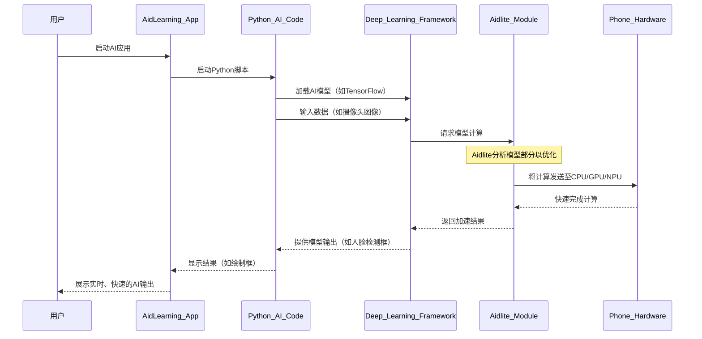

# 第2章：AI模型部署与加速（aidlite）

欢迎回来，未来的AI创新者！

但AI应用的"大脑"——实际识别面孔、理解语音或检测物体的AI模型呢？我们已经拥有了强大的[AI编程平台](03_ai_programming_platform_.md)，其中包含所有深度学习框架，可以训练这些模型。然而，一旦模型训练完成，它就需要准备好投入实际使用！它需要被**部署**（投入使用），更重要的是，它需要**快速**运行，尤其是在移动设备上。

想象我们建造了一辆超级跑车（训练好的AI模型）。现在需要把它送上赛道（部署），并确保引擎经过精细调校和优化以赢得比赛（加速）。这正是AidLearning中**AI模型部署与加速（aidlite）**的核心！它就像为我们的AI跑车配备的专业引擎调校师。

### 什么是AI模型部署？

**AI模型部署**是将训练好的AI模型——我们花费数小时训练的成果——投入实际应用的过程。就像将完成的画作从工作室搬到美术馆供大家欣赏。

例如，如果我们训练一个识别不同类型花朵的AI模型，部署意味着将该模型转化为移动应用实际可用的功能，通过手机摄像头识别花朵。这通常包括：

1.  **保存模型**：将训练好的模型存储为特定文件格式。
2.  **转换（如果需要）**：有时需要将模型转换为更轻量或优化的格式，以便在移动设备上高效运行。
3.  **加载到应用中**：在应用中编写代码加载保存的模型，并输入新数据（如摄像头拍摄的照片）。

### 什么是AI模型加速？

模型部署后，我们希望它能快速完成任务。这就是**AI模型加速**的用武之地。它的目标是让AI模型运行得更快，尤其是在手机等计算能力有限的设备上。

可以这样理解：一个强大的AI模型或许能识别人脸，但如果耗时5秒，对实时视频通话来说就没什么用。如果能以毫秒级完成，那就是加速！这对实时AI应用至关重要，例如：

*   **人脸识别**：在实时视频流中即时识别人物。
*   **手势估计**：追踪手势动作以实现手势控制。
*   **物体检测**：快速识别图片或视频中的物品。

### AidLearning的秘密武器：`aidlite`（CPU+GPU+NPU加速）

AidLearning内置了一项名为==`aidlite`的独特技术，同时处理部署和加速==，让AI模型在移动设备上飞速运行。

`aidlite`就像专业的引擎调校师：

*   **智能转换**：AidLearning（通常在后台）帮助将模型（如TensorFlow或PyTorch训练的）转换为`aidlite`能理解的高效格式。
*   **硬件优化**：`aidlite`设计用于智能利用手机的所有强大组件：
    *   **CPU（中央处理器）**：手机的主要大脑。
    *   **GPU（图形处理器）**：擅长并行计算，AI模型常用。
    *   **NPU/DSP（神经网络处理器/数字信号处理器）**：现代手机芯片中专为加速AI计算设计的部件。

`aidlite`会找到在不同硬件组件上运行AI模型各部分的最佳方式，大幅提升速度

在早期AidLearning版本中，可能见过`tflite_gpu`（支持GPU加速的TensorFlow Lite），它实现了类似功能。AidLearning还集成了其他高效框架如`ncnn`，但`aidlite`是其定制化的全面解决方案。

### 为什么移动设备上的加速至关重要

移动设备与强大的台式电脑相比面临不同挑战：

| 功能       | 台式电脑                           | 移动设备（智能手机）                  |
| :--------- | :--------------------------------- | :------------------------------------ |
| **功耗**   | 电源充足，可大量耗电               | 电池有限，需节能                      |
| **处理器** | 通常为强大的Intel/AMD CPU，独立GPU | 基于ARM的CPU，集成GPU/NPU（架构不同） |
| **散热**   | 大型风扇，散热片                   | 被动散热，需谨慎管理温度              |
| **AI速度** | 通常较快，但需设置                 | 未经优化时较慢，需专门技术            |

如果没有像`aidlite`这样的专门加速技术，复杂AI模型在手机上会运行缓慢，耗电快，导致实时任务无法使用。

### 使用`aidlite`加速AI

通常不需要直接在应用中"编写"`aidlite`代码。相反，AidLearning会在使用AI模型时在后台自动启用`aidlite`。关键在于将模型转换为`aidlite`能优化的格式。

假设我们使用TensorFlow训练了一个简单的人脸检测模型。在AidLearning中，我们会：

1.  **准备模型**：将TensorFlow模型保存为`.pb`文件（TensorFlow图的"冻结"版本）。
2.  **加载模型**：Python应用加载此优化后的模型。
3.  **运行推理**：输入图像时，`aidlite`自动介入加速计算。

以下是简化代码示例，展示如何在AidLearning环境中加载和使用TensorFlow模型。在加载和运行过程中，`aidlite`会发挥作用。

```python
import tensorflow as tf
import numpy as np
import cv2
import cvs # 来自第三章

# 假设'my_face_detector.pb'是预优化的TensorFlow模型
# （AidLearning通常提供工具将模型转换为此格式以便aidlite使用）
model_path = "/path/to/my_face_detector.pb" 
input_tensor_name = "image_tensor:0" # 模型输入名称
output_tensor_name = "detection_boxes:0" # 模型输出名称

def run_face_detection(image_np):
    # 加载图（应用只需加载一次）
    with tf.gfile.GFile(model_path, 'rb') as f:
        graph_def = tf.GraphDef()
        graph_def.ParseFromString(f.read())

    with tf.Session(graph=tf.Graph()) as sess:
        tf.import_graph_def(graph_def, name='')
        image_tensor = sess.graph.get_tensor_by_name(input_tensor_name)
        output_tensor = sess.graph.get_tensor_by_name(output_tensor_name)

        # 运行推理——AIDLITE加速在此生效！
        # AidLearning运行时检测到TF模型，使用aidlite
        # 在CPU+GPU+NPU上加速执行。
        output_data = sess.run(
            output_tensor, 
            feed_dict={image_tensor: np.expand_dims(image_np, axis=0)}
        )
        return output_data # 返回检测到的人脸框

# --- 与摄像头帧配合使用的示例（概念性）---
# 这部分通常会在cvs GUI应用中
# 如第三章的摄像头示例
# cap = cvs.VideoCapture(1)
# frame = cap.read()
# if frame is not None:
#    detections = run_face_detection(frame)
#    # 现在可以用'detections'在'frame'上绘制框
#    # 并用cvs.imshow()显示帧
```

**解释：** 这段代码展示了通用模式：
1.  拥有预训练且通常预优化的AI模型文件（如TensorFlow的`.pb`文件）。
2.  将模型加载到TensorFlow会话中。
3.  调用`sess.run()`进行计算时，AidLearning底层的`aidlite`技术会自动检测并将计算导向手机最高效的硬件（CPU、GPU或NPU），使检测速度远快于纯CPU运行。

我们只需*使用*深度学习框架（如这里的TensorFlow），AidLearning的`aidlite`模块会透明地提供性能加速。

### 底层原理：`aidlite`如何加速AI模型

`aidlite`的魔力在于它能桥接AI模型（来自TensorFlow、PyTorch等框架）与手机的专用硬件。

以下是AI模型在AidLearning中运行的简化流程：



AidLearning在其`README`文件中明确提到了这种加速：

来自`README-en.md`：
```markdown
它拥有独特的cpu+gpu+npu(dsp)加速技术，通过内置的aidlite模块显著提升深度学习算法的性能。
```
**解释：** 明确指出`aidlite`是内置模块，负责`cpu+gpu+npu(dsp)`加速，大幅提升深度学习算法性能。

来自`README.md`
```markdown
* 内置创新性的CPU+GPU+NPU智能加速技术，通过“硬件+框架+Op"多层优化，赋予深度学习运算性能的大幅度提升。并且提供统一API接口，在方便开发者调用的同时，还支持不同AI框架模型自动转换。
```
**解释：** 这段确认了内置的`CPU+GPU+NPU`智能加速技术，通过多层优化（硬件+框架+Op）极大提升深度学习计算性能

还提到统一API和不同AI框架模型的自动转换。

"部署"过程通常涉及将模型转换为加速器能高效使用的格式。查看AidLearning源码中的`posenet`示例：

来自`src/mutilpose/posenet/converter/tfjs2python.py`：
```python
            # 冻结图并写入最终模型文件
            freeze_graph(
                input_graph=os.path.join(model_dir, "model-%s.pbtxt" % chkpoint),
                input_saver="",
                input_binary=False,
                input_checkpoint=checkpoint_path,
                output_node_names='heatmap,offset_2,displacement_fwd_2,displacement_bwd_2',
                restore_op_name="save/restore_all",
                filename_tensor_name="save/Const:0",
                output_graph=os.path.join(model_dir, "model-%s.pb" % chkpoint),
                clear_devices=True,
                initializer_nodes="")
```
**解释：** 这段代码展示了如何将TensorFlow模型的计算图"冻结"为`.pb`（protobuf）文件。这是模型部署的关键步骤，生成一个自包含的优化模型，供`aidlite`在手机硬件上加速。

加载此类`.pb`模型的代码：

来自`src/mutilpose/posenet/model.py`：
```python
    model_path = os.path.join(model_dir, 'model-%s.pb' % model_cfg['checkpoint_name'])
    # ...
    with tf.gfile.GFile(model_path, 'rb') as f:
        graph_def = tf.GraphDef()
    graph_def.ParseFromString(f.read())
    sess.graph.as_default()
    tf.import_graph_def(graph_def, name='')
    # ... 然后通过名称获取张量，如'offset_2:0'、'heatmap:0'
```
**解释：** 这段代码加载之前冻结的`.pb`模型。一旦图加载到TensorFlow中，`aidlite`就会施展魔法加速其执行。

### 总结

在本章中，我们学习了**AI模型部署与加速（aidlite）**是让AI应用在移动设备上高效运行的关键过程。AidLearning的定制`aidlite`模块如同专业性能调校师，==利用手机的CPU、GPU和NPU/DSP，提供实时AI能力==。这意味着我们可以构建强大、智能的应用，而无需担心移动硬件上的性能问题。

现在我们知道如何让AI模型快速响应，接下来探索如何随时随地开发和访问AidLearning项目

