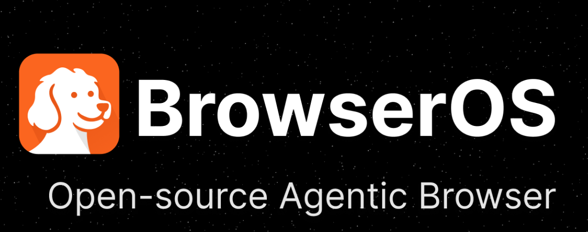
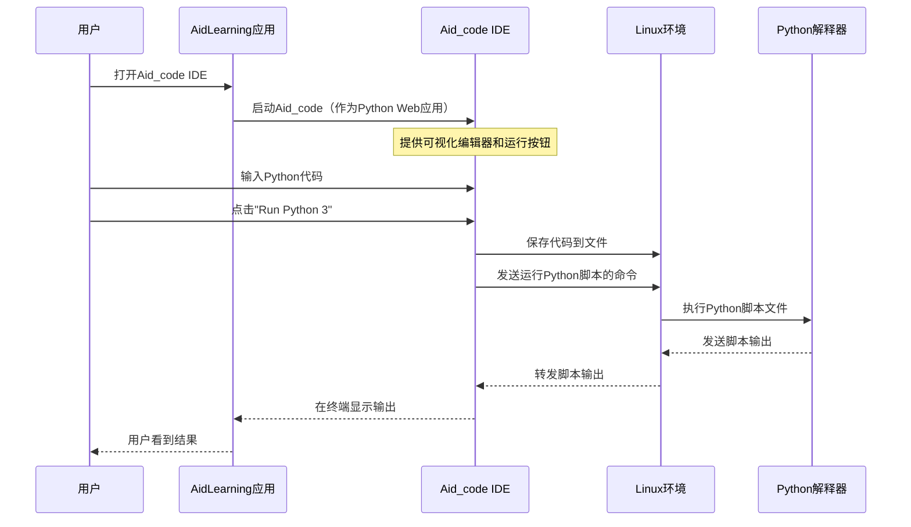

# 第三章：Aid_code IDE

我们了解到AidLearning为安卓手机配备了强大的AI工具和预装框架（如TensorFlow），随时可以增强我们的智能应用。但我们在哪里编写这些出色的AI程序代码呢？这正是**Aid_code IDE**的用途！

## 什么是Aid_code IDE？我们的智能代码工作区

可以把Aid_code想象成我们个人的超级智能记事本，专门为在AidLearning环境中编写Python代码而设计。它不仅仅是一个简单的文本编辑器，而是一个**集成开发环境(IDE)**。

IDE就像程序员的专用工作坊。它不仅提供一个空白页面，还集成了我们编写、测试和修复代码所需的所有工具。==Aid_code直接内置在AidLearning中，是我们在手机上开启Python编程之旅的完美场所==。

Aid_code解决了一个重大挑战：如何在移动设备上舒适地编写和运行复杂程序。它将类似桌面的编码体验直接带到我们的指尖，让我们随时随地都能高效工作。

## Aid_code的核心功能

Aid_code集成了许多功能，使编码更简单、更快速、更灵活：

### 1. 专为Python设计（Python 2和Python 3）

Python是AI的首选语言，Aid_code完全支持它。无论是处理旧的Python 2脚本还是更现代的Python 3，Aid_code都支持，让我们可以根据项目需求选择版本。

### 2. 智能编码与自动补全

有没有想过我们的记事本可以猜测我们想输入什么？Aid_code可以！它提供**自动代码补全**功能，这意味着在我们输入时，它会建议常见的关键词、函数名和变量名。这一功能帮助我们：

*   **更快输入**：减少手动输入，加快编码速度。
*   **减少错误**：建议引导我们使用正确的语法，减少拼写错误。
*   **发现函数**：帮助我们探索可用的函数和方法。

### 3. 直接在手机上即时运行代码

使用Aid_code，我们无需将代码转移到其他设备或通过复杂步骤查看运行结果。只需轻点一下，就可以**直接在手机上运行Python脚本**。这对于在路上测试、实验和快速迭代AI项目非常有用。

### 4. 通过PC浏览器编码，更舒适

有时，我们可能更喜欢大屏幕和物理键盘。Aid_code提供了惊人的灵活性，允许我们**通过PC浏览器访问和编辑代码**。只要手机和PC在同一个Wi-Fi网络下，我们就可以：

*   **使用更大的屏幕和键盘**：适合长时间编码。
*   **==无缝切换设备==**：从手机开始，在PC上完成，反之亦然。
*   **轻松协作**：在大屏幕上展示代码。

## 如何使用Aid_code IDE

让我们通过一个简单的例子来了解如何使用Aid_code。

### 1. 打开Aid_code

在安卓设备上启动AidLearning应用后，我们会看到一个类似桌面的环境。找到"Aid_code"图标并点击打开IDE。它会显示一个代码编辑器，我们可以在这里开始编写Python脚本。

### 2. 编写第一个Python脚本

让我们编写一个经典的"Hello, World!"程序。在Aid_code编辑器中输入以下内容：

```python
# 这是我们在Aid_code中的第一个Python脚本！
print("Hello, AidLearning World!")
print("在手机上编程真是太棒了！")
```

**这段代码的作用：**
这两行Python代码只是向屏幕打印消息。`print()`是Python的基本函数，用于显示输出。

### 3. 运行脚本

输入代码后，在Aid_code界面中找到"Run"按钮或类似的执行控件。AidLearning通常会为直接运行Python 2或Python 3脚本提供专用按钮。点击相应的按钮（例如"Run Python 3"），Aid_code将在AidLearning提供的[安卓上的Linux环境](04_linux_environment_on_android_.md)中执行脚本。

我们会在AidLearning应用的终端窗口中直接看到输出，类似这样：

```
Hello, AidLearning World!
在手机上编程真是太棒了！
```

### 4. 从PC访问Aid_code

这一功能非常方便！要在PC上编辑代码，请按照以下步骤操作：

1.  **找到手机的IP地址**：在AidLearning中打开终端（桌面上的另一个应用），输入`ifconfig`。查找Wi-Fi适配器的IP地址（例如`192.168.1.8`）。
2.  **打开PC的浏览器**：在电脑上打开任意浏览器（如Chrome、Firefox、Edge）。
3.  **输入Aid_code地址**：在浏览器的地址栏中输入`http://手机IP:8900/`。例如，如果手机的IP是`192.168.1.8`，则输入`http://192.168.1.8:8900/`。

然后，我们会在PC浏览器中看到Aid_code IDE界面，可以编辑手机上看到的相同文件。

以下是一个示例，展示在两种设备上看到的相同代码：

```
+------------------------------------------+
|            Aid_code on Android           |
|  +------------------------------------+  |
|  | # My first Python script           |  |
|  | print("Hello, AidLearning World!") |  |
|  | print("在手机上编程真是太棒了！")    |
|  +------------------------------------+  |
|  | [Run Python 3]                     |  |
+------------------------------------------+

           (Same network connection)
                     |
                     V

+------------------------------------------+
|            Aid_code on PC Browser        |
|  +------------------------------------+  |
|  | http://192.168.1.8:8900/           |  |
|  +------------------------------------+  |
|  | # My first Python script           |  |
|  | print("Hello, AidLearning World!") |  |
|  | print("在手机上编程真是太棒了！")    |
|  +------------------------------------+  |
|  | [Run Python 3]                     |  |
+------------------------------------------+
```

这种灵活性让我们可以随时选择最适合编码任务的环境。

关于PC Browser的一些创造性 前文传送：[[BrowserOS\] 专用AI代理 | AI代理协调器_browseros浏览器](https://lvynote.blog.csdn.net/article/details/149338889)



## 底层原理：Aid_code如何工作

Aid_code并不是神奇地运行我们的Python代码。它利用了我们在[第一章：AidLearning平台（四合一环境）](01_aidlearning_platform__4_in_1_environment__.md)中讨论的AidLearning强大的"四合一环境"。

当我们使用Aid_code时，以下是简化的运行流程：



本质上，Aid_code本身是一个运行在AidLearning的[安卓上的Linux环境](04_linux_environment_on_android_.md)中的Python应用。它提供了一个Web界面（我们在手机或PC浏览器上看到的内容），并==利用底层的Linux系统保存文件和执行Python程序==。

例如，当AidLearning启动时，类似这样的脚本（简化自项目文件中的`e.sh`）会帮助启动Aid_code：

```bash
# 来自AidLearning核心启动脚本（简化）
# 此命令将Aid_code IDE作为后台进程启动
python2 /home/.remi/editor/.toucheditor >/dev/null 2>&1 &
```

**这段代码的作用：**
这行代码执行了一个名为`.toucheditor`的Python 2脚本，它是`remi`库（一个Python的Web GUI框架）的一部分。这个脚本随后启动了托管Aid_code IDE的Web服务器，使其可以在手机屏幕和Web浏览器中访问。

> 末尾的`&`使其在后台运行。

这种集成意味着Aid_code不仅仅是一个应用，它是连接我们输入与AidLearning中隐藏的强大Linux和Python功能的桥梁。

## 总结

在本章中，我们探索了**Aid_code IDE**，这是我们在AidLearning中进行Python编程的主要工作区。现在我们知道，它是一个集成开发环境，提供自动代码补全、直接在手机上运行Python 2和Python 3脚本的功能，以及通过PC浏览器访问和编辑代码的灵活性。这使得Aid_code成为一个极其多功能且用户友好的工具，适合在路上或舒适的桌面上开发AI应用。

在下一章中，我们将深入探讨AidLearning的核心功能，了解[安卓上的Linux环境](04_linux_environment_on_android_.md)如何托管所有这些出色的工具。

[下一章：安卓上的Linux环境](04_linux_environment_on_android_.md)

