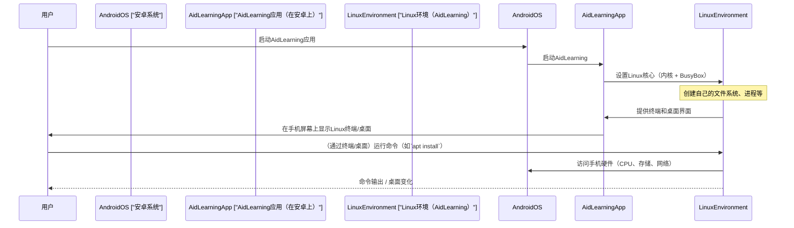

# 第四章：安卓上的Linux环境

在[第三章：Aid_code IDE](03_aid_code_ide_.md)中，我们学习了如何使用Aid_code直接在安卓手机上编写和运行Python代码。但这些代码究竟在哪里运行？是什么强大的"引擎"让AidLearning实现这一切？答案就是**安卓上的Linux环境**

## 什么是安卓上的Linux环境？

想象我们的安卓手机就像一座特殊的房子。通常，安卓是这座房子里唯一的操作系统（就像房子的主人）。但AidLearning做了一件非常了不起的事：它在我们的安卓房子里引入了一个**完整的Linux操作系统**，而不会干扰安卓或需要任何特殊的"装修"（比如root手机）。

这意味着我们直接在安卓手机里获得了一个微型但功能齐全的Linux电脑！它不是缓慢的模拟或"虚拟"机器，而是一个直接构建在手机硬件上的真实Linux系统，提供速度和效率。

### 为什么这是革命性的？（尤其是对AI来说！）

Linux是许多开发者、服务器以及对我们最重要的**人工智能(AI)**的首选操作系统。几乎所有强大的AI开发工具和服务器都运行在Linux上。通过将Linux带到手机上，AidLearning：

*   **解锁专业工具**：让我们可以使用开发者在大电脑上使用的相同命令行工具和软件包（比如用`apt`安装新软件）。
*   **提供稳定基础**：Linux以其稳定性和健壮性著称，非常适合运行复杂的AI模型。
*   **无需root**：这是一个巨大的优势！"Root"安卓手机可能有风险，会失去保修，有时还会导致安全问题。AidLearning提供了完整的Linux体验，而没有任何这些缺点。我们的手机保持安全且保修有效。

## 移动Linux系统的核心组件

AidLearning中的新Linux环境配备了我们在桌面Linux电脑上期望的一切，但针对手机进行了优化。

### 1. 终端（基于文本的控制中心）

可以把终端想象成与Linux系统的直接对话。我们不是点击图标，而是输入命令。它在管理文件、安装软件和运行脚本方面非常强大。

*   **它是什么**：一个基于文本的界面，我们输入命令，系统以文本响应。
*   **为什么有用**：对系统管理、脚本编写和许多开发者任务至关重要。我们会用它来安装Python库、更新软件包和运行复杂程序。

### 2. 图形桌面（可视化工作区）

虽然终端很强大，但图形桌面让许多任务变得更简单。AidLearning提供了一个**图形操作桌面**，就像我们在Windows、macOS或传统Linux电脑上看到的那样。

*   **它是什么**：一个熟悉的桌面环境，有窗口、图标和鼠标指针（即使我们是用手指操作！）。
*   **如何访问**：我们可以直接使用手机的触摸屏，甚至可以连接键盘和鼠标以获得更传统的PC体验。我们还会在[第七章：PC连接(SSH & Web)](07_pc_connectivity__ssh___web__.md)中看到如何通过PC的网页浏览器访问它。

### 3. 底层技术：Linux内核与BusyBox

AidLearning的Linux环境建立在强大、高效的技术上：

*   **Linux内核**：这是Linux操作系统的核心。它管理手机的硬件（如CPU、内存和存储），并让软件与之交互。==AidLearning巧妙地使用了安卓环境中的Linux内核==。
*   **BusyBox**：这就像Linux的紧凑工具箱。它是一个包含许多常见Linux命令（如`ls`、`cd`、`cp`、`mv`、`apt`）的单一可执行文件。==使用BusyBox让AidLearning的Linux环境非常轻量且快速，非常适合移动设备==。
*   [mirror/busybox: BusyBox mirror](https://github.com/mirror/busybox)

这种组合确保了Linux环境**快速且接近实时**，因为它高效地运行在手机硬件上，不会被虚拟化拖慢。

## 让Linux环境发挥作用：基本命令

让我们在终端中尝试一些基本的Linux命令。

### 1. 打开终端

在AidLearning桌面上，我们会看到一个"Terminal"图标。点击它打开命令行界面。

### 2. 浏览文件和目录

前文传送：

[探索交互的本质：从指令到界面的演进与Linux基础指令的深入剖析](https://lvynote.blog.csdn.net/article/details/139645777)

[【探索Linux命令行】从基础指令到高级管道操作的介绍与实践_命令行管道操作](https://lvynote.blog.csdn.net/article/details/139706097)

以下是一些入门命令：

*   **`pwd`（打印工作目录）**：告诉我们当前在文件系统中的位置。

    ```bash
    # 在AidLearning终端中
    pwd
    ```
    **这个命令的作用**：打印我们当前所在目录的完整路径。例如，它可能显示`/home/aid`。

*   **`ls`（列出文件）**：显示当前目录中的所有文件和文件夹。

    ```bash
    # 在AidLearning终端中
    ls
    ```
    **这个命令的作用**：列出当前目录的内容。我们可能会看到`Desktop`、`Documents`、`examples`等名称。

*   **`cd`（切换目录）**：让我们移动到不同的文件夹。

    ```bash
    # 在AidLearning终端中
    cd examples
    pwd # 检查新位置
    ```
    **这些命令的作用**：第一个命令让我们进入`examples`文件夹。第二个`pwd`命令确认我们现在位于`/home/aid/examples`。

### 3. 用`apt`安装软件

Linux最强大的功能之一是能够轻松使用"包管理器"安装新软件包。AidLearning使用`apt`（高级包工具），这在许多Linux发行版中很常见。

*   **`apt update`**：这个命令从互联网刷新可用软件的列表。在安装任何新东西之前运行它是一个好习惯。

    ```bash
    # 在AidLearning终端中
    apt update
    ```
    **这个命令的作用**：它连接到互联网并下载关于AidLearning Linux系统所有可用软件包的最新信息。我们会看到很多文本滚动，因为它获取了这些信息。

*   **`apt install <包名>`**：更新后，我们可以安装新软件！例如，`neofetch`是一个显示系统信息的有趣工具。

    ```bash
    # 在AidLearning终端中
    apt install neofetch -y
    ```
    **这个命令的作用**：它下载并安装`neofetch`程序。`-y`部分自动同意安装过程中的任何提示，使其更容易。安装后，我们只需输入`neofetch`并按回车键，就能看到一些酷炫的系统信息！

这展示了拥有完整Linux环境的力量：我们不受限于预装的内容，可以像在桌面Linux电脑上一样扩展其功能

## 底层原理：AidLearning如何实现Linux环境

当我们在安卓手机上启动AidLearning应用时，它不会*取代*安卓。相反，它在安卓内部创建了一个特殊的"沙盒"，完整的Linux环境就在这里运行。

以下是这种强大集成的简化工作原理：



如我们所见，安卓系统作为主机，提供基本的硬件访问。AidLearning应用巧妙地在其内部建立并管理一个完整的Linux环境，以交互式桌面和终端的形式呈现给我们。

为了实现这一点，AidLearning启动时会运行特殊脚本。例如，项目文件中的启动脚本（`e.sh`）的简化部分展示了它如何启动基于网页的桌面和终端等服务：

```bash
# 简化自e.sh：AidLearning核心启动脚本
# 这个脚本在后台启动各种服务
python2 /root/.startx >/dev/null 2>&1 & # 启动图形桌面组件
python2 /root/.startssh >/dev/null 2>&1 & # 激活SSH以进行远程访问
python2 /home/.remi/editor/.toucheditor >/dev/null 2>&1 & # 启动Aid_code IDE
# ... 其他服务如文件浏览器、Jupyter等
```
**这个脚本的作用**：每一行在后台（`&`）执行一个Python脚本或命令，启动AidLearning环境的关键部分。例如，`.startx`启动提供图形桌面的组件，而`.toucheditor`启动[Aid_code IDE](03_aid_code_ide_.md)。这展示了底层Linux环境如何被编排以提供我们看到的所有功能。

## 总结

在本章中，我们探索了AidLearning中**安卓上的Linux环境**的基础概念。我们现在知道，AidLearning将安卓手机转变为强大的微型Linux电脑，配备终端和图形桌面，而**无需root设备**。这个真实的Linux系统，通过Linux内核和BusyBox高效构建，为我们所有的AI编程和开发任务提供了强大的基础。

有了这些知识，我们已准备好深入创建图形用户界面！在下一章中，我们将探索如何使用[GUI向导（触摸拖拽UI设计）](05_gui_wizard__touch_and_drag_ui_design__.md)==可视化设计应用==。

[下一章：GUI向导（触摸拖拽UI设计）](05_gui_wizard__touch_and_drag_ui_design__.md)

