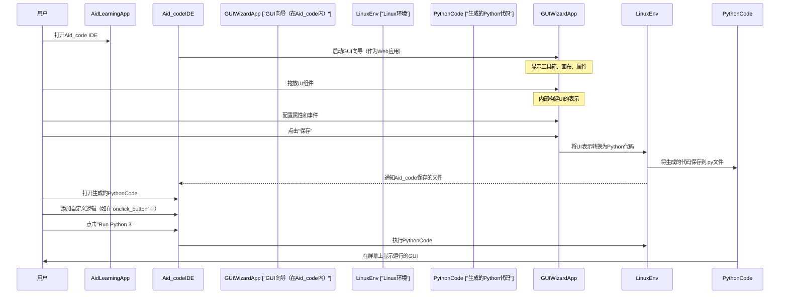

# 第五章：GUI向导（触摸拖拽UI设计）

在[第四章：安卓上的Linux环境](04_linux_environment_on_android_.md)中，我们探索了安卓手机内运行的强大Linux系统，它为所有开发提供了基础

现在，让我们通过设计漂亮的用户界面(UI)而无需编写大量代码，使开发变得更加简单！

## 想象像搭积木一样设计应用

我们是否曾在使用手机应用时想过："他们是怎么让那些按钮和文本框看起来这么棒的？"创建图形用户界面(GUI)——即我们与应用交互的可视化部分——通常需要编写大量代码，指定每个按钮、文本框或图像的位置。这可能既耗时又复杂，尤其对初学者来说。

AidLearning引入了一个名为**GUI向导（触摸拖拽UI设计）**的绝妙功能来解决这个问题。想象我们在搭积木：从盒子里挑选一块（比如一个按钮或标签），把它拖到搭建区域（我们的应用屏幕），然后放在想要的位置。GUI向导正是这样为我们的应用界面服务的

> （qt creator & lvgl 也都有这样的ide：[Qt & LVGL_lvy-的专栏](https://blog.csdn.net/2301_80171004/category_12868545.html)）

这种可视化方法让设计应用变得超级快速和有趣。我们专注于应用*应该是什么样子*，而AidLearning负责为我们编写复杂的Python代码。这是一个巨大的帮助，让我们可以专注于应用的"智能"部分（如AI逻辑），而不是"外观"部分。

## 什么是GUI向导？

AidLearning的Aid_code IDE中的GUI向导是一个**可视化设计工具**，允许我们通过简单的触摸和拖拽操作创建应用界面。

以下是它的核心理念：

1.  **可视化设计**：我们不是用代码描述UI元素（例如"在位置X,Y创建一个文本为'点击我'的按钮"），而是直接在屏幕上*看到*它们并排列它们。
2.  **UI组件**：这些是界面的"构建块"。常见的包括：
    *   **按钮**：供用户点击并触发操作。
    *   **标签**：用于显示文本消息。
    *   **文本框（输入字段）**：供用户输入信息。
    *   **容器**：容纳其他组件的特殊区域，帮助我们组织布局。
3.  **触摸拖拽**：我们使用手指（或连接的鼠标）从"工具箱"中选择组件，并在应用屏幕上移动它们。还可以调整它们的大小以满足需求。
4.  **自动代码生成**：这是神奇的部分。当我们可视化设计时，向导会在后台默默编写描述界面的Python代码。保存设计时，它会创建一个包含所有这些UI代码的Python文件。

这一功能极大地简化了开发流程，即使我们是UI编程的新手也能轻松上手。

## 使用GUI向导构建第一个应用界面

让我们一步步创建一个非常简单的界面：一个带有按钮的应用，按下按钮时，标签上的文本会改变。

### 1. 启动GUI向导

GUI向导集成在[Aid_code IDE](03_aid_code_ide_.md)中。通常通过Aid_code中的专用菜单选项或按钮访问，通常标记为"UI设计"或"向导"。

### 2. 添加主容器

首先，应用需要一个主区域来容纳所有组件。这通常是一个`Widget`（通用容器）或`VBox`/`HBox`（用于垂直/水平自动排列）。让我们使用`Widget`以获得最大灵活性。

*   从工具箱（通常在屏幕左侧）选择`Widget`组件。
*   可能会弹出一个对话框要求输入"变量名"。我们将其命名为`mainContainer`。
*   它出现在屏幕上后，可以触摸并拖动其角落调整大小，使其成为应用的主窗口。

    ```
    +------------------------------------------+
    |            AidLearning Desktop           |
    |  +------------------------------------+  |
    |  |       [UI Design Tool]             |  |
    |  |  +----------------------------+    |  |
    |  |  | MainContainer (Widget)     |    |  |
    |  |  |                            |    |  |
    |  |  |                            |    |  |
    |  |  |                            |    |  |
    |  |  |                            |    |  |
    |  |  +----------------------------+    |  |
    |  |                                    |  |
    |  +------------------------------------+  |
    +------------------------------------------+
    ```
    *可视化说明*：我们正在将一个矩形区域（主`Widget`容器）拖到设计画布上。

### 3. 添加标签

接下来，添加一些会改变的文本。

*   从工具箱选择`Label`组件。
*   给它一个变量名，比如`messageLabel`。
*   拖放到`mainContainer`中。还可以更改其初始文本（例如"我的标签"）并通过触摸拖拽调整位置。

    ```
    +------------------------------------------+
    |            AidLearning Desktop           |
    |  +------------------------------------+  |
    |  |       [UI Design Tool]             |  |
    |  |  +----------------------------+    |  |
    |  |  | MainContainer              |    |  |
    |  |  |   +-------------------+    |    |  |
    |  |  |   | 我的标签          |    |    |  |
    |  |  |   +-------------------+    |    |  |
    |  |  |                            |    |  |
    |  |  |                            |    |  |
    |  |  +----------------------------+    |  |
    |  |                                    |  |
    |  +------------------------------------+  |
    +------------------------------------------+
    ```
    *可视化说明*：我们在主窗口中放置了一个文本框（"我的标签"）。

### 4. 添加按钮

现在，我们需要一个可以点击的东西！

*   从工具箱选择`Button`组件。
*   给它一个变量名，比如`actionButton`。
*   拖放到`mainContainer`中，可能在标签下方。可以将其文本改为"打招呼"。

    ```
    +------------------------------------------+
    |            AidLearning Desktop           |
    |  +------------------------------------+  |
    |  |       [UI Design Tool]             |  |
    |  |  +----------------------------+    |  |
    |  |  | MainContainer              |    |  |
    |  |  |   +-------------------+    |    |  |
    |  |  |   | 我的标签          |    |    |  |
    |  |  |   +-------------------+    |    |  |
    |  |  |                            |    |  |
    |  |  |   +-------------------+    |    |  |
    |  |  |   |    打招呼         |    |    |  |
    |  |  |   +-------------------+    |    |  |
    |  |  +----------------------------+    |  |
    |  |                                    |  |
    |  +------------------------------------+  |
    +------------------------------------------+
    ```
    *可视化说明*：我们在标签下方添加了一个按钮。

### 5. 连接动作（事件）

当有人点击"打招呼"时会发生什么？我们需要告诉按钮做一些事情。GUI向导帮助我们连接"事件"（如点击）到"函数"（事件发生时运行的代码片段）。

*   在设计画布上选择`actionButton`。
*   在属性面板（通常在右侧）中，查找"Events"或"onclick"。
*   可能会看到一个选项将其连接到新的或现有函数。让向导为我们创建一个新函数，比如`onclick_button`。

### 6. 保存设计并查看代码

设计完成后，保存它

*   在向导菜单中查找"保存"或"另存为"选项。
*   为项目指定一个Python文件名（例如`my_first_gui.py`）。
*   向导会自动为设计生成Python代码并保存到该文件中。

现在，我们可以退出GUI向导并在[Aid_code IDE](03_aid_code_ide_.md)中打开`my_first_gui.py`。会看到类似这样的生成代码（为清晰起见简化）：

```python
# -*- coding: utf-8 -*-
from remi.gui import *
from cvs import * # 我们将在下一章学习'cvs'！

class MyGUIApp(App):
    def __init__(self, *args, **kwargs):
        super(MyGUIApp, self).__init__(*args)

    def main(self):
        # 这部分由GUI向导生成！
        mainContainer = Widget(width='266px', height='257px')
        mainContainer.style.update({"position":"absolute","top":"61px","left":"16px"})

        self.actionButton = Button('打招呼')
        self.actionButton.style.update({"width":"149px","position":"absolute","top":"80px","left":"37px"})
        mainContainer.append(self.actionButton,'actionButton') # 将按钮添加到容器

        self.messageLabel = Label('我的标签')
        self.messageLabel.style.update({"width":"98px","position":"absolute","top":"20px","left":"20px"})
        mainContainer.append(self.messageLabel,'messageLabel') # 将标签添加到容器
        
        # 将按钮点击连接到我们的函数
        self.actionButton.onclick.do(self.onclick_button)
        
        return mainContainer
    
    # 这个函数也是生成的（或我们链接到它）
    def onclick_button(self, emitter):
        # 在这里添加自定义逻辑！
        self.messageLabel.set_text('你好，AidLearning世界！')
        print("按钮被点击了！") # 会显示在控制台中

# 这部分运行我们的应用
if __name__ == "__main__":
    initcv(cvs.openwin)
    startcv(MyGUIApp)
```
**这段代码的作用：**
*   像`mainContainer = Widget(...)`和`self.actionButton = Button(...)`这样的行创建了我们拖到屏幕上的可视化部分。
*   `mainContainer.append(...)`将按钮和标签添加到主窗口。
*   `self.actionButton.onclick.do(self.onclick_button)`将按钮的"点击"事件连接到名为`onclick_button`的函数。
*   `onclick_button`函数是我们添加特定操作的地方。在这里，我们添加了`self.messageLabel.set_text('你好，AidLearning世界！')`来更改标签文本，以及`print("按钮被点击了！")`在控制台中显示消息。

### 7. 运行应用

在[Aid_code IDE](03_aid_code_ide_.md)中，只需点击"Run Python 3"（或Python 2）按钮。我们可视化设计的应用将在安卓屏幕上启动！点击"打招呼"按钮时，文本"我的标签"会变为"你好，AidLearning世界！"。

## 底层原理：GUI向导如何工作

GUI向导并非魔法；它本身是一个聪明的应用，运行在AidLearning的[安卓上的Linux环境](04_linux_environment_on_android_.md)中。它使用一个强大的Python库`remi`（Python REMote Interface）构建自己的可视化界面，并帮助我们构建我们的界面。

以下是其工作原理的简化分解：



本质上：
1.  GUI向导为我们提供**可视化编辑器**。
2.  当我们与编辑器交互时，它会跟踪添加的所有组件、它们的位置、大小以及连接的任何事件。
3.  保存时，向导将UI的内部"蓝图"**编写为Python代码**（使用`remi.gui`库和AidLearning的自定义`cvs`包），创建相同的界面。
4.  生成的Python代码是一个常规Python脚本，可以在AidLearning环境中运行（和修改！），就像任何其他程序一样。

项目中`gui_wizard`文件夹的`README.md`明确指出："向导会自动生成这样的代码："并附有示例，确认了这一工作流程。它==利用`remi`库实现基于Web的GUI开发，并通过AidLearning的特定`cvs`包进一步集成和定制==。

## 总结

在本章中，我们解锁了AidLearning中**GUI向导（触摸拖拽UI设计）**的强大功能。现在我们知道，这个可视化工具让我们可以直观地设计应用界面，像搭积木一样，而无需编写大量代码。通过简单地触摸、拖拽和配置UI组件，向导自动生成Python代码，显著==加快开发流程，让我们专注于AI应用的核心逻辑==。

虽然向导帮助我们快速入门，但有时我们需要更多控制或特定的UI行为。在下一章中，我们将深入探讨AidLearning的专用图形框架：[自定义GUI框架（`cvs`包）](06_custom_gui_framework___cvs__package__.md)，它让我们可以通过Python代码精细控制界面。

[下一章：自定义GUI框架（`cvs`包）](06_custom_gui_framework___cvs__package__.md)

