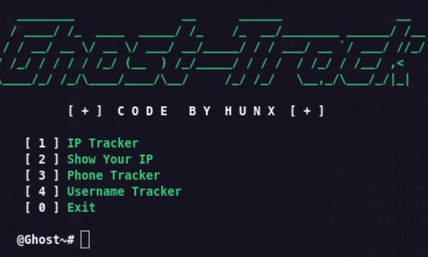
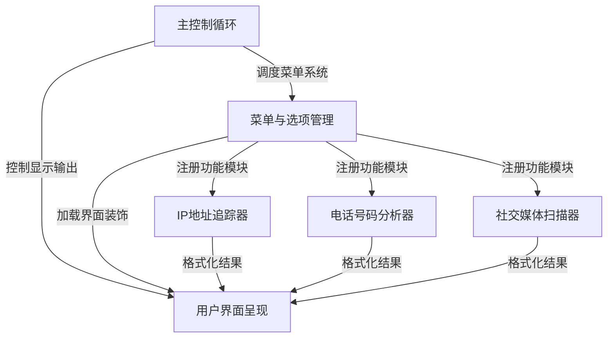
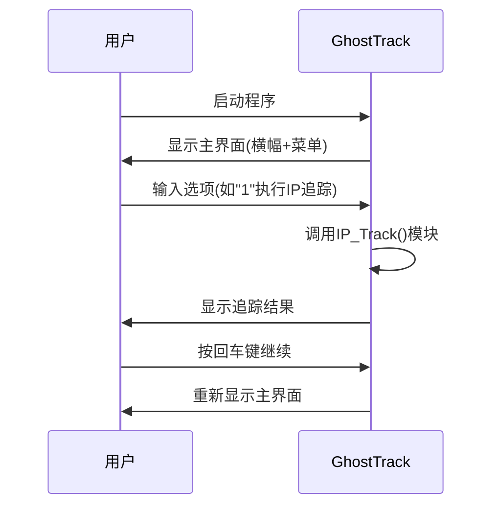

链接：[github.com/HunxByts/GhostTrack](https://github.com/HunxByts/GhostTrack)



# docs：GhostTrack信息追踪工具

GhostTrack是一款专注于**开源情报收集(OSINT)**的命令行工具

- 能够帮助用户追踪与各类网络标识符相关的公开信息，主要功能包括：

## 功能
- **IP地址追踪**：解析地理位置与网络归属
- **电话号码分析**：提取运营商及区域信息  
- **社交媒体扫描**：检测用户名在多平台的活跃情况

## 系统架构



## 功能模块

1. [主控制循环](01_main_application_loop_.md)  
   程序的中枢调度系统，负责维持工具运行状态

2. [菜单与选项管理](02_menu_and_option_management_.md)  
   用户交互界面的构建与功能路由

3. [IP地址追踪器](03_ip_address_tracker_.md)  
   基于WHOIS和GeoIP的地址解析实现

4. [电话号码分析器](04_phone_number_analyzer_.md)  
   通过号码前缀数据库识别运营商信息

5. [社交媒体扫描器](05_social_media_username_scanner_.md)  
   多平台用户名存在性检测引擎

6. [用户界面呈现](06_user_interface_presentation_.md)  
   彩色终端输出与结果格式化显示

---
# 第1章：主控制循环

欢迎来到`GhostTrack`

本章将揭示该程序的"心脏"——主控制循环机制。这个循环系统如同永不疲倦的接待员，持续维持着用户与工具的交互流程。

## 循环机制解析

### 基础概念
主控制循环是维持程序持续运行的引擎，其工作流程可分为四个阶段：
1. **界面呈现**：显示欢迎横幅与功能菜单（类似前台接待）
2. **输入捕获**：等待用户选择功能选项（接收服务请求）
3. **任务执行**：调用对应功能模块处理请求（提供服务）
4. **状态重置**：返回初始界面准备下次交互（复位待命）

### 典型交互场景


## 核心代码实现

### 主函数结构
```python
def main():
    clear()  # 清空控制台
    option() # 渲染界面元素
    time.sleep(1)
    try:
        opt = int(input(f"{Wh}\n [ + ] {Gr}选择功能 : {Wh}"))  # 捕获用户输入
        execute_option(opt)  # 执行对应功能
    except ValueError:  # 非数字输入处理
        print(f'\n{Wh}[ ! ] {Re}请输入数字编号')
        time.sleep(2)
        main()  # 重新进入循环
```

### 执行控制函数
```python
def execute_option(opt):
    try:
        call_option(opt)  # 调用具体功能模块
        input(f'\n{Wh}[ + ] {Gr}按回车键继续')  # 交互暂停点
        main()  # 关键循环逻辑：重新进入主函数
    except ValueError as e:
        print(e)  # 异常处理
        time.sleep(2)
        execute_option(opt)  # 重试当前操作
```

## 关键技术点

1. **递归式循环设计**：
   - 通过`main()`→`execute_option()`→`main()`的嵌套调用实现持续交互
   - 替代方案：可采用`while True`循环结构，但当前设计更利于异常隔离

2. **状态管理**：
   - 每次循环开始都会清空控制台(`clear()`)
   - 功能模块执行完毕后的`input()`暂停确保结果可读

3. **退出机制**：
   - 选项0触发系统`exit()`调用
   - Ctrl+C中断被`KeyboardInterrupt`捕获处理

## 设计优势分析

1. **模块化程度高**：
   - 界面渲染(`option()`)与业务逻辑(`call_option()`)分离
   - 新增功能只需扩展`call_option()`分支判断

2. **健壮性保障**：
   - 输入类型验证(`int(input())`)
   - 异常处理层级分明

3. **用户体验优化**：
   - 操作间隔的`time.sleep(1)`避免界面闪烁
   - 彩色终端输出提升可读性

接下来将深入解析菜单系统的实现原理：
[第2章：菜单与选项管理](02_menu_and_option_management_.md)

