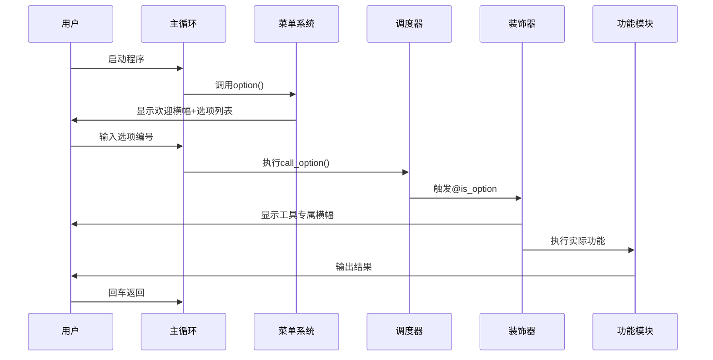
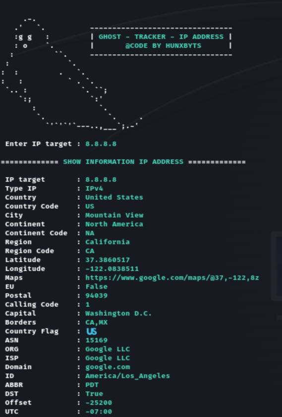
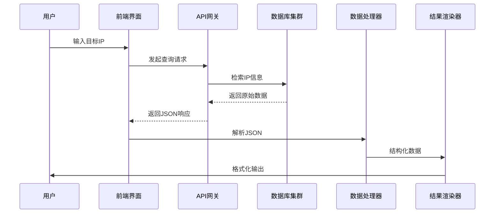

# 第2章：菜单与选项管理系统

在`GhostTrack`工具中，菜单系统如同智能导航中枢，通过精心设计的架构实现功能调度。本章将深入解析其实现原理与技术细节。

## 核心数据结构

### 选项注册表
```python
options = [
    {
        'num': 1,                   # 选项编号
        'text': 'IP地址追踪',       # 显示文本
        'func': IP_Track            # 绑定函数
    },
    {
        'num': 2,
        'text': '显示本机IP',
        'func': showIP
    },
    # ...其他选项...
    {
        'num': 0,
        'text': '退出程序',
        'func': exit
    }
]
```

## 技术实现

### 菜单渲染引擎
```python
def option_text():
    """动态生成菜单文本"""
    menu_str = ''
    for item in options:
        menu_str += f'{Wh}[ {item["num"]} ] {Gr}{item["text"]}\n'
    return menu_str

def option():
    """主界面渲染函数"""
    clear()  # 清屏操作
    # 显示ASCII艺术横幅
    stderr.writelines(option_text())  # 输出格式化菜单
```

### 选项调度器
```python
def call_option(selected_num):
    """选项执行路由"""
    if selected_num not in [opt['num'] for opt in options]:
        raise ValueError('无效选项编号')
    
    for item in options:
        if item['num'] == selected_num:
            item['func']()  # 执行绑定函数
            return
```

### 自动化横幅装饰器
```python
def is_option(func):
    """函数装饰器：自动添加横幅"""
    def wrapper(*args, **kwargs):
        run_banner()  # 前置横幅显示
        func(*args, **kwargs)  # 执行原函数
    return wrapper

@is_option  # 应用装饰器
def IP_Track():
    """IP追踪功能实现"""
    target_ip = input(f"{Wh}\n 输入目标IP : {Gr}")
    # ...IP查询逻辑...
```

##### 🎢装饰器设计哲学

可以解释为：

**“在不修改原函数代码的前提下，统一给多个功能==自动加上相同的前置操作==（比如显示横幅）。”**

就像你每次进教室前，老师都要求喊一声“报告”——装饰器就是那个==自动帮你喊“报告”==的规则，你只管进教室（写自己的功能），不用每次都手动喊

## 系统工作流程



## 设计优势分析

1. **可扩展架构**
   - 新增功能只需在`options`列表注册
   - 符合开闭原则(OCP)

2. **一致性保障**
   - 装饰器模式确保统一的前置横幅
   - 菜单自动生成避免硬编码

3. **异常处理**
   - 输入验证机制
   - 错误编号检测

## 性能考量

1. **时间复杂度**
   - 菜单渲染: O(n)
   - 选项查找: O(n) → 可优化为字典O(1)

2. **内存占用**
   - 选项列表常驻内存
   - 横幅文本按需加载

## 实践建议

1. **国际化支持**
   ```python
   # 多语言扩展示例
   options = [
       {
           'num': 1,
           'text': {'en': 'IP Tracker', 'zh': 'IP地址追踪'},
           'func': IP_Track
       }
   ]
   ```

2. **热重载机制**
   ```python
   def reload_options():
       global options
       options = load_from_config('menu_config.json')
   ```

接下来将深入首个功能模块的实现细节：
[第3章：IP地址追踪器](03_ip_address_tracker_.md)

---
# 第3章：IP地址追踪器

在`GhostTrack`工具中，IP地址追踪模块通过智能化的网络请求与数据处理，实现了对目标IP的深度信息挖掘。本章将全面解析其技术实现与运行机制。

## 功能概述

### 核心能力



- **地理定位**：解析IP所属国家/城市
- **网络归属**：识别ISP服务商
- **时区信息**：获取当地标准时间
- **网络属性**：判断IP类型(IPv4/IPv6)

### 应用场景
1. 网络流量来源分析
2. 服务器位置验证
3. 可疑连接调查
4. 网络拓扑研究

## 技术实现

### 核心函数结构
```python
@is_option  # 自动加载横幅装饰器
def IP_Track():
    target_ip = input(f"{Wh}\n 输入目标IP : {Gr}")  # 用户输入捕获
    print(f' {Wh}============= {Gr}IP地址详细信息 {Wh}=============')
    
    # API请求与数据处理
    response = requests.get(f"http://ipwho.is/{target_ip}")
    ip_data = json.loads(response.text)
    
    # 信息提取与展示
    print(f"{Wh}\n IP目标地址   :{Gr}", target_ip)
    print(f"{Wh} IP类型       :{Gr}", ip_data["type"])
    print(f"{Wh} 国家         :{Gr}", ip_data["country"])
    # ...更多字段输出...
    
    # 地图链接生成
    map_url = f"https://www.google.com/maps/@{int(ip_data['latitude'])},{int(ip_data['longitude'])},8z"
    print(f"{Wh} 地图位置     :{Gr}", map_url)
```

### 技术点

1. **API集成**
   - 采用`ipwho.is`免费API服务
   - ==请求格式: `http://ipwho.is/{ip_address}`==
   - 响应数据: JSON格式

2. **数据处理**
   ```python
   {
       "ip": "8.8.8.8",
       "type": "IPv4",
       "country": "United States",
       "city": "Ashburn",
       "latitude": 39.03,
       "longitude": -77.5,
       # ...其他字段...
   }
   ```

3. **用户体验优化**
   - 彩色终端输出
   - 2秒延迟模拟数据处理过程
   - 直接生成可点击的地图链接

## 系统架构



## 安全与限制

1. **隐私保护**
   - 仅查询公开注册的IP信息
   - 不记录用户查询历史

2. **使用限制**
   - 免费API的请求频率限制(60次/分钟)
   - 部分字段可能缺失(如城市级精度)

3. **数据准确性**
   - ISP信息可能存在延迟更新
   - 地理坐标为大范围近似值

## 扩展应用

### 批量查询模式
```python
def batch_ip_track(ip_list):
    results = []
    for ip in ip_list:
        res = requests.get(f"http://ipwho.is/{ip}")
        results.append(json.loads(res.text))
    return pd.DataFrame(results)  # 返回DataFrame便于分析
```

### 异常检测
```python
def detect_anomaly(ip_data):
    if ip_data['proxy'] or ip_data['tor']:
        return "匿名网络警告"
    if ip_data['latitude'] == 0:  # 无效坐标
        return "数据异常"
    return None
```

## 性能优化

1. **缓存机制**
   ```python
   from functools import lru_cache
   
   @lru_cache(maxsize=100)
   def cached_ip_lookup(ip):
       return requests.get(f"http://ipwho.is/{ip}")
   ```

2. **异步请求**
   ```python
   import aiohttp
   
   async def async_ip_track(ip):
       async with aiohttp.ClientSession() as session:
           async with session.get(f"http://ipwho.is/{ip}") as response:
               return await response.json()
   ```

接下来将探索通信标识解析技术：
[第4章：电话号码分析器](04_phone_number_analyzer_.md)

