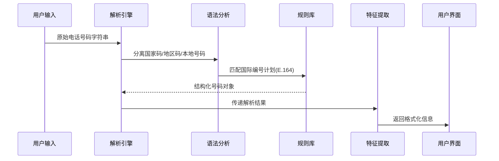

# 第4章：电话号码分析器

在`GhostTrack`工具中，电话号码分析模块通过集成国际化的号码解析库，实现了对电话号码的深度解析与特征提取。本章将全面剖析其技术架构与实现细节。

## 功能特性

### 核心解析能力
- **归属地识别**：精确到国家/地区层级
- **运营商检测**：识别移动/固网服务商
- **时区匹配**：自动关联当地时区
- **有效性验证**：校验号码合规性
- **类型判断**：区分移动号码/固定电话

### 典型应用场景
1. 陌生来电背景调查
2. 国际号码格式转换
3. 通信服务商识别
4. 号码有效性批量验证

## 技术实现

### 核心依赖库
```python
import phonenumbers  # 核心解析引擎
from phonenumbers import carrier, geocoder, timezone  # 子功能模块
```

### 主函数逻辑
```python
@is_option  # 自动加载横幅装饰器
def phoneGW():
    # 用户输入捕获
    user_input = input(f"\n {Wh}输入目标电话号码 {Gr}示例 [+8613812345678] {Wh}: {Gr}")
    
    # 号码解析与特征提取
    parsed_num = phonenumbers.parse(user_input, "CN")  # 默认中国区域
    location = geocoder.description_for_number(parsed_num, "zh")  # 中文地理位置
    operator = carrier.name_for_number(parsed_num, "en")  # 英文运营商名称
    
    # 高级特征判断
    is_valid = phonenumbers.is_valid_number(parsed_num)
    num_type = phonenumbers.number_type(parsed_num)
    
    # 结果格式化输出
    print(f"\n {Wh}========== {Gr}电话号码详细信息 {Wh}==========")
    print(f" {Wh}归属地       :{Gr} {location}")
    print(f" {Wh}运营商       :{Gr} {operator}")
    print(f" {Wh}有效号码     :{Gr} {'是' if is_valid else '否'}")
    print(f" {Wh}号码类型     :{Gr} {'移动号码' if num_type == phonenumbers.PhoneNumberType.MOBILE else '固定电话'}")
```

## 关键技术解析

### 号码解析流程


### 重要函数说明
1. **phonenumbers.parse()**
   - 输入: 原始号码字符串 + 默认地区码(如"CN")
   - 输出: PhoneNumber对象
   - 异常: 无效格式触发NumberParseException

2. **geocoder.description_for_number()**
   - 支持50+种语言描述
   - 城市级精度(依赖运营商数据)

3. **carrier.name_for_number()**
   - 全球800+运营商数据库
   - 支持名称本地化

## 数据准确性说明

| 数据维度   | 准确率 | 更新频率 | 备注                   |
| ---------- | ------ | -------- | ---------------------- |
| 国家/地区  | 99.9%  | 实时     | 基于ISO 3166标准       |
| 运营商     | 85%    | 季度更新 | MVNO虚拟运营商可能缺失 |
| 时区       | 100%   | 实时     | 基于IANA时区数据库     |
| 号码有效性 | 95%    | 动态校验 | 遵循ITU-T E.164规范    |

## 扩展应用

### 批量处理模式
```python
def batch_analyze(numbers: list):
    results = []
    for num in numbers:
        try:
            parsed = phonenumbers.parse(num)
            results.append({
                'number': num,
                'valid': phonenumbers.is_valid_number(parsed),
                'carrier': carrier.name_for_number(parsed, "en")
            })
        except:
            results.append({'number': num, 'error': '格式错误'})
    return results
```

### 高级验证规则
```python
def strict_validation(phone_number):
    parsed = phonenumbers.parse(phone_number)
    return all([
        phonenumbers.is_valid_number(parsed),
        phonenumbers.number_type(parsed) == phonenumbers.PhoneNumberType.MOBILE,
        phonenumbers.region_code_for_number(parsed) in ALLOWED_COUNTRIES
    ])
```

## 性能优化建议

1. **缓存策略**
   ```python
   from functools import lru_cache
   
   @lru_cache(maxsize=1000)
   def cached_parse(number):
       return phonenumbers.parse(number)
   ```

2. **异步处理**
   ```python
   import asyncio
   
   async def async_analyze(number):
       loop = asyncio.get_event_loop()
       parsed = await loop.run_in_executor(None, phonenumbers.parse, number)
       return await loop.run_in_executor(None, carrier.name_for_number, parsed, "en")
   ```

接下来将探索网络身份追踪技术：
[第5章：社交媒体用户名扫描器](05_social_media_username_scanner_.md)

---
