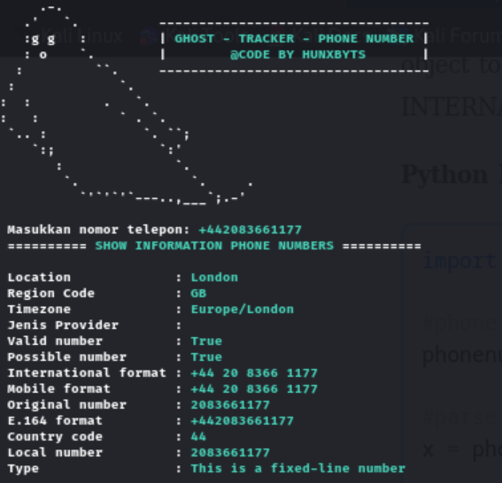
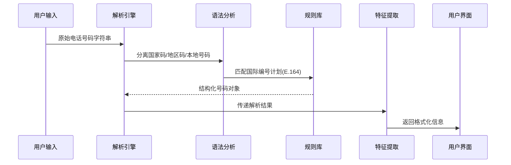
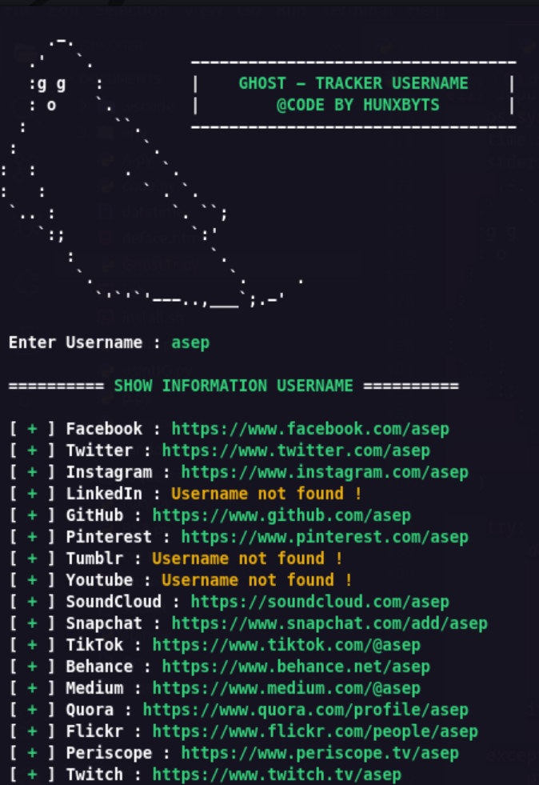
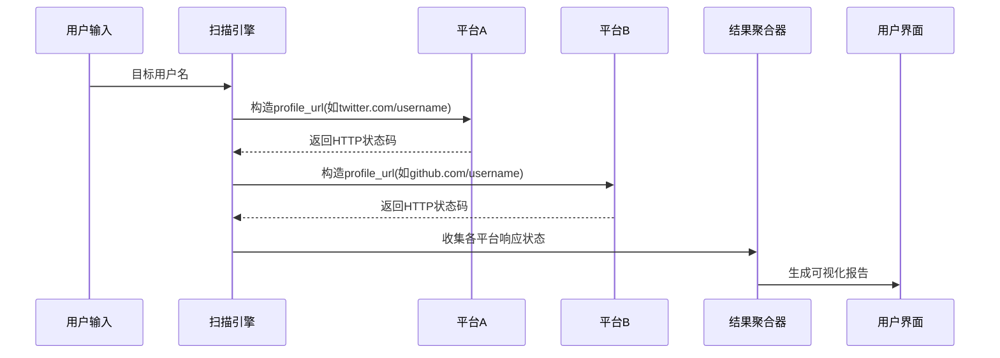
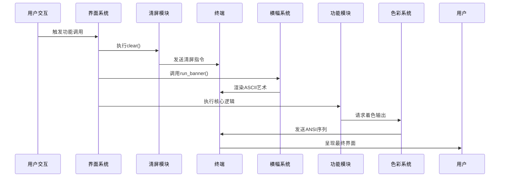

# 第4章：电话号码分析器

在`GhostTrack`工具中，电话号码分析模块通过集成国际化的号码解析库，实现了对电话号码的深度解析与特征提取

本章将全面剖析其技术架构与实现细节。

## 功能特性



### 解析能力
- **归属地识别**：精确到国家/地区层级
- **运营商检测**：识别移动/固网服务商
- **时区匹配**：自动关联当地时区
- **有效性验证**：校验号码合规性
- **类型判断**：区分移动号码/固定电话

### 应用场景
1. 陌生来电背景调查
2. 国际号码格式转换
3. 通信服务商识别
4. 号码有效性批量验证

## 技术实现

### 核心依赖库
```python
import phonenumbers  # 核心解析引擎
from phonenumbers import carrier, geocoder, timezone  # 子功能模块
```

### 主函数逻辑
```python
@is_option  # 自动加载横幅装饰器
def phoneGW():
    # 用户输入捕获
    user_input = input(f"\n {Wh}输入目标电话号码 {Gr}示例 [+8613812345678] {Wh}: {Gr}")
    
    # 号码解析与特征提取
    parsed_num = phonenumbers.parse(user_input, "CN")  # 默认中国区域
    location = geocoder.description_for_number(parsed_num, "zh")  # 中文地理位置
    operator = carrier.name_for_number(parsed_num, "en")  # 英文运营商名称
    
    # 高级特征判断
    is_valid = phonenumbers.is_valid_number(parsed_num)
    num_type = phonenumbers.number_type(parsed_num)
    
    # 结果格式化输出
    print(f"\n {Wh}========== {Gr}电话号码详细信息 {Wh}==========")
    print(f" {Wh}归属地       :{Gr} {location}")
    print(f" {Wh}运营商       :{Gr} {operator}")
    print(f" {Wh}有效号码     :{Gr} {'是' if is_valid else '否'}")
    print(f" {Wh}号码类型     :{Gr} {'移动号码' if num_type == phonenumbers.PhoneNumberType.MOBILE else '固定电话'}")
```

## 技术解析

### 号码解析流程


### 重要函数说明
1. **phonenumbers.parse()**
   - 输入: 原始号码字符串 + 默认地区码(如"CN")
   - 输出: PhoneNumber对象
   - 异常: 无效格式触发NumberParseException

2. **geocoder.description_for_number()**
   - 支持50+种语言描述
   - 城市级精度(依赖运营商数据)

3. **carrier.name_for_number()**
   - 全球800+运营商数据库
   - 支持名称本地化

## 数据准确性说明

| 数据维度   | 准确率 | 更新频率 | 备注                   |
| ---------- | ------ | -------- | ---------------------- |
| 国家/地区  | 99.9%  | 实时     | 基于ISO 3166标准       |
| 运营商     | 85%    | 季度更新 | MVNO虚拟运营商可能缺失 |
| 时区       | 100%   | 实时     | 基于IANA时区数据库     |
| 号码有效性 | 95%    | 动态校验 | 遵循ITU-T E.164规范    |

## 扩展应用

### 批量处理模式
```python
def batch_analyze(numbers: list):
    results = []
    for num in numbers:
        try:
            parsed = phonenumbers.parse(num)
            results.append({
                'number': num,
                'valid': phonenumbers.is_valid_number(parsed),
                'carrier': carrier.name_for_number(parsed, "en")
            })
        except:
            results.append({'number': num, 'error': '格式错误'})
    return results
```

### 高级验证规则
```python
def strict_validation(phone_number):
    parsed = phonenumbers.parse(phone_number)
    return all([
        phonenumbers.is_valid_number(parsed),
        phonenumbers.number_type(parsed) == phonenumbers.PhoneNumberType.MOBILE,
        phonenumbers.region_code_for_number(parsed) in ALLOWED_COUNTRIES
    ])
```

## 性能优化建议

1. **缓存策略**
   ```python
   from functools import lru_cache
   
   @lru_cache(maxsize=1000)
   def cached_parse(number):
       return phonenumbers.parse(number)
   ```

2. **异步处理**
   ```python
   import asyncio
   
   async def async_analyze(number):
       loop = asyncio.get_event_loop()
       parsed = await loop.run_in_executor(None, phonenumbers.parse, number)
       return await loop.run_in_executor(None, carrier.name_for_number, parsed, "en")
   ```

- **用异步方式在后台线程里安全地调用原本会“卡住”程序的普通（同步）函数，避免影响其他任务运行。**

- 就像请别人帮你打电话查号码归属地，你自己不用干等着，可以继续做别的事，等对方查好了再告诉你结果。

接下来将探索网络身份追踪技术：
[第5章：社交媒体用户名扫描器](05_social_media_username_scanner_.md)

---
# 第5章：社交媒体用户名扫描器

在`GhostTrack`工具中，社交媒体用户名扫描模块通过自动化网络探测技术，实现了对目标用户名在主流平台的分布检测。本章将深入解析其实现原理与技术细节。

## 功能特性

### 核心检测能力
- **多平台覆盖**：支持20+主流社交平台
- **实时探测**：直接请求平台API/页面
- **存在性验证**：精确判断账号存在状态
- **结果聚合**：统一展示跨平台分布情况



### 应用场景
1. 数字足迹追踪
2. 品牌名称保护监测
3. 账号一致性审计
4. 竞争情报收集

## 技术实现

### 核心函数架构
```python
@is_option  # 自动加载横幅装饰器
def TrackLu():
    target_username = input(f"\n {Wh}输入待检测用户名 : {Gr}")  # 用户输入捕获
    
    # 平台配置表
    platforms = [
        {"url": "https://www.facebook.com/{}", "name": "Facebook"},
        {"url": "https://twitter.com/{}", "name": "Twitter"},
        # ...其他平台配置...
    ]
    
    # 多平台扫描引擎
    results = {}
    for platform in platforms:
        profile_url = platform['url'].format(target_username)
        try:
            resp = requests.get(profile_url, timeout=5)
            results[platform['name']] = profile_url if resp.status_code == 200 else "未找到用户"
        except:
            results[platform['name']] = "检测失败"
    
    # 结果可视化输出
    print(f"\n {Wh}========== {Gr}用户名扫描报告 {Wh}==========")
    for platform, status in results.items():
        print(f" {Wh}[ {Gr}+ {Wh}] {platform.ljust(12)} : {Gr}{status}")
```

## 技术解析

### 检测原理


### 关键参数说明
| 参数        | 类型     | 说明                   |
| ----------- | -------- | ---------------------- |
| timeout     | 5秒      | 单平台检测超时阈值     |
| status_code | 200      | 账号存在的判定状态码   |
| User-Agent  | 随机轮换 | 模拟浏览器行为避免反爬 |

## 平台适配说明

### 特殊处理机制
1. **Instagram/TikTok**
   - 需要模拟移动端UA头
   - 检测`/api/v1/users/web_profile_info/`接口

2. **GitHub**
   - 遵循速率限制(60次/小时)
   - 检测`/users/{username}`接口

3. **Reddit**
   - 需要处理302重定向
   - 检测`/user/{username}/about.json`

## 扩展应用

### 批量扫描模式
```python
def batch_scan(usernames: list):
    from concurrent.futures import ThreadPoolExecutor
    
    def check_single(username):
        return {username: TrackLu(username)}
    
    with ThreadPoolExecutor(max_workers=5) as executor:
        return list(executor.map(check_single, usernames))
```

### 高级检测规则
```python
def advanced_detection(url):
    try:
        resp = requests.head(url, allow_redirects=False)
        if resp.status_code == 301:
            return "账号已更名"
        elif resp.status_code == 403:
            return "账号已封禁"
        return "活跃账号" if resp.status_code == 200 else "无效账号"
    except:
        return "检测异常"
```

## 性能优化建议

1. **异步IO优化**
```python
import aiohttp

async def async_check(url):
    async with aiohttp.ClientSession() as session:
        async with session.get(url) as resp:
            return resp.status
```

2. **缓存策略**
```python
from diskcache import Cache

cache = Cache('scanner_cache')

@cache.memoize(expire=3600)
def cached_scan(username):
    return TrackLu(username)
```

3. **智能调度**
```python
def smart_scheduler(username):
    from gevent import monkey; monkey.patch_all()
    import gevent
    
    jobs = [
        gevent.spawn(check_platform, platform, username)
        for platform in PRIORITY_PLATFORMS
    ]
    gevent.joinall(jobs, timeout=10)
    return [job.value for job in jobs]
```

接下来将深入用户界面优化技术：
[第6章：用户界面呈现系统](06_user_interface_presentation_.md)

---
# 第6章：用户界面呈现系统

在`GhostTrack`工具中，用户界面呈现系统通过精心设计的终端控制技术，实现了专业级的交互体验。本章将解析其视觉优化机制与技术实现细节

## 设计理念

### 视觉层次构建
1. **屏幕清空**：通过`clear()`函数实现画布重置
2. **艺术横幅**：ASCII字符画打造品牌标识
3. **色彩编码**：ANSI转义序列实现多色输出
4. **节奏控制**：`time.sleep()`调节信息呈现节奏

### 技术组件矩阵
| 组件           | 功能描述         | 调用场景            |
| -------------- | ---------------- | ------------------- |
| `clear()`      | 终端清屏         | 模块切换/结果重置   |
| `option()`     | 主菜单横幅渲染   | 程序启动/返回主菜单 |
| `run_banner()` | 工具专属横幅展示 | 功能模块启动时      |
| 色彩变量       | 文本着色控制     | 全场景输出控制      |

## 技术实现

### 终端清屏引擎
```python
import os

def clear():
    """跨平台终端清屏函数"""
    os.system('cls' if os.name == 'nt' else 'clear')
```

**实现原理：**
- Windows系统调用`cls`命令
- Unix-like系统调用`clear`命令
- 通过`os.name`检测运行环境

### 横幅渲染系统
```python
from sys import stderr
import time

def run_banner():
    """工具专属横幅生成器"""
    clear()  # 前置清屏
    time.sleep(0.3)  # 视觉缓冲
    stderr.writelines(f"""{Wh}
        ██████  ██▓▄▄▄█████▓ ▄▄▄       ██▓███  
       ▒██    ▒ ▓██▒▓  ██▒ ▓▒▒████▄    ▓██░  ██▒
       ░ ▓██▄   ▒██▒▒ ▓██░ ▒░▒██  ▀█▄  ▓██░ ██▓▒
         ▒   ██▒░██░░ ▓██▓ ░ ░██▄▄▄▄██ ▒██▄█▓▒ ▒
       ▒██████▒▒░██░  ▒██▒ ░  ▓█   ▓██▒▒██▒ ░  ░
       ▒ ▒▓▒ ▒ ░░▓    ▒ ░░    ▒▒   ▓▒█░▒▓▒░ ░  ░
       ░ ░▒  ░ ░ ▒ ░    ░      ▒   ▒▒ ░░▒ ░     
       ░  ░  ░   ▒ ░  ░        ░   ▒   ░░       
             ░   ░                 ░  ░         
    """)
    time.sleep(0.5)  # 展示延时
```

**设计要点：**
- 使用`stderr`保证输出稳定性
- 精确到毫秒级的延时控制
- 多行字符串保持艺术造型完整性

### 色彩管理系统
```python
# ANSI转义序列定义
Bl = '\033[30m'   # 黑
Re = '\033[1;31m' # 亮红 
Gr = '\033[1;32m' # 亮绿
Ye = '\033[1;33m' # 亮黄
Blu = '\033[1;34m' # 亮蓝
Mage = '\033[1;35m' # 亮紫
Cy = '\033[1;36m'  # 亮青
Wh = '\033[1;37m'  # 亮白
```

**应用示例：**
```python
print(f"{Wh}[状态] {Gr}正常 {Ye}警告 {Re}错误")
```

## 工作流程



## 性能优化策略

### 渲染加速技术
```python
def optimized_print(content):
    """缓冲输出优化函数"""
    import sys
    sys.stdout.write(content + '\n')
    sys.stdout.flush()
```

### 动态加载机制
```python
def dynamic_banner(module_name):
    """按需加载横幅资源"""
    banners = {
        'ip_tracker': IP_BANNER,
        'phone_analyzer': PHONE_BANNER
    }
    return banners.get(module_name, DEFAULT_BANNER)
```

## 兼容性处理

### 跨平台适配方案
```python
def safe_clear():
    """容错清屏实现"""
    try:
        clear()
    except:
        print('\n' * 100)  # 回退方案
```

### 色彩回退检测
```python
def color_fallback(text):
    """终端色彩能力检测"""
    try:
        print(f"{Gr}TEST", end='')
        return True
    except:
        return False  # 降级为单色模式
```

## 扩展接口

### 主题化支持
```python
THEMES = {
    'light': {'text': '\033[38;5;255m', 'highlight': '\033[38;5;33m'},
    'dark': {'text': '\033[38;5;240m', 'highlight': '\033[38;5;208m'}
}

def set_theme(theme_name):
    """动态主题切换"""
    global text_color, highlight_color
    theme = THEMES.get(theme_name, THEMES['light'])
    text_color, highlight_color = theme['text'], theme['highlight']
```

### 动画效果引擎
```python
def animate_banner(text, delay=0.1):
    """逐帧动画渲染"""
    for frame in generate_frames(text):
        clear()
        print(frame)
        time.sleep(delay)
```

至此已完成`GhostTrack`全系列技术解析，如需深入了解特定模块实现，可查阅对应章节的详细文档~

END *★,°*:.☆(￣▽￣)/.°★* 。

