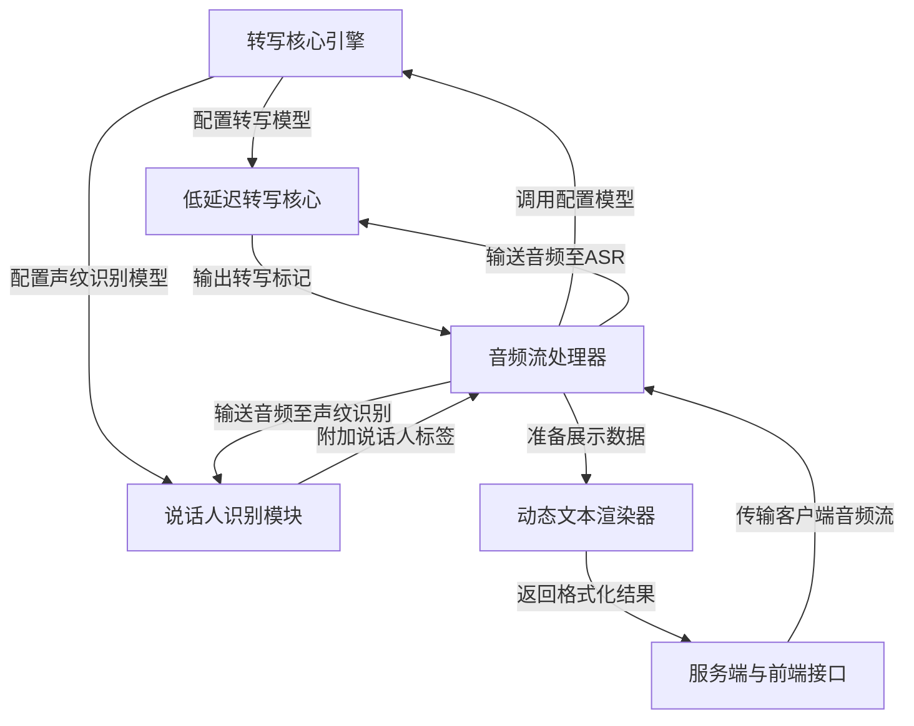

链接：[github.com/QuentinFuxa/WhisperLiveKit?tab=readme-ov-file](https://github.com/QuentinFuxa/WhisperLiveKit?tab=readme-ov-file)

Whisper的专栏写了一半，之后有机会更新出来，关于Whisper之前有许多项目中也有介绍到过~

前文传送：

[[Meetily后端框架] Whisper转录服务器 | 后端服务管理脚本](https://blog.csdn.net/2301_80171004/article/details/149281906?ops_request_misc=%257B%2522request%255Fid%2522%253A%252293432dc72f0a1db6f9ededdb8e20dc1d%2522%252C%2522scm%2522%253A%252220140713.130102334.pc%255Fblog.%2522%257D&request_id=93432dc72f0a1db6f9ededdb8e20dc1d&biz_id=0&utm_medium=distribute.pc_search_result.none-task-blog-2~blog~first_rank_ecpm_v1~rank_v31_ecpm-1-149281906-null-null.nonecase&utm_term=Whisper&spm=1018.2226.3001.4450)

[[Sync_ai_vid] 唇形同步推理流程 | Whisper架构](https://blog.csdn.net/2301_80171004/article/details/150870809?ops_request_misc=%257B%2522request%255Fid%2522%253A%252293432dc72f0a1db6f9ededdb8e20dc1d%2522%252C%2522scm%2522%253A%252220140713.130102334.pc%255Fblog.%2522%257D&request_id=93432dc72f0a1db6f9ededdb8e20dc1d&biz_id=0&utm_medium=distribute.pc_search_result.none-task-blog-2~blog~first_rank_ecpm_v1~rank_v31_ecpm-2-150870809-null-null.nonecase&utm_term=Whisper&spm=1018.2226.3001.4450)

[[AI-video] 字幕服务 | 视频素材服务 | 视频生成服务](https://blog.csdn.net/2301_80171004/article/details/149397068?ops_request_misc=%257B%2522request%255Fid%2522%253A%252293432dc72f0a1db6f9ededdb8e20dc1d%2522%252C%2522scm%2522%253A%252220140713.130102334.pc%255Fblog.%2522%257D&request_id=93432dc72f0a1db6f9ededdb8e20dc1d&biz_id=0&utm_medium=distribute.pc_search_result.none-task-blog-2~blog~first_rank_ecpm_v1~rank_v31_ecpm-4-149397068-null-null.nonecase&utm_term=Whisper&spm=1018.2226.3001.4450)

...ok现在我们一起来看一下这个有趣的项目吧

# docs：WhisperLiveKit

WhisperLiveKit 是一个专为**浏览器内实时语音转文字**设计的强大项目


利用先进AI模型*处理实时音频流*，实现*说话人识别*，并*动态展示*转写文本，通常具备*超低延迟*特性，非常适合实时对话和交互式应用场景。

## 架构



## 章节

1. [服务端与前端接口](01_server___frontend_interface_.md)
2. [音频流处理器](02_audio_stream_handler_.md)
3. [转写核心引擎](03_transcription_core_.md)
4. [低延迟转写核心](04_low_latency_transcription_core_.md)
5. [说话人识别模块](05_speaker_identification_.md)
6. [动态文本渲染器](06_dynamic_transcript_renderer_.md)

---

# WhisperLiveKit 实时语音转文字系统

## 概述
WhisperLiveKit 是一款基于浏览器实现的**全本地化==实时语音转文字==**解决方案，集成说话人识别功能，提供开箱即用的前后端服务

[](https://pypi.org/project/whisperlivekit/)
[](https://pypi.org/project/whisperlivekit/)


## 技术
- **Simul-Whisper/Streaming (2025 SOTA)**：采用AlignAtt策略实现超低延迟转写
- **NLLW (2025)**：基于蒸馏版NLLB (2022/2024) 支持200种语言实时互译
- **WhisperStreaming (2023 SOTA)**：LocalAgreement策略的低延迟转写
- **Streaming Sortformer (2025 SOTA)**：实时说话人分离技术
- **Diart (2021 SOTA)**：实时声纹识别框架
- **Silero VAD (2024)**：企业级语音活动检测

> 传统Whisper批处理方案存在语境丢失、音节截断等问题
>
> WhisperLiveKit采用前沿==流式处理==技术实现智能缓冲与增量处理。

## 架构


==后端支持多用户并发==，语音活动检测有效降低静音时段计算开销。

## 快速开始

### 安装部署
```bash
pip install whisperlivekit
# 或克隆仓库开发版
git clone https://github.com/your-repo/whisperlivekit && pip install -e .
```

### 启动服务
```bash
whisperlivekit-server --model base --language en
```
浏览器访问 http://localhost:8000 即可体验实时转写

> 语言支持列表详见`tokenizer.py`，HTTPS配置参考参数章节


## 可选依赖

| 功能                | 安装命令                        |
| ------------------- | ------------------------------- |
| 说话人识别          | `pip install nemo_toolkit[asr]` |
| Apple芯片优化       | `pip install mlx-whisper`       |
| 翻译功能            | `pip install nllw`              |
| (不推荐)Diart后端   | `pip install diart`             |
| (不推荐)原生Whisper | `pip install whisper`           |

## 使用示例

### 命令行接口
```bash
# 法语转丹麦语(大模型)
whisperlivekit-server --model large-v3 --language fr --target-language da

# 多人会话识别(中模型)
whisperlivekit-server --host 0.0.0.0 --port 80 --model medium --diarization --language fr
```

### Python API集成
```python
from whisperlivekit import TranscriptionEngine, AudioProcessor
from fastapi import FastAPI, WebSocket

app = FastAPI()
engine = TranscriptionEngine(model="medium", diarization=True, lan="en")

@app.websocket("/asr")
async def websocket_endpoint(websocket: WebSocket):
    processor = AudioProcessor(engine)
    async for result in processor.create_tasks():
        await websocket.send_json(result)
```

### 前端集成
内置HTML/JS实现，可通过`from whisperlivekit import get_inline_ui_html`调用。

## 参数配置
| 参数           | 说明                        | 默认值 |
| -------------- | --------------------------- | ------ |
| --model        | Whisper模型尺寸             | small  |
| --language     | 输入语言(auto自动检测)      | auto   |
| --diarization  | 启用说话人识别              | False  |
| --ssl-certfile | HTTPS证书路径               | None   |
| --pcm-input    | 直接输入PCM音频(绕过FFmpeg) | False  |

完整参数表详见文档。

## 生产部署

### 服务端配置
```bash
pip install uvicorn gunicorn
gunicorn -k uvicorn.workers.UvicornWorker -w 4 your_app:app
```

### Nginx示例
```nginx
server {
    listen 80;
    server_name your-domain.com;
    location / {
        proxy_pass http://localhost:8000;
        proxy_set_header Upgrade $http_upgrade;
        proxy_set_header Connection "upgrade";
    }
}
```

## Docker部署
```bash
# GPU加速版
docker build -t wlk .
docker run --gpus all -p 8000:8000 wlk

# CPU版
docker build -f Dockerfile.cpu -t wlk .
docker run -p 8000:8000 wlk
```

## 应用场景
- 会议实时记录
- 听障人士辅助工具
- 播客/视频自动字幕
- 客服通话分析(带说话人标记)

