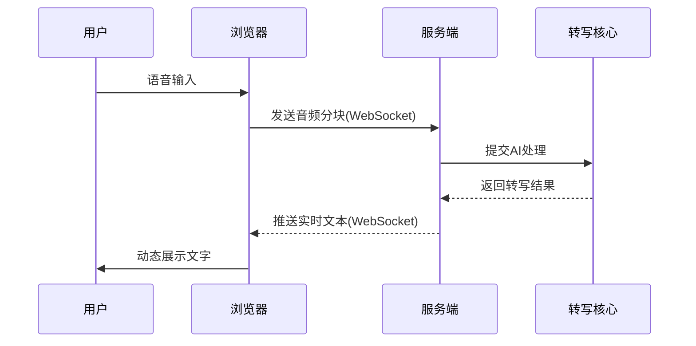

# 第1章：服务端与前端接口

想象一下，我们在会议中或观看视频时，希望将实时语音内容即时转化为屏幕文字——这正是WhisperLiveKit的核心功能


将语音实时转写成文字，并通过浏览器直接展示，实现近乎零延迟的交互体验~

## 接口功能定位

服务端与前端接口是WhisperLiveKit的"交互中枢"，负责连接用户浏览器（可视化界面）与后端AI处理系统（核心算力）

这一设计解决了网页应用直接实现实时语音转文字的难题，若无此接口，浏览器将无法实现"收音"与"展示"的闭环。

## 核心组件解析

### 1. 浏览器前端
作为系统的"感官终端"，通过Chrome/Firefox等浏览器实现：
- 麦克风音频采集（或浏览器标签页音频捕获）
- 音频压缩（节省带宽）
- 实时文字渲染展示

### 2. WhisperLiveKit服务端
基于Python的FastAPI框架构建，承担"智能中继"角色：
- 接收浏览器音频流
- 调度AI处理模块
- 返回结构化转写结果

### 3. WebSocket通信通道
建立浏览器与服务端的持久化双向连接，突破传统HTTP请求-响应模式，实现毫秒级实时数据传输。

## 快速实践指南

### 步骤1：启动服务端
在终端执行以下命令：
```bash
whisperlivekit-server --model base --language en
```
- `--model base`：选用轻量级语音识别模型
- `--language en`：指定英语识别

### 步骤2：浏览器访问
打开浏览器访问：
```
http://localhost:8000
```
点击"录音"按钮即可体验实时语音转文字功能。

## 通信流程


## 代码

### 服务端WebSocket处理(FastAPI)
```python
@app.websocket("/asr")
async def websocket_endpoint(websocket: WebSocket):
    await websocket.accept()  # 建立连接
    while True:
        audio_chunk = await websocket.receive_bytes()  # 接收音频分块
        # 调用转写核心处理...
        await websocket.send_json(transcript)  # 返回结果
```

### 前端WebSocket控制(JavaScript)
```javascript
const ws = new WebSocket("ws://localhost:8000/asr");
ws.onmessage = (event) => {
    renderText(JSON.parse(event.data));  // 动态渲染文字
};
recorder.ondataavailable = (e) => {
    ws.send(e.data);  // 发送音频数据
};
```

本章揭示了音频数据如何抵达服务端，接下来将深入探讨[音频流处理器](02_audio_stream_handler_.md)如何优化音频预处理流程
