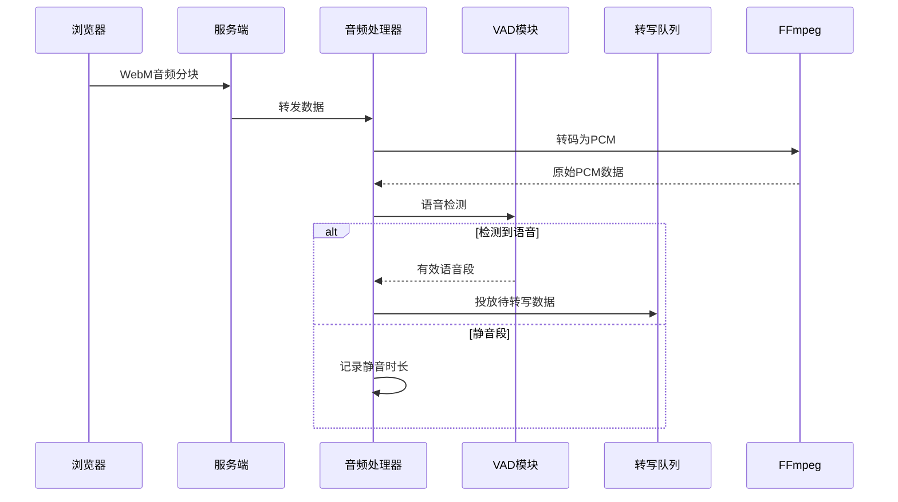

# 第2章：音频流处理器

在上一章[服务端与前端接口](01_server___frontend_interface_.md)中，我们了解了浏览器如何捕获语音并通过"音频分块"发送至WhisperLiveKit服务端。这就像将生鲜食材送至厨房，但食材不能直接用于烹饪（AI模型处理）——需要经过清洗、切割与分装！这正是**音频流处理器**的核心职责。

## 功能定位

将WhisperLiveKit比作智能工厂：
- **服务端接口**是接收原始音频的装卸区
- **音频流处理器**则是调度全厂的车间主管

核心解决以下问题：
1. 实时过滤静音与背景噪声
2. 格式转换（如WebM→PCM）
3. 负载均衡防止系统过载

## 核心组件

### 1. 音频分块
持续到达的小数据包（典型30ms/块），类似传送带上的货箱

### 2. FFmpeg引擎
实时转码压缩音频为AI模型所需的PCM格式：
```python
# FFmpeg参数示例
cmd = [
    "ffmpeg", "-i", "pipe:0",  # 输入管道
    "-f", "s16le", "-acodec", "pcm_s16le",  # 输出PCM格式
    "pipe:1"  # 输出管道
]
```

### 3. 语音活动检测(VAD)
基于Silero VAD模型的静音检测器：
```python
vad = FixedVADIterator(model)  # 初始化检测器
if vad(pcm_chunk):  # 检测语音段
    transcription_queue.put(pcm_chunk)
```

### 4. 双缓冲队列
- **输入缓冲**：临时存储待处理音频
- **处理队列**：分类路由至不同AI模块

## 工作流程


## 关键代码实现

### 音频处理器初始化
```python
class AudioProcessor:
    def __init__(self):
        self.ffmpeg = FFmpegManager() if need_convert else None
        self.vad = FixedVADIterator() if enable_vad else None
        self.transcription_queue = asyncio.Queue()
```

### 实时处理逻辑
```python
async def process_audio(self, chunk):
    if self.ffmpeg:
        pcm = await self.ffmpeg.convert(chunk)  # 格式转换
    else:
        pcm = chunk  # 直接使用PCM
    
    if self.vad(pcm):  # 语音检测
        await self.transcription_queue.put(pcm)  # 路由至转写核心
```

## 性能优化策略
1. **动态分块**：根据网络延迟自动调整分块大小（100-500ms）
2. **零拷贝缓冲**：使用memoryview减少音频处理时的内存复制
3. **优先级队列**：确保实时音频优先于离线任务处理

## 下一章预告
音频流处理器已完成"食材预处理"，接下来将深入[转写核心引擎](03_transcription_core_.md)如何实现语音到文字的魔法转换！

