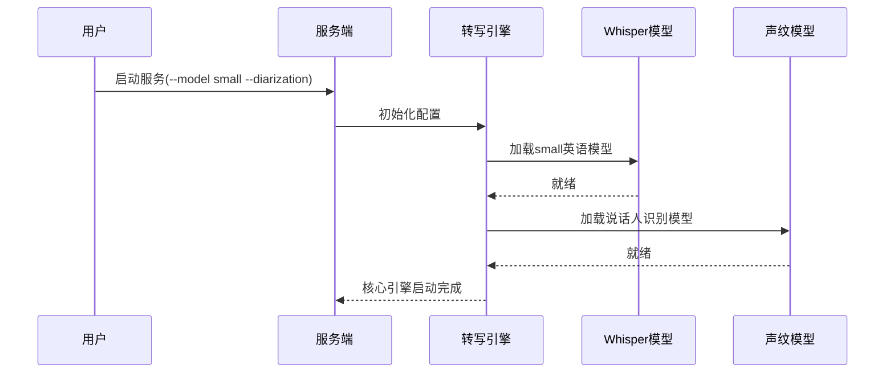

# 第3章：转写核心引擎

在上一章[音频流处理器](02_audio_stream_handler_.md)中，我们了解了原始音频如何被==预处理==为纯净的语音片段。

这些"待转写食材"现在需要一个强大的==AI大脑==来解析成文字——这正是**转写核心引擎**的使命

## 功能定位

实现实时语音转文字需要多维度协同：
1. **模型选型**：在速度（如`tiny`模型）与精度（如`large-v3`模型）间权衡
2. **语言适配**：支持英语、西班牙语等多语种识别
3. **任务路由**：区分纯转写与实时翻译场景
4. **说话人分离**：多人对话时标注发言者身份
5. **实时调度**：所有复杂步骤需在语音输入同时瞬时完成

转写核心引擎如同交响乐指挥，协调各AI模块奏出完美的实时转写乐章。

## 组件

### 1. 模型加载器
根据配置动态加载Whisper模型：
```python
if args.backend == "simulstreaming":
    self.asr = SimulStreamingASR(**args.__dict__)  # 实时流式模型
```

### 2. 任务配置器
解析启动参数：
```bash
whisperlivekit-server --model small --language en --task transcribe
```

### 3. 功能集成器
- **声纹识别**：通过`SortformerDiarization`模型标记说话人
- **静音检测**：与[音频流处理器](02_audio_stream_handler_.md)协同过滤无效音频
- **实时翻译**：当`target_language`参数激活时加载翻译模型

### 4. 流程调度器
采用单例模式确保全局唯一处理引擎：
```python
class TranscriptionEngine:
    _instance = None  # 单例模式
    def __new__(cls): 
        if not cls._instance:
            cls._instance = super().__new__(cls)
        return cls._instance
```

## 初始化流程


## 关键代码实现

### 引擎初始化
```python
def __init__(self, **kwargs):
    # 加载语音活动检测模型
    if self.args.vac:
        self.vac_model = load_silero_vad()
    
    # 加载主转写模型
    if self.args.transcription:
        self.asr = backend_factory(**self.args.__dict__)
    
    # 加载说话人识别模型
    if self.args.diarization:
        self.diarization_model = SortformerDiarization()
```

### 实时处理器工厂
```python
def online_factory(args, asr):
    if args.backend == "simulstreaming":
        return SimulStreamingOnlineProcessor(asr)  # 流式处理
    else:
        return OnlineASRProcessor(asr)  # 标准处理
```

## 性能优化

1. **模型预热**：首次加载后立即运行空白音频预热模型
2. **实例池**：==预加载多个模型实例应对并发请求==
3. **硬件适配**：
   - Apple Silicon芯片启用MLX加速
   - NVIDIA GPU启用FasterWhisper后端

核心引擎已就绪，接下来让我们来看看[低延迟转写核心](04_low_latency_transcription_core_.md)如何实现毫秒级响应

