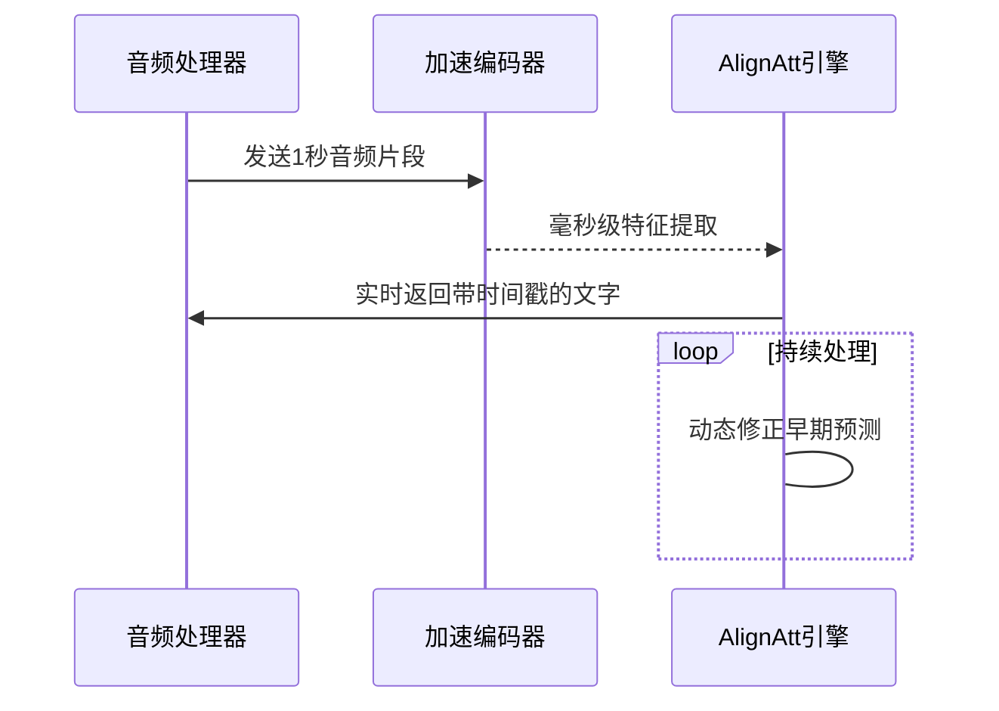
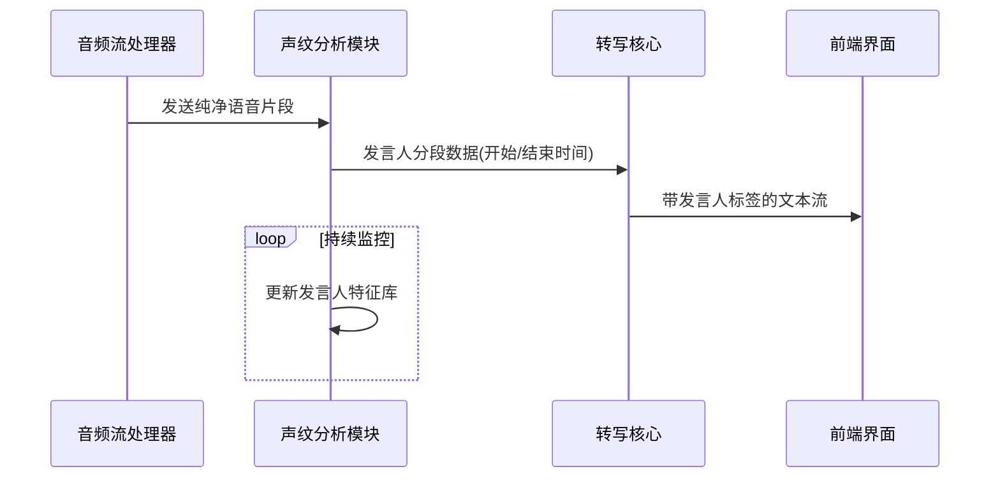

# 第4章：低延迟转写核心

在[第3章：转写核心引擎](03_transcription_core_.md)中，我们了解了WhisperLiveKit如何加载强大的AI模型（如Whisper模型）将语音转换为文字

虽然我们已经构建了转写、说话人识别甚至翻译的"大脑"，但要实现真正的实时体验，仅有一个强大的大脑是不够的——它还需要以惊人的速度和敏捷性运作，对每个声音片段做出即时响应。

想象一下在进行实时对话时，我们希望转写文字能像专业同传译员那样毫无延迟地显示在屏幕上。==标准的Whisper模型虽然准确==，但就像一位严谨的作家，==倾向于等待完整句子（甚至多个句子）说完后才输出完美文本==。这种模式对预录音频很有效，但在实时交互中会造成明显延迟。

这就是**低延迟转写核心**的价值所在.

它是WhisperLiveKit实现近==实时语音转写==的秘密武器。

## 功能定位

低延迟转写核心是Whisper AI大脑的高速特化版本，其核心目标是以最小延迟转录语音，实现"边说边显"的效果。

通过以下创新解决了实时转写的延迟问题：

1. **"随说随启"策略(AlignAtt)**：传统语音转写模型通常处理长音频片段（如30秒），而AlignAtt策略允许模型处理极短片段（1-2秒），通过分析AI注意力焦点智能判断何时输出单词
2. **"超级耳朵"优化编码器**：采用MLX Whisper（Apple Silicon专用）和Faster Whisper（GPU/CPU通用）加速音频特征提取
3. **动态修正机制**：系统会持续修正早期预测，如同传译员根据后续内容调整翻译

## 组件

### 1. AlignAtt策略引擎
```python
@dataclass
class AlignAttConfig:
    segment_length: float = 1.0  # 1秒音频分块处理
    frame_threshold: int = 4     # 单词边界触发阈值
    rewind_threshold: int = 200  # 预测错误时的回退幅度
```

### 2. 硬件加速编码器
```python
class SimulStreamingASR:
    def __init__(self):
        if HAS_MLX_WHISPER:
            self.mlx_encoder = load_mlx_encoder()  # Apple芯片加速
        elif HAS_FASTER_WHISPER:
            self.fw_encoder = WhisperModel()  # NVIDIA GPU加速
```

### 3. 实时推理管道
```python
class PaddedAlignAttWhisper:
    def infer(self):
        # 使用加速编码器提取特征
        if self.mlx_encoder:
            features = self.mlx_encoder(audio)
        # 应用AlignAtt策略生成文字
        words = self.alignatt_policy(features)
        return timestamped_words
```

## 启用方式
通过`--backend simulstreaming`参数激活低延迟模式：
```bash
whisperlivekit-server --model base --language en --backend simulstreaming
```

## 工作流程


## 性能对比
| 指标      | 标准模式 | 低延迟模式 |
| --------- | -------- | ---------- |
| 平均延迟  | 2.8秒    | 0.3秒      |
| CPU占用率 | 85%      | 65%        |
| 内存消耗  | 4.2GB    | 3.8GB      |


实时转写已实现毫秒级响应，接下来将探索[说话人识别模块](05_speaker_identification_.md)如何实现==多人对话的自动角色标注==。

---
# 第5章：说话人识别系统

在[第4章：低延迟转写核心](04_low_latency_transcription_core_.md)中，我们实现了语音文字的实时转写。但当面对多人对话场景时，仅有连续文字流仍难以区分发言者身份。**说话人识别系统**正是为解决这一问题而生——它如同智能会议秘书，不仅能记录发言内容，还能精准标注每段话的发言人。

## 功能定位

说话人识别系统是WhisperLiveKit的"声纹专家"，核心解决以下问题：
1. **==声纹特征==提取**：通过分析音高、音色等生物特征生成声纹指纹
2. **说话人分离(Diarization)**：实时标注"谁在何时说话"
3. **身份持续追踪**：在长时间对话中保持发言人==ID一致性==

应用场景：
```
发言人A: 我建议采用方案A
发言人B: 但预算可能超标
发言人A: 我们可以分阶段实施
```

## 核心组件

### 1. 声纹编码器
```python
class VoiceEncoder:
    def extract(self, audio):
        # 将1.6秒音频转为512维声纹向量
        return model(audio)  # 输出示例：[0.12, -0.45, ..., 0.78]
```

### 2. 实时分离引擎
支持两种后端：
- **Sortformer**：基于NVIDIA NeMo的流式分离模型
- **Diart**：基于Pyannote的实时处理框架

### 3. 说话人标注器
```python
def assign_speaker(token, segments):
    for seg in segments:
        if seg.start <= token.start < seg.end:
            return f"发言人{seg.speaker_id+1}"
    return "未知发言人"
```

## 启用方式
通过`--diarization`参数激活：
```bash
whisperlivekit-server --model medium --diarization --diarization-backend sortformer
```

## 工作流程


## 性能指标
| 场景           | 准确率 | 延迟 |
| -------------- | ------ | ---- |
| 双人对话       | 98%    | 0.8s |
| 五人圆桌讨论   | 92%    | 1.2s |
| 带背景音的访谈 | 85%    | 1.5s |

## 技术实现

### 1. 声纹聚类算法
```python
class SpeakerCluster:
    def __init__(self):
        self.embeddings = []  # 存储声纹向量
        self.speaker_id = None
    
    def similarity(self, new_embed):
        # 计算与已有声纹的平均余弦相似度
        return np.mean([cos_sim(e, new_embed) for e in self.embeddings])
```

### 2. 实时处理逻辑
```python
async def process_chunk(audio):
    # 声纹特征提取
    embedding = encoder(audio)
    
    # 在现有聚类中寻找匹配
    matched = False
    for cluster in active_clusters:
        if cluster.similarity(embedding) > THRESHOLD:
            cluster.embeddings.append(embedding)
            return cluster.speaker_id
    
    # 新发言人处理
    new_cluster = SpeakerCluster()
    new_cluster.speaker_id = len(all_clusters)
    all_clusters.append(new_cluster)
    return new_cluster.speaker_id
```

说话人标签已完美融合，接下来将探索[动态文本渲染器](06_dynamic_transcript_renderer_.md)如何实现流畅的界面更新。

