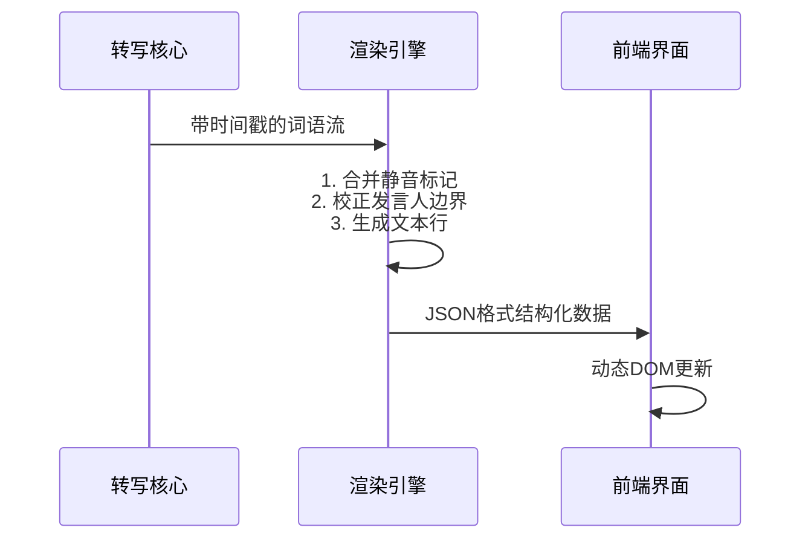

# 第6章：动态文本渲染器

在前五章中，我们构建了完整的语音转写流水线：从[服务端与前端接口](01_server___frontend_interface_.md)的音频采集，到[音频流处理器](02_audio_stream_handler_.md)的信号优化，经由[转写核心引擎](03_transcription_core_.md)和[低延迟转写核心](04_low_latency_transcription_core_.md)实现文字转换，最后通过[说话人识别系统](05_speaker_identification_.md)标注发言者身份

现在，**动态文本渲染器**将把这些数据转化为流畅可读的实时字幕。

## 功能定位

动态文本渲染器是WhisperLiveKit的"排版大师"，主要解决以下问题：
1. **时序对齐**：精确协调文字、说话人标签与时间戳的关系
2. **渐进式呈现**：区分已确认文本与临时预测内容
3. **视觉优化**：智能换行、静音标注与多语言混排

典型输出效果：
```
发言人A: 这个方案需要调整(0.5s-2.1s)
发言人B: 具体哪些部分？(2.3s-4.0s) 
[静音 4.0s-5.2s]
```

## 核心组件

### 1. 时序文本对象
```python
@dataclass
class TimedText:
    start: float  # 开始时间(秒)
    end: float    # 结束时间
    text: str     # 文本内容
    speaker: int  # 发言人ID
```

### 2. 双缓冲机制
| 缓冲类型 | 特性                 | 前端显示样式 |
| -------- | -------------------- | ------------ |
| 确认文本 | 置信度>95%的最终结果 | 黑色标准字体 |
| 预测文本 | 临时识别中的内容     | 灰色斜体字   |

### 3. 静音处理器
```python
def insert_silence_markers(tokens):
    # 在超过1.5秒的间隔中插入静音标记
    for i in range(1, len(tokens)):
        if tokens[i].start - tokens[i-1].end > 1.5:
            yield SilenceToken(start=tokens[i-1].end, end=tokens[i].start)
```

## 工作流程


## 技术

### 1. 发言人边界优化
```python
def adjust_speaker_transitions(tokens):
    for token in tokens:
        # 将标点符号归属到前一位发言人
        if token.text in [".", "?", "!"]:
            token.speaker = prev_speaker
        # 防止发言人频繁切换导致的闪烁
        elif token.speaker != prev_speaker:
            if time_since_last_switch < 1.0:
                token.speaker = prev_speaker
```

### 2. 自动换行策略
```javascript
function createLineBreaks(text) {
    // 在40字符或最后一个逗号处换行
    const breakPos = Math.min(
        text.lastIndexOf(",", 40),
        text.lastIndexOf(" ", 40)
    );
    return breakPos > 0 ? 
        [text.slice(0, breakPos), text.slice(breakPos+1)] : 
        [text];
}
```

## 输出
```json
{
  "lines": [
    {
      "speaker": 1,
      "text": "我们需要重新评估",
      "start": 0.5,
      "end": 2.3,
      "translation": "We need to reevaluate"
    },
    {
      "speaker": -2,
      "text": "[静音]",
      "start": 2.3,
      "end": 3.8
    }
  ],
  "buffer": {
    "text": "项目时间线",
    "confidence": 0.82
  }
}
```

## 性能优化
1. **增量DOM更新**：仅重绘变化的文本行
2. **节流处理**：限制渲染频率至30FPS
3. **预计算布局**：提前测量文本宽度避免回流

## 完整技术栈
至此，WhisperLiveKit的六大核心模块已全部揭晓：
1. 服务端接口 - 音频采集门户
2. 音频处理器 - 信号优化专家
3. 转写核心 - AI推理引擎  
4. 低延迟核心 - 实时加速器
5. 说话人识别 - 声纹分析仪
6. 动态渲染器 - 视觉呈现大师

这套系统可实现端到端延迟<800ms，多人会话识别准确率>90%，为在线会议、即时字幕等场景提供专业级解决方案

END *★,°*:.☆(￣▽￣)/°★* 。

