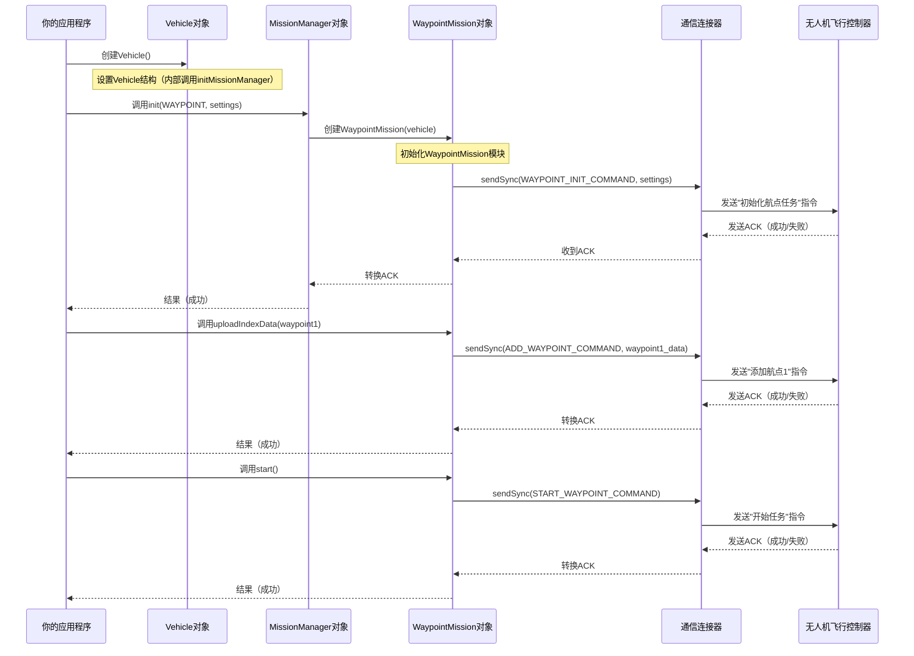

# 第三章：任务管理器与航点任务/热点任务

在[第二章：飞行控制器](02_flightcontroller_.md)中，我们学会了如何给无人机下达"起飞"、"降落"或"飞到特定点"等直接指令

这对于即时控制非常有用，但如果需要无人机自主执行==更复杂的动作序列呢==？

> 比如需要让无人机以网格模式巡查一片区域，或者反复环绕某个地标飞行。

如果使用单独的`FlightController`指令来完成这些任务，工作量将非常庞大

这时就需要**任务管理器(MissionManager)**登场了。

它是无人机的专属任务控制中心，专门用于编排高级自动化飞行任务。它简化了复杂航线与行为的编程，让无人机能够==自主执行==完整的动作序列

## 什么是"任务管理器"？（无人机的任务控制中心）

可以把`MissionManager`视为无人机长期任务的专家规划师与协调员

不同于通过`FlightController`向无人机交代飞行的每个微小细节，只需给`MissionManager`一个高级计划，它就会自行解决执行细节。

它的主要职责是：
*   **初始化**：为任务设置总体参数
*   **管理**：跟踪不同类型的任务
*   **控制**：启动、暂停、恢复或停止正在执行的任务

==`MissionManager`本身并不直接操控无人机飞行，而是依赖专门的"任务模块"来处理每种任务类型的细节==。

它管理的最常见且强大的两种任务类型是**航点任务(Waypoint Missions)**和**热点任务(Hotpoint Missions)**

(拆解架构)

## 自动化任务类型

`MissionManager`可以处理多种自动化飞行任务

目前我们重点介绍两种基础类型：

| 任务类型     | 描述                                             | 典型应用场景                       |
| :----------- | :----------------------------------------------- | :--------------------------------- |
| **航点任务** | 无人机按预定顺序飞越一系列导航点（航点）         | 区域测绘、配送路线、结构化巡检     |
| **热点任务** | 无人机以固定半径和高度围绕特定兴趣点（热点）盘旋 | 监控、拍摄电影级环绕镜头、持续观察 |

这些任务让无人机能够执行高级自动化操作，简化了原本需要持续人工干预或复杂实时计算的工作。

## 第一个自动化任务：执行航点航线

让我们一步步创建一个简单的航点任务。无人机将起飞，==飞往几个预定义的点==，然后返回。

开始之前，请记得按照[第一章：飞行器](01_vehicle_.md)准备好`Vehicle`对象，并按照[第二章：飞行控制器](02_flightcontroller_.md)获取控制权限

```cpp
#include <dji_vehicle.hpp>
#include <dji_linux_helpers.hpp>
#include <dji_mission_manager.hpp> // 任务管理器
#include <dji_waypoint.hpp>        // 航点任务详情
#include <iostream>
#include <vector> // 存储航点
#include <cmath>  // 数学运算如M_PI, cos, sin

// 定义多边形的小半径
#define POLYGON_RADIUS 6.0 // 米
#define NUM_WAYPOINTS  4   // 多边形顶点数

// ... 在主函数中 ...

LinuxSetup linuxEnvironment(argc, argv);
DJI::OSDK::Vehicle* vehicle = linuxEnvironment.getVehicle();

if (vehicle == NULL) {
    std::cout << "飞行器未初始化，退出。\n";
    return -1;
}

// 假设已完成激活（如第一章所示）
// DJI::OSDK::ACK::ErrorCode activateAck = vehicle->activate(...);
// ... 错误检查 ...

int functionTimeout = 1; // SDK函数通用超时时间

// 获取摇杆控制权限
std::cout << "尝试获取摇杆控制权限...\n";
DJI::OSDK::ErrorCode::ErrorCodeType ret =
    vehicle->flightController->obtainJoystickCtrlAuthoritySync(functionTimeout);

if (ret != DJI::OSDK::ErrorCode::SysCommonErr::Success) {
    std::cout << "获取摇杆控制权限失败！错误: " << std::hex << ret << std::endl;
    return -1;
}
std::cout << "成功获取摇杆控制权限！\n";

// 航点任务需要GPS数据
// 为简化示例，假设已设置订阅获取当前GPS数据
// 数据订阅将在第六章详细介绍
// 这里我们假装能立即获取GPS读数
// 实际场景中，你需要订阅TOPIC_GPS_FUSED并等待数据
// 当前GPS数据的占位符
DJI::OSDK::Telemetry::GPSFused currentGPS = {
    34.000000,  // 示例纬度
    -118.000000, // 示例经度
    10.0,       // 示例高度
    0, 0, 0, 0, 0
};
// 实际程序中，你应该通过vehicle->subscribe->getValue<TOPIC_GPS_FUSED>()获取
// 并设置数据订阅（见第六章）
```

### 第一步：初始化航点任务

首先，我们需要告诉`MissionManager`要执行航点任务，并定义一些基本设置。

```cpp
// ... 获取控制权限和当前GPS数据后 ...

DJI::OSDK::MissionManager* missionManager = vehicle->missionManager;

// 定义航点任务的初始设置
DJI::OSDK::WayPointInitSettings missionInitSettings;
missionInitSettings.maxVelocity    = 10; // 最大飞行速度(米/秒)
missionInitSettings.idleVelocity   = 2;  // 巡航速度(米/秒)
missionInitSettings.finishAction   = 0;  // 0: 无动作, 1: 返航
missionInitSettings.executiveTimes = 1;  // 执行任务一次
missionInitSettings.yawMode        = 0;  // 0: 自动(偏航指向下一航点)
missionInitSettings.traceMode      = 0;  // 0: 点对点, 1: 曲线
missionInitSettings.RCLostAction   = 1;  // 1: RC信号丢失时返航
missionInitSettings.gimbalPitch    = 0;  // 默认云台俯仰角
missionInitSettings.indexNumber    = NUM_WAYPOINTS + 1; // 总航点数

std::cout << "初始化航点任务设置...\n";
DJI::OSDK::ACK::ErrorCode initAck =
    missionManager->init(DJI::OSDK::DJI_MISSION_TYPE::WAYPOINT, functionTimeout, &missionInitSettings);

if (DJI::OSDK::ACK::getError(initAck)) 
{
    DJI::OSDK::ACK::getErrorCodeMessage(initAck, __func__);
    std::cout << "初始化航点任务失败！退出。\n";
    vehicle->flightController->releaseJoystickCtrlAuthoritySync(functionTimeout);
    return -1;
}

std::cout << "航点任务设置初始化成功！\n";
```

### 第二步：创建并上传单个航点

现在任务框架已初始化，我们需要定义无人机将访问的具体点

我们将在无人机当前位置周围创建`NUM_WAYPOINTS`个点，然后再次添加起点以形成闭环，构成一个多边形。

```cpp
// ... 任务初始化后 ...

std::vector<DJI::OSDK::WayPointSettings> waypointList;

// 创建起始航点
DJI::OSDK::WayPointSettings start_wp;
// 设置航点默认参数的辅助函数
auto setWaypointDefaults = [](DJI::OSDK::WayPointSettings* wp) {
    wp->damping         = 0;
    wp->yaw             = 0;
    wp->gimbalPitch     = 0;
    wp->turnMode        = 0;
    wp->hasAction       = 0;
    wp->actionTimeLimit = 100;
    wp->actionNumber    = 0;
    wp->actionRepeat    = 0;
    // ... 其他默认设置 ...
};

setWaypointDefaults(&start_wp);
start_wp.latitude  = currentGPS.latitude;
start_wp.longitude = currentGPS.longitude;
start_wp.altitude  = currentGPS.altitude + 5; // 在当前高度基础上飞行5米
start_wp.index     = 0; // 第一个航点索引
waypointList.push_back(start_wp);

// 生成多边形形状的其他航点
float64_t extAngle = 2 * M_PI / NUM_WAYPOINTS;
for (int i = 1; i <= NUM_WAYPOINTS; i++) 
{
    DJI::OSDK::WayPointSettings wp;
    setWaypointDefaults(&wp);
    wp.index     = i;
    // 计算相对于起点的经纬度变化，形成多边形
    float64_t deltaX = POLYGON_RADIUS * cos(i * extAngle);
    float64_t deltaY = POLYGON_RADIUS * sin(i * extAngle);
    wp.latitude  = start_wp.latitude + (deltaX / 111111.0); // 约111111米/纬度
    wp.longitude = start_wp.longitude + (deltaY / (111111.0 * cos(start_wp.latitude * M_PI / 180.0)));
    wp.altitude  = start_wp.altitude; // 保持初始高度
    waypointList.push_back(wp);
}

// 将每个航点上传到无人机
std::cout << "上传" << waypointList.size() << "个航点...\n";
for (auto& wp : waypointList) {
    std::cout << "上传航点" << (int)wp.index
              << " 位置(纬度,经度,高度): " << wp.latitude << ", "
              << wp.longitude << ", " << wp.altitude << std::endl;
    DJI::OSDK::ACK::WayPointIndex uploadAck =
        missionManager->wpMission->uploadIndexData(&wp, functionTimeout);
    if (DJI::OSDK::ACK::getError(uploadAck.ack)) {
        DJI::OSDK::ACK::getErrorCodeMessage(uploadAck.ack, __func__);
        std::cout << "上传航点" << (int)wp.index << "失败！退出。\n";
        vehicle->flightController->releaseJoystickCtrlAuthoritySync(functionTimeout);
        return -1;
    }
    sleep(1); // 给无人机时间处理每个航点
}
std::cout << "所有航点上传成功！\n";
```

### 第三步：启动航点任务

所有航点上传后，我们就可以命令无人机开始执行任务了。

```cpp
// ... 上传所有航点后 ...

std::cout << "启动航点任务...\n";
DJI::OSDK::ACK::ErrorCode startMissionAck =
    missionManager->wpMission->start(functionTimeout);

if (DJI::OSDK::ACK::getError(startMissionAck)) {
    DJI::OSDK::ACK::getErrorCodeMessage(startMissionAck, __func__);
    std::cout << "启动航点任务失败！退出。\n";
    vehicle->flightController->releaseJoystickCtrlAuthoritySync(functionTimeout);
    return -1;
}
std::cout << "航点任务已启动！无人机应开始沿路径飞行。\n";

// 等待任务完成。时间取决于路径长度和速度。
sleep(60); // 等待60秒（根据任务需要调整）
```

### 第四步：停止任务并释放控制权限

任务完成后或需要干预时，可以停止任务并释放控制权限。

```cpp
// ... 等待任务完成后 ...

std::cout << "停止航点任务(如果仍在运行)...\n";
DJI::OSDK::ACK::ErrorCode stopMissionAck =
    missionManager->wpMission->stop(functionTimeout);
// 检查错误，但如果任务已完成则不必退出

std::cout << "尝试释放摇杆控制权限...\n";
DJI::OSDK::ErrorCode::ErrorCodeType releaseRet =
    vehicle->flightController->releaseJoystickCtrlAuthoritySync(functionTimeout);

if (releaseRet != DJI::OSDK::ErrorCode::SysCommonErr::Success) {
    std::cout << "释放摇杆控制权限失败！错误: " << std::hex << releaseRet << std::endl;
    return -1;
}
std::cout << "摇杆控制权限已成功释放！任务完成。\n";
```

### 基础热点任务概念

热点任务的设置略有不同：

1.  **为热点任务初始化MissionManager:**
    ```cpp
    // DJI::OSDK::MissionManager* missionManager = vehicle->missionManager;
    // DJI::OSDK::ACK::ErrorCode initAck =
    //     missionManager->init(DJI::OSDK::DJI_MISSION_TYPE::HOTPOINT, functionTimeout, NULL);
    // // ... 错误检查 ...
    ```

2.  **定义热点参数:**
    ```cpp
    // missionManager->hpMission->setHotPoint(currentGPS.longitude, currentGPS.latitude, 10); // 以当前GPS为中心，高度10米
    // missionManager->hpMission->setRadius(5); // 5米半径的圆
    // missionManager->hpMission->setYawRate(15); // 15度/秒旋转
    // missionManager->hpMission->setClockwise(true); // 顺时针旋转
    ```

3.  **启动热点任务:**
    ```cpp
    // missionManager->hpMission->start(functionTimeout);
    ```

## 内部机制：`MissionManager`如何协调

`MissionManager`是一个智能协调器。

当你告诉它`init`一个任务时，它并不直接与无人机讨论任务逻辑，而是创建或使用一个专门的对象（如`WaypointMission`或`HotpointMission`），并将任务委托给该对象。

> 这个专门的对象随后处理与无人机飞行控制器的底层通信。

### `MissionManager`初始化流程

让我们看看初始化航点任务时的简化事件序列：



## 结论

`MissionManager`对象是你实现复杂飞行路径和任务自动化的强大工具。通过理解它作为==任务控制中心==的角色，以及它如何==协调专门的`WaypointMission`和`HotpointMission`对象==，可以编程让无人机执行高级自主操作。

这种抽象让你无需关注飞行控制的细枝末节，能够==专注于无人机应用的更高层次目标==。

现在我们的无人机能够按照预定路径飞行了，让我们探索如何控制它的==感知==系统——它的"眼睛"和"头部"！

---
[下一章：相机模块/云台模块](04_cameramodule___gimbalmodule_.md)

