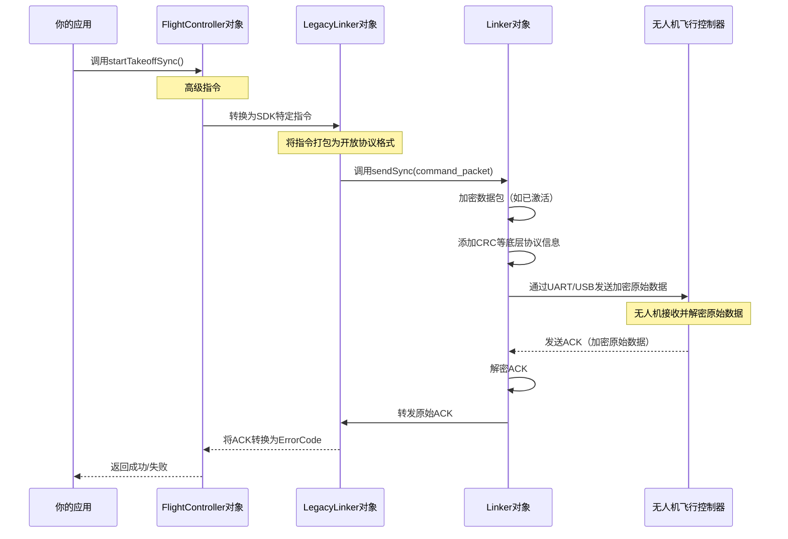

# 第七章：连接器

在之前的章节中，我们学会了如何控制无人机飞行（[第二章：飞行控制器](02_flightcontroller_.md)）、执行复杂任务（[第三章：任务管理器与航点任务/热点任务](03_missionmanager___waypointmission_hotpointmission_.md)）、拍摄图像（[第四章：相机模块/云台模块](04_cameramodule___gimbalmodule_.md)）甚至传输高级传感器数据（[第五章：高级感知](05_advancedsensing_.md)）

最近在[第六章：数据订阅](06_datasubscription_.md)中，我们还学习了如何订阅各类实时遥测数据

但这些指令和数据究竟是如何在你的计算机（运行`Onboard-SDK`应用）与大疆无人机之间传输的？==连接代码与无人机"大脑"的无形桥梁是什么==

这就是**连接器(Linker)**的舞台

它是默默无闻的英雄，在底层管理着所有通信事务。

## 什么是"连接器"？（无人机的翻译官与信使）

想象需要与一个语言不通的人通信，且发送的信件需要加密以确保安全。这时你需要：

1.  **翻译官**：将你的信息转换为对方语言并理解其回复
2.  **邮递服务**：处理所有邮寄细节，确保信件送达，并实施/解除加密

在`Onboard-SDK`中，`Linker`对象正是大疆无人机的**翻译官与信使**。作为**通信总管**，它==负责处理所有底层细节，包括从应用向无人机发送指令以及接收返回数据==。

### 为什么需要`Linker`？

机载计算机与无人机之间的物理连接方式多样，可能是串口（UART）、USB线缆或其他接口

这些连接传输的并非原始文本，而是遵循特定协议的结构化数据，通常还会加密以确保安全，因此需要谨慎处理以避免错误。

`Linker`为你屏蔽了这些复杂性：

*   ==管理==物理通信通道（如UART或USB）
*   ==处理==底层通信协议，确保消息格式正确且可被理解
*   ==执行==数据包加解密，保护指令与无人机数据安全
*   ==确保==可靠性，重试失败传输并检查数据完整性

没有`Linker`，SDK中的每个模块（如`FlightController`或`DataSubscription`）都需关注这些底层通信任务，这将使应用开发变得极其复杂且易错。`Linker`确保了信息流的无缝可靠传输。

## 连接器的核心职责

`Linker`肩负多项关键任务：

| 职责           | 描述                                                         | 示例                                                         |
| :------------- | :----------------------------------------------------------- | :----------------------------------------------------------- |
| **通道管理**   | 建立并管理与无人机的物理连接                                 | 初始化UART串口或USB批量通道                                  |
| **协议处理**   | 确保指令和数据遵循大疆通信协议                               | 将数据打包为`开放协议`帧（参见[第八章：开放协议](08_open_protocol_.md)） |
| **数据包流控** | 发送数据包、接收确认信息并管理重传                           | 使用`sendSync()`进行阻塞调用或`sendAsync()`进行非阻塞调用    |
| **加解密**     | 通过加密外发指令和解密传入遥测数据来保障通信安全             | 应用`Vehicle`激活时提供的加密密钥                            |
| **数据路由**   | 将传入数据包定向到正确的SDK模块（如`DataSubscription`、`AdvancedSensing`） | 调用特定指令ID注册的回调函数                                 |

## 如何设置`Linker`（已自动完成）

对初学者而言，好消息是在大多数操作中通常**不需要直接与`Linker`对象交互**。它==是`Vehicle`对象（来自[第一章：飞行器](01_vehicle_.md)的无人机"大脑"）内部管理使用的基础组件==。

创建`LinuxSetup`（或其他平台的等效设置）对象时，它会自动初始化`Linker`并配置必要的通信通道。

以下是`Linker`隐式设置的示例：

```cpp
#include <dji_vehicle.hpp>
#include <dji_linux_helpers.hpp> // Linux设置
#include <dji_linker.hpp>        // 隐式使用连接器

int main(int argc, char** argv) 
{
    // 1. LinuxSetup创建并初始化Linker
    // 配置UART（串口）和可能的USB通道
    DJI::OSDK::LinuxSetup linuxEnvironment(argc, argv);
    
    // 2. Linker对象随后被传递给Vehicle构造函数
    // 因此'vehicle'对象持有指向'linker'的指针
    DJI::OSDK::Vehicle* vehicle = linuxEnvironment.getVehicle();

    if (vehicle == NULL) {
        std::cout << "飞行器未初始化，退出。\n";
        return -1;
    }

    // ...（应用其他部分）...
    return 0;
}
```

### 唯一直接交互：设置加密密钥

少数需要直接接触`Linker`的情况之一（虽然仍由`Vehicle`对象发起）是在无人机激活时设置加密密钥，确保后续通信安全。

```cpp
#include <dji_vehicle.hpp>
#include <dji_linux_helpers.hpp>
// ... 其他头文件 ...

// ... 主函数或辅助函数内 ...

// 假设linuxEnvironment和vehicle已完成设置...
DJI::OSDK::LinuxSetup linuxEnvironment(argc, argv);
DJI::OSDK::Vehicle* vehicle = linuxEnvironment.getVehicle();
// ... 错误检查 ...

DJI::OSDK::Vehicle::ActivateData* activateData = linuxEnvironment.getActivateData();
// 此'activateData'包含加密密钥('encKey')

// 调用vehicle->activate()时，最终会使用linker设置加密密钥
DJI::OSDK::ACK::ErrorCode ack = vehicle->activate(activateData, 1); // 1秒超时

if (DJI::OSDK::ACK::getError(ack)) {
    std::cout << "激活失败。\n";
    return -1;
}

std::cout << "无人机激活成功！连接器已启用加密。\n";

// 内部流程：激活成功后，Vehicle对象调用：
// vehicle->linker->setKey(activateData->encKey);
// 此行直接配置Linker启用安全通信
```

## 内部机制：`Linker`如何工作

`Linker`位于SDK通信栈的最底层，直接对接操作系统硬件驱动。你发送的每条指令和接收的每个数据包都经由`Linker`处理。

### `Linker`在通信中的角色

通过追踪"起飞"这样的简单指令，我们可以了解`Linker`如何充当翻译官和信使：



### 支持的通信通道

`Linker`支持多种连接无人机的方式：

| 通道类型         | 描述                                                         | 典型应用场景                                                 |
| :--------------- | :----------------------------------------------------------- | :----------------------------------------------------------- |
| **UART（串口）** | 通过串行端口通信（如Linux上的`/dev/ttyUSB0`或`/dev/ttyS0`）。若计算机无串口需使用USB转串口适配器。 | 主要且最常用的通用控制与遥测通道                             |
| **USB ACM**      | 通过USB CDC ACM（抽象控制模型）设备通信，表现为虚拟串口      | 特定无人机型号（如M210 V2）上用于传输图像数据等高级感知功能  |
| **USB Bulk**     | 通过USB直接高速批量传输数据                                  | 现代无人机（如M300系列）专用于H264视频和立体图像等高带宽数据流（由[高级感知](05_advancedsensing_.md)处理） |

## 结论

`Linker`是`Onboard-SDK`的基础通信引擎，充当无人机专属的翻译官与信使，==管理从物理连接、数据加密到协议处理和可靠数据包传输的所有事务==。虽然很少直接与之交互，但了解其底层关键作用有助于理解指令如何抵达无人机以及遥测数据如何返回应用。正是这个沉默的功臣，支撑着迄今为止学到的所有高级功能。

现在我们已经理解了核心==通信桥梁==，接下来让我们深入探究流经它的==特定语言==（协议）

---
[下一章：开放协议](08_open_protocol_.md)

