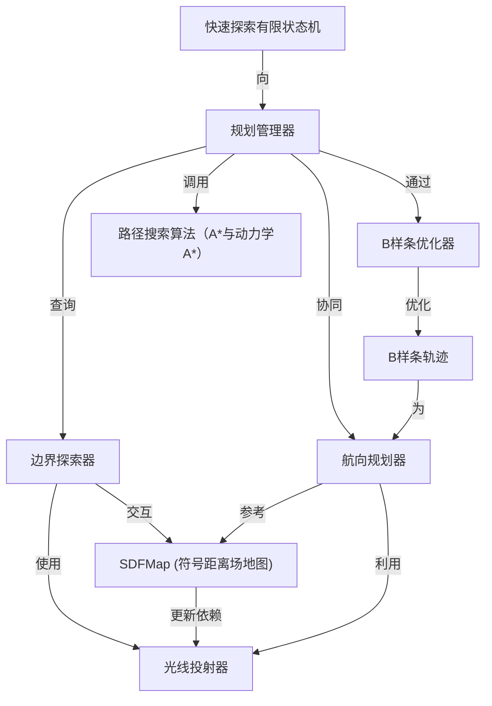

链接：[github.com/HKUST-Aerial-Robotics/FUEL](https://github.com/HKUST-Aerial-Robotics/FUEL)

# docs：FUEL

`FUEL`项目使**自主移动机器人**能够*探索未知环境*并安全导航

- 利用传感器数据（RayCaster）构建周围环境的详细**3D地图**（SDFMap），==识别==待探索的新区域（Frontier Finder），并智能规划探索方向（Heading Planner）

- 能==生成==*平滑且无碰撞的运动路径*（B样条轨迹、路径搜索算法），同时遵守机器人的物理限制，并通过持续==优化==提升效率（Bspline Optimizer）

- 整个系统由中央控制器（Planner Manager）和高级探索逻辑（Fast Exploration FSM）统一管理。

## 可视化

## 章节

1. [光线投射器
](01_raycaster_.md)
2. [符号距离场地图
](02_sdfmap__signed_distance_field_map__.md)
3. [B样条轨迹
](03_b_spline_trajectory_.md)
4. [边界探索器
](04_frontier_finder_.md)
5. [航向规划器
](05_heading_planner_.md)
6. [路径搜索算法（A*与动力学A*）
](06_path_search_algorithms__astar___kinodynamic_astar__.md)
7. [B样条优化器
](07_bspline_optimizer_.md)
8. [规划管理器
](08_planner_manager_.md)
9. [快速探索有限状态机
](09_fast_exploration_fsm__finite_state_machine__.md)

---
