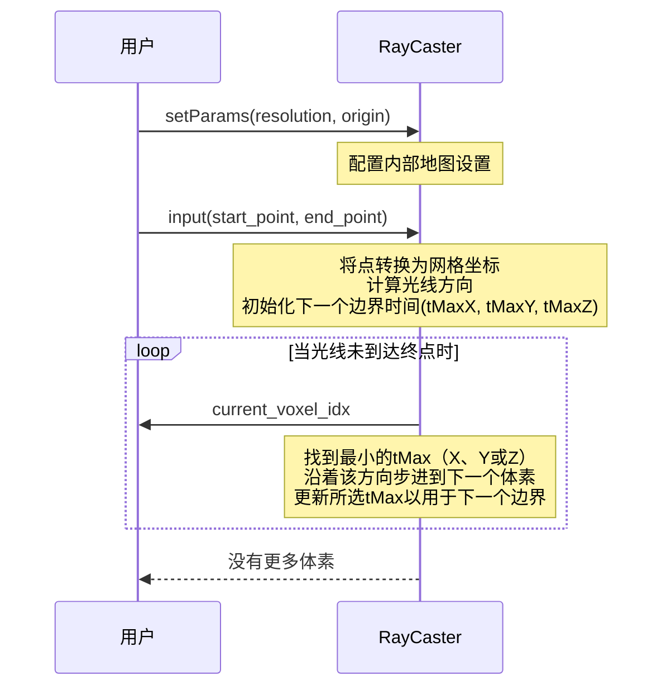

# 第1章：光线投射器

想象一下，我们正在玩电子游戏，或者操控一个现实中的机器人。游戏角色或机器人是如何"知道"周围环境的？它们如何检测墙壁、障碍物或开放空间？

这不是魔法~在机器人技术和地图构建领域，我们使用一种称为**光线投射**的巧妙技术来模拟这种"视觉"过程。

`RayCaster`就像是机器人的模拟摄像头或激光传感器。它从机器人的"眼睛"（传感器位置）向环境中投射虚拟线（称为"光线"），从而精确计算出这些光线穿过了内部地图的哪些部分。

### 为什么这很重要？机器人的视觉难题

设想一个配备了深度摄像头（如Kinect或LiDAR传感器）的机器人。当这个摄像头进行测量时，它实际上会发射出许多光线，并告诉我们每条光线上第一个障碍物的距离。

我们的机器人需要利用这些信息来：
1.  **构建地图**：如果一条光线传播很远而没有碰到任何物体，那么这条路径上的所有区域都应该是畅通的。如果光线在某个距离碰到了物体，那么这个物体的位置很可能被占据。
2.  **检查可见性**：机器人能否在没有障碍物阻挡的情况下"看到"目标位置？这对导航和规划至关重要。

==`RayCaster`帮助将这些传感器读数转化为机器人对世界的理解==更新，这些信息通常存储在3D网格地图中。

### 概念解析

让我们拆解`RayCaster`背后的关键思想：

*   **传感器原点**：这是我们虚拟光线的起点。在机器人中，它对应于摄像头或传感器的精确位置。
*   **光线**：可以将其想象为从传感器原点发射的超细、==完全笔直的激光束==。每条光线沿特定方向直线传播。
*   **网格单元（体素）**：我们的环境不是一个平滑、连续的空间。相反，==FUEL通常将世界表示为3D网格==，就像一个巨大的乐高世界。这个网格中的每个小立方体称为**体素**（3D像素）。
*   **光线投射（动作）**：这是实际发射光线并识别光线从起点到终点传播过程中穿过的*所有*体素的过程。

**类比**：想象我们身处一个完全由隐形乐高积木构成的黑暗房间中。我们从自己的位置（传感器原点）发射激光笔。`RayCaster`就是告诉我们激光束在碰到墙壁或耗尽光线之前穿过了哪些隐形乐高积木的工具。

### 如何使用`RayCaster`

FUEL中的`RayCaster`设计得非常直观

我们提供起点（传感器位置）和终点（光线"击中"某物或达到最大范围的位置），它会返回光线穿过的所有体素（网格单元）的列表。

这些体素流非常有用，可用于：
*   **地图更新**：如果光线从`起点`到`终点`没有碰到任何物体，那么它穿过的所有体素都可能是空的（自由空间）。如果光线因为碰到障碍物而停止，那么它最后接触的体素很可能被占据。
*   **视线检查**：如果我们想知道点A是否能"看到"点B，可以从A向B投射一条光线。如果`RayCaster`告诉我们光线只穿过了空体素，那么视线就是畅通的！

让我们看一个简化的代码示例，展示如何在代码中使用`RayCaster`：

首先，我们需要告诉`RayCaster`关于3D网格地图的基本属性，例如`分辨率`（每个体素的大小）和`原点`（地图的`(0,0,0)`点在现实世界中的坐标）。

```cpp
// 创建RayCaster对象
RayCaster my_ray_caster;

// 定义地图的分辨率和原点
double map_resolution = 0.1; // 每个体素为0.1m x 0.1m x 0.1m
Eigen::Vector3d map_origin(0.0, 0.0, 0.0); // 地图的(0,0,0)位于世界坐标(0,0,0)

// 为RayCaster设置这些参数
my_ray_caster.setParams(map_resolution, map_origin);
```
*解释*：这段代码准备我们的`RayCaster`实例。`setParams()`告诉它我们的3D世界如何被划分为体素。`分辨率`定义了我们的"乐高积木"有多大，而`原点`告诉`RayCaster`第一个"乐高积木"在现实世界中的位置。

现在，让我们在两点之间投射一条光线并获取它穿过的体素：

```cpp
Eigen::Vector3d sensor_start_point(1.0, 2.0, 1.5); // 机器人的传感器位于(1m, 2m, 1.5m)
Eigen::Vector3d ray_end_point(3.0, 2.0, 1.5);     // 光线传播到(3m, 2m, 1.5m)

// 告诉RayCaster准备这条特定光线
my_ray_caster.input(sensor_start_point, ray_end_point);

Eigen::Vector3i current_voxel_idx; // 存储每个体素的网格索引的变量

std::cout << "光线穿过的体素：" << std::endl;
// 遍历光线穿过的所有体素
// nextId()在有更多体素要处理时返回'true'
while (my_ray_caster.nextId(current_voxel_idx)) {
    // 打印当前体素的网格索引
    // 在实际应用中，我们会用这个来更新地图或检查障碍物！
    std::cout << "- (" << current_voxel_idx.x() << ", "
              << current_voxel_idx.y() << ", "
              << current_voxel_idx.z() << ")" << std::endl;
}
std::cout << "光线投射完成。" << std::endl;
```
*解释*：我们使用现实世界坐标（例如米）定义`sensor_start_point`和`ray_end_point`。`input()`函数为这条特定光线设置`RayCaster`。然后，我们进入一个`while`循环。在循环内部，`my_ray_caster.nextId(current_voxel_idx)`尝试获取光线上的下一个体素。如果找到一个，它返回`true`并用体素的3D网格索引填充`current_voxel_idx`。循环继续，直到光线到达终点，此时`nextId()`返回`false`。

### 底层原理：光线遍历算法

`RayCaster`如何如此高效地计算出光线穿过的体素？它使用了一种巧妙的数学算法，通常称为"体素遍历算法"或3D网格的"DDA（数字微分分析器）算法"。

#### 逐步解析：

1.  **光线设置**：当我们调用`input(start_point, end_point)`时，`RayCaster`首先获取这些现实世界坐标，并将它们转换为相对于3D网格的坐标（例如，距离原点有多少个体素）。
2.  **计算光线方向**：它确定光线传播的总体方向（例如，主要是正X方向，略微负Y方向等）。它还计算出每个轴的"步进"方向（例如，`x`应该增加还是减少？）。
3.  **找到第一个边界交叉点**：这是魔法开始的地方！`RayCaster`计算光线在X、Y和Z轴上传播多远才能穿过*下一个*网格线。
    *   `tMaxX`：光线穿过下一个垂直网格线（改变其X体素索引）所需的"时间"（或距离因子）。
    *   `tMaxY`：光线穿过下一个水平网格线（改变其Y体素索引）所需的"时间"。
    *   `tMaxZ`：光线穿过下一个深度网格线（改变其Z体素索引）所需的"时间"。
    它还计算`tDeltaX`、`tDeltaY`、`tDeltaZ`，这是穿过*后续*网格线所需的额外"时间"。
4.  **迭代遍历**：
    *   它从包含`start_point`的体素开始。
    *   在每一步（`nextId`调用）中，它比较`tMaxX`、`tMaxY`和`tMaxZ`。最小的值表示光线将*首先*穿过哪个网格线。
    *   `RayCaster`然后沿着该轴"步进"到下一个体素。例如，如果`tMaxX`最小，它会增加（或减少）当前的X体素索引。
    *   它更新该特定轴的`tMax`值（例如，`tMaxX = tMaxX + tDeltaX`）以反映它何时将穿过该轴的下一个边界。
    *   这个过程重复进行，逐个产生每个体素，直到当前体素匹配`end_point`的体素。

#### 简化序列图：



### 代码实现

`RayCaster`在FUEL中的核心实现可以在`fuel_planner/plan_env/include/plan_env/raycast.h`（声明）和`fuel_planner/plan_env/src/raycast.cpp`（实际代码）中找到。

让我们看一下`raycast.cpp`中`RayCaster::input`函数的简化摘录，了解它如何开始设置光线：

```cpp
// 在raycast.cpp的RayCaster::input(...)内部
// 1. 将现实世界坐标转换为网格坐标
start_ = start / resolution_; // 按地图分辨率缩放起点
end_ = end / resolution_;     // 按地图分辨率缩放终点

// 2. 确定起点和终点的整数网格索引
x_ = (int)std::floor(start_.x()); // 当前X体素索引
y_ = (int)std::floor(start_.y()); // 当前Y体素索引
z_ = (int)std::floor(start_.z()); // 当前Z体素索引

endX_ = (int)std::floor(end_.x()); // 目标X体素索引
endY_ = (int)std::floor(end_.y()); // 目标Y体素索引
endZ_ = (int)std::floor(end_.z()); // 目标Z体素索引

// 3. 计算光线在网格坐标中的方向向量
direction_ = (end_ - start_);

// ...（更多用于初始化tMax和tDelta值的代码）...
```
*解释*：这部分代码首先获取我们提供的`start`和`end`点（例如以米为单位），并将它们除以`resolution_`以转换为内部网格坐标系。然后，`std::floor`用于获取两个点的整数体素索引。最后，它计算`direction_`，即从`start_`网格坐标到`end_`网格坐标的向量。这个`direction_`有助于确定光线的路径。

接下来，让我们看看`RayCaster::nextId`函数中的遍历逻辑核心：

```cpp
// 在raycast.cpp的RayCaster::nextId(...)内部
// 获取当前体素的网格索引以返回给用户
auto tmp = Eigen::Vector3d(x_, y_, z_);
// 添加偏移量并转换为int以获取最终的网格索引（voxel_idx）
idx = (tmp + offset_).cast<int>();

// 检查是否已经到达目标体素
if (x_ == endX_ && y_ == endY_ && z_ == endZ_) {
    return false; // 没有更多体素要处理，光线结束
}

// 比较tMaxX_、tMaxY_、tMaxZ_以找到光线接下来将穿过哪个网格边界
if (tMaxX_ < tMaxY_) {
    if (tMaxX_ < tMaxZ_) {
        x_ += stepX_;      // 沿X方向移动到下一个体素
        tMaxX_ += tDeltaX_; // 为*下一个*X边界更新tMaxX_
    } else {
        z_ += stepZ_;      // 沿Z方向移动到下一个体素
        tMaxZ_ += tDeltaZ_; // 为*下一个*Z边界更新tMaxZ_
    }
} else { // tMaxY_小于或等于tMaxX_
    if (tMaxY_ < tMaxZ_) {
        y_ += stepY_;      // 沿Y方向移动到下一个体素
        tMaxY_ += tDeltaY_; // 为*下一个*Y边界更新tMaxY_
    } else {
        z_ += stepZ_;      // 沿Z方向移动到下一个体素
        tMaxZ_ += tDeltaZ_; // 为*下一个*Z边界更新tMaxZ_
    }
}

return true; // 成功移动到下一个体素并返回其ID
```
*解释*：这段代码在我们每次调用`nextId()`时执行。它首先记录当前体素的索引（`idx`）。然后，检查我们是否已经到达光线的终点（即当前的`x_`、`y_`、`z_`是否匹配`endX_`、`endY_`、`endZ_`）。如果是，光线完成，返回`false`。

否则，就是决策时间！它比较`tMaxX_`、`tMaxY_`和`tMaxZ_`。这些值中的最小值告诉我们光线接下来将穿过哪个网格线（X、Y或Z）。代码然后沿着相应方向（`stepX_`、`stepY_`或`stepZ_`）更新当前体素索引（`x_`、`y_`或`z_`），并更新该轴的`tMax_`值。这确保算法精确地"走过"光线穿过的每一个体素，一个接一个。

### `RayCaster`的实际应用（FUEL示例）

我们会在FUEL项目的多个部分发现`RayCaster`作为一个基础组件：

*   **边界查找**：在[边界查找器](04_frontier_finder_.md)模块中，`RayCaster`对于评估潜在视点至关重要。例如，`countVisibleCells`函数使用`RayCaster`来确定机器人从特定位置可以"看到"多少未知区域（称为"边界"）。这帮助机器人规划下一步探索的方向。
*   **轨迹可见性检查**：在`VisibilityUtil`（支持[B样条轨迹](03_b_spline_trajectory_.md)和[B样条优化器](07_bspline_optimizer_.md)等模块）中，`RayCaster`用于`lineVisib`检查。它确认在规划的机器人路径上的点之间是否存在直接的视线，确保机器人不会试图穿过障碍物或进入未映射的区域。

这些例子突显了`RayCaster`是FUEL如何让机器人感知其环境并做出智能规划决策的关键构建块。

### 结论

在本章中，我们探讨了FUEL中`RayCaster`的概念。我们了解到它通过3D体素网格投射光线来模拟传感器如何"看到"周围环境。这个过程使机器人能够识别哪些区域是自由的，哪些被占据，并检查清晰的视线，这对于构建地图和规划安全路径至关重要。

`RayCaster`收集的自由和占据空间信息对于创建世界的详细内部表示至关重要。在下一章中，我们将深入探讨FUEL存储和使用这些环境数据的最强大方式之一：**符号距离场地图**。

[下一章：符号距离场地图](02_sdfmap__signed_distance_field_map__.md)

