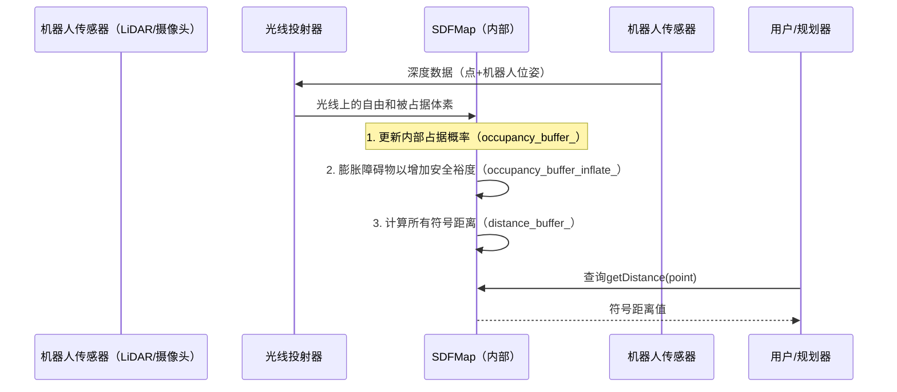

# 第2章：符号距离场地图（SDFMap）

在第1章中，我们学习了机器人如何使用[光线投射器](01_raycaster_.md)来"看到"周围环境，通过投射虚拟光线来检测障碍物和开放空间。但"看到"只是成功的一半


机器人如何*记住*它看到的一切，构建一个全面的世界内部模型，并最重要的是，如何利用这个模型规划不仅避开障碍物而且**安全远离**它们的路径？

这就是**符号距离场地图（SDFMap）**的用武之地。可以将其视为机器人对其整个环境的最详细、动态的3D蓝图，其中内置了关键的"安全裕度"。

### 机器人的3D蓝图与安全测量仪

想象我们正在拥挤的停车场中驾驶汽车。我们不仅需要知道其他车辆的*位置*，还需要本能地知道我们的车与它们之间*有多少空间*。这种==对距离和间隙的直观感知正是SDFMap为机器人提供的功能==。

SDFMap解决的核心问题是让机器人能够：

1.  **构建全面的3D地图**：存储关于每一小块空间（体素）的信息——它是自由的、被占据的还是未知的？
2.  **确保安全**：计算空间中任意点到最近障碍物的*最短距离*。这对于规划无碰撞且安全的路径至关重要，不仅要勉强避开障碍物，还要保持舒适的安全缓冲。

**用例**：我们的机器人需要在杂乱无章的房间里飞行。它接收传感器数据（如来自[光线投射器](01_raycaster_.md)的数据）。`SDFMap`将这些原始数据转化为地图，不仅显示墙壁和家具，还告诉机器人："如果移动到*这个精确位置*，我们将距离最近的墙壁0.8米"，或者"在*那个位置*，我们距离桌子只有0.1米，太近了！"

### 概念解析：SDFMap包含什么？

`SDFMap`是简单网格地图的强大扩展。以下是其关键组成部分：

*   **体素（3D像素）**：与第1章类似，世界被划分为称为体素的小立方体网格。每个体素都有自己的故事。
*   **占据状态**：每个体素知道自己的==状态==：
    *   `FREE`：这里什么都没有，是开放空间。
    *   `OCCUPIED`：这里有障碍物（墙壁、椅子等）。
    *   `UNKNOWN`：机器人尚未探索此区域。
*   **符号距离场（核心功能！）**：这是核心特性。对于地图中的*每个体素*，==SDFMap存储一个数字：到最近障碍物的**符号距离**==。
    *   **正距离（+）**：如果体素位于**自由空间**，其值为到最近障碍物*边界*的最短距离。正数越大，距离障碍物越远，越安全。
    *   **负距离（-）**：如果体素**位于障碍物内部**，其值为到最近障碍物*边界*的最短距离，但表示为负数。负数越大，表示在障碍物内部越深（意味着更严重的碰撞）。
    *   **零距离（0）**：如果体素正好位于障碍物的**表面**，其值为零。

**类比：潜艇的==声纳==地图**
想象一艘潜艇在水下航行。它的声纳不仅将岩石标记为"命中"或"未命中"，还会不断告诉船长："我们距离那块岩壁50米"，或者"我们正在接近海沟，目前低于海平面-10米"。==SDFMap提供了这种连续的、定量的安全信息==。

### 如何使用SDFMap进行安全导航

`SDFMap`提供了简单的函数来查询其丰富的数据。最常见的用法是获取特定点的距离，通常还包括其"梯度"（告诉我们最近障碍物的方向）。

以下是机器人如何使用`SDFMap`检查安全性的示例：

```cpp
#include <plan_env/sdf_map.h> // 包含SDFMap头文件
// ... 其他包含和命名空间声明

// 假设'my_sdf_map'是一个已初始化的SDFMap对象
// （例如，通过SDFMap.cpp中的'initMap'函数）

fast_planner::SDFMap my_sdf_map;
// ... （初始化my_sdf_map的代码，如调用my_sdf_map.initMap(nh)）

Eigen::Vector3d robot_center_position(1.5, 2.0, 1.0); // 机器人位置示例（单位：米）
double robot_safety_radius = 0.4;                     // 机器人希望保持0.4米的安全距离

// 1. 获取到最近障碍物的符号距离
double distance_to_nearest_obstacle = my_sdf_map.getDistance(robot_center_position);

std::cout << "机器人中心到最近障碍物的距离: "
          << distance_to_nearest_obstacle << " 米" << std::endl;

// 2. 根据安全半径评估机器人是否安全
if (distance_to_nearest_obstacle > robot_safety_radius) {
    std::cout << "状态：安全！有足够的间隙。" << std::endl;
} else if (distance_to_nearest_obstacle > 0.0) {
    std::cout << "状态：注意！间隙较小，但尚未碰撞。" << std::endl;
} else { // distance_to_nearest_obstacle <= 0.0
    std::cout << "状态：危险！机器人已碰撞或接触障碍物。" << std::endl;
}
```
*解释*：这段代码展示了机器人如何查询`SDFMap`以获取当前位置的符号距离。通过将此距离与预定义的`robot_safety_radius`进行比较，机器人可以立即评估其安全性，并决定是否需要调整路径。

我们还可以获取更简单的占据状态：

```cpp
// ... （使用相同的'my_sdf_map'和'robot_center_position'）

// 3. 获取机器人位置处体素的基本占据状态
int occupancy_status = my_sdf_map.getOccupancy(robot_center_position);

std::cout << "机器人位置处的占据状态: ";
if (occupancy_status == fast_planner::SDFMap::OCCUPIED) {
    std::cout << "被占据（此处有障碍物）！" << std::endl;
} else if (occupancy_status == fast_planner::SDFMap::FREE) {
    std::cout << "自由（开放空间）！" << std::endl;
} else { // occupancy_status == fast_planner::SDFMap::UNKNOWN
    std::cout << "未知（机器人尚未探索此区域）！" << std::endl;
}
```
*解释*：`getOccupancy()`方法提供了一个更快速、更粗略的检查，告诉机器人其所在体素是自由的、被占据的还是未知的。这在不需要精确距离的基本检查中非常有用。

### 底层原理：SDFMap如何构建和更新

`SDFMap`会持续用新的传感器数据（通常来自我们的[光线投射器](01_raycaster_.md)！）进行更新。这个过程涉及几个巧妙的步骤：

#### 逐步解析：从传感器数据到安全距离

1.  **传感器输入和占据更新**：
    *   机器人的传感器（如深度摄像头或LiDAR，由[光线投射器](01_raycaster_.md)处理）提供点云，指示障碍物的位置和开放空间。
    *   `SDFMap`利用这些信息更新其内部的`occupancy_buffer_`。这个缓冲区存储每个体素被占据的"概率"。光线击中点会增加这些体素的`OCCUPIED`概率，而光线穿过的体素会降低其概率（使其变为`FREE`）。

2.  **障碍物膨胀（创建安全缓冲）**：
    *   为了确保机器人不仅避开障碍物，还保持安全距离，`SDFMap`会"膨胀"检测到的障碍物。这意味着`OCCUPIED`体素*周围*的体素也会在单独的`occupancy_buffer_inflate_`中被标记为`OCCUPIED`。
    *   这种虚拟膨胀在真实障碍物周围创建了一个"安全气泡"，反映了`obstacles_inflation_`参数。如果机器人的中心进入这个膨胀区域，即使它还没有碰到*实际*障碍物，也会被认为太近或已碰撞。

3.  **欧几里得符号距离场（ESDF）计算**：
    *   这是核心的数学过程。`SDFMap`计算*每个体素*到最近的`OCCUPIED`体素（或膨胀后的占据体素）的最短欧几里得距离。
    *   它使用一种高效的算法，称为3D欧几里得距离变换（EDT）。该算法通过在整个网格中传播距离信息来工作，就像池塘中的涟漪一样，直到每个体素都知道其最近的障碍物。
    *   关键的是，它处理*符号*距离：如果体素位于障碍物内部，它会得到一个负的距离值。

整个过程快速且连续进行，确保机器人始终拥有最新、安全感知的环境理解。

#### 简化序列图：构建SDFMap



### 深入代码实现

`SDFMap`在FUEL中的实现主要位于`fuel_planner/plan_env/include/plan_env/sdf_map.h`（头文件）和`fuel_planner/plan_env/src/sdf_map.cpp`（源代码）。

让我们看看`SDFMap`如何初始化以及如何处理传入的传感器数据。

#### 初始化：设置世界

当`SDFMap`启动时，它需要知道它将映射的世界的基本尺寸。

```cpp
// 在sdf_map.cpp的SDFMap::initMap(...)中
void SDFMap::initMap(ros::NodeHandle& nh) {
  // ... （从ROS节点句柄'nh'加载参数）

  // 从参数设置地图属性
  mp_->resolution_inv_ = 1 / mp_->resolution_; // 逆运算以加速计算
  mp_->map_origin_ = Eigen::Vector3d(-x_size / 2.0, -y_size / 2.0, mp_->ground_height_);
  // 计算每个轴上的总体素数
  for (int i = 0; i < 3; ++i)
    mp_->map_voxel_num_(i) = ceil(mp_->map_size_(i) / mp_->resolution_);

  // 初始化数据缓冲区
  int buffer_size = mp_->map_voxel_num_(0) * mp_->map_voxel_num_(1) * mp_->map_voxel_num_(2);
  md_->occupancy_buffer_ = vector<double>(buffer_size, mp_->clamp_min_log_ - mp_->unknown_flag_);
  md_->occupancy_buffer_inflate_ = vector<char>(buffer_size, 0);
  md_->distance_buffer_ = vector<double>(buffer_size, mp_->default_dist_);
  // ... （其他缓冲区）

  caster_.reset(new RayCaster); // 创建光线投射器实例
  caster_->setParams(mp_->resolution_, mp_->map_origin_); // 配置它
}
```
*解释*：`initMap`函数读取地图大小和分辨率等参数。它计算构成地图的体素数（`map_voxel_num_`），并为主要数据缓冲区分配内存：`occupancy_buffer_`（存储每个体素的占据概率/对数）、`occupancy_buffer_inflate_`（存储膨胀后的占据状态）和`distance_buffer_`（存储计算出的符号距离）。它还初始化一个[光线投射器](01_raycaster_.md)实例以帮助处理传感器数据。

#### 处理传感器数据：输入点云

当机器人获取新的传感器读数时，它们==以点云的形式传入==。

`SDFMap`利用这些数据更新其占据网格。

```cpp
// 在sdf_map.cpp的SDFMap::inputPointCloud(...)中
void SDFMap::inputPointCloud(
    const pcl::PointCloud<pcl::PointXYZ>& points, const int& point_num,
    const Eigen::Vector3d& camera_pos) {
  // ... （处理边界更新）

  // 遍历点云中的每个点
  for (int i = 0; i < point_num; ++i) {
    auto& pt = points.points[i];
    Eigen::Vector3d pt_w(pt.x, pt.y, pt.z); // 当前传感器点的世界坐标

    // 处理地图外或过远的点，将它们限制在max_ray_length内
    // ...

    // 将世界坐标点转换为体素索引
    Eigen::Vector3i idx;
    posToIndex(pt_w, idx);
    int vox_adr = toAddress(idx); // 获取体素的一维数组地址

    // 标记光线终点为潜在占据
    setCacheOccupancy(vox_adr, 1); // '1'表示被占据/命中

    // 使用光线投射器标记光线上的体素为自由
    caster_->input(pt_w, camera_pos); // 从摄像头到此点投射光线
    Eigen::Vector3i current_voxel_idx;
    caster_->nextId(current_voxel_idx); // 跳过第一个体素（摄像头位置）
    while (caster_->nextId(current_voxel_idx)) {
      // 标记光线上的所有体素（命中点之前）为自由
      setCacheOccupancy(toAddress(current_voxel_idx), 0); // '0'表示自由/未命中
    }
  }
  // ... （从cache_voxel_更新对数概率）
  mr_->local_updated_ = true; // 标记局部地图需要更新
}
```
*解释*：`inputPointCloud`函数接收传感器的`points`和`camera_pos`（传感器原点）

对于每个点：

1.  它计算检测到的障碍物点的体素索引。
2.  调用`setCacheOccupancy`并传入`1`（命中/被占据）标记此体素。
3.  然后使用`caster_`（来自第1章的[光线投射器](01_raycaster_.md)！）从`camera_pos`到`pt_w`追踪一条光线。光线上的所有体素被标记为`0`（未命中/自由），因为传感器在这些位置未观测到障碍物。

> 这通过同时处理命中和未命中，高效地更新了`occupancy_buffer_`。

#### 计算距离：`updateESDF3d`函数

更新占据状态后，`SDFMap`需要计算所有这些关键的符号距离。这是由`updateESDF3d`函数完成的。

```cpp
// 在sdf_map.cpp的SDFMap::updateESDF3d()中
void SDFMap::updateESDF3d() {
  // ... （定义更新区域min_esdf, max_esdf）

  // 步骤1：沿Z轴（切片）计算距离
  // 对于每个(x,y)列，沿Z填充ESDF
  for (int x = min_esdf[0]; x <= max_esdf[0]; x++)
    for (int y = min_esdf[1]; y <= max_esdf[1]; y++) {
      fillESDF(
          [&](int z) { // 获取Z轴占据值的Lambda函数
            return md_->occupancy_buffer_inflate_[toAddress(x, y, z)] == 1 ?
                0 : std::numeric_limits<double>::max(); // 0表示占据，max表示自由
          },
          [&](int z, double val) { md_->tmp_buffer1_[toAddress(x, y, z)] = val; }, // 存入tmp_buffer1
          min_esdf[2], max_esdf[2], 2); // '2'表示Z维度
    }

  // 步骤2：沿Y轴计算距离
  // 对于每个(x,z)平面，沿Y填充ESDF，使用Z的结果
  for (int x = min_esdf[0]; x <= max_esdf[0]; x++)
    for (int z = min_esdf[2]; z <= max_esdf[2]; z++) {
      fillESDF(
          [&](int y) { return md_->tmp_buffer1_[toAddress(x, y, z)]; }, // 从tmp_buffer1获取
          [&](int y, double val) { md_->tmp_buffer2_[toAddress(x, y, z)] = val; }, // 存入tmp_buffer2
          min_esdf[1], max_esdf[1], 1); // '1'表示Y维度
    }

  // 步骤3：沿X轴计算距离
  // 对于每个(y,z)平面，沿X填充ESDF，使用Y的结果
  for (int y = min_esdf[1]; y <= max_esdf[1]; y++)
    for (int z = min_esdf[2]; z <= max_esdf[2]; z++) {
      fillESDF(
          [&](int x) { return md_->tmp_buffer2_[toAddress(x, y, z)]; }, // 从tmp_buffer2获取
          [&](int x, double val) {
            md_->distance_buffer_[toAddress(x, y, z)] = mp_->resolution_ * std::sqrt(val); // 最终距离
          },
          min_esdf[0], max_esdf[0], 0); // '0'表示X维度
    }

  // ... （额外步骤：计算完整的符号距离场的负距离）
}
```
*解释*：`updateESDF3d`函数是距离计算的核心。

使用3D EDT算法，通常涉及对体素网格的三次遍历（每个轴一次：Z、Y，然后是X）

`fillESDF`辅助函数（一种专门的1D EDT算法）沿每个轴重复应用。它从占据体素的距离为0开始，自由体素的距离为"无限"，然后向外传播最小距离

经过三次遍历后，`md_->distance_buffer_`包含了到最近占据体素的真实欧几里得距离。如果启用了`mp_->signed_dist_`，最后一步会计算负距离，完成距离场的"符号"部分。

#### 获取距离和梯度

`getDistWithGrad`函数经常被规划器使用，因为它不仅提供距离，还提供到最近障碍物的方向（梯度）。

```cpp
// 在sdf_map.cpp的SDFMap::getDistWithGrad(...)中
double SDFMap::getDistWithGrad(const Eigen::Vector3d& pos, Eigen::Vector3d& grad) {
  // ... （边界检查）

  // 找到用于插值的基础体素索引
  Eigen::Vector3d pos_m = pos - 0.5 * mp_->resolution_ * Eigen::Vector3d::Ones();
  Eigen::Vector3i idx;
  posToIndex(pos_m, idx);

  // 从周围8个体素获取距离值
  double values[2][2][2];
  for (int x = 0; x < 2; x++)
    for (int y = 0; y < 2; y++)
      for (int z = 0; z < 2; z++) {
        Eigen::Vector3i current_idx = idx + Eigen::Vector3i(x, y, z);
        values[x][y][z] = getDistance(current_idx); // 获取周围体素的距离
      }

  // 执行三线性插值以估计距离和梯度
  // 这在体素中心之间平滑估计值
  // ... （使用'values'和分数'diff'计算'dist'和'grad'的复杂计算）

  return dist; // 返回插值后的距离
}
```
*解释*：当我们查询`getDistWithGrad`时，它不会只返回`pos`所在单个体素的距离

相反，它使用**三线性插值**

这意味着它会查看查询`pos`周围8个体素的距离值，并根据`pos`在这些体素中的精确分数位置计算出一个平滑、更准确的距离（及其梯度）。这种平滑的距离和梯度对于需要环境精确信息的优化算法至关重要。

### `SDFMap`的实际应用（FUEL示例）

`SDFMap`是FUEL项目规划能力的基石：

*   **轨迹规划和优化**：在[B样条轨迹](03_b_spline_trajectory_.md)和[B样条优化器](07_bspline_optimizer_.md)等模块中，`SDFMap`的距离和梯度信息不可或缺。它使规划器能够生成不仅避开障碍物，还保持特定安全裕度的平滑路径。梯度帮助优化算法将轨迹"推离"障碍物。
*   **路径搜索**：[路径搜索算法（A*与动力学A*）](06_path_search_algorithms__astar___kinodynamic_astar__.md)等算法使用`SDFMap`高效评估在环境不同部分移动的"成本"，优先选择远离障碍物的路径。
*   **边界探索**：[边界查找器](04_frontier_finder_.md)使用`SDFMap`理解已知和未知空间之间的边界，引导机器人高效探索新区域。

### 结论

在本章中，我们探讨了`SDFMap`——机器人高度详细的3D环境蓝图，包含关键的符号距离信息

我们了解到它如何超越简单的占据/自由地图，为空间中的每个点提供连续的"安全测量仪"。这种强大的表示方式，由[光线投射器](01_raycaster_.md)处理的传感器数据持续更新，是机器人安全感知和导航复杂环境的基础。

既然我们的机器人对世界有了如此丰富的理解，它实际上==如何规划==一条平滑、高效且安全的路径呢？在下一章中，我们将深入探讨FUEL如何利用**B样条轨迹**生成灵活且优化的机器人运动。

[下一章：B样条轨迹](03_b_spline_trajectory_.md)

