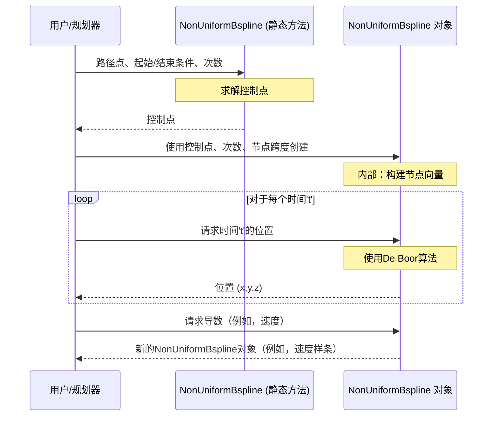

# 第3章：B样条轨迹

在上一章中，我们深入探讨了强大的[SDFMap（有符号距离场地图）](02_sdfmap__signed_distance_field_map__.md)。我们的机器人现在对其环境有了极其详细的3D理解，包括到障碍物的精确安全距离。它知道*哪里*可以安全前往。但知道去哪里只是成功的一半；另一半是弄清楚*如何*平滑高效地移动到那里，就像熟练的驾驶员在蜿蜒的道路上行驶一样。

这就是**B样条轨迹**发挥作用的地方。想象一下，我们正在为机器人绘制一条要遵循的路径。简单地连接一系列直线可能可以到达目的地，但运动会很不平稳、低效，对任何货物（或乘客！）来说都不舒适。我们需要的是一种能够创建美观平滑、连续且自然地尊重机器人物理限制（如最大速度和加速度）的路径的方法。

`B样条轨迹`是FUEL针对这个问题的优雅解决方案。它就像使用柔性尺在几个点之间绘制完美平滑的曲线，而不是仅用尖锐、僵硬的直线连接它们。这使我们的机器人能够规划非常流畅和可控的运动。

### 机器人的平滑舞蹈

**核心用例：** 我们的机器人使用其[SDFMap（有符号距离场地图）](02_sdfmap__signed_distance_field_map__.md)在复杂的、充满障碍物的环境中识别出目标位置。它需要生成一条平滑、无碰撞的路径到达该目标，确保永远不会超过其最大速度或加速度能力。

`B样条轨迹`通过提供一种数学方法来描述平滑曲线，帮助机器人实现这一目标，该曲线可以轻松控制并根据物理限制进行检查。

### 分解概念：什么是B样条？

B样条是一种高度通用的数学曲线。不要被"数学曲线"这个词吓到；它其实非常直观！

*   **控制点：** 可以将它们想象成无形的"磁铁"或"吸引子"，将曲线拉向它们。B样条曲线不一定*通过*这些控制点（与其他一些类型的曲线不同），但它们强有力地塑造了曲线的形状。通过移动几个控制点，我们可以显著改变曲线的一段。
    *   **类比：** 想象用手指推动一根柔性橡皮筋。我们的手指就是控制点，橡皮筋的形状就是B样条。
*   **节点向量（或节点跨度）：** 这是一个数字序列，定义了沿曲线的"时间"间隔以及样条的不同段如何连接。对于我们的初学者友好解释，只需将其视为控制路径每个部分的持续时间和平滑度。"均匀"B样条具有相等的时间间隔，就像沿路径的恒定速度。
*   **阶数/次数：** 这个数字定义了B样条可以有多"弯曲"和平滑。更高的次数通常意味着更平滑的曲线。对于机器人轨迹，通常使用三次（次数3）或五次（次数5）B样条，因为它允许平滑的位置、速度和加速度曲线。
    *   次数1：用直线连接点（像基本的多边形路径）。
    *   次数2：平滑曲线，但加速度可能"跳跃"。
    *   次数3（三次）：位置、速度和加速度都是平滑的，使其成为机器人运动的理想选择。

**为什么B样条对机器人轨迹如此有用？**

1.  **平滑性：** 它们自然产生连续曲线，意味着机器人的运动将流畅而没有突然的抖动。
2.  **局部控制：** 改变一个控制点只影响曲线的一小部分。这对于优化非常有用，因为机器人可以局部调整其路径以避开新检测到的障碍物，而无需重新计算整个轨迹。
3.  **易于求导：** 从B样条计算速度（一阶导数）和加速度（二阶导数）非常简单。这对于确保机器人保持在其物理限制内至关重要。

### 如何使用B样条轨迹

使用B样条进行机器人运动的典型方法是首先定义一系列路径点（例如，中间目标或从粗略路径采样的点）。然后，我们使用一个特殊函数将这些路径点转换为实际的B样条控制点及其节点向量。一旦我们通过控制点和节点定义了B样条，我们就可以在轨迹上的任何时刻评估其位置、速度和加速度。

#### 步骤1：将路径点参数化为B样条

想象一下，我们有一系列希望机器人经过附近的期望点。`parameterizeToBspline`函数（FUEL的`NonUniformBspline`类中的静态辅助函数）接受这些路径点，以及期望的起始/结束速度和加速度，并计算平滑B样条所需的控制点。

```cpp
// 示例：路径点和边界条件
std::vector<Eigen::Vector3d> waypoints;
waypoints.push_back(Eigen::Vector3d(0.0, 0.0, 1.0)); // 起点
waypoints.push_back(Eigen::Vector3d(1.0, 0.5, 1.2)); // 中间点1
waypoints.push_back(Eigen::Vector3d(2.0, 1.0, 1.0)); // 中间点2
waypoints.push_back(Eigen::Vector3d(3.0, 0.8, 0.9)); // 终点

// 定义期望的起始/结束速度和加速度（为简单起见全部为零）
std::vector<Eigen::Vector3d> boundary_derivatives;
boundary_derivatives.push_back(Eigen::Vector3d(0, 0, 0)); // 起始速度 (v_start)
boundary_derivatives.push_back(Eigen::Vector3d(0, 0, 0)); // 结束速度 (v_end)
boundary_derivatives.push_back(Eigen::Vector3d(0, 0, 0)); // 起始加速度 (a_start)
boundary_derivatives.push_back(Eigen::Vector3d(0, 0, 0)); // 结束加速度 (a_end)

double time_step = 1.0; // 路径点之间的时间间隔（参数化的任意值）
int degree = 3;         // 我们想要三次B样条（次数3以实现平滑运动）

Eigen::MatrixXd control_points_output; // 这将存储计算出的控制点

// 调用静态辅助函数获取控制点
fast_planner::NonUniformBspline::parameterizeToBspline(
    time_step, waypoints, boundary_derivatives, degree, control_points_output);

std::cout << "为B样条生成了 " << control_points_output.rows()
          << " 个控制点。" << std::endl;
// 在实际应用中，这些控制点将被存储并用于
// 创建实际的NonUniformBspline对象。
```
*解释：* 这段代码接受一系列`waypoints`（我们的机器人可能从路径搜索算法获得），定义期望的起始和结束条件（如在开始和结束时静止），然后使用`parameterizeToBspline`计算`control_points_output`。这些控制点是我们平滑B样条轨迹的核心定义。

#### 步骤2：创建B样条对象

一旦我们有了控制点，我们就可以创建一个实际的`NonUniformBspline`对象来表示我们的轨迹。

```cpp
// 使用上一步的'control_points_output'
double initial_knot_interval = time_step; // 使用相同的时间步长作为初始节点跨度

fast_planner::NonUniformBspline my_bspline_trajectory(
    control_points_output, degree, initial_knot_interval);

std::cout << "B样条轨迹对象已创建。" << std::endl;
// 现在'my_bspline_trajectory'保存了
// 我们机器人路径的完整定义。
```
*解释：* 我们使用计算出的`control_points_output`、选择的`degree`和初始`knot_interval`实例化`NonUniformBspline`对象。该对象现在封装了我们的平滑路径。

#### 步骤3：评估B样条的位置、速度或加速度

使用`NonUniformBspline`对象，我们可以在轨迹上的任何给定"时间"`t`查询机器人的确切状态（位置、速度、加速度）。`evaluateDeBoorT`函数用于此目的。

```cpp
// 在不同时间点评估B样条
double total_duration = my_bspline_trajectory.getTimeSum();

std::cout << "总轨迹持续时间：" << total_duration << " 秒。" << std::endl;

// 获取轨迹开始时的位置 (t=0)
Eigen::VectorXd current_pos = my_bspline_trajectory.evaluateDeBoorT(0.0);
std::cout << "t=0.0时的位置：(" << current_pos.x() << ", "
          << current_pos.y() << ", " << current_pos.z() << ")" << std::endl;

// 获取轨迹持续时间一半时的位置
current_pos = my_bspline_trajectory.evaluateDeBoorT(total_duration / 2.0);
std::cout << "t=" << total_duration / 2.0 << "时的位置：("
          << current_pos.x() << ", " << current_pos.y() << ", "
          << current_pos.z() << ")" << std::endl;

// 获取轨迹结束时的位置
current_pos = my_bspline_trajectory.evaluateDeBoorT(total_duration);
std::cout << "t=" << total_duration << "时的位置：("
          << current_pos.x() << ", " << current_pos.y() << ", "
          << current_pos.z() << ")" << std::endl;

// 要获取速度或加速度，我们首先获取导数样条
fast_planner::NonUniformBspline velocity_spline = my_bspline_trajectory.getDerivative();
Eigen::VectorXd current_vel = velocity_spline.evaluateDeBoorT(0.0);
std::cout << "t=0.0时的速度：(" << current_vel.x() << ", "
          << current_vel.y() << ", " << current_vel.z() << ")" << std::endl;
```
*解释：* 这段代码演示了如何"回放"轨迹。`getTimeSum()`给出路径的总时间。然后，`evaluateDeBoorT(t)`计算任何给定`t`时的精确位置。关键的是，`getDerivative()`创建一个*新的*B样条，表示速度曲线，然后我们可以从中评估任何时间的速度。在速度样条上再次调用`getDerivative()`将给出加速度样条！这使得检查物理限制非常容易。

### 底层原理是什么？平滑运动背后的数学

FUEL中的`NonUniformBspline`类高效地处理B样条的所有复杂数学。

#### 逐步演练：从路径点到机器人运动

1.  **路径点到控制点转换（`parameterizeToBspline`）：**
    *   这是初始设置。我们提供一系列关键`waypoints`，轨迹应该"通过"（或非常接近）。
    *   我们还指定样条的`degree`（例如，3表示三次）和边界条件（例如，起始和结束速度/加速度为零）。
    *   在内部，`parameterizeToBspline`构建一个线性方程组。它使用B样条的已知属性（控制点如何与曲线上的点及其导数相关）来*求解*满足我们路径点和边界条件的最优`control_points`。这通常使用高效的线性代数求解器（如Eigen的QR分解）完成。
2.  **B样条构建（`setUniformBspline`）：**
    *   一旦找到`control_points`，就使用这些点、`degree`和初始`knot_span`（节点之间的时间间隔）初始化`NonUniformBspline`对象。
    *   然后它构建一个`knot vector`。对于"均匀"B样条（这是常见的起点），节点是均匀间隔的。
3.  **点评估（`evaluateDeBoor` / `evaluateDeBoorT`）：**
    *   当我们要求在特定"时间"`u`（或`t`）的曲线上的点时，`NonUniformBspline`使用**De Boor算法**。该算法是一种非常高效且数值稳定的方法，用于从控制点和节点向量计算B样条上的点。它在控制点之间重复插值，每一步都更接近曲线上的最终点。
4.  **导数计算（`getDerivative`）：**
    *   B样条的一个奇妙特性是它们的导数（表示速度和加速度）*也是*B样条！`getDerivative()`不计算单个速度点；相反，它计算定义速度B样条的*新控制点集*（次数比原始低一）。然后我们可以评估这个新样条以获得速度。

#### 简化序列图：



### 深入代码实现

FUEL中B样条的核心实现在`fuel_planner/bspline/include/bspline/non_uniform_bspline.h`和`fuel_planner/bspline/src/non_uniform_bspline.cpp`中。

让我们看看`NonUniformBspline`类的关键部分。

#### 初始化：设置均匀B样条

构造函数和`setUniformBspline`函数处理样条的初始设置，包括生成节点向量。

```cpp
// 在NonUniformBspline::setUniformBspline(...)中，来自non_uniform_bspline.cpp
void NonUniformBspline::setUniformBspline(const Eigen::MatrixXd& points,
                                          const int& order, const double& interval) {
  control_points_ = points; // 存储输入控制点
  p_ = order;               // 存储阶数（次数）
  knot_span_ = interval;    // 存储时间间隔

  n_ = points.rows() - 1;   // n+1个控制点 -> n = points.rows()-1
  m_ = n_ + p_ + 1;         // m = n+p+1定义节点向量大小

  u_ = Eigen::VectorXd::Zero(m_ + 1); // 初始化节点向量
  for (int i = 0; i <= m_; ++i) {
    if (i <= p_)
      u_(i) = double(-p_ + i) * knot_span_; // 均匀样条的钳位起始节点
    else
      u_[i] = u_[i - 1] + knot_span_;       // 均匀间隔的节点
  }
}
```
*解释：* 这段代码接受提供的`control_points_`、`order`（次数）和`interval`（节点跨度）。然后它计算必要的`n_`和`m_`参数并生成`u_`（节点向量）。对于均匀B样条，节点是规则间隔的，前`p+1`个和后`p+1`个节点被"钳位"（重复），以确保曲线从第一个和最后一个控制点开始和结束，这在轨迹生成中很常见。

#### 将路径点参数化为控制点

`parameterizeToBspline`静态函数对于将用户友好的路径点转换为B样条所需的数学`control_points`至关重要。

```cpp
// 在NonUniformBspline::parameterizeToBspline(...)中，来自non_uniform_bspline.cpp
void NonUniformBspline::parameterizeToBspline(const double& ts,
                                              const vector<Eigen::Vector3d>& point_set,
                                              const vector<Eigen::Vector3d>& start_end_derivative,
                                              const int& degree, Eigen::MatrixXd& ctrl_pts) {
  // ... (输入验证和设置)

  // K是路径点的数量
  int K = point_set.size();

  // A矩阵将控制点映射到路径点和边界导数
  Eigen::MatrixXd A = Eigen::MatrixXd::Zero(K + 4, K + degree - 1);
  Eigen::VectorXd bx(K + 4), by(K + 4), bz(K + 4);
  ctrl_pts.resize(K + degree - 1, 3); // 输出控制点将有K+degree-1行

  if (degree == 3) { // 三次B样条的示例（次数3）
    // 这些向量定义控制点如何影响路径点和导数
    Eigen::Vector3d pt_to_pos = 1 / 6.0 * Eigen::Vector3d(1, 4, 1);
    Eigen::Vector3d pt_to_vel = 1 / (2 * ts) * Eigen::Vector3d(-1, 0, 1);
    Eigen::Vector3d pt_to_acc = 1 / (ts * ts) * Eigen::Vector3d(1, -2, 1);

    // 根据B样条属性用系数填充矩阵A
    for (int i = 0; i < K; ++i) A.block<1, 3>(i, i) = pt_to_pos.transpose();
    A.block<1, 3>(K, 0) = pt_to_vel.transpose();         // 起始速度约束
    A.block<1, 3>(K + 1, K - 1) = pt_to_vel.transpose(); // 结束速度约束
    A.block<1, 3>(K + 2, 0) = pt_to_acc.transpose();     // 起始加速度约束
    A.block<1, 3>(K + 3, K - 1) = pt_to_acc.transpose(); // 结束加速度约束
  }
  // ... (次数4和5的类似块)

  // 用目标路径点位置和导数值填充'b'向量
  for (int i = 0; i < K; ++i) {
    bx(i) = point_set[i][0]; by(i) = point_set[i][1]; bz(i) = point_set[i][2];
  }
  for (int i = 0; i < 4; ++i) { // 4个边界导数
    bx(K + i) = start_end_derivative[i][0]; // x分量
    by(K + i) = start_end_derivative[i][1]; // y分量
    bz(K + i) = start_end_derivative[i][2]; // z分量
  }

  // 为每个维度（x、y、z）求解线性系统 A * ctrl_pts = b
  ctrl_pts.col(0) = A.colPivHouseholderQr().solve(bx);
  ctrl_pts.col(1) = A.colPivHouseholderQr().solve(by);
  ctrl_pts.col(2) = A.colPivHouseholderQr().solve(bz);
}
```
*解释：* 这是一段更高级的代码，但说明了核心思想：它构建一个大矩阵`A`，表示每个路径点和边界条件处的B样条基函数。`point_set`和`start_end_derivative`形成`b`向量。通过使用`A.colPivHouseholderQr().solve()`求解线性方程`A * ctrl_pts = b`，它有效地找到生成通过或接近`point_set`并尊重期望边界条件的B样条的控制点（`ctrl_pts`）。

#### 评估曲线上的点（De Boor算法）

`evaluateDeBoor`函数是获取样条上点的主力。

```cpp
// 在NonUniformBspline::evaluateDeBoor(...)中，来自non_uniform_bspline.cpp
Eigen::VectorXd NonUniformBspline::evaluateDeBoor(const double& u) {
  // 找到'u'落入哪个节点区间
  int k = p_;
  while (u_(k + 1) < u) ++k;

  // 检索影响此区间的'p_ + 1'个控制点
  vector<Eigen::VectorXd> d;
  for (int i = 0; i <= p_; ++i)
    d.push_back(control_points_.row(k - p_ + i));

  // De Boor算法（递归插值）
  for (int r = 1; r <= p_; ++r)
    for (int i = p_; i >= r; --i) {
      double alpha = (u - u_[i + k - p_]) / (u_[i + 1 + k - r] - u_[i + k - p_]);
      d[i] = (1 - alpha) * d[i - 1] + alpha * d[i]; // 线性插值步骤
    }
  return d[p_]; // 样条上的最终插值点
}
```
*解释：* 这个函数实现了De Boor算法的核心。给定"时间"`u`，它首先识别样条的正确段。然后，它在一组相关控制点（`d`）之间迭代执行线性插值（`(1 - alpha) * d[i - 1] + alpha * d[i]`）。经过`p_`（次数）次迭代后，`d[p_]`包含时间`u`时B样条上的精确点。

#### 获取导数（速度、加速度）

使用B样条计算导数非常简单。

```cpp
// 在NonUniformBspline::getDerivative()中，来自non_uniform_bspline.cpp
NonUniformBspline NonUniformBspline::getDerivative() {
  // 计算导数样条的新控制点
  Eigen::MatrixXd ctp = Eigen::MatrixXd::Zero(control_points_.rows() - 1, control_points_.cols());

  // 导数控制点的公式
  for (int i = 0; i < ctp.rows(); ++i)
    ctp.row(i) = p_ * (control_points_.row(i + 1) - control_points_.row(i)) /
                 (u_(i + p_ + 1) - u_(i + 1));

  // 为导数创建新的B样条对象（次数为p_-1）
  NonUniformBspline derivative(ctp, p_ - 1, knot_span_);

  // 调整导数样条的节点向量
  Eigen::VectorXd knot(u_.rows() - 2);
  knot = u_.segment(1, u_.rows() - 2); // 删除第一个和最后一个原始节点
  derivative.setKnot(knot);

  return derivative;
}
```
*解释：* 这个函数展示了B样条的优雅之处：导数也是B样条！它使用基于原始控制点和节点向量的简单公式计算一组新的`ctp`（控制点）。然后它创建一个`新的NonUniformBspline`对象，但`degree`减少了一（`p_-1`）并且`knot`向量经过调整。这个新样条*就是*速度曲线（或者如果再次调用则是加速度），然后可以像任何其他样条一样评估。

### 实际应用中的`B样条轨迹`（FUEL示例）

B样条是FUEL中运动规划的基础：

*   **轨迹优化**：[Bspline Optimizer](07_bspline_optimizer_.md)严重依赖B样条。它采用初始B样条轨迹并迭代调整其控制点（"磁铁"），使路径更平滑、更安全（在[SDFMap（有符号距离场地图）](02_sdfmap__signed_distance_field_map__.md)的指导下远离障碍物）和更快，同时尊重机器人的物理限制。
*   **路径规划**：像[Path Search Algorithms (Astar & Kinodynamic Astar)](06_path_search_algorithms__astar___kinodynamic_astar__.md)这样的算法可能会生成一系列路径点作为粗略路径。然后使用这里描述的方法将这些路径点转换为平滑的B样条轨迹，使路径可由真实机器人执行。
*   **安全检查**：`NonUniformBspline`中的`checkFeasibility`和`reallocateTime`函数用于快速验证生成的轨迹是否违反机器人的最大速度或加速度限制。如果违反，`reallocateTime`可以延长轨迹的持续时间以使其可行而不改变其形状，就像动态速度限制调整一样。

### 结论

在本章中，我们探讨了`B样条轨迹`作为FUEL为机器人生成平滑、连续和物理可行路径的方法。我们了解了控制点和节点向量如何定义这些灵活的曲线，以及它们的属性如何允许轻松计算位置、速度和加速度。这个强大的数学工具，结合来自[SDFMap（有符号距离场地图）](02_sdfmap__signed_distance_field_map__.md)的详细环境理解，构成了智能运动生成的支柱。

现在我们的机器人可以看到它的世界并规划通过它的平滑路径，下一个合乎逻辑的步骤是引导它探索新的、未知的区域。在下一章中，我们将发现FUEL如何使用**Frontier Finder**找到这些令人兴奋的新前沿。

[下一章：Frontier Finder](04_frontier_finder_.md)

