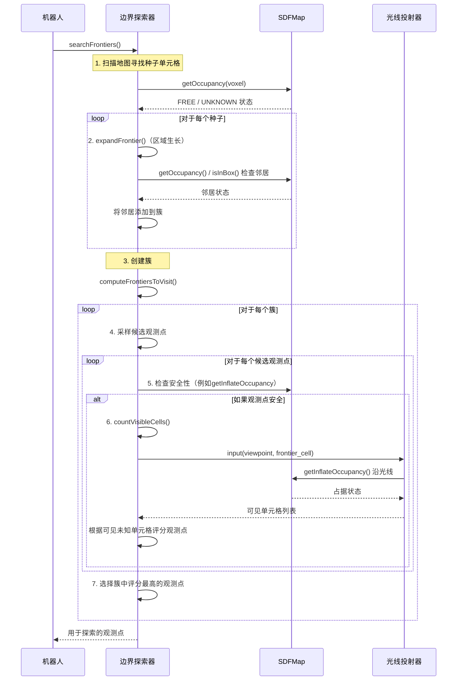

# 第4章：边界探索器

在前几章中，我们的机器人已经掌握了两个强大的能力：首先是通过[光线投射器](01_raycaster_.md)"看到"周围环境，其次是通过[符号距离场地图（SDFMap）](02_sdfmap__signed_distance_field_map__.md)构建包含安全距离的详细3D世界蓝图

最近在[第3章：B样条轨迹](03_b_spline_trajectory_.md)中，它学会了如何在*已知*区域规划极其平滑、安全和高效的路径。

- 但这里有一个重要问题：如果我们的机器人只绘制了一栋大型建筑的一个==小角落==，它如何决定*下一步去哪里*探索其余部分？它如何智能地==寻找新的==、未映射的区域，而不是重复访问已经知道的地方？

这就是**边界探索器**的工作。它就像是机器人的数字侦察兵，唯一目的是查看机器人当前的地图，==识别已知世界与未知世界之间的模糊边缘==，然后将这些地方标记为值得探索的精彩地点

这些边缘就是我们所说的"边界"。

### 机器人的探索指南针

**核心用例**：想象我们的机器人刚刚开始探索一个新的黑暗洞穴

它的传感器只照亮了周围的一个小气泡，其余部分在[SDFMap](02_sdfmap__signed_distance_field_map__.md)中仍标记为`UNKNOWN`。机器人需要决定下一步移动到哪里，以扩展其知识并绘制更多洞穴地图。

`边界探索器`通过以下方式解决这个问题：
1.  **发现边界**：它扫描地图，==寻找当前为`FREE`（已知的空闲空间）但至少有一个`UNKNOWN`邻居的单元格==。这些是已探索世界的"边缘"。
2.  **分组处理**：它将附近的边界单元格分组为"==簇=="，因为探索整个未知区域比探索单个单元格更高效。
3.  **建议观测点**：对于每个簇，它会计算最佳位置（观测点），机器人可以从这些位置"观察"并映射该未探索区域的大部分，同时确保观测点本身是安全且无障碍的。

这个模块对于真正的自主探索至关重要，引导机器人系统地发现其环境。

### 概念解析：什么是边界？

让我们拆解`边界探索器`背后的关键思想：

*   **边界单元格**：这些是基本构建块。"边界单元格"是[SDFMap](02_sdfmap__signed_distance_field_map__.md)中满足两个条件的任何网格单元格（体素）：
    1.  它被标记为`FREE`（意味着机器人知道它是一个空闲空间）。
    2.  它至少有一个直接邻居被标记为`UNKNOWN`（意味着机器人从未感知过该区域）。
    *   **类比**：如果地图像一本涂色书，`FREE`区域是已涂色的部分，`UNKNOWN`区域是空白部分。边界单元格是紧邻空白部分的已涂色点，这是已涂色区域的边界。

*   **边界簇**：机器人不想只探索一个`UNKNOWN`体素；它想探索整个`UNKNOWN`*区域*。因此，`边界探索器`将所有找到的单个边界单元格分组到物理上彼此靠近的组中。这些组就是"边界簇"。
    *   **类比**：不仅仅是找到涂色结束的单个点，而是找到未涂色空间的整个"墙"或"线"，就像你尚未进入的新房间的边缘。

*   **最佳观测点**：一旦`边界探索器`知道未探索区域*在哪里*（簇），它需要告诉机器人*最佳站立位置*来观察它们。"最佳观测点"是一个安全的位置，机器人可以从这里看到边界簇中的最多`UNKNOWN`单元格，而不会被障碍物阻挡视线。
    *   **类比**：你发现了一个新的未涂色房间。你应该站在门口的哪个位置才能尽可能多地看到房间内部，而不会撞到门框或被一堆箱子挡住视线？

### 如何使用`边界探索器`

`边界探索器`通过不断扫描机器人更新的[SDFMap](02_sdfmap__signed_distance_field_map__.md)来工作。通常会调用其`searchFrontiers()`方法，该方法负责识别、聚类和寻找观测点的繁重工作。

以下是集成它的简化示例：

```cpp
#include <ros/ros.h>
#include <Eigen/Eigen>
#include <memory> // 用于std::shared_ptr
#include <active_perception/frontier_finder.h>
#include <plan_env/edt_environment.h> // 需要EDTEnvironment::Ptr
#include <plan_env/sdf_map.h>        // 需要SDFMap::Ptr

// 假设'nh'是初始化的ROS NodeHandle
// 假设'edt_env'是初始化的EDTEnvironment共享指针
// (EDTEnvironment包装了SDFMap并提供距离信息)

// 1. 初始化边界探索器
fast_planner::FrontierFinder frontier_finder(edt_env, nh);

// 2. 机器人移动并更新地图（例如通过传感器数据处理到SDFMap中）
//    ...（机器人导航和地图更新循环）...

// 3. 当机器人需要寻找新区域探索时：
std::cout << "正在搜索边界..." << std::endl;
frontier_finder.searchFrontiers(); // 这是查找和聚类边界的主要函数！

// 4. 搜索后，计算找到的边界信息（如观测点）
frontier_finder.computeFrontiersToVisit();

// 5. 检索找到的边界（单元格簇）用于可视化或进一步使用
std::vector<std::vector<Eigen::Vector3d>> all_frontier_cells;
frontier_finder.getFrontiers(all_frontier_cells);

std::cout << "找到 " << all_frontier_cells.size() << " 个边界簇。" << std::endl;
for (size_t i = 0; i < all_frontier_cells.size(); ++i) {
    std::cout << "  簇 " << i << " 有 " << all_frontier_cells[i].size()
              << " 个单元格。" << std::endl;
}

// 6. 获取建议的边界观测点
//    我们需要机器人当前位置以帮助优先选择观测点
Eigen::Vector3d current_robot_pos(0.5, 0.5, 1.0); // 示例机器人当前位置
std::vector<Eigen::Vector3d> top_view_points;
std::vector<double> top_view_yaws;
std::vector<Eigen::Vector3d> frontier_averages;

frontier_finder.getTopViewpointsInfo(current_robot_pos, top_view_points, top_view_yaws, frontier_averages);

std::cout << "建议的顶级观测点：" << std::endl;
for (size_t i = 0; i < top_view_points.size(); ++i) {
    std::cout << "  - 观测点 " << i << ": 位置 (" << top_view_points[i].x() << ", "
              << top_view_points[i].y() << ", " << top_view_points[i].z()
              << "), 偏航角 " << top_view_yaws[i] << "（朝向边界平均位置: "
              << frontier_averages[i].x() << ", " << frontier_averages[i].y() << ", "
              << frontier_averages[i].z() << ")" << std::endl;
}
```
*解释*：这段代码首先初始化`边界探索器`

最重要的调用是`searchFrontiers()`，它主动扫描地图并找到新的未知区域。

之后，`computeFrontiersToVisit()`进一步处理这些区域，例如寻找最佳观测点。最后，`getFrontiers()`和`getTopViewpointsInfo()`允许我们检索结果：实际的边界单元格列表和机器人可以移动到的建议安全观测点（位置和方向）。机器人随后会选择其中一个建议观测点作为下一个目标。

### 底层原理：如何发现和评分边界

`边界探索器`结合了来自[SDFMap](02_sdfmap__signed_distance_field_map__.md)和[光线投射器](01_raycaster_.md)的信息来实现其目标。

#### 逐步解析：寻找已知世界的边缘

1.  **扫描种子**：`边界探索器`系统地扫描3D网格地图的一部分（特别是那些被新传感器数据更新的区域）。它寻找任何`FREE`体素，该体素至少有一个`UNKNOWN`邻居。当找到这样的体素时，它将其视为新边界的"种子"。
2.  **扩展簇（区域生长）**：一旦找到种子，算法开始从中扩展，就像池塘中的涟漪一样。它使用一种称为"区域生长"的技术（类似于广度优先搜索或深度优先搜索）。它将所有相邻的`FREE`体素（这些体素*也*有一个`UNKNOWN`邻居）添加到当前簇中。这一过程持续到没有更多符合条件的邻居可以添加，形成一个完整的边界簇。
3.  **降采样簇**：对于非常大的簇，拥有每个单元格可能数据量过大。`边界探索器`可以对这些簇进行降采样（例如取一个代表性的子集），以加快处理速度，特别是在计算可见性时。
4.  **采样候选观测点**：对于每个边界簇，`边界探索器`生成许多可能的机器人位置*围绕*该簇。这些是"候选观测点"。它通常在簇中心周围的不同高度和距离上以圆形方式采样它们。
5.  **检查观测点安全性**：在考虑候选观测点之前，`边界探索器`会检查它是否安全：
    *   它是否在地图边界内？
    *   它是否在`FREE`空间中，并且不太靠近任何`OCCUPIED`或`UNKNOWN`区域（使用[SDFMap](02_sdfmap__signed_distance_field_map__.md)中的`getInflateOccupancy`和`isNearUnknown`函数）？
6.  **评估观测点覆盖范围**：对于每个*安全*的候选观测点，`边界探索器`确定其质量。它通过以下方式实现：
    *   **视场检查**：首先检查边界单元格是否在机器人的"视场"（FOV）内。
    *   **可见性检查（光线投射）**：对于视场内的每个边界单元格，它使用[光线投射器](01_raycaster_.md)从观测点到该单元格投射一条光线。如果光线在到达边界单元格之前碰到任何`OCCUPIED`单元格（或`UNKNOWN`空间），则该边界单元格被"遮挡"（阻挡）且无法看到。
    *   **计数可见单元格**：它计算一个观测点可以*实际*看到的`UNKNOWN`边界单元格数量。这个计数决定了观测点的"分数"。
7.  **选择最佳观测点**：分数最高的观测点（意味着它们可以看到最多的未知单元格）被选为该边界簇的"最佳观测点"。这些是提供给机器人进行探索的观测点。

#### 简化序列图：



### 代码实现

`边界探索器`在FUEL中的实现可以在`fuel_planner/active_perception/include/active_perception/frontier_finder.h`（头文件）和`fuel_planner/active_perception/src/frontier_finder.cpp`（源代码）中找到。

让我们看看`边界探索器`如何识别新的边界簇以及如何评估观测点。

#### 发现和扩展边界（`searchFrontiers`和`expandFrontier`）

`searchFrontiers`函数是启动边界搜索的主要入口点。它遍历地图并为每个潜在种子调用`expandFrontier`。

```cpp
// 在frontier_finder.cpp的FrontierFinder::searchFrontiers()中（简化）
void FrontierFinder::searchFrontiers() {
  // ...（清除旧边界并识别更新的地图区域的代码）...

  Eigen::Vector3i min_id, max_id;
  edt_env_->sdf_map_->posToIndex(search_min, min_id); // 将现实世界坐标转换为体素索引
  edt_env_->sdf_map_->posToIndex(search_max, max_id);

  // 遍历地图的边界框以寻找边界种子
  for (int x = min_id(0); x <= max_id(0); ++x)
    for (int y = min_id(1); y <= max_id(1); ++y)
      for (int z = min_id(2); z <= max_id(2); ++z) {
        Eigen::Vector3i cur(x, y, z); // 当前体素
        // 检查此体素是否为种子：尚未聚类，已知空闲，且有未知邻居
        if (frontier_flag_[toadr(cur)] == 0 && knownfree(cur) && isNeighborUnknown(cur)) {
          expandFrontier(cur); // 从此种子开始扩展新边界
        }
      }
  splitLargeFrontiers(tmp_frontiers_); // 进一步细化大簇
}
```
*解释*：`searchFrontiers`遍历地图的相关部分。对于每个体素（`cur`），它检查三件事：
1.  `frontier_flag_[toadr(cur)] == 0`：此体素是否已被分配到边界簇？（`toadr`将3D体素索引转换为1D数组地址）。
2.  `knownfree(cur)`：此体素是否已知为`FREE`？（使用`edt_env_->sdf_map_->getOccupancy(idx) == SDFMap::FREE`）。
3.  `isNeighborUnknown(cur)`：此体素是否至少有一个`UNKNOWN`邻居？（这是"边缘"条件）。
如果全部为真，则调用`expandFrontier`在其周围构建簇。

现在，让我们看看`expandFrontier`如何从种子生长簇：

```cpp
// 在frontier_finder.cpp的FrontierFinder::expandFrontier(...)中（简化）
void FrontierFinder::expandFrontier(const Eigen::Vector3i& first) {
  std::queue<Eigen::Vector3i> cell_queue; // 用于广度优先搜索（BFS）的队列
  std::vector<Eigen::Vector3d> expanded_cells; // 存储当前边界簇的单元格
  Eigen::Vector3d pos;

  edt_env_->sdf_map_->indexToPos(first, pos); // 将体素索引转换为现实世界位置
  expanded_cells.push_back(pos);
  cell_queue.push(first);
  frontier_flag_[toadr(first)] = 1; // 标记为已访问（属于边界的一部分）

  while (!cell_queue.empty()) {
    auto cur = cell_queue.front();
    cell_queue.pop();
    auto nbrs = allNeighbors(cur); // 获取'cur'的所有26个3D邻居
    for (auto nbr : nbrs) {
      int adr = toadr(nbr);
      // 检查邻居是否有效以添加到该簇：
      // 尚未属于任何边界，位于地图内，已知空闲，且有未知邻居
      if (frontier_flag_[adr] == 1 || !edt_env_->sdf_map_->isInBox(nbr) ||
          !(knownfree(nbr) && isNeighborUnknown(nbr)))
        continue;

      edt_env_->sdf_map_->indexToPos(nbr, pos);
      if (pos[2] < 0.4) continue; // 忽略离地面太近的单元格（噪声）
      expanded_cells.push_back(pos);
      cell_queue.push(nbr);
      frontier_flag_[adr] = 1; // 标记邻居属于此边界
    }
  }
  if (expanded_cells.size() > cluster_min_) { // 如果簇足够大
    Frontier frontier;
    frontier.cells_ = expanded_cells;
    computeFrontierInfo(frontier); // 计算平均位置、边界框等
    tmp_frontiers_.push_back(frontier); // 添加到新边界的临时列表
  }
}
```
*解释*：`expandFrontier`使用`queue`执行==区域生长算法==

它从`first`种子体素开始，将其添加到`expanded_cells`并标记。然后，它反复从队列中取出一个体素，检查其`allNeighbors`（26个周围体素），如果邻居符合条件（尚未属于任何边界，位于地图边界内，是`FREE`且有`UNKNOWN`邻居），则将该邻居添加到`expanded_cells`和队列中。这一过程持续到队列为空，此时形成一个完整的簇。

#### 计数可见单元格（`countVisibleCells`）

此函数通过检查观测点可以看到多少边界单元格来评估其质量，它严重依赖[光线投射器](01_raycaster_.md)和[SDFMap](02_sdfmap__signed_distance_field_map__.md)。

```cpp
// 在frontier_finder.cpp的FrontierFinder::countVisibleCells(...)中（简化）
int FrontierFinder::countVisibleCells(
    const Eigen::Vector3d& pos, const double& yaw, const std::vector<Eigen::Vector3d>& cluster) {
  percep_utils_->setPose(pos, yaw); // 设置虚拟摄像机的位姿以进行FOV检查
  int visib_num = 0;
  Eigen::Vector3i idx;

  for (auto cell : cluster) {
    // 1. 检查边界单元格是否在机器人的视场（FOV）内
    if (!percep_utils_->insideFOV(cell)) continue;

    // 2. 使用光线投射检查边界单元格是否可见（未被障碍物遮挡）
    raycaster_->input(cell, pos); // 从边界单元格到观测点投射光线
    bool visib = true;
    while (raycaster_->nextId(idx)) { // 遍历光线上的体素
      // 如果光线碰到膨胀障碍或未知空间，路径被阻挡
      if (edt_env_->sdf_map_->getInflateOccupancy(idx) == 1 || // 膨胀障碍
          edt_env_->sdf_map_->getOccupancy(idx) == SDFMap::UNKNOWN) { // 未知空间
        visib = false;
        break;
      }
    }
    if (visib) visib_num += 1; // 如果光线无阻挡到达观测点，增加可见计数
  }
  return visib_num; // 返回可见边界单元格总数
}
```
*解释*：对于簇中的每个`cell`，`countVisibleCells`执行两个主要检查

首先，`percep_utils_->insideFOV(cell)`快速确定单元格是否在机器人传感器范围和角度内。

如果是，则使用[光线投射器](01_raycaster_.md)：`raycaster_->input(cell, pos)`设置从边界单元格到机器人观测点的光线。`while (raycaster_->nextId(idx))`循环遍历这条光线。如果光线上的任何体素是`OCCUPIED`（特别是`getInflateOccupancy(idx) == 1`，意味着它是障碍物或障碍物的安全缓冲区内，如[SDFMap](02_sdfmap__signed_distance_field_map__.md)所述）或`UNKNOWN`，则视野被阻挡（`visib = false`）。如果光线完成而没有碰到任何阻挡，则单元格被计为可见。

### `边界探索器`的实际应用（FUEL示例）

`边界探索器`是FUEL整体探索策略的重要组成部分：

*   **探索管理器**：`FastExplorationManager`（在`fast_exploration_manager.cpp`中）使用`边界探索器`持续更新其未探索区域列表。然后，它利用`边界探索器`建议的最佳观测点来规划机器人的下一步移动。
*   **路径规划和行程生成**：一旦`边界探索器`建议了一组观测点，`FastExplorationManager`可能会使用旅行商问题（TSP）求解器等算法来确定访问观测点的最优*序列*。它还使用`updateFrontierCostMatrix`和`getFullCostMatrix`函数来计算在不同边界之间移动的成本（时间/能量）。
*   **决策制定（FSM）**：`快速探索有限状态机（FSM）`（我们将在后面的章节中讨论）依赖`边界探索器`提供目标并驱动整体探索行为，在"寻找边界"、"规划路径"和"执行路径"等状态之间转换。

### 结论

在本章中，我们揭示了`边界探索器`在实现自主探索中的关键作用。

我们了解了它如何识别已知和未知区域之间的边界，将这些"边界单元格"聚类为可管理的组，然后智能地建议安全、高效的观测点供机器人移动。通过结合来自[SDFMap](02_sdfmap__signed_distance_field_map__.md)的地图数据和[光线投射器](01_raycaster_.md)的感知能力，`边界探索器`有效地充当了机器人的探索指南针。

现在我们的机器人知道==*去哪里*探索==，下一个挑战是在这些观测点==正确定位以进行映射==。在下一章中，我们将研究**航向规划器**，它精确控制机器人的方向

[下一章：航向规划器](05_heading_planner_.md)

