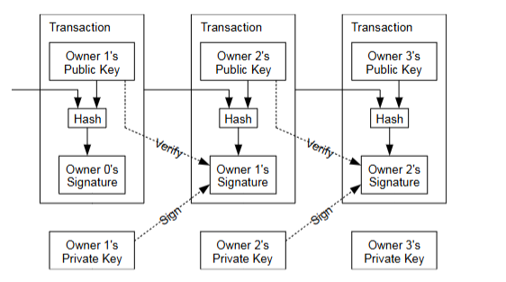
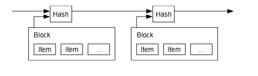
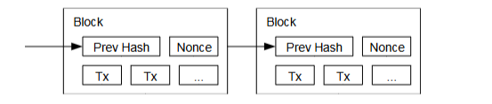
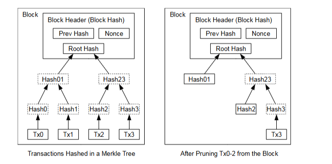
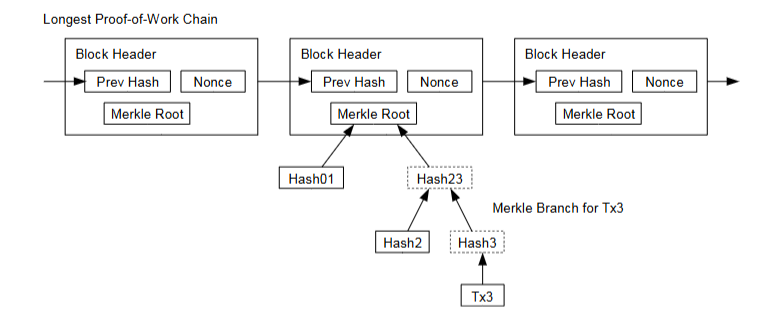
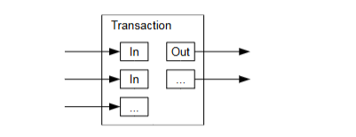

### 比特币：一种点对点的电子现金系统  
**作者：中本聪**  
**Email：satoshin@gmx.com**  
**网址：www.bitcoin.org**  

#### 摘要  
一种完全点对点版本的电子现金系统，可以让在线支付直接从==一方发送到另一方==（P2P），而无需经过金融机构。

数字签名提供了部分解决方案，但如果仍需要一个可信的第三方来防止双重支付，其主要优势将会丧失。

我们提出了一种使用点对点网络解决双重支付问题的方法。网络通过将==交易哈希==到一个基于工作量证明的不断延续的链中，==为交易生成时间戳==，从而形成一个记录，这个记录无法在不重新进行工作量证明的情况下被更改。

最长的链不仅作为所见事件顺序的证明，还作为其来自最大 CPU 功率池的证明。只要大多数 CPU 功率由不协作攻击网络的节点控制，它们将生成最长的链并超越攻击者。网络本身需要的结构非常少。消息以尽力广播的方式传播，节点可以随意离开和重新加入网络，并接受最长的工作量证明链作为它们离开期间发生的事情的证明。

---

#### 1. 引言  
互联网商业几乎完全依赖金融机构作为可信的第三方来处理电子支付。

虽然这个系统对于大多数交易来说运作得足够好，但它仍然存在`信任模式`的固有弱点。

==完全不可逆的交易==实际上是不可能的，因为金融机构无法避免调解争议。

调解的成本增加了交易成本，限制了实际交易的最低规模，并切断了小额随意交易的可能性。此外，由于无法进行不可逆的服务支付，导致更广泛的成本。由于存在逆转的可能性，信任的需求进一步扩散。

商家必须对客户保持警惕，要求他们提供更多信息，而这些信息在其他情况下并不需要。一定比例的欺诈被认为是不可避免的。这些成本和支付的不确定性可以通过使用实物货币当面支付来避免，但没有机制可以通过通信渠道进行支付而无需可信方。

需要的是一种`基于加密证明而非信任的电子支付系统`，使任何两个愿意的当事人可以直接交易，而无需可信的第三方。计算上不可逆的交易将保护卖家免受欺诈，常规的托管机制可以轻松实施以保护买家。在本文中，我们提出了一种使用==点对点分布式时间戳服务器==解决双重支付问题的方法，以生成交易时间顺序的计算证明。只要诚实的节点集体控制的 CPU 功率超过任何协作攻击节点组，该系统就可以保持安全。

---

#### 2. 交易  
我们定义电子货币为数字签名链。每位所有者通过数字签名前一交易的哈希值和下一所有者的公钥，将==货币转移给下一位所有者，并将这些添加到货币的末尾==。收款人可以验证签名以验证所有权链。

问题在于，收款人无法验证某位所有者是否没有双重支付货币。一个常见的解决方案是引入一个可信的中央权威机构或铸币机构，检查每笔交易是否存在双重支付。在每次交易之后，货币必须返回铸币机构以发行新币，且只有直接由铸币机构发行的货币才被信任不会被双重支付。这个解决方案的问题在于整个货币系统的命运取决于运行铸币机构的公司，每笔交易都必须经过他们，就像银行一样。

我们需要一种方法让收款人知道之前的所有者没有签署任何早期的交易。对于我们的目的来说，最早的交易才是重要的，因此我们不关心后续的双重支付尝试。确认交易不存在的唯一方法是了解所有交易。在基于铸币机构的模型中，铸币机构了解所有交易并决定哪个交易先到达。为了在没有可信方的情况下实现这一点，交易必须公开宣布[1]，我们需要一个系统让参与者就交易接收的顺序达成单一历史记录的共识。收款人需要证明在每次交易时，大多数节点同意这是最先接收到的交易。

---

#### 3. 时间戳服务器  
我们提出的解决方案始于一个时间戳服务器。时间戳服务器通过对一组需要时间戳的项目进行哈希，并广泛发布哈希值（例如在报纸或 Usenet 帖子中）来工作[2-5]。时间戳证明数据在当时必须已经存在，显然是为了生成哈希值。每个时间戳在其哈希中包含前一个时间戳，形成一个链，==每个额外的时间戳进一步强化之前的时间戳==。

---

#### 4. 工作量证明  
为了在点对点基础上实现分布式时间戳服务器，我们需要使用类似于 Adam Back 的 Hashcash 的工作量证明系统[6]，而不是报纸或 Usenet 帖子。

工作量证明涉及扫描一个值，当被哈希时（例如使用 SHA-256），哈希值以一定数量的零位开始。所需的平均工作量在所需零位数量上呈指数增长，可以通过执行单个哈希来验证。

对于我们的时间戳网络，我们通过在区块中增加一个随机数（nonce）直到找到一个使区块哈希满足所需零位的值来实现工作量证明。一旦 CPU 努力使其满足工作量证明，区块就无法在不重新进行工作的情况下更改。随着后续区块被链接到其后，更改区块的工作量将包括重新处理其后的所有区块。

工作量证明还解决了多数决策中的代表问题。如果多数基于一个 IP 地址一票的原则，那么任何能够分配多个 IP 的人都可以颠覆它。

==工作量证明本质上是一个 CPU 一票==。多数决策由`最长链`表示，该链具有投入最多工作量证明努力的区块。

如果大多数 CPU 功率由诚实节点控制，诚实链将增长最快并超越任何竞争链。要修改过去的区块，攻击者需要重新进行区块的工作量证明以及其后的所有区块，然后赶上并超越诚实节点的工作。我们稍后将展示，随着后续区块的增加，较慢的攻击者赶上的概率呈指数下降。

---

为了补偿硬件速度的提升和运行节点兴趣的变化，工作量证明的难度由一个移动平均值决定，目标是每小时生成一个平均区块数量。如果区块生成速度过快，难度将增加。

---

#### 5. 网络  
运行网络的步骤如下：  
1）新交易被广播到所有节点。  
2）每个节点将新交易收集到一个区块中。  
3）每个节点尝试为其区块找到一个困难的工作量证明。  
4）当某个节点找到工作量证明时，它将区块广播给所有节点。  
5）节点仅接受区块中的所有交易有效且未被双重支付的情况下，接受该区块。  
6）节点通过创建链中下一区块并使用已接受区块的哈希值作为前一个哈希来表达对区块的接受。  

==节点始终认为最长链是正确的，并将继续努力扩展它==。如果两个节点同时广播不同版本的下一区块，某些节点可能首先接收到其中一个。在这种情况下，它们将在接收到的第一个区块上工作，但会保存另一个分支，以防它变得更长。当找到下一个工作量证明并且某个分支变得更长时，节点会切换到较长的分支。  

新交易广播不一定需要到达所有节点。只要它们到达许多节点，它们很快就会进入一个区块。区块广播也对丢失消息具有容忍性。如果某个节点未接收到区块，它将在接收到下一个区块时请求它，并意识到自己错过了一个区块。

---

#### 6. 激励  
按照惯例，区块中的第一笔交易是一笔特殊交易，它创建了一个由区块创建者拥有的新币。这为节点支持网络提供了激励，并提供了一种将币初始分发到流通中的方法，因为没有中央权威来发行它们。  

恒定数量的新币的持续增加==类似于金矿工花费资源将黄金加入流通==。在我们的案例中，是 CPU 时间和电力被花费。激励也可以通过交易费用提供资金。如果交易的输出值小于其输入值，差额是交易费用，它被添加到包含该交易的区块的激励值中。一旦预定数量的币进入流通，激励可以完全转变为交易费用，从而完全无通货膨胀。  

激励可能有助于鼓励节点保持诚实。如果一个贪婪的攻击者能够组装比所有诚实节点更多的 CPU 功率，他必须在使用它欺骗他人（例如偷回自己的支付）和使用它生成新币之间做出选择。他应该发现遵守规则更有利可图，这些规则使他获得比其他所有人加起来更多的新币，而不是破坏系统和他自己财富的有效性。

---

#### 7. 回收磁盘空间  
一旦币的最新交易被足够多的区块覆盖，可以丢弃之前的已花费交易以节省磁盘空间。为实现这一点而不破坏区块的哈希，交易被哈希到一个默克尔树中[7][2][5]，只有根哈希包含在区块的哈希中。旧区块可以通过将树的分支截断来压缩。内部哈希不需要存储。  

`一个没有交易的区块头大约是 80 字节`。如果我们假设区块每 10 分钟生成一次，80 字节 * 6 * 24 * 365 = 每年 4.2MB。考虑到 2008 年的计算机系统通常配备 2GB 的内存，且摩尔定律预测当前增长为每年 1.2GB，即使必须将区块头保存在内存中，存储也不成问题。

---

#### 8. 简化支付验证  
==无需运行完整的网络节点即可验证支付==。用户只需保留最长工作量证明链的区块头副本，这可以通过查询网络节点直到==确信自己拥有最长链来实现==，并获取将交易链接到其时间戳所在区块的默克尔分支。

他无法自己检查交易，但通过将其链接到链中的某个位置，他可以看到网络节点已接受它，并且其后添加的区块进一步确认网络已接受它。  

因此，只要诚实节点控制网络，验证是可靠的，但如果网络被攻击者压制，则更容易受到攻击。虽然网络节点可以自行验证交易，但简化的方法可能会被攻击者伪造的交易欺骗，只要攻击者能够继续压制网络。

保护这一点的一种策略是接受网络节点检测到==无效区块时发出的警报==，提示用户的软件下载完整区块和警报交易以确认不一致。经常收到支付的企业可能仍然希望运行自己的节点，以获得更独立的安全性和更快的验证。

---

#### 9. 价值的组合与拆分  
虽然可以单独处理每个币，但为每分钱进行单独交易会很笨重。为了允许价值的组合与拆分，交易包含多个输入和输出。通常会有一个来自较大先前交易的单一输入或多个输入组合较小金额，最多两个输出：==一个用于支付，另一个将找零==（如果有的话）返回给发送者。  

需要注意的是，交易依赖多个交易的情况（即“扇出”），这些交易又依赖更多交易，在这里并不是问题。这里永远不需要提取交易历史的完整独立副本。

