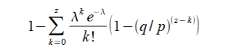

#### 10. 隐私  
传统银行模式通过将信息访问限制于相关方和可信第三方来实现一定程度的隐私。公开宣布所有交易的必要性排除了这种方法，但隐私仍然可以通过在信息流的其他地方进行分割来保持：即==保持公钥匿名==。

公众可以看到某人向某人发送了金额，但没有信息将交易与任何人链接。这类似于股票交易所发布的信息，即==交易的时间和规模（“交易记录”）是公开的，但不透露交易双方的身份==。


作为额外的保护措施，`每次交易都应使用一个新的密钥对，以防止它们被链接到一个共同的所有者`。

一些链接仍然不可避免，尤其是多输入交易，它们必然会显示这些输入属于同一所有者。风险在于，如果某个密钥的所有者身份被揭示，链接可能会暴露属于同一所有者的其他交易。

---

#### 11. 计算  
我们考虑一个攻击者试图生成比诚实链更快的替代链的场景。即使成功，这也不会使系统开放给任意更改，例如凭空创造价值或拿取从未属于攻击者的钱。节点不会接受无效交易作为支付，诚实节点永远不会接受包含无效交易的区块。攻击者只能试图更改自己的交易以取回最近支付的资金。

诚实链和攻击者链之间的竞争可以被描述为一个二项随机游走。成功事件是诚实链被延长一个区块，使领先优势增加 +1；失败事件是攻击者链被延长一个区块，使差距减少 -1。

攻击者从给定的差距追赶上的概率类似于赌徒破产问题。假设一个拥有无限信用的赌徒从亏损开始，并进行无限次试验以尝试达到收支平衡。我们可以计算他达到收支平衡的概率，或者攻击者从 z 个区块落后追赶上的概率，如下所示[8]：


---

##### 11.1 攻击者成功概率  
根据我们的假设，\[p > q\]，随着攻击者需要追赶的区块数量增加，概率呈指数下降。如果攻击者不能在早期幸运地快速前进，他的成功几率会随着差距的扩大变得微乎其微。

我们现在考虑新交易的接收者需要等待多长时间才能确信发送者无法更改交易。假设发送者是一个攻击者，他希望让接收者暂时相信他已支付，然后在一段时间后将交易改为支付给自己。接收者会在发生更改时收到警报，但发送者希望此时已经太晚。

接收者生成一个新的密钥对，并在签名之前将公钥交给发送者。这防止发送者提前准备一条区块链，通过持续工作直到幸运地足够领先，然后在那个时刻执行交易。一旦交易被发送，不诚实的发送者会秘密地开始在一个包含其交易替代版本的并行链上工作。

接收者等待交易被添加到一个区块中，并且在其后链接了 z 个区块。他不知道攻击者的确切进度，但假设诚实区块平均花费预期时间生成，攻击者的潜在进度将是一个泊松分布，期望值为：


要计算攻击者仍能追赶上的概率，我们将攻击者可能取得的每个进度量的泊松密度与从该点追赶上的概率相乘：


为了避免对==无穷尾部进行求和==，可以重新排列公式：



---

##### Code
计算攻击者在比特币网络中成功篡改已确认z个区块的交易的概率，`随着确认区块数增加，攻击成功的可能性会急剧下降`:

````c
#include <math.h>
double AttackerSuccessProbability(double q, int z) {
    double p = 1.0 - q;
    double lambda = z * (q / p);
    double sum = 1.0;
    int i, k;
    for (k = 0; k <= z; k++) {
        double poisson = exp(-lambda);
        for (i = 1; i <= k; i++) {
            poisson *= lambda / i;
        }
        sum -= poisson * (1 - pow(q / p, z - k));
    }
    return sum;
}
````

---

##### 结果分析  
运行一些结果，我们可以看到概率随着 z 的增加呈指数下降：


---

#### 12. 结论  
我们提出了一种无需信任的电子交易系统。我们从传统的基于数字签名的货币框架开始，这种框架提供了强大的所有权控制，但在没有防止双重支付的方式时是不完整的。为了解决这个问题，我们提出了一个基于工作量证明的点对点网络，用于记录交易的公共历史。只要诚实节点控制多数 CPU 功率，攻击者就几乎不可能更改历史记录。  

网络的设计简单且鲁棒。节点可以同时工作，几乎无需协调。它们不需要被识别，因为消息无需路由到特定位置，只需尽力交付即可。节点可以随时离开和重新加入网络，接受工作量证明链作为离开期间发生的事情的证明。节点通过 CPU 功率投票，==表达对有效区块的接受，并拒绝无效区块==。任何必要的规则和激励都可以通过这种共识机制强制执行。

-----------

### sum

1. **摘要**：比特币是一种==点对点==电子现金系统，允许用户直接交易，无需金融机构，并通过工作量证明防止双重支付问题。  
2. **引言**：当前支付系统依赖可信第三方，存在成本高、信任风险等问题，比特币通过加密技术解决这些缺陷。  
3. **交易**：比特币使用数字签名链记录货币所有权，并通过公开交易防止双重支付。  
4. **时间戳服务器**：==时间戳服务器通过哈希链记录交易顺序==，确保数据不可篡改。  
5. **工作量证明**：通过计算难度较高的哈希值验证交易，==最长链代表诚实节点的共识==，确保安全性。  
6. **网络**：节点通过`广播交易、验证区块和扩展最长链`共同维护网络稳定性。  
7. **激励机制**：通过新币奖励和交易费用激励节点参与，保证网络持续运转。  
8. **磁盘空间优化**：使用默克尔树压缩数据，==仅保留必要的区块头==以节省存储空间。  
9. **简化支付验证**：用户无需运行完整节点，==通过区块头和默克尔路径验证交易==。  
10. **隐私保护**：通过==匿名公钥和一人一密钥机制==，减少交易与身份的直接关联。  
11. **攻击概率分析**：攻击者试图篡改链的成功概率随区块数量增加而迅速下降。  
12. **结论**：比特币通过去中心化网络和工作量证明机制构建了一种无需信任的安全电子交易系统。