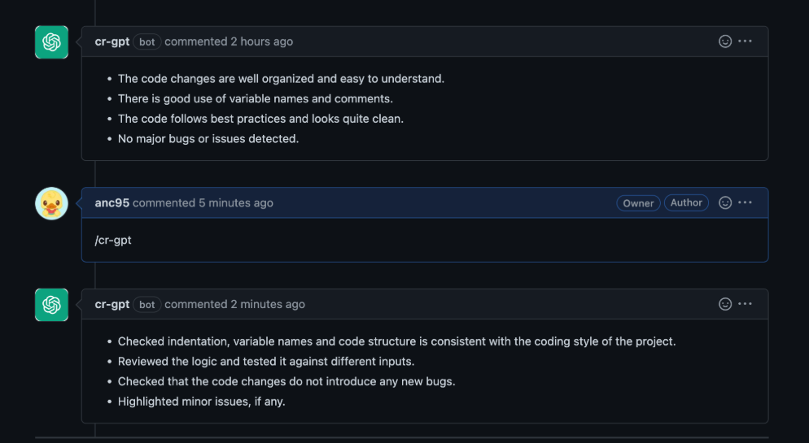
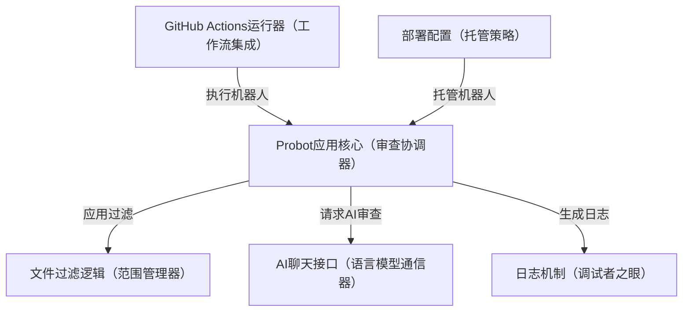
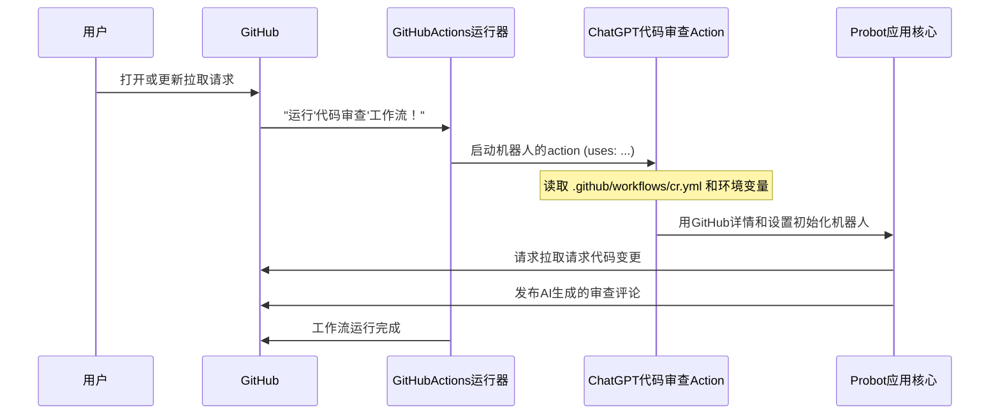

链接：[probot.github.io/apps/cr-bot/](https://probot.github.io/apps/cr-bot/)



# docs：ChatGPT-CodeReview

本项目`ChatGPT-CodeReview`是一个**智能机器人**，能够在GitHub工作流中*自动执行代码审查*

它会*监听新的或更新的拉取请求*，使用**ChatGPT等AI模型**分析代码变更，然后在拉取请求中以评论形式发布详细的反馈和建议

本质上，它充当了一个==*全天候AI助手*，帮助维护代码质量==。

## 可视化



## 章节

1. [GitHub Actions运行器（工作流集成）](01_github_actions_runner__the_workflow_integration__.md)
2. [Probot应用核心（审查协调器）](02_probot_app_core__the_review_orchestrator__.md)
3. [部署配置（托管策略）](03_deployment_configurations__the_hosting_strategy__.md)
4. [AI聊天接口（语言模型通信器）](04_ai_chat_interface__the_language_model_communicator__.md)
5. [文件过滤逻辑（范围管理器）](05_file_filtering_logic__the_scope_manager__.md)
6. [日志机制（调试者之眼）](06_logging_mechanism__the_debugger_s_eye__.md)

---

# 第1章：GitHub Actions运行器（工作流集成）

欢迎来到我们探索`ChatGPT-CodeReview`的第一章

在这里，我们将从了解机器人如何==通过名为"GitHub Actions"的强大功能`无缝集成`到现有项目开始==。

想象我们正在GitHub上与团队合作一个编码项目。

每当有人提交新代码进行审查（这称为打开"拉取请求"）时，我们希望有一个==AI助手自动查看变更并提供有用的建议==。这就是GitHub Actions运行器的用武之地

它就像一个住在我们GitHub项目中的小机器人助手，随时准备自动执行任务。

## 它解决了什么问题？

这种集成解决的主要问题是**自动化**

与其手动运行代码审查工具或让人检查每一行代码，GitHub Actions运行器让`ChatGPT-CodeReview`机器人自行运行。它在新拉取请求打开或更新时立即启动审查过程，节省时间并确保一致的反馈。

可以这样理解：

*   **没有GitHub Actions运行器**：我们必须`手动复制代码变更`，粘贴到机器人中，然后将审查评论复制回GitHub。这是大量手动工作！
*   **有GitHub Actions运行器**：我们设置==一个简单的配置文件==，GitHub负责其余一切。机器人获取代码，审查它，并==直接在拉取请求上发布评论，全部自动完成==

## `ChatGPT-CodeReview`如何使用GitHub Actions

核心思想是我们告诉GitHub："嘿，当*这个*发生时（比如拉取请求），运行*那个*特定程序（我们的`ChatGPT-CodeReview`机器人）。"我们通过在项目中创建一个特殊文件来实现这一点：`.github/workflows/cr.yml`。

让我们分解这个文件的简单示例：

```yaml
# 这是我们自动化任务的名称
name: 代码审查

# 这告诉GitHub何时运行此任务
on:
  pull_request: # 当拉取请求事件发生时运行此工作流
    types: [opened, reopened, synchronize] # 具体来说，当PR被打开、重新打开或更新时

# 这些是我们的机器人需要的特殊"权限"
permissions:
  contents: read # 允许机器人读取我们的代码文件
  pull-requests: write # 允许机器人在拉取请求上发布评论
  models: read # 允许机器人使用GitHub自己的AI模型（如果配置）

# 这定义了我们的机器人实际要做的工作
jobs:
  test: # 我们称这个特定工作为"test"（可以任意命名）
    runs-on: ubuntu-latest # 在GitHub提供的全新Linux计算机上运行此工作
    steps: # 这是我们工作的各个步骤
      - uses: anc95/ChatGPT-CodeReview@main # 这是魔法所在！使用我们的机器人代码审查操作。
        env: # 这些是我们传递给机器人的设置（环境变量）
          GITHUB_TOKEN: ${{ secrets.GITHUB_TOKEN }} # 让机器人与GitHub对话的秘密令牌
          LANGUAGE: English # 告诉机器人用英语提供审查
          USE_GITHUB_MODELS: true # 使用GitHub内置的AI模型
          # 如果使用OpenAI，可能还需要添加 OPENAI_API_KEY: ${{ secrets.OPENAI_API_KEY }}
```

让我们以初学者友好的方式看看每个部分：

1.  **`name: 代码审查`**：这只是我们自动化任务的友好名称，方便在GitHub项目的"Actions"选项卡中轻松找到它。

2.  **`on: pull_request: types: [opened, reopened, synchronize]`**：这是"触发器"。它告诉GitHub*何时*启动我们的机器人助手。在这里，它在以下情况下行动：
    *   `opened`：有人创建全新的拉取请求。
    *   `reopened`：现有拉取请求在关闭后被重新打开。
    *   `synchronize`：有人向现有拉取请求推送新变更。

3.  **`permissions:`**：这对安全至关重要！就像给我们的机器人助手特定的工具和访问卡。
    *   `contents: read`：允许机器人读取拉取请求中的代码文件。没有这个，它看不到要审查的内容！
    *   `pull-requests: write`：允许机器人直接在拉取请求上写评论。这是它提供审查的方式。
    *   `models: read`：如果我们想使用GitHub提供的高级AI模型（而不是像OpenAI这样的外部模型），这个权限让机器人访问它们。

4.  **`jobs: test:`**："job"是一起运行的步骤集合。我们可以有多个job，但对于简单的代码审查，一个通常足够。`runs-on: ubuntu-latest`意味着GitHub将为这个job设置一台全新的虚拟计算机（运行Linux操作系统）。

5.  **`steps:`**：这些是我们机器人助手的实际指令。
    *   **`- uses: anc95/ChatGPT-CodeReview@main`**：这是核心命令！它告诉GitHub Actions运行器获取并使用`ChatGPT-CodeReview`机器人。`@main`表示它将使用机器人主开发分支的最新版本。
    *   **`env:`**：这些是"环境变量"。可以看作是我们传递给机器人的特殊笔记或设置。
        *   `GITHUB_TOKEN: ${{ secrets.GITHUB_TOKEN }}`：这是GitHub自动提供的**超级重要秘密**。就像临时身份证，允许我们的机器人安全地与GitHub对话（例如获取代码、发布评论）。GitHub Actions自动管理这个`secrets.GITHUB_TOKEN`。
        *   `LANGUAGE: English`：简单设置，告诉机器人用英语写审查评论。
        *   `USE_GITHUB_MODELS: true`：这个设置告诉机器人尝试使用GitHub直接提供的AI模型，可能有不同的优势或成本。
        *   如果不使用GitHub的模型，可能需要在这里添加个人OpenAI API Key，如`OPENAI_API_KEY: ${{ secrets.OPENAI_API_KEY }}`。我们可以在GitHub仓库的"Secrets"设置中设置这个`OPENAI_API_KEY`。

一旦这个`.github/workflows/cr.yml`文件在我们的项目中，==每次==我们打开或更新拉取请求时，GitHub Actions运行器将==自动执行==这些步骤，我们的`ChatGPT-CodeReview`机器人就会行动起来

## 幕后：Action如何工作

我们已经设置了`cr.yml`文件。幕后实际发生了什么？

当我们打开或更新拉取请求时：

1.  **GitHub注意到事件**：GitHub检测到拉取请求事件（如被打开或同步）。
2.  **运行器激活**：GitHub的内部系统说："啊哈！发生了`pull_request`事件，`cr.yml`工作流设置为在此事件上运行。"然后它激活"GitHub Actions运行器"。
3.  **工作流执行**：运行器读取我们的`cr.yml`文件，特别是`steps`部分。
4.  **Action下载**：当运行器看到`uses: anc95/ChatGPT-CodeReview@main`，它会去GitHub上的`ChatGPT-CodeReview`项目并下载该Action的特定代码。
5.  **Action的指令**：在下载的Action中，有另一个特殊文件`action.yml`。这个文件告诉运行器*如何*实际运行机器人的代码（例如，它使用什么编程语言，哪个文件是起点）。
    ```yaml
    # 文件: action.yml
    name: ChatGPT CodeReviewer # Action的公开名称
    description: '由ChatGPT驱动的代码审查Action'
    runs:
      using: 'node20' # 告诉GitHub使用Node.js 20版本来运行此action
      main: 'action/index.cjs' # 这是GitHub应执行的主文件
    ```
    这个`action.yml`文件本质上是我们的`ChatGPT-CodeReview` Action的操作手册，指示GitHub Actions运行器使用Node.js并从`action/index.cjs`开始执行。

6.  **机器人初始化**：`action/index.cjs`（在项目中链接到`src/github-action.cjs`）是我们的机器人在GitHub Actions环境中的实际逻辑入口点。
    ```javascript
    // 文件: src/github-action.cjs
    // 这是将我们的机器人与GitHub Actions连接的"胶水"
    const { run } = require('@probot/adapter-github-actions'); // 将我们的机器人适配到GitHub Actions的特殊工具
    const { robot } = require('./bot'); // 引入我们机器人的主要逻辑（在第2章介绍）
    
    // 这行在GitHub Actions环境中启动我们的'robot'。
    // 它自动处理传递GitHub上下文和环境变量。
    run(robot);
    ```
    这段小代码充当桥梁。它使用名为`@probot/adapter-github-actions`的特殊工具，获取我们的核心机器人（来自`./bot.cjs`的`robot`，我们将在[第2章：Probot应用核心（审查协调器）](02_probot_app_core__the_review_orchestrator__.md)中探索），并在GitHub Actions环境中顺利运行它。它确保所有`env`变量（如`GITHUB_TOKEN`和`LANGUAGE`）正确传递给机器人。

7.  **审查过程**：现在，核心机器人接管。它使用`GITHUB_TOKEN`访问拉取请求详情（代码变更），将它们发送给AI（GitHub的模型或像OpenAI这样的外部模型），获取审查结果，然后再次使用`GITHUB_TOKEN`将AI的评论直接发布到拉取请求上。

以下是事件的简化序列：



## 总结

GitHub Actions运行器是我们的自动化助手，将GitHub上的项目与`ChatGPT-CodeReview`机器人连接起来

通过定义一个简单的`.github/workflows/cr.yml`文件，我们可以设置机器人在打开或更新拉取请求时自动审查代码变更。

它处理运行机器人的所有细节，给予必要的权限，并传递正确的设置，使自动化代码审查变得轻而易举

现在我们了解了机器人如何在GitHub中"激活"，让我们更深入地了解机器人*内部*发生了什么

在下一章中，我们将探索`ChatGPT-CodeReview`机器人的核心大脑：[Probot应用核心（审查协调器）](02_probot_app_core__the_review_orchestrator__.md)。

