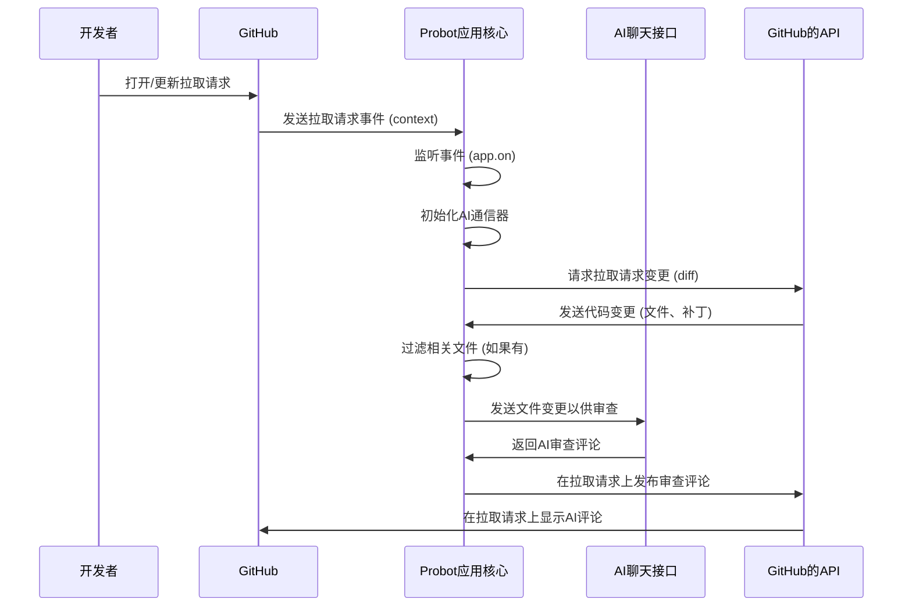

# 第2章：Probot应用核心（审查协调器）

欢迎回来

在[第1章：GitHub Actions运行器（工作流集成）](01_github_actions_runner__the_workflow_integration__.md)中，我们学习了`ChatGPT-CodeReview`机器人如何==在拉取请求打开或更新时被GitHub激活==。这就像打开了机器人的电源开关。

现在，是时候深入了解机器人*启动后*发生了什么。它如何==知道*该做什么*==？如何==管理整个审查过程==？

这正是**Probot应用核心**的功能——它是中央大脑，是"审查协调器"，负责做出所有决策并协调任务

## 它解决了什么问题？

想象我们有一个管理团队的项目经理

当新任务到来时，这个经理不只是传递任务；他们会分解任务，将部分分配给不同的团队成员，跟踪进度，并确保一切顺利交付最终结果。

**Probot应用核心**为我们的代码审查机器人扮演了完全相同的角色。它解决的问题是**协调和决策**。当GitHub告诉机器人"嘿，刚刚发生了拉取请求！"时，Probot应用核心立即行动：

*   判断发生了什么*类型*的事件（例如`新PR或现有PR被更新`）。
*   获取有关代码变更的所有必要细节
*   决定哪些文件需要审查，哪些应该忽略
*   将相关代码片段发送给AI
*   最后，将AI的反馈整理并发布回拉取请求

没有这个"协调器"，我们的机器人将只是一个坐在那里的程序，对接收到的GitHub事件不知所措

## 认识Probot：我们的GitHub应用工具包

机器人大脑的核心是一个名为**Probot**的特殊工具包

==Probot是一个框架，可以非常轻松地构建与GitHub交互的应用==。

可以将其视为GitHub应用的`专用操作系统`。

- 它处理所有复杂的事情，如接收来自GitHub的`事件`、`身份验证`和进行`API调用`，因此我们可以专注于机器人的独特逻辑。

### 1. 监听事件（机器人的耳朵）

Probot应用核心最基本的工作是*监听*来自GitHub的特定事件

就像我们可能监听电话铃声一样，机器人监听GitHub事件，如`pull_request.opened`（创建了新PR）或`pull_request.synchronize`（向现有PR推送了新变更）。

以下是机器人"==告诉"Probot它关心哪些事件的方式==：

```typescript
// 文件: src/bot.ts (简化)
import { Probot } from 'probot'; // Probot工具包
// ... 其他导入 ...

export const robot = (app: Probot) => {
  // 这告诉Probot在特定PR事件发生时运行我们的代码
  app.on(
    ['pull_request.opened', 'pull_request.synchronize'],
    async (context) => {
      // ... 我们机器人的主要审查逻辑将放在这里 ...
    }
  );
};
```
在这个片段中，`app.on()`是关键。就像设置通知规则。我们告诉Probot："当`pull_request.opened`事件或`pull_request.synchronize`事件发生时，运行这个`async (context) => { ... }`函数中的代码。"

### 2. `context`对象（事件的细节）

当事件触发我们的机器人时，Probot不只是说"发生了PR！"它提供了一个丰富的信息包，称为`context`对象。这个`context`对象包含机器人需要了解的关于事件的所有内容，例如：

*   事件来自哪个仓库。
*   谁触发了事件（例如谁打开了PR）。
*   关于拉取请求本身的所有细节（标题、正文、更改的文件等）。
*   与GitHub交互的工具（如`context.octokit`）（例如获取更多数据或发布评论）。

可以将`context`视为随每个新任务一起到达的项目经理的说明书和工具箱。

```typescript
// 在我们的app.on处理程序中（简化）
app.on(
  ['pull_request.opened', 'pull_request.synchronize'],
  async (context) => {
    const repo = context.repo(); // 获取仓库详情（所有者、名称）
    const pull_request = context.payload.pull_request; // 从事件中获取所有PR详情

    // ... 我们使用这些细节来决定下一步做什么 ...
  }
);
```
在这里，`context.repo()`快速提供有关仓库的信息，`context.payload.pull_request`提供触发事件的拉取请求的许多直接细节。

## 审查协调流程

现在机器人已经接收到事件并拥有所有`context`细节，审查代码的分步计划是什么？

以下是协调的简化视图：



### 深入代码（计划在行动中）

让我们看看包含Probot应用核心核心逻辑的`src/bot.ts`文件。我们将把`app.on`处理程序分解为其主要步骤。

1.  **初始化AI通信器**：
    协调器首先需要一种与AI对话的方式。

    ```typescript
    // 文件: src/bot.ts (摘录)
    export const robot = (app: Probot) => {
      const loadChat = async (context: Context) => {
        // 这个函数设置我们与AI对话的方式，
        // 使用GitHub的模型或像OpenAI这样的外部服务。
        // 我们将在第4章更详细地探讨这一点！
        // ... (为简洁省略细节) ...
        return new Chat(process.env.OPENAI_API_KEY || process.env.GITHUB_TOKEN);
      };
    
      app.on(
        ['pull_request.opened', 'pull_request.synchronize'],
        async (context) => {
          const chat = await loadChat(context); // 获取我们的AI通信器
    
          if (!chat) {
            // 如果我们无法与AI对话，就无法审查。
            log.info('Chat初始化失败');
            return 'no chat';
          }
          // ... 审查逻辑的其余部分 ...
        }
      );
    };
    ```
    `loadChat`函数负责建立与AI的连接。它可能使用来自GitHub secrets的API密钥或GitHub自己的AI模型。我们将在[第4章：AI聊天接口（语言模型通信器）](04_ai_chat_interface__the_language_model_communicator__.md)中详细了解其工作原理。

2.  **获取代码变更**：
    现在我们有了AI通信器，协调器向GitHub请求拉取请求中的实际代码差异（"补丁"）。

    ```typescript
    // 文件: src/bot.ts (摘录)
    // ... 在app.on处理程序中 ...
    
    const data = await context.octokit.repos.compareCommits({
      owner: repo.owner,
      repo: repo.repo,
      base: context.payload.pull_request.base.sha, // 起始点提交
      head: context.payload.pull_request.head.sha, // PR中的最新提交
    });
    
    let { files: changedFiles, commits } = data.data;
    
    // ... (获取仅最新变更的'synchronize'事件逻辑) ...
    ```
    `context.octokit`是Probot提供的一个强大工具，允许我们的机器人与GitHub API交互。在这里，`context.octokit.repos.compareCommits`要求GitHub比较两个提交，并给我们一个`changedFiles`列表和中间的`commits`。

3.  **过滤文件**：
    并非拉取请求中的每个文件都需要审查。例如，我们可能希望忽略配置文件或图像变更。协调器应用过滤规则。

    ```typescript
    // 文件: src/bot.ts (摘录)
    // ... 在app.on处理程序中 ...
    
    const ignoreList = (process.env.IGNORE || '').split('\n').filter(Boolean);
    const ignorePatterns = (process.env.IGNORE_PATTERNS || '').split(',').filter(Boolean);
    const includePatterns = (process.env.INCLUDE_PATTERNS || '').split(',').filter(Boolean);
    
    changedFiles = changedFiles?.filter((file) => {
      // 这是过滤逻辑发生的地方。
      // 它根据模式检查文件是否应包含或忽略。
      // 我们将在第5章深入探讨这一点！
      return !ignoreList.includes(file.filename) && /* 其他模式检查 */;
    });
    
    if (!changedFiles?.length) {
      log.info('过滤后未发现变更');
      return 'no change';
    }
    ```
    在这里，机器人从环境变量加载过滤设置（如`IGNORE_PATTERNS`），并使用它们缩小`changedFiles`的范围。我们将在[第5章：文件过滤逻辑（范围管理器）](05_file_filtering_logic__the_scope_manager__.md)中详细探讨这一点。

4.  **发送给AI审查**：
    有了过滤后的文件，协调器遍历它们，提取`patch`（每个文件的实际代码变更），并将其发送给AI以获取反馈。

    ```typescript
    // 文件: src/bot.ts (摘录)
    // ... 在app.on处理程序中 ...
    
    const reviewComments = []; // 存储AI的建议
    
    for (let i = 0; i < changedFiles.length; i++) {
      const file = changedFiles[i];
      const patch = file.patch || ''; // 实际代码变更
    
      if (!patch || patch.length > MAX_PATCH_COUNT) {
        // 跳过差异过大的文件
        continue;
      }
      try {
        const res = await chat?.codeReview(patch); // AI审查代码补丁！
        if (!res.lgtm && !!res.review_comment) {
          reviewComments.push({
            path: file.filename,
            body: res.review_comment,
            position: patch.split('\n').length - 1, // 放置评论的位置
          });
        }
      } catch (e) {
        log.info(`审查 ${file.filename} 失败`, e);
      }
    }
    ```
    对于每个相关文件，`chat?.codeReview(patch)`是AI介入的时刻。它接收代码变更并返回其建议，这些建议随后被收集到`reviewComments`中。

5.  **发布审查评论**：
    最后，协调器收集所有AI的建议，并再次使用`context.octokit`将它们作为评论发布到拉取请求上。

    ```typescript
    // 文件: src/bot.ts (摘录)
    // ... 在app.on处理程序中 ...
    
    try {
      await context.octokit.pulls.createReview({
        repo: repo.repo,
        owner: repo.owner,
        pull_number: context.pullRequest().pull_number,
        body: reviewComments.length ? "ChatGPT代码审查" : "LGTM 👍", // 总体摘要
        event: 'COMMENT', // 表示我们正在添加评论
        comments: reviewComments, // AI的所有具体评论
        commit_id: commits[commits.length - 1].sha, // 附加到最新提交
      });
    } catch (e) {
      log.info(`创建审查失败`, e);
    }
    
    log.info('成功审查', context.payload.pull_request.html_url);
    ```
    这个`context.octokit.pulls.createReview`命令是机器人"回话"GitHub的方式，将AI的见解放在开发者可以看到的地方。

## 总结

**Probot应用核心（审查协调器）**是`ChatGPT-CodeReview`机器人的智能中心

它使用Probot框架监听GitHub事件，处理`context`信息，然后协调一系列操作：初始化AI通信器、获取代码变更、应用过滤规则、将代码发送给AI审查，最后将AI的反馈直接发布到拉取请求上。

它是一个项目经理，确保我们的自动化代码审查从头到尾顺利进行。

接下来，我们将了解这个协调器在现实世界中的位置和运行方式。深入[第3章：部署配置（托管策略）](03_deployment_configurations__the_hosting_strategy__.md)，了解如何将机器人提供给GitHub。

---

