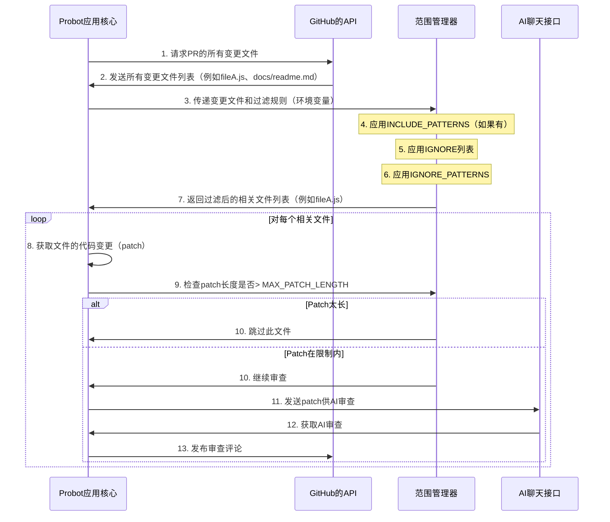

# 第5章：文件过滤逻辑（范围管理器）

欢迎回来

在[第4章：AI聊天接口（语言模型通信器）](04_ai_chat_interface__the_language_model_communicator__.md)中，我们探索了机器人如何与ChatGPT等强大的AI模型智能通信

它知道如何==提出正确的问题并理解答案==（`by  json`）。

但想象一下，我们正在审查一个庞大的编码项目

一个拉取请求可能涉及数百个文件，从核心应用程序逻辑到临时构建文件、图像资源，甚至是来自外部库（如`node_modules`）的文件。

我们真的想把*所有这些*都发送给AI审查吗？可能不需要

这就是**文件过滤逻辑（范围管理器）**发挥作用的地方。它是负责智能决定拉取请求中*哪些*文件应该实际发送给AI审查的组件。它就像一个高效的**独家俱乐部保镖**，确保只有相关且可管理的代码变更能够进入AI审查环节。

## 它解决了什么问题？

`ChatGPT-CodeReview`机器人在决定审查哪些文件时面临两个主要挑战：

1.  **AI成本和性能**：向AI发送过多代码会增加成本并延长处理时间。AI模型还有"令牌限制"，意味着它们一次只能处理一定量的文本。发送不相关或非常大的文件可能会触及这些限制，导致审查失败或不完整。
2.  **相关性**：并非所有文件对代码审查都同等重要。我们可能不需要AI对以下内容的反馈：
    *   配置文件（如`.env`、`package-lock.json`）。
    *   生成的代码（如`dist`文件夹中的编译JavaScript）。
    *   大型第三方库（`node_modules`）。
    *   文档或图像文件。

> **范围管理器**通过提供清晰的规则来解决这些问题，规定**包含什么、忽略什么以及哪些内容对AI来说太大而无法高效处理**。它确保==AI将其宝贵的注意力（和我们的预算）集中在真正重要的代码上==。

## 范围管理器的规则（保镖的检查清单）

我们机器人的保镖（范围管理器）有几个关键规则来决定哪些文件可以进入：

(类似于==bot的.ignore==)

1.  **直接忽略列表（`IGNORE`）**："这些特定文件*永远*不允许进入。"
2.  **忽略模式（`IGNORE_PATTERNS`）**："任何匹配这些常见模式的文件*不允许*进入。"
3.  **包含模式（`INCLUDE_PATTERNS`）**："*只有*匹配这些模式的文件允许进入。其他所有文件都排除在外！"（此规则优先级最高）。
4.  **最大变更大小（`MAX_PATCH_LENGTH`）**："即使文件被允许，如果其变更太大，AI无法一次性处理，则跳过它。"

让我们看看如何在`.github/workflows/cr.yml`文件中配置这些规则。

## 配置范围管理器（设置保镖的规则）

我们使用GitHub Actions工作流中的环境变量来配置范围管理器，就像在[第1章：GitHub Actions运行器（工作流集成）](01_github_actions_runner__the_workflow_integration__.md)中看到的那样

以下是设置这些规则的示例：

```yaml
# 文件: .github/workflows/cr.yml (片段)
      - uses: anc95/ChatGPT-CodeReview@main
        env:
          GITHUB_TOKEN: ${{ secrets.GITHUB_TOKEN }}
          # ... 其他设置 ...

          # 规则1: 要忽略的特定文件
          IGNORE: |
            package-lock.json
            yarn.lock
            .env

          # 规则2: 要忽略的文件模式（逗号分隔）
          IGNORE_PATTERNS: "*.md, .github/**, public/*, dist/**, *.test.js"

          # 规则3: *仅*包含匹配这些模式的文件（逗号分隔）
          # 如果设置，IGNORE和IGNORE_PATTERNS将被忽略！
          INCLUDE_PATTERNS: "src/**/*.js, src/**/*.ts, scripts/**"

          # 规则4: 每个文件的变更最大大小（字符数）
          MAX_PATCH_LENGTH: 1000 # 示例：仅审查最多1000个字符的变更
```

让我们分解每条规则：

### 1. `IGNORE`：要排除的特定文件

此变量是一个以换行符分隔的精确文件名列表。如果文件的名称匹配此列表中的*任何*条目，它将被立即过滤掉。

**示例**：
```yaml
          IGNORE: |
            package-lock.json
            yarn.lock
            .env
```
**结果**：如果拉取请求更改了`package-lock.json`、`yarn.lock`或`.env`，机器人将直接忽略这些变更，不会将它们发送给AI。

### 2. `IGNORE_PATTERNS`：要排除的文件模式

此变量是一个以逗号分隔的"glob模式"列表。Glob模式类似于通配符（`*`匹配任何内容，`**`匹配任何目录）。任何匹配*任何*这些模式的文件将被排除。

**示例**：
```yaml
          IGNORE_PATTERNS: "*.md, .github/**, public/*, dist/**, *.test.js"
```
**结果**：
*   `*.md`：忽略所有Markdown文件（例如`README.md`、`CONTRIBUTING.md`）。
*   `.github/**`：忽略`.github`目录中的任何内容（例如工作流文件、问题模板）。
*   `public/*`：忽略`public`文件夹中的直接文件（例如`public/index.html`）。
*   `dist/**`：忽略`dist`目录或其子目录中的任何内容（常见于编译代码）。
*   `*.test.js`：忽略JavaScript测试文件。

### 3. `INCLUDE_PATTERNS`：*仅*包含匹配这些模式的文件

这是最强大的过滤规则。如果设置了`INCLUDE_PATTERNS`，机器人将*仅*考虑匹配*至少一个*这些模式的文件。所有其他文件，无论`IGNORE`或`IGNORE_PATTERNS`如何，都将被排除。这相当于一个"允许列表"。

**示例**：
```yaml
          INCLUDE_PATTERNS: "src/**/*.js, src/**/*.ts, scripts/**"
```
**结果**：
*   `src/**/*.js`：仅包含`src`文件夹中的任何位置的JavaScript文件。
*   `src/**/*.ts`：仅包含`src`文件夹中的任何位置的TypeScript文件。
*   `scripts/**`：仅包含`scripts`文件夹中的任何位置的文件。
*   **重要**：如果还有`README.md`和`public/index.html`的变更，它们将被*忽略*，因为它们不匹配任何`INCLUDE_PATTERNS`。

### 4. `MAX_PATCH_LENGTH`：限制变更大小

即使文件通过了`IGNORE`和`INCLUDE_PATTERNS`规则的检查，其变更的总大小（"补丁"或"差异"）可能对AI来说太大而无法有效处理。此变量设置单个文件补丁的字符限制。

**示例**：
```yaml
          MAX_PATCH_LENGTH: 1000 # 仅审查最多1000个字符的变更
```
**结果**：如果文件`src/big-feature.js`有2000个字符的变更，而`MAX_PATCH_LENGTH`为1000，机器人将跳过审查此文件，即使它匹配`INCLUDE_PATTERNS`。这可以避免触及AI令牌限制并节省成本。

## 幕后：范围管理器的工作原理

让我们追踪`ChatGPT-CodeReview`机器人如何应用这些规则。这发生在[Probot应用核心（审查协调器）](02_probot_app_core__the_review_orchestrator__.md)从GitHub获取变更文件列表之后。

### 逐步解析：保镖的决策过程

1.  **获取所有变更**：机器人首先向GitHub请求拉取请求中*所有*更改的文件。
2.  **加载规则**：然后从环境变量中读取`IGNORE`、`IGNORE_PATTERNS`和`INCLUDE_PATTERNS`。
3.  **优先检查`INCLUDE_PATTERNS`**：如果设置了`INCLUDE_PATTERNS`，保镖会立即过滤列表，仅保留匹配*至少一个*这些模式的文件。任何不匹配的文件将被丢弃。
4.  **检查`IGNORE`列表**：对于剩余的文件，保镖检查文件的精确名称是否在`IGNORE`列表中。如果是，文件将被丢弃。
5.  **检查`IGNORE_PATTERNS`**：对于仍然剩余的文件，保镖检查文件是否匹配任何`IGNORE_PATTERNS`。如果匹配，文件将被丢弃。
6.  **最终列表**：通过所有这些检查的文件被视为"相关"。
7.  **大小检查**：在将每个"相关"文件发送给AI之前，机器人提取其特定变更（`patch`）。如果`patch`长度超过`MAX_PATCH_LENGTH`，则*跳过该文件的审查*，但其他文件仍可能被审查。

### 简化序列图



### 深入代码（保镖逻辑的实际应用）

核心过滤逻辑位于`src/bot.ts`中的`app.on`处理程序内。

1.  **加载配置**：
    首先，机器人从环境变量加载过滤偏好。

    ```typescript
    // 文件: src/bot.ts (摘录)
    // ... 在app.on处理程序中 ...
    
    const ignoreList = (process.env.IGNORE || process.env.ignore || '')
        .split('\n')
        .filter((v) => v !== ''); // 按换行符分割，移除空条目
    const ignorePatterns = (process.env.IGNORE_PATTERNS || '').split(',').filter((v) => Boolean(v.trim())); // 按逗号分割
    const includePatterns = (process.env.INCLUDE_PATTERNS || '').split(',').filter((v) => Boolean(v.trim())); // 按逗号分割
    
    log.debug('ignoreList:', ignoreList);
    log.debug('ignorePatterns:', ignorePatterns);
    log.debug('includePatterns:', includePatterns);
    
    // ... 其余代码 ...
    ```
    此片段将`IGNORE`、`IGNORE_PATTERNS`和`INCLUDE_PATTERNS`字符串转换为干净的数组，便于检查。

2.  **对`changedFiles`应用过滤器**：
    接下来，机器人遍历每个变更文件，并使用`filter`方法应用规则。

    ```typescript
    // 文件: src/bot.ts (摘录)
    // ... 加载配置后 ...
    
    changedFiles = changedFiles?.filter(
        (file) => 
        {
          const filePath = file.filename; // 被检查文件的路径
    
          // 规则3: INCLUDE_PATTERNS（优先级最高）
          if (includePatterns.length) {
            return matchPatterns(includePatterns, filePath); // 仅包含匹配的文件
          }
    
          // 规则1: IGNORE列表（次优先级）
          if (ignoreList.includes(filePath)) {
            return false; // 如果在忽略列表中，排除
          }
    
          // 规则2: IGNORE_PATTERNS（排除的最后优先级）
          if (ignorePatterns.length) {
            return !matchPatterns(ignorePatterns, filePath); // 如果匹配忽略模式，排除
          }
    
          return true; // 如果没有规则适用，默认包含文件
      });
    
    if (!changedFiles?.length) {
      log.info('过滤后未发现变更');
      return 'no change';
    }
    // ... 其余代码 ...
    ```
    此`filter`函数逐个处理每个文件。注意`includePatterns`首先被检查。如果使用了它，其他忽略规则对该文件将被跳过。
    
3.  **`matchPatterns`辅助函数**：
    `matchPatterns`函数是一个辅助函数，使用`minimatch`库检查文件路径是否匹配任何glob模式。它还支持回退到正则表达式。

    ```typescript
    // 文件: src/bot.ts (摘录 - 文件底部)
    const matchPatterns = (patterns: string[], path: string) => 
    {
      return patterns.some((pattern) => { // 检查是否有任何模式匹配
        try 
        {
          // 使用minimatch处理glob模式（例如"*.js"、"src/**"）
          return minimatch(path, pattern.startsWith('/') ? "**" + pattern : pattern.startsWith("**") ? pattern : "**/" + pattern);
        } 
          catch 
        {
          // 如果不是glob，尝试作为正则表达式匹配
          try 
          {
            return new RegExp(pattern).test(path);
          } 
            catch (e) 
          {
            return false; // 无效模式
          }
        }
      })
    }
    ```
    此函数使模式匹配功能强大且灵活。`patterns.some()`意味着如果列表中*至少一个*模式匹配`path`，则返回`true`。
    
4.  **`MAX_PATCH_LENGTH`检查**：
    在初始过滤后，机器人遍历*剩余*文件。对于每个文件，在将其`patch`发送给AI之前，检查`MAX_PATCH_LENGTH`。

    ```typescript
    // 文件: src/bot.ts (摘录)
    // ... 在发送文件给AI的循环中 ...
    const MAX_PATCH_COUNT = process.env.MAX_PATCH_LENGTH
      ? +process.env.MAX_PATCH_LENGTH
      : Infinity; // 默认为无限制
    
    for (let i = 0; i < changedFiles.length; i++) {
        const file = changedFiles[i];
        const patch = file.patch || ''; // 获取实际代码变更
    
        if (!patch || patch.length > MAX_PATCH_COUNT) {
          log.info(
            `${file.filename} 因差异过大而被跳过`
          );
          continue; // 跳过此文件，继续下一个
        }
        // ... 调用chat?.codeReview(patch)在此处发生 ...
    }
    ```
    此检查确保即使大文件通过了名称/模式过滤，其单个变更也不会压倒AI或消耗过多令牌。

## 总结

**文件过滤逻辑（范围管理器）**是`ChatGPT-CodeReview`的关键组件。

它作为一个智能保镖，使用用户定义的规则（`IGNORE`、`IGNORE_PATTERNS`、`INCLUDE_PATTERNS`）==从拉取请求中选择最相关的文件==。

强制执行`MAX_PATCH_LENGTH`，确保发送给AI的单个代码变更可控，避免昂贵的审查和触及AI令牌限制

通过==有效管理审查范围==，机器人提供了更集中、高效且经济高效的反馈。

现在我们了解了机器人如何==决定*审查什么*==，让我们学习如何窥探幕后，看看==*机器人在做什么*==。在下一章中，我们将探索[第6章：日志机制（调试）](06_logging_mechanism__the_debugger_s_eye__.md)。
