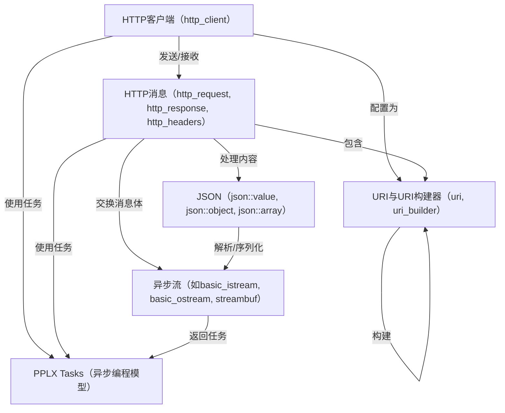
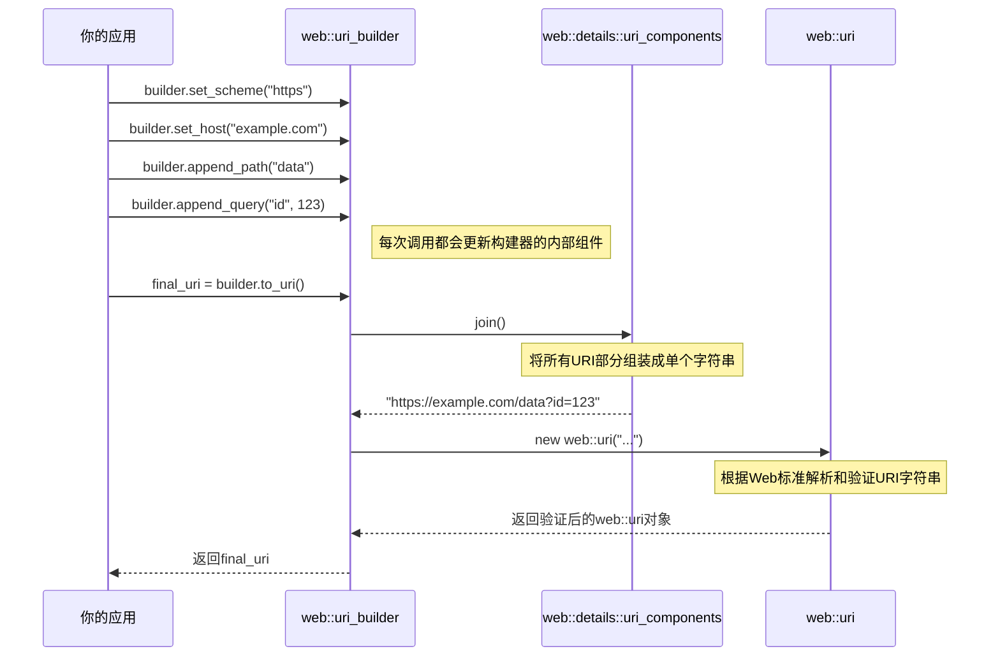

链接：[C++ Rest SDK: Namespace List](https://microsoft.github.io/cpprestsdk/namespaces.html)

[How to statically link the C++ REST SDK (Casablanca) | Katy's Code](https://katyscode.wordpress.com/2014/04/01/how-to-statically-link-the-c-rest-sdk-casablanca/)

# docs：cpprestsdk

`cpprestsdk`是一个强大的C++库，专为**异步网络通信**设计

它通过提供高级抽象来发送和接收*HTTP请求与响应*、解析*JSON数据*以及管理*URI*，使应用程序能够轻松连接并与Web服务交互。

其异步能力的核心在于==使用**PPLX Tasks**，允许程序在执行网络I/O时保持响应性==。

## 可视化



## 章节

1. [URI与URI构建器（`uri`, `uri_builder`）](01_uri_and_uri_builder___uri____uri_builder___.md)
2. [HTTP消息（`http_request`, `http_response`, `http_headers`）](02_http_messages___http_request____http_response____http_headers___.md)
3. [HTTP客户端（`http_client`）](03_http_client___http_client___.md)
4. [PPLX Tasks（异步编程模型）](04_pplx_tasks__asynchronous_programming_model__.md)
5. [JSON（`json::value`, `json::object`, `json::array`）](05_json___json__value____json__object____json__array___.md)
6. [异步流（如`basic_istream`, `basic_ostream`, `streambuf`）](06_asynchronous_streams__e_g____basic_istream____basic_ostream____streambuf___.md)

---

# 第1章：URI与URI构建器（`uri`，`uri_builder`）

欢迎来到`cpprestsdk`的第一章

在开始通过网络发送和接收数据之前，我们需要掌握如何标识网络资源的基本知识。就像寄信需要朋友的邮政地址一样，程序需要==网络地址==才能与在线服务通信。

在网络编程中，这些地址被称为==URI（统一资源标识符==）。

本章将介绍`cpprestsdk`的两个关键组件：表示有效网络地址的`uri`类，以及用于逐步构建和修改这些地址的强大工具`uri_builder`类。

## 问题：标识网络资源

假设正在构建一个简单的天气应用。为了获取特定城市的当前天气预报，应用需要向天气API（应用程序接口）发送请求。

这个API的地址可能是`https://api.weather.com/forecast`。但如果你想要"伦敦"未来"3天"的数据呢？你需要将这些细节添加到地址中，最终可能得到类似`https://api.weather.com/forecast?city=London&days=3`的地址。

手动构建这样的字符串很棘手。你必须记住：
1. **分隔部分**：==使用`?`开始查询，用`&`分隔查询参数==
2. **编码特殊字符**：如果城市名称包含空格（如"New York"），需要转换为"New%20York"才能成为有效的URI。这个过程称为URL编码

> 手动操作容易出错。这正是`cpprestsdk`的`uri`和`uri_builder`发挥作用的地方

## `uri`类：网络地址名片

将`web::uri`类视为网络资源的完整、完美格式化的"地址名片"。

一旦有了`uri`对象，它就符合网络标准且有效。可以轻松读取其不同部分，但创建后不能直接修改——它是不可变的。

让我们看看如何创建`uri`并检查其组成部分：

```cpp
#include <iostream>
#include "cpprest/uri.h" // 别忘了包含这个头文件

int main() {
    // 直接从字符串字面量创建URI
    // U()用于C++ REST SDK中的跨平台宽字符串字面量
    web::uri completed_uri(U("https://example.com/data?id=123&name=test"));
    
    // 打印完整URI
    std::wcout << L"完整URI: " << completed_uri.to_string() << std::endl;

    // 访问URI的各个组件
    std::wcout << L"协议: " << completed_uri.scheme() << std::endl; // 如"https"
    std::wcout << L"主机(服务器地址): " << completed_uri.host() << std::endl;   // 如"example.com"
    std::wcout << L"路径(特定资源): " << completed_uri.path() << std::endl;   // 如"/data"
    std::wcout << L"查询(参数): " << completed_uri.query() << std::endl; // 如"id=123&name=test"
    std::wcout << L"片段(内部引用): " << completed_uri.fragment() << std::endl; // 如""（本例中为空）

    return 0;
}
```

**输出：**
```
完整URI: https://example.com/data?id=123&name=test
协议: https
主机(服务器地址): example.com
路径(特定资源): /data
查询(参数): id=123&name=test
片段(内部引用): 
```

这段代码展示了如何立即将URI分解为其核心组件。==`uri`对象处理解析和验证==

## `uri_builder`类：URI构建工具包

`web::uri_builder`类是==逐步构建或修改URI==的首选工具。

就像有一套乐高积木来构建你的网络地址。你可以逐个添加协议、主机、路径段和查询参数等部分，构建器确保它们正确组合，包括处理必要的编码。

让我们用`uri_builder`构建我们的天气API示例：`https://api.weather.com/forecast?city=London&days=3`。

```cpp
#include <iostream>
#include "cpprest/uri_builder.h" // 这个头文件包含uri.h和uri_builder.h

int main() {
    // 从基础URI或空构建器开始
    web::uri_builder builder(U("https://api.weather.com"));

    // 添加路径段。append_path正确处理斜杠
    builder.append_path(U("forecast")); // 现在是"https://api.weather.com/forecast"
    
    // 添加查询参数。构建器自动处理编码
    // 这里U("London")没有特殊字符，编码为U("London")
    builder.append_query(U("city"), U("London")); 
    
    // 可以附加各种类型的查询，构建器将其转换为字符串并附加
    builder.append_query(U("days"), 3); // 3被转换为"3"并附加

    // 调用to_uri()或to_string()获取最终URI
    web::uri final_weather_uri = builder.to_uri();
    std::wcout << L"最终天气URI: " << final_weather_uri.to_string() << std::endl;

    // 查询参数包含空格的示例
    web::uri_builder search_builder(U("https://search.engine.com"));
    search_builder.append_path(U("query"));
    search_builder.append_query(U("q"), U("C++ REST SDK")); // "C++ REST SDK"变为"C%2B%2B%20REST%20SDK"
    std::wcout << L"搜索URI: " << search_builder.to_string() << std::endl;

    return 0;
}
```

**输出：**

```
最终天气URI: https://api.weather.com/forecast?city=London&days=3
搜索URI: https://search.engine.com/query?q=C%2B%2B%20REST%20SDK
```

注意`uri_builder`如何自动处理：
- 为路径添加第一个`/`（如果不存在）
- 为第一个查询参数添加`?`，为后续参数添加`&`
- 编码特殊字符如` `（空格）和`+`（加号）为`%20`和`%2B`，确保URI有效且能被Web服务器正确解析

这使得`uri_builder`在动态构建网络地址时非常方便，无需担心URI格式化和编码的细节。

## 幕后：`uri`和`uri_builder`的工作原理

让我们看看使用这些类时幕后发生了什么。

### `uri`的解析过程

当你从字符串创建`web::uri`对象时，它会执行详细的解析过程：

1. **接收字符串**：`uri`构造函数获取输入字符串（如`U("https://example.com/data?id=123")`）
2. **标识组件**：扫描字符串中的特殊字符如`:`、`//`、`?`、`#`，确定协议、主机、路径、查询和片段部分的起止位置
3. **验证**：每个标识的组件根据URI标准RFC 3986进行检查，确保语法正确。例如，协议必须以字母开头，某些字符只能在特定URI部分使用
4. **存储组件**：如果一切有效，这些组件存储在内部结构（特别是`web::details::uri_components`）中
5. **规范化**：可能会进行一些标准化操作，如将协议和主机转换为小写
6. **构建最终字符串**：URI被重新组装为其规范化字符串表示，即`to_string()`返回的内容

如果任何验证步骤失败，`uri`构造函数会抛出`uri_exception`，阻止创建无效的网络地址。

以下是`uri`构造函数内部逻辑的简化视图：

```cpp
// 简化自Release/src/uri/uri.cpp
uri::uri(const utility::char_t* uri_string) {
    // 解析URI字符串的内部助手
    details::inner_parse_out out;

    // 尝试将输入字符串分解为各个部分
    // 这涉及扫描分隔符和验证字符
    if (!out.parse_from(uri_string)) {
        // 如果解析失败（如无效字符或结构），抛出错误
        throw uri_exception("提供的uri无效: " + utility::conversions::to_utf8string(uri_string));
    }

    // 将解析的组件存储到'm_components'中
    out.write_to(m_components);
    // 将组件连接回最终的规范化字符串，存储在'm_uri'中
    m_uri = m_components.join();
}
```

### `uri_builder`的构建过程

`uri_builder`管理这些URI组件的可变版本。当你调用`set_host()`或`append_path()`等方法时，它会直接修改这些内部组件。当调用`to_uri()`或`to_string()`时，它会执行以下步骤：

1. **组合组件**：获取设置的所有部分（协议、主机、路径、查询、片段）
2. **编码**：对于需要编码的组件（如路径和查询），确保特殊字符（如空格、非ASCII字符）转换为百分号编码形式（如` `变为`%20`）
3. **委托给`uri`**：然后将这个组合并编码的字符串传递给`web::uri`构造函数。这意味着在最终URI返回给你之前，仍然会经过`uri`类的严格验证过程

这种委托确保从`uri_builder`获得的任何URI始终是有效的`web::uri`对象。

以下是构建URI时的序列图：



以及`uri_builder`中`append_path`的简化工作原理：

```cpp
// 简化自Release/src/uri/uri_builder.cpp
uri_builder& uri_builder::append_path(const utility::string_t& toAppend, bool do_encode) {
    // 获取内部组件结构中存储的路径组件的引用
    auto& current_path = m_uri.m_path; 
    
    // 智能添加斜杠的逻辑（如避免"//"这样的双斜杠）
    // ...

    if (do_encode) {
        // 如果需要编码，调用uri::encode_uri安全转换字符
        current_path.append(uri::encode_uri(toAppend, uri::components::path));
    } else {
        // 否则直接附加字符串
        current_path.append(toAppend);
    }
    return *this; // 返回引用以允许链式调用
}
```

`do_encode`参数至关重要。对于大多数用户提供的数据，你会希望`do_encode`为`true`（通常是`append_query`和其他设置器的默认值），这样`cpprestsdk`就能将空格、&符号或非ASCII字符等特殊字符正确转换为`%XX`格式。

## 总结

本章探讨了`cpprestsdk`中URI的基础概念：

| 特性         | `web::uri`                                                   | `web::uri_builder`                                           |
| :----------- | :----------------------------------------------------------- | :----------------------------------------------------------- |
| **目的**     | 表示完整、有效且不可变的网络地址                             | 逐步构建或修改URI的工具                                      |
| **可变性**   | 创建后只读（不可变）                                         | 可变；可以更改其组件                                         |
| **创建方式** | 从字符串创建（无效时抛出异常）                               | 从现有`uri`或空构建器创建                                    |
| **关键方法** | `scheme()`, `host()`, `path()`, `query()`, `to_string()`, `validate()` | `set_scheme()`, `append_path()`, `append_query()`, `to_uri()`, `to_string()` |
| **编码**     | 在访问组件进行比较时执行解码                                 | 在构建时处理组件的编码                                       |

理解如何==正确构建和管理URI（统一资源标识符==）是网络通信的第一个关键步骤。

现在知道了如何==精确定位互联网上的资源==，下一步是学习如何==打包和向该地址发送消息==。

在[下一章](02_http_messages___http_request____http_response____http_headers___.md)中，我们将深入探讨HTTP消息，特别是`http_request`和`http_response`，这些是你与Web服务通信时实际发送和接收的"信件"！

