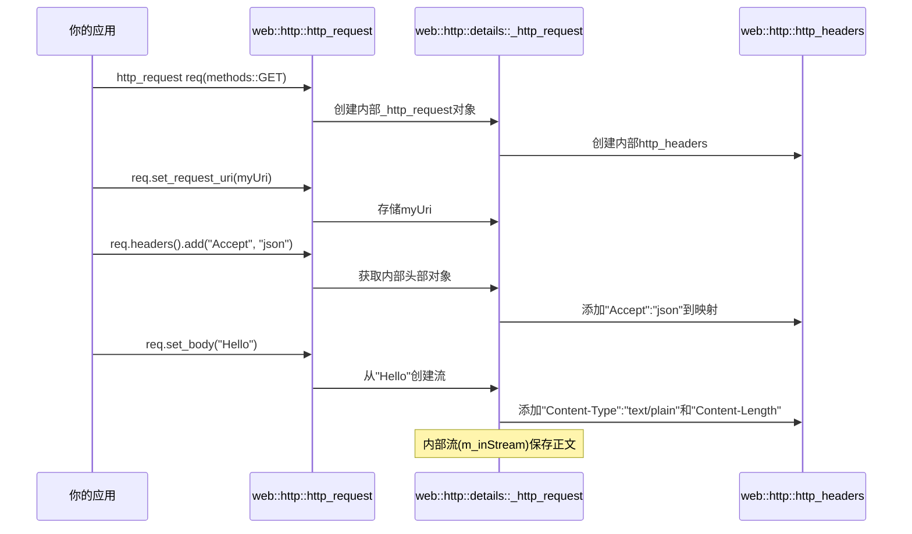

# 第2章：HTTP消息（`http_request`，`http_response`，`http_headers`）

欢迎回来

在[第1章：URI与URI构建器（`uri`，`uri_builder`）](01_uri_and_uri_builder___uri____uri_builder___.md)中，我们学习了如何使用`uri`和`uri_builder`精确定位互联网上的资源

可以将==URI想象成信封上写的邮政地址==。但信封里的*信件*或==包裹==是什么？如何告诉邮局（Web服务器）想发送什么或期望什么样的回复？

这正是HTTP消息的作用

在`cpprestsdk`中，`http_request`、`http_response`和`http_headers`类代表了这些网络通信的基本组成部分。本章将介绍这些关键组件，展示如何==构建发送的请求以及如何解析收到的响应==。

## 问题：封装网络通信

再次想象我们的天气应用。我们知道获取伦敦天气预报的URI：`https://api.weather.com/forecast?city=London&days=3`。这是我们的目标地址。但仅仅有地址是不够的。我们需要告诉天气服务器：

1. **我们想做什么**：是*获取*数据？*发送*新数据？*删除*某些内容？（这是**HTTP方法**）。对于天气数据，我们通常使用==GET==。
2. **任何特殊指令**：我们是否偏好特定语言的响应？接受什么格式？（这些是**HTTP头部**）
3. **我们发送的数据**：如果我们要向数据库添加新城市，会在消息主体（**HTTP正文**）中包含该城市的详细信息。

当天气服务器回复时，它也会发送一个HTTP消息。我们需要能够：

1. **检查是否成功**：请求是否成功，或者是否有错误？（这是**HTTP状态码**）。
2. **理解回复**：服务器返回了什么？例如天气预报数据本身（这是**HTTP正文**）。
3. **读取额外信息**：天气预报是什么格式的？何时生成的？（更多**HTTP头部**）。

`cpprestsdk`提供了`http_request`、`http_response`和`http_headers`类来优雅地管理所有这些细节

## `http_request`：发送消息

`web::http::http_request`类表示从你的应用程序发送到Web服务器的消息。它包含了服务器理解你需求所需的一切。

### `http_request`的关键部分

*   **方法**：想执行的操作（例如`GET`、`POST`、`PUT`、`DELETE`）。`cpprestsdk`在`web::http::methods`中提供了这些常量。
*   **URI**：目标资源的地址（我们在第1章学过！）。
*   **头部**：关于请求的元数据，如内容类型、接受的语言等。
*   **正文**：你发送的实际数据负载（例如JSON数据、文件）。

让我们为天气示例创建一个简单的GET请求：

```cpp
#include "cpprest/http_msg.h" // 包含http_request, http_response, http_headers
#include "cpprest/uri.h"      // 来自第1章
#include <iostream>

int main() {
    // 1. 为天气预报创建URI
    web::uri weather_uri(U("https://api.weather.com/forecast?city=London&days=3"));

    // 2. 用GET方法创建HTTP请求对象
    // cpprestsdk提供了预定义方法如methods::GET, methods::POST等
    web::http::http_request request(web::http::methods::GET);

    // 3. 为请求设置URI
    request.set_request_uri(weather_uri);

    // 现在，看看我们的请求是什么样子的（用于调试）
    std::wcout << L"我们的请求:\n" << request.to_string() << std::endl;

    return 0;
}
```

**输出：**
```
我们的请求:
GET https://api.weather.com/forecast?city=London&days=3 HTTP/1.1

```

在这段代码中：
- `web::http::methods::GET`是表示GET HTTP方法的常量
- `request.set_request_uri(weather_uri)`将目标地址分配给我们的请求
- `request.to_string()`是获取请求字符串表示的便捷方式，非常适合调试

### 为`http_request`添加正文

并非所有请求都有正文。`GET`请求通常没有。但用于发送新数据（如提交表单）的`POST`请求几乎总是有正文。

以下是一个创建带有简单字符串正文的`POST`请求的示例：

```cpp
#include "cpprest/http_msg.h"
#include "cpprest/uri.h"
#include <iostream>

int main() {
    web::uri api_uri(U("https://api.example.com/users"));

    // 创建POST请求
    web::http::http_request post_request(web::http::methods::POST);
    post_request.set_request_uri(api_uri);

    // 设置简单的字符串正文。cpprestsdk自动将Content-Type设置为text/plain
    post_request.set_body(U("username=Alice&email=alice@example.com"));

    std::wcout << L"我们的POST请求:\n" << post_request.to_string() << std::endl;

    return 0;
}
```

**输出：**
```
我们的POST请求:
POST https://api.example.com/users HTTP/1.1
Content-Type: text/plain; charset=utf-8
Content-Length: 35

username=Alice&email=alice@example.com
```

注意`cpprestsdk`在我们调用`set_body`时自动添加了`Content-Type`头部和`Content-Length`头部

这是`cpprestsdk`提供的众多便利之一。接下来我们将更详细地了解这些头部。

## `http_headers`：消息的信封备注

`http_request`和`http_response`对象都有一个`http_headers`成员。这个类充当HTTP头部字段的键值存储。头部提供了关于消息的重要元数据，例如：

*   `Content-Type`：正文中数据的类型（例如`application/json`、`text/html`）。
*   `Authorization`：访问受保护资源的凭据。
*   `User-Agent`：关于发起请求的客户端的信息。
*   `Accept`：客户端在响应中偏好的数据格式。
*   `Content-Length`：消息正文的大小（以字节为单位）。

`http_headers`类处理大小写（`Content-Type`和`content-type`在内部被视为相同），并允许你添加、删除和检索头部值。

### 操作头部

让我们为天气请求添加一些自定义头部：

```cpp
#include "cpprest/http_msg.h"
#include "cpprest/uri.h"
#include <iostream>

int main() {
    web::uri weather_uri(U("https://api.weather.com/forecast?city=London&days=3"));
    web::http::http_request request(web::http::methods::GET);
    request.set_request_uri(weather_uri);

    // 获取请求头部的引用
    web::http::http_headers& headers = request.headers();

    // 添加一些头部
    headers.add(U("Accept"), U("application/json")); // 我们偏好JSON数据
    headers.add(U("X-Custom-App-Id"), U("myWeatherApp123")); // 自定义头部

    // 也可以用[]操作符设置，但'add'对多值头部更安全
    headers[web::http::header_names::accept_language] = U("en-US,en;q=0.9"); 
    // ^ header_names提供了常见头部的常量

    std::wcout << L"带自定义头部的请求:\n" << request.to_string() << std::endl;

    // 检索头部值
    utility::string_t accept_header;
    if (headers.match(U("Accept"), accept_header)) { // match()是安全的检索方式
        std::wcout << L"请求的Accept类型: " << accept_header << std::endl;
    }

    return 0;
}
```

**输出：**
```
带自定义头部的请求:
GET https://api.weather.com/forecast?city=London&days=3 HTTP/1.1
Accept: application/json
Accept-Language: en-US,en;q=0.9
X-Custom-App-Id: myWeatherApp123

请求的Accept类型: application/json
```

`http_headers`的关键点：
- `request.headers()`给你一个可变的头部引用。
- `headers.add(key, value)`添加一个头部。如果头部已存在，通常会追加新值并用逗号分隔（例如`Accept`头部）。
- `headers[key] = value`设置一个头部，覆盖任何先前的值。
- `headers.match(key, output_value)`是检索头部值的首选方式，安全地检查是否存在。
- `web::http::header_names`提供了常见HTTP头部名称的常量，避免拼写错误。

## `http_response`：你的接收回复

`web::http::http_response`类表示你从Web服务器收到的回复消息。它告诉你发生了什么，并提供请求的数据。

### `http_response`的关键部分

*   **状态码**：表示结果的数字代码（例如`200`表示OK，`404`表示未找到）。`cpprestsdk`在`web::http::status_codes`中提供了这些常量。
*   **原因短语**：状态码的简短、人类可读描述（例如"OK"对应200）。
*   **头部**：关于响应的元数据（例如`Content-Type`、`Date`、`Server`）。
*   **正文**：服务器返回的实际数据负载（例如天气预报JSON）。

由于我们尚未介绍发送请求（这是[第3章：HTTP客户端（`http_client`）](03_http_client___http_client___.md)的内容！），我们将创建一个模拟的`http_response`来演示如何检查其部分内容。

```cpp
#include "cpprest/http_msg.h"
#include <iostream>
#include <vector>

int main() {
    // 1. 模拟天气服务器的响应
    // 创建一个状态码为200 OK的响应
    web::http::http_response response(web::http::status_codes::OK);

    // 2. 为模拟响应设置一些头部
    response.headers().add(U("Content-Type"), U("application/json"));
    response.headers().add(U("Server"), U("WeatherAPI/1.0"));

    // 3. 为模拟响应设置JSON正文
    utility::string_t json_body_str = U(R"({"city": "London", "temperature": "15C", "conditions": "Cloudy"})");
    response.set_body(json_body_str, U("application/json")); // 显式指定内容类型

    // 现在，检查响应
    std::wcout << L"模拟响应:\n" << response.to_string() << std::endl;

    // 访问状态码和原因短语
    std::wcout << L"状态码: " << response.status_code() << std::endl;
    std::wcout << L"原因短语: " << response.reason_phrase() << std::endl; // 默认为"OK"对应200

    // 访问头部
    utility::string_t content_type_header;
    if (response.headers().match(U("Content-Type"), content_type_header)) {
        std::wcout << L"响应Content-Type: " << content_type_header << std::endl;
    }

    // 访问正文（返回一个任务，将在第4章介绍）
    // 现在，我们阻塞以立即获取结果用于演示
    utility::string_t body_content = response.extract_string().get();
    std::wcout << L"响应正文:\n" << body_content << std::endl;

    return 0;
}
```

**输出：**
```
模拟响应:
HTTP/1.1 200 OK
Content-Type: application/json
Content-Length: 68
Server: WeatherAPI/1.0

{"city": "London", "temperature": "15C", "conditions": "Cloudy"}
状态码: 200
原因短语: OK
响应Content-Type: application/json
响应正文:
{"city": "London", "temperature": "15C", "conditions": "Cloudy"}
```

这里我们看到：
- `web::http::status_codes::OK`是200状态码的常量。
- `response.status_code()`和`response.reason_phrase()`给你基本结果。
- `response.headers().match()`与`http_request`中的用法相同。
- `response.extract_string().get()`是你将正文作为字符串检索的方式。`.get()`部分同步等待正文完全可用（更多关于任务的内容在[第4章：PPLX任务（异步编程模型）](04_pplx_tasks__asynchronous_programming_model__.md)）。`cpprestsdk`还提供了`extract_json()`和`extract_vector()`用于不同的正文类型。

## 幕后：HTTP消息的工作原理

`http_request`和`http_response`的核心是围绕内部实现类（如`_http_request`和`_http_response`）的轻量级包装器。这些内部类保存URI、方法、状态码、原因短语的实际数据成员，以及重要的`http_headers`对象和消息正文流。

### 创建`http_request`

当你创建`http_request`对象时：

1. **对象创建**：`web::http::http_request request(web::http::methods::GET);`
   - 这个构造函数实际上在堆上分配了一个内部的`details::_http_request`对象，使用`std::shared_ptr`。所有核心数据（方法、URI、头部、正文流）都存储在这个内部对象中。
   - HTTP方法（`GET`）直接存储。
   - 创建一个空的`http_headers`对象并与请求关联。
2. **设置URI**：`request.set_request_uri(weather_uri);`
   - `uri`对象（来自第1章）简单地存储在内部的`_http_request`结构中。
3. **添加头部**：`request.headers().add(U("Accept"), U("application/json"));`
   - `headers()`方法返回内部`http_headers`对象的引用。
   - 当调用`add()`时，头部名称和值存储在`http_headers`对象内部的`std::map`中。这个映射使用特殊的比较器来处理头部名称的大小写不敏感（例如"Content-Type"和"content-type"被视为相同头部）。
4. **设置正文**：`request.set_body(U("..."));`
   - 字符串数据被转换为异步流（`concurrency::streams::istream`）。
   - 然后将这个流设置为`_http_request`对象的内部正文流（`m_inStream`）。
   - 关键的是，`Content-Type`和`Content-Length`头部会根据正文内容自动添加/更新到`http_headers`对象中。

以下是事件的简化序列：



### 简化的`http_headers::add`

`add`方法是一个模板函数，可以接受各种类型的值。它将值转换为字符串并存储，如果头部已存在则处理连接。

```cpp
// 简化自Release/include/cpprest/http_headers.h
class http_headers
{
private:
    // 头部存储在键不区分大小写的映射中
    typedef std::map<utility::string_t, utility::string_t, _case_insensitive_cmp> inner_container;
    inner_container m_headers;

public:
    template<typename _t1>
    void add(const key_type& name, const _t1& value)
    {
        // 将值（如int, string）转换为string_t
        auto printedValue = utility::conversions::details::print_string(value);
        auto& mapVal = m_headers[name]; // 访问或创建映射中的条目

        if (mapVal.empty())
        {
            mapVal = std::move(printedValue); // 如果是新的，直接存储
        }
        else
        {
            // 如果已存在，用逗号追加（某些头部的标准）
            mapVal.append(_XPLATSTR(", ")).append(std::move(printedValue));
        }
    }
    // ... 其他方法
};
```

这段代码展示了`http_headers`如何在内部使用`std::map`。`_case_insensitive_cmp`结构确保"Accept"和"accept"被视为相同的键，使头部处理更加健壮。

### 简化的`http_request::to_string`

`to_string`方法是调试的便捷方式。它组装请求行，然后调用基类`http_msg_base::to_string()`添加头部和正文。

```cpp
// 简化自Release/src/http/client/http_client_msg.cpp
utility::string_t details::_http_request::to_string() const
{
    utility::string_t result(m_method); // 以HTTP方法开始（如"GET"）
    result += _XPLATSTR(' ');           // 添加空格

    // 追加URI
    if (this->m_uri.is_empty())
    {
        result += _XPLATSTR('/'); // 如果URI为空，默认为"/"
    }
    else
    {
        result += this->m_uri.to_string(); // 追加URI字符串
    }

    result += _XPLATSTR(" HTTP/1.1\r\n"); // 添加HTTP版本和换行
    result += http_msg_base::to_string(); // 追加扁平化的头部和正文
    return result;
}
```

这说明了`to_string`如何简单地将HTTP消息的各个部分连接成标准字符串格式。

## 总结

在本章中，我们通过探索`cpprestsdk`中的核心消息类型，为HTTP通信奠定了基础：

| 特性         | `web::http::http_request`                      | `web::http::http_response`                                   | `web::http::http_headers`                             |
| :----------- | :--------------------------------------------- | :----------------------------------------------------------- | :---------------------------------------------------- |
| **目的**     | 发送到服务器的消息                             | 从服务器接收的消息                                           | 任一消息的元数据（键值对）                            |
| **关键内容** | 方法、URI、头部、正文                          | 状态码、原因短语、头部、正文                                 | `std::string_t`键值对的集合                           |
| **创建方式** | `http_request(method)`                         | `http_response(status_code)`                                 | 通过`request.headers()`或`response.headers()`访问     |
| **常见操作** | `set_request_uri()`, `set_body()`, `headers()` | `status_code()`, `reason_phrase()`, `extract_string()`, `headers()` | `add(key, value)`, `match(key, &value)`, `operator[]` |
| **类比**     | 你发送的带有指令的信件/包裹                    | 你收到的回复信件/包裹                                        | 信封或运输标签上的备注                                |

现在知道如何构建准备发送的`http_request`以及如何准备解析`http_response`。可以指定方法、目标URI、正文内容，并为请求和响应自定义头部。

理解如何==构建HTTP消息==至关重要，但这些消息不会自己神奇地在互联网上传输！在[下一章](03_http_client___http_client___.md)中，我们将介绍`http_client`类，这是你==实际发送==这些`http_request`对象并从==Web服务接收==`http_response`对象的主要工具。准备好发起你的第一个网络调用吧~

