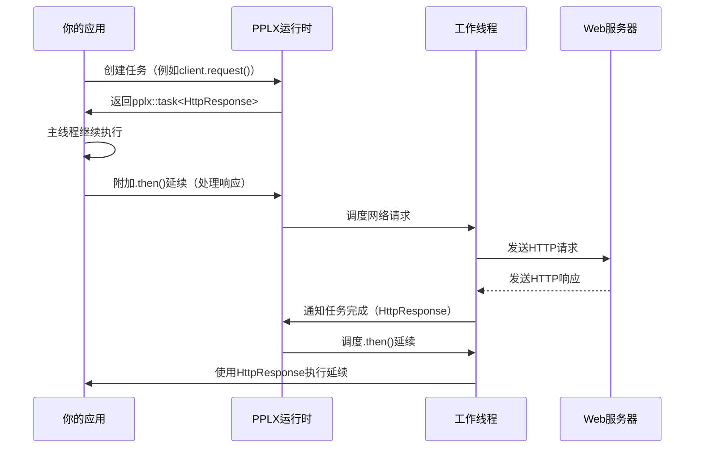

# 第4章：PPLX任务（异步编程模型）

欢迎回来

在[第3章：HTTP客户端（`http_client`）](03_http_client___http_client___.md)中，我们学习了如何使用`http_client`发送`http_request`消息并从Web服务器接收`http_response`消息。你可能注意到，在我们的示例中，我们在调用`client.request()`或`response.extract_string()`后使用了`.get()`。虽然`.get()`能快速获取结果，但它有一个显著的缺点：它会*阻塞*你的程序。

想象一下，你正在尝试获取天气数据，而网络连接很慢。如果你使用`.get()`，你的整个应用程序会冻结，变得无响应，直到天气数据最终到达。这对于现代、用户友好的应用程序来说并不理想！

这就是**PPLX任务**的用武之地。PPLX（Parallel Patterns Library Extensions）是`cpprestsdk`强大的异步编程模型。它允许你的程序启动一个长时间运行的操作（如网络请求），然后在该操作进行时*继续做其他事情*。当操作完成时，你的程序会收到通知，你可以处理结果。

## 问题：保持应用程序的响应性

想象一下在繁忙的餐厅点餐的场景。

**场景1：阻塞（使用`.get()`）**
你点了餐。服务员说：“好的，在这里等着。不要动，不要和任何人说话，就盯着厨房门，直到你的食物准备好。”你必须站在那里，无所事事，直到食物送达。如果厨房很慢，你就被困住了！

**场景2：异步（使用PPLX任务）**
你点了餐。服务员说：“这是你的订单号。去你的桌子放松一下，和朋友聊天，看看手机。食物准备好了我会送过来。”你可以继续其他活动，服务员（或厨房）会在后台处理你的订单。当食物准备好时，服务员会送过来，然后你可以享用。

在`cpprestsdk`中，那个“订单号”就是一个`pplx::task`对象。`http_client::request()`方法不会立即给你`http_response`，而是给你一个`pplx::task<http_response>`。这个任务是一个“承诺”，表示`http_response`将在未来的某个时间点可用。

## 介绍`pplx::task`：你的异步“订单号”

`pplx::task<T>`是一个表示异步操作未来结果的对象。`T`是结果的类型（例如`http_response`、`int`、`void`）。

关于`pplx::task`的关键点：

*   **未来结果**：它不会立即持有结果，而是承诺最终会有结果。
*   **非阻塞**：你可以获取一个`pplx::task`并继续运行其他代码。
*   **完成状态**：一个任务可以是：
    *   **运行中**：操作仍在进行。
    *   **已完成**：操作成功完成，结果可用。
    *   **失败**：操作失败（例如网络错误），并发生异常。
    *   **已取消**：操作被提前停止。

让我们回顾一下[第3章](03_http_client___http_client___.md)中的天气请求，但现在我们将专注于如何在不立即阻塞的情况下处理`pplx::task`。

### 创建和等待任务（目前仍使用阻塞方式）

你可以通过多种方式创建任务。`client.request()`返回一个任务，但你也可以从函数或已知结果中创建任务。

```cpp
#include "cpprest/http_client.h"
#include "cpprest/uri.h"
#include "cpprest/http_msg.h"
#include <iostream>
#include <string> // 用于utility::string_t

int main() {
    // 1. 直接从lambda函数创建任务
    // 这个任务将计算10 + 20
    pplx::task<int> calculation_task = pplx::create_task([]() {
        std::wcout << L"在后台任务中计算..." << std::endl;
        // 模拟一些工作
        std::this_thread::sleep_for(std::chrono::milliseconds(500)); 
        return 10 + 20;
    });

    std::wcout << L"主线程在计算任务运行时继续执行。" << std::endl;

    // 2. 等待任务完成并获取其结果（阻塞）
    // 目前我们仍使用.get()来演示结果获取。
    // 稍后我们将学习使用.then()的非阻塞方式！
    int result = calculation_task.get();
    std::wcout << L"计算任务完成。结果: " << result << std::endl;

    // 3. 从已知结果创建任务
    pplx::task<utility::string_t> greeting_task = pplx::task_from_result(U("你好，PPLX！"));
    
    // 这个任务已经完成，所以.get()是即时的。
    utility::string_t greeting = greeting_task.get();
    std::wcout << L"预完成任务的结果: " << greeting << std::endl;

    return 0;
}
```

**输出：**
```
主线程在计算任务运行时继续执行。
在后台任务中计算...
计算任务完成。结果: 30
预完成任务的结果: 你好，PPLX！
```

在这个例子中：
*   `pplx::create_task()`接受一个函数（这里是一个lambda）并在后台线程中运行它。它立即返回一个`pplx::task`对象。
*   `main`线程在计算完成之前打印其消息，展示了非阻塞的启动。
*   `calculation_task.get()`然后*阻塞*`main`线程，直到后台计算完成并返回其结果。
*   `pplx::task_from_result()`创建一个*已经完成*的任务，其`.get()`调用是即时的。

虽然`.get()`很简单，但如果立即在长时间运行的任务后使用，它会破坏异步编程的目的。真正的威力在于**延续**。

## `pplx::task::then()`：链式异步操作

`then()`方法是PPLX异步编程的基石。它允许你指定在任务完成后应该运行的代码，而不会阻塞当前线程。这个“链式”代码称为**延续**。

想象一下告诉服务员：“当我的食物准备好（任务完成）时，*然后*请给我账单（运行这个延续）。”

`then()`方法也返回一个新的`pplx::task`，表示延续本身的结果。这允许你将多个操作链接在一起！

让我们使用`then()`使我们的天气请求真正异步：

```cpp
#include "cpprest/http_client.h"
#include "cpprest/uri.h"
#include "cpprest/http_msg.h"
#include <iostream>
#include <string> // 用于utility::string_t

int main() {
    web::uri base_api_uri(U("https://api.weather.com"));
    web::http::client::http_client client(base_api_uri);

    web::uri_builder uri_path_builder(U("/forecast"));
    uri_path_builder.append_query(U("city"), U("London"));
    uri_path_builder.append_query(U("days"), 3);

    web::http::http_request request(web::http::methods::GET);
    request.set_request_uri(uri_path_builder.to_uri());

    std::wcout << L"异步发送请求..." << std::endl;

    // 启动异步请求。这会返回一个任务。
    client.request(request)
        // .then()接受一个lambda函数，当请求任务完成时运行。
        // lambda接收http_response对象作为参数。
        .then([](web::http::http_response response) {
            std::wcout << L"收到响应（在延续线程中）！" << std::endl;
            std::wcout << L"状态码: " << response.status_code() << std::endl;

            // 在这个延续中，我们启动另一个异步操作：
            // 提取正文字符串。这也返回一个任务。
            return response.extract_string();
        })
        // 链接另一个.then()来处理extract_string()的结果。
        // 这个lambda接收正文字符串作为参数。
        .then([](utility::string_t body) {
            std::wcout << L"正文提取完成（在另一个延续线程中）！" << std::endl;
            std::wcout << L"响应正文:\n" << body << std::endl;
        })
        // 添加一个.then()用于错误处理（失败的任务）
        .then([](pplx::task<void> previous_task) {
            try {
                previous_task.get(); // 检查前一个任务是否失败
            } catch (const web::http::http_exception& e) {
                std::wcout << L"捕获到HTTP异常: " << e.what() << std::endl;
            } catch (const std::exception& e) {
                std::wcout << L"捕获到一般异常: " << e.what() << std::endl;
            }
        });
    
    std::wcout << L"主线程在网络操作进行时可以自由处理其他工作。" << std::endl;
    std::wcout << L"按回车键退出..." << std::endl;
    std::getchar(); // 保持控制台打开以查看异步输出

    return 0;
}
```

**高级输出（“主线程”和“收到响应”的顺序可能不同）：**
```
异步发送请求...
主线程在网络操作进行时可以自由处理其他工作。
按回车键退出...
收到响应（在延续线程中）！
状态码: 200
正文提取完成（在另一个延续线程中）！
响应正文:
{"city":"London","forecast":[{"day":"Today","temp":"15C","conditions":"Cloudy"}]}
```
（天气数据的实际输出取决于`https://api.weather.com`是否是一个真实的API。）

注意`main`线程的输出出现在“收到响应”消息之前，因为`client.request()`返回了一个任务，而`then()`安排其工作在*稍后*执行。这就是非阻塞异步编程的精髓！

### 理解带返回值的`then()`

*   如果你的`.then()` lambda返回`void`（如示例中的最后两个），链中的下一个`then()`将接收一个`pplx::task<void>`。
*   如果你的`.then()` lambda返回一个值（例如`utility::string_t`），链中的下一个`then()`将接收一个`pplx::task<utility::string_t>`。
*   如果你的`.then()` lambda返回一个`pplx::task<T>`（如`response.extract_string()`），PPLX会自动“解包”它，因此链中的*下一个*`then()`直接接收`T`，而不是嵌套的任务。这使得链式调用非常简洁！

## `pplx::task_completion_event`：手动控制任务完成

有时，你想创建一个`pplx::task`，其完成由你手动控制，而不是绑定到函数或网络操作。这就是`pplx::task_completion_event<T>`（TCE）的用武之地。

你可以从TCE创建一个`pplx::task`。稍后，你可以手动`set()`其结果，`set_exception()`或`set_task_canceled()`，这将完成关联的任务并触发任何`then()`延续。

```cpp
#include "cpprest/pplx/pplxtasks.h" // 用于pplx::task和pplx::task_completion_event
#include <iostream>
#include <thread>
#include <chrono>

int main() {
    // 1. 创建一个任务完成事件
    pplx::task_completion_event<int> tce;

    // 2. 创建一个将由TCE完成的任务
    pplx::task<int> controlled_task(tce);

    // 3. 启动一个后台线程，最终设置TCE
    std::thread background_worker([tce]() {
        std::wcout << L"后台工作线程正在处理一些长时间任务..." << std::endl;
        std::this_thread::sleep_for(std::chrono::seconds(2)); // 模拟工作
        std::wcout << L"后台工作线程完成，设置TCE为42。" << std::endl;
        tce.set(42); // 手动完成任务，结果为42
    });

    std::wcout << L"主线程继续，通过.then()等待controlled_task。" << std::endl;

    // 4. 为controlled_task附加一个延续
    controlled_task.then([](int result) {
        std::wcout << L"受控任务完成，结果: " << result << std::endl;
    });

    // 加入后台线程以确保其完成（对程序退出很重要）
    background_worker.join(); 

    std::wcout << L"主线程完成其他工作。按回车键退出。" << std::endl;
    std::getchar(); 

    return 0;
}
```

**输出：**
```
主线程继续，通过.then()等待controlled_task。
后台工作线程正在处理一些长时间任务...
主线程完成其他工作。按回车键退出。
后台工作线程完成，设置TCE为42。
受控任务完成，结果: 42
```
（“主线程完成...”和“后台工作线程完成...”的顺序可能不同。）

在这里，`controlled_task`只有在`background_worker`线程调用`tce.set(42)`时才会完成，展示了手动控制任务生命周期的能力。

## `pplx::cancellation_token`：改变主意

`pplx::cancellation_token`是一种向任务发出信号的方式，告诉它们应该停止正在进行的操作。就像告诉服务员：“实际上，我改变主意了，取消那个订单！”

你创建一个`pplx::cancellation_token_source`来管理令牌，然后将令牌传递给任务。稍后，你可以在源上调用`cancel()`来发出取消信号。任务可以检查`token.is_canceled()`或注册回调。

```cpp
#include "cpprest/pplx/pplxtasks.h"
#include <iostream>
#include <thread>
#include <chrono>

int main() {
    pplx::cancellation_token_source cts; // 管理取消
    pplx::cancellation_token token = cts.get_token(); // 传递给任务的令牌

    pplx::task<void> long_running_task = pplx::create_task([token]() {
        for (int i = 0; i < 5; ++i) {
            if (token.is_canceled()) { // 检查是否请求取消
                std::wcout << L"任务: 请求取消，提前停止！" << std::endl;
                // 如果你想传播取消，抛出task_canceled
                throw pplx::task_canceled(); 
            }
            std::wcout << L"任务: 仍在工作... (" << i+1 << "/5)" << std::endl;
            std::this_thread::sleep_for(std::chrono::milliseconds(500));
        }
        std::wcout << L"任务: 未取消完成。" << std::endl;
    }, token); // 将令牌传递给任务的创建

    std::wcout << L"主线程: 启动一个长时间运行的任务。" << std::endl;
    std::this_thread::sleep_for(std::chrono::seconds(1)); // 让任务运行一会儿

    std::wcout << L"主线程: 请求取消！" << std::endl;
    cts.cancel(); // 发出取消信号

    try {
        long_running_task.get(); // 等待并观察可能的取消异常
    } catch (const pplx::task_canceled& e) {
        std::wcout << L"主线程: 捕获到task_canceled异常。" << std::endl;
    }

    std::wcout << L"主线程: 完成。按回车键退出。" << std::endl;
    std::getchar();

    return 0;
}
```

**输出（近似）：**
```
主线程: 启动一个长时间运行的任务。
任务: 仍在工作... (1/5)
任务: 仍在工作... (2/5)
主线程: 请求取消！
任务: 请求取消，提前停止！
主线程: 捕获到task_canceled异常。
主线程: 完成。按回车键退出。
```

## 幕后：PPLX任务的工作原理

PPLX任务建立在管理线程和延续的复杂运行时之上。

### 高级概述

1.  **任务创建**：当你调用`pplx::create_task()`或`client.request()`时，PPLX创建一个任务的内部表示（一个“任务对象”）。这个对象存储了要执行的计算的信息、其当前状态（运行中、已完成等）以及任何附加的延续。
2.  **调度**：实际的计算（你的lambda或HTTP请求）通常提交给PPLX运行时管理的线程池。这意味着它将在单独的线程上运行，释放你的调用线程。
3.  **返回`pplx::task`**：`create_task()`或`request()`调用立即返回一个`pplx::task`对象给你的代码。这个对象本质上是内部任务对象的轻量级句柄。
4.  **附加延续**：当你调用`.then()`时，PPLX将你的延续lambda注册到内部任务对象。它不会立即运行它。
5.  **任务完成**：当后台计算完成（无论是成功、异常还是取消）：
    *   更新内部任务对象的状态。
    *   PPLX的调度器识别为此任务注册的所有延续。
    *   然后将每个延续提交给线程池执行。
6.  **链式调用**：如果一个延续本身返回一个任务，PPLX会自动将其与原始链“链接”，确保后续的`.then()`调用正确连接。

以下是简化的序列图：



### 深入PPLX代码（简化）

PPLX是一个复杂的库，但我们可以查看其简化部分以理解其核心。其核心依赖于`scheduler_interface`来决定*在哪里*运行实际工作。

#### `get_ambient_scheduler`和`schedule`

当你使用`pplx::create_task()`创建任务时，PPLX使用“环境调度器”来执行工作。这个调度器负责将你的函数放在后台线程上。

来自`Release/src/pplx/pplx.cpp`和`Release/include/pplx/pplxinterface.h`（简化）：

```cpp
// 简化自Release/include/pplx/pplxinterface.h
// 这是PPLX使用的任何调度器的接口。
struct scheduler_interface
{
    // 核心方法：接受一个函数指针和数据，并调度其执行。
    virtual void schedule(TaskProc_t proc, _In_ void* param) = 0;
};

// 简化自Release/src/pplx/pplx.cpp
// 这是PPLX获取默认调度器的方式。
_PPLXIMP std::shared_ptr<pplx::scheduler_interface> _pplx_cdecl get_ambient_scheduler()
{
    // ... 检索或创建默认调度器（例如线程池）的逻辑 ...
    return default_scheduler_instance;
}
```

`create_task`然后使用这个调度器。例如，`linux_scheduler`可能在内部使用`boost::asio::thread_pool`：

来自`Release/src/pplx/pplxlinux.cpp`（简化）：

```cpp
// 简化自Release/src/pplx/pplxlinux.cpp
_PPLXIMP void linux_scheduler::schedule(TaskProc_t proc, void* param)
{
    // 将任务提交到共享线程池，在后台线程上运行。
    crossplat::threadpool::shared_instance().service().post(boost::bind(proc, param));
}
```

这意味着当你调用`pplx::create_task([](){ ... });`时，你的lambda被包装成一个`TaskProc_t`并交给这个`schedule`方法，然后将其交给线程池进行异步执行。

#### `pplx::task_completion_event`内部

`pplx::task_completion_event`在内部保存了一个状态，关联的`pplx::task`可以查询。当你在TCE上调用`set()`时，它会更新这个共享状态，进而导致`pplx::task`转换为完成状态并触发其延续。

来自`Release/include/pplx/pplxtasks.h`（非常简化）：

```cpp
// 非常简化的TCE和Task如何链接的视图
namespace pplx {
namespace details {
    // 保存结果或异常的内部状态对象
    template<typename _ResultType>
    class _Task_impl {
        // ... 内部状态（例如enum _State { _Empty, _Completed, _Faulted, _Canceled }）
        // ... 如果完成，存储_ResultType
        // ... 附加的延续列表
    public:
        // TCE调用的方法来设置结果
        void _Set_result(_ResultType val) {
            // 更新状态为_Completed
            // 存储val
            // 调度所有延续
        }
        // ... 其他设置异常、取消的方法
    };
} // namespace details

template<typename _ResultType>
class task_completion_event {
    // 指向内部任务实现的共享指针，允许多个任务/TCE
    // 指向相同的状态。
    std::shared_ptr<details::_Task_impl<_ResultType>> m_impl;
public:
    void set(const _ResultType& value) {
        m_impl->_Set_result(value); // 更新共享状态
    }
    // ... 其他方法
};

template<typename _ResultType>
class task {
    std::shared_ptr<details::_Task_impl<_ResultType>> m_impl;
public:
    // 从TCE构造链接到其内部状态
    task(const task_completion_event<_ResultType>& tce) : m_impl(tce.m_impl) {}

    // .then()方法将延续添加到内部impl
    template<typename _Func>
    auto then(_Func&& f) {
        // 将f添加到m_impl的回调列表中
        // 返回f结果的新任务
    }
    // ... 其他方法如.get(), .wait()
};

} // namespace pplx
```

这展示了基本思想：`task_completion_event`和`task`通常共享一个底层状态对象（`_Task_impl`）。TCE用于*控制*该状态，而`task`用于*观察*它并附加反应（`.then()`）。

## 总结

在本章中，我们解锁了使用PPLX任务在`cpprestsdk`中进行异步编程的强大功能：

| 特性                             | 描述                                                         | 类比                                         |
| :------------------------------- | :----------------------------------------------------------- | :------------------------------------------- |
| `pplx::task<T>`                  | 表示异步操作的未来结果，允许你的程序继续执行。               | 餐厅的“订单号”。                             |
| `pplx::create_task()`            | 从lambda函数或可调用对象创建任务，在后台线程上运行。         | 向厨房下新订单。                             |
| `pplx::task_from_result()`       | 创建一个已经完成的任务，带有指定值。                         | 食物已经准备好；你只需取走。                 |
| `.get()`, `.wait()`              | **阻塞**方法，用于检索任务结果或等待其完成。避免用于响应性。 | 盯着厨房门，不做其他事情。                   |
| `.then()`                        | 附加一个“延续”回调，在任务完成后运行，**非阻塞**。           | 告诉服务员：“当食物准备好时，*然后*送过来。” |
| `pplx::task_completion_event<T>` | 允许你稍后手动完成任务，用于桥接非PPLX异步操作。             | 一个特殊的订单号，你可以自己标记为“完成”。   |
| `pplx::cancellation_token`       | 一种机制，用于向任务发出信号，告诉它们应该停止操作。         | 告诉服务员：“请取消那个订单。”               |

通过利用`pplx::task`及其`then()`方法，你可以构建响应式、高效的应用程序，执行网络请求和其他长时间运行的操作，而不会冻结用户界面或占用主程序线程。这是现代C++开发的基本概念！

既然我们可以异步发送和接收HTTP消息，下一步自然是理解如何处理数据本身。大多数Web服务使用JSON交换结构化数据。在[下一章](05_json___json__value____json__object____json__array___.md)中，我们将深入探讨`cpprestsdk`的JSON类，包括`json::value`、`json::object`和`json::array`，以解析和构建JSON数据！

