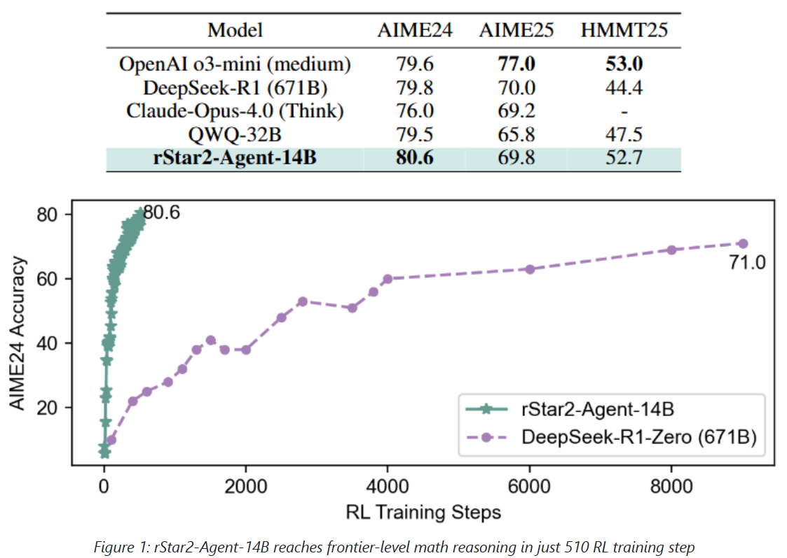
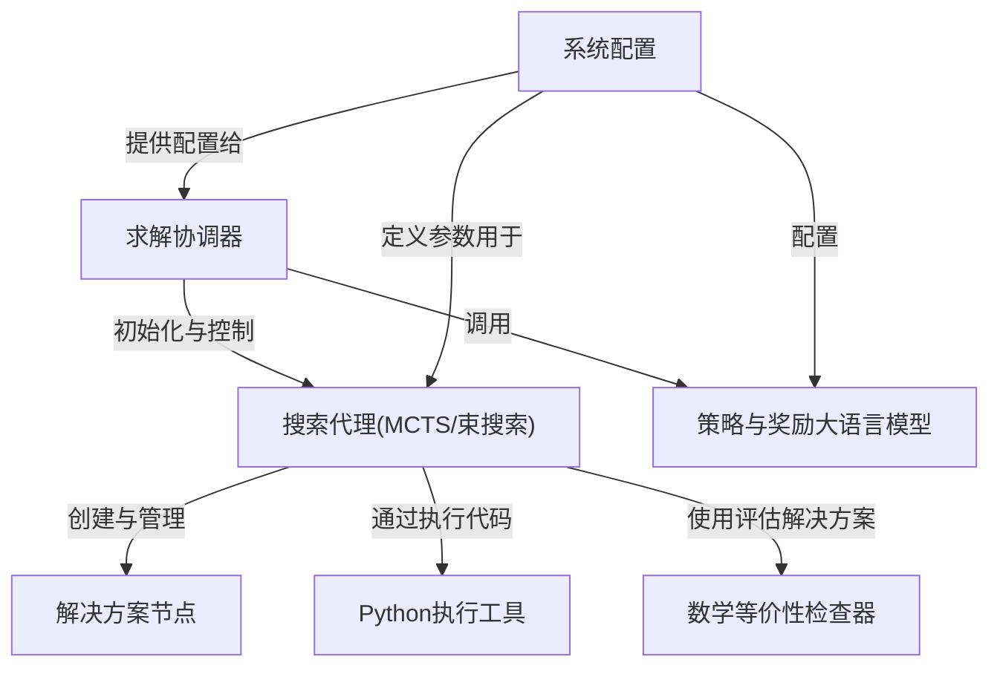
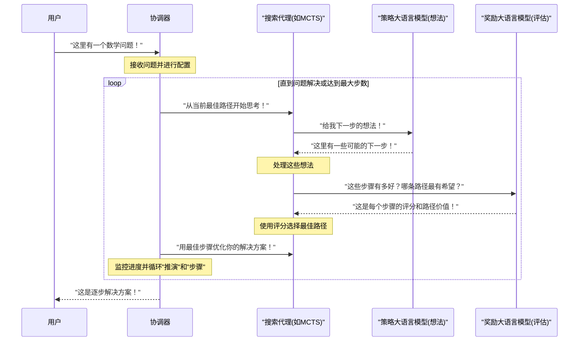

链接：[Paper page - rStar2-Agent: Agentic Reasoning Technical Report](https://huggingface.co/papers/2508.20722)



rStar2-Agent 是一个 14B 数学推理模型，通过==纯代理强化学习==实现了与 671B DeepSeek-R1 相当的性能

该模型能够进行`规划`、`推理`和`自主使用编码工具`来高效地探索、验证和反思以解决更复杂的问题。

### Main Function Points
1. 提出了一种有效的代理强化学习算法 `GRPO-RoC`，具有一种新颖的 `Resample-on-Correct` 回溯策略，可优化编码工具的使用并通过选择性保留高质量的正向轨迹来实现更短、更智能的推理。
2. 开发了一个可扩展高效的强化学习基础设施，支持高吞吐量的工具调用执行并缓解代理强化学习回溯的高成本，使其能够在有限的 GPU 资源（64 个 MI300X GPU）上进行高效训练。
3. 提出了一种从``非推理 SFT 开始``、通过``多阶段强化学习``并``逐步增加数据集难度``的代理训练配方，使 rStar2-Agent-14B 在仅 510 个强化学习步骤内就达到了前沿水平。

### Technology Stack
- 强化学习框架: Verl
- 代码执行服务: Code Judge
- 编程语言: Python


# docs：rStar

`rStar-Math`通过模拟"深度思考"使*小型语言模型*(SLMs)能够实现高级数学推理。

采用**蒙特卡洛树搜索(MCTS)**或**束搜索(Beam Search)**算法来==探索多种解题路径==，其中专门的**大语言模型(策略与奖励模型)**会提出下一步推理步骤并评估其质量。这使得系统能够迭代优化解决方案并掌握==复杂数学问题==。

## 可视化



## 章节

1. [求解协调器
](01_solver_orchestrator_.md)
2. [搜索代理(MCTS/束搜索)
](02_search_agents__mcts_beam_search__.md)
3. [策略与奖励大语言模型
](03_policy___reward_llms_.md)
4. [解决方案节点
](04_solution_nodes_.md)
5. [系统配置
](05_system_configuration_.md)
6. [Python执行工具
](06_python_execution_tool_.md)
7. [数学等价性检查器
](07_math_equivalence_checker_.md)

---


# 第1章：求解协调器

欢迎来到`rStar`

在这第一章中，我们将认识`rStar`系统的"大脑"或"项目经理"——**求解协调器(Solver Orchestrator)**。

想象我们遇到一个非常困难的数学问题，比如证明一个复杂定理或求解代数方程的逐步解法。

这不是简单地输入计算器就能解决的问题。我们需要一个==结构化的方法==，可能需要头脑风暴想法、评估它们，并不断优化策略直到找到答案。

这正是`rStar`设计用来解决的复杂任务类型。但它如何管理解决这类问题所涉及的各个部分呢？这就是**求解协调器**的作用

## 什么是求解协调器？

将求解协调器视为`rStar`中==解决任何问题的**项目经理**==。

它本身并不直接解决问题，但它知道如何组织整个过程，确保团队中所有不同的"专家"能够高效协作。

它的主要职责是：

1.  **==启动流程==**：开始问题求解的旅程
2.  **==管理"思考者"==**：指导[搜索代理(MCTS/束搜索)](02_search_agents__mcts_beam_search__.md)探索不同的解决思路和路径。这些代理就像是创意策略师
3.  **==咨询"专家"==**：与[策略与奖励大语言模型](03_policy___reward_llms_.md)协作，获取新想法(策略模型)并评估这些想法的质量(奖励模型)。这些大语言模型就像是经验丰富的顾问
4.  **==跟踪进度==**：监督由[解决方案节点](04_solution_nodes_.md)构建的解决方案开发过程
5.  **==交付最终答案==**：问题解决后，将所有内容编译成清晰的逐步解决方案

它是连接所有这些强大组件以实现目标的核心枢纽。

## 求解协调器的工作示例

让我们看看如何在`rStar`中使用求解协调器来解决问题。在`main.py`中，`Solver`被初始化并调用来解决一批问题。

```python
# 来自main.py

# ...(导入和设置)...

# 初始化求解协调器
solver = Solver(config=config)

# ...(代理初始化)...

# 指示求解协调器解决问题
# 它接收代理列表(我们的"思考者")和其他信息
jsonlines = solver.solve(agents, saved_jsonl_file, cur_data)

# ...(保存结果)...
```

在这个代码片段中：
1. 我们创建了一个`Solver`类的实例，并传入`config`。这个`config`包含协调器需要的所有设置，如使用哪些模型和尝试多少步骤
2. 然后调用它的`solve`方法。这个方法是协调器工作的核心。它接收`agents`(我们的问题求解"思考者")、保存结果的路径和实际的问题数据
3. `solve`方法启动整个过程，管理代理并与大语言模型交互，直到找到解决方案或达到搜索限制。它返回最终解决方案

## 幕后工作：协调器的工作流程

为了理解调用`solver.solve()`时发生了什么，让我们将求解协调器想象成运行问题求解会议的项目经理。



以下是发生的过程分解：

1.  **==接收问题==**：用户给`rStar`一个问题。`协调器`接收它和配置设置
2.  **==初始化思考者==**：`协调器`准备它的[搜索代理(MCTS/束搜索)](02_search_agents__mcts_beam_search__.md)。这些代理负责主动寻找解决方案。每个代理从初始问题开始
3.  **==迭代问题求解==**：`协调器`进入一个循环，通常称为"推演"或"迭代"。在每次迭代中，它指导代理：
    *   **生成想法**：代理询问[策略与奖励大语言模型](03_policy___reward_llms_.md)(特别是策略模型)为问题提出潜在的下一步
    *   **评估想法**：代理然后询问[策略与奖励大语言模型](03_policy___reward_llms_.md)(特别是奖励模型)为这些想法评分。每个潜在步骤有多好？结果路径看起来多有希望？
    *   **选择最佳路径**：基于这些评估，代理选择最有希望的路径
    *   **更新解决方案**：选择的步骤被添加到代理当前的[解决方案节点](04_solution_nodes_.md)中，构建最终解决方案
4.  **==重复==**：这个过程在每次"推演"中进行多个"步骤"，并多次"推演"，允许代理探索和优化他们的解决方案
5.  **==最终解决方案==**：迭代完成后(或找到解决方案)，`协调器`从代理收集最佳解决方案并呈现给用户

### 深入查看`Solver`类

让我们看看`rstar_deepthink/solver.py`文件中的`Solver`类定义。

```python
# 来自rstar_deepthink/solver.py

class Solver(BaseModel):
    # 配置协调器的行为
    config: Any
    stop: List[str] = None
    llm: Optional[Callable[[...], List[str]]] = None # 策略模型处理器
    reward_model: Optional[Any] = None # 奖励模型处理器
    max_agent_steps: int = 1 # 执行多少次"推演"

    def __init__(self, **kwargs) -> None:
        super().__init__(**kwargs)
        # 基于配置初始化策略和奖励模型
        if self.config.need_value_func:
            self.reward_model = self.create_rm() # 创建奖励模型
        self.llm = self.create_llm() # 创建策略模型

        # 基于搜索模式(如MCTS)设置max_agent_steps
        if self.config.mode == "mcts":
            self.max_agent_steps = self.config.iterations
            # ...其他MCTS特定设置...
```

> 这里可以看到`Solver`类持有重要引用：

*   `config`：当前运行的所有设置
*   `llm`：协调器与策略模型通信以生成新想法的方式
*   `reward_model`：协调器与奖励模型通信以评估想法的方式
*   `max_agent_steps`：控制协调器将执行多少次"推演"或主要迭代

`__init__`方法设置这些连接，基于提供的配置创建策略和奖励模型。

现在，让我们看看协调器工作的核心：`solve`方法。

```python
# 来自rstar_deepthink/solver.py

class Solver(BaseModel):
    # ...(初始化和其他方法)...

    def solve(self, agents: List[BaseTree], saved_jsonl_file: str, cur_data: List[Dict[str, Any]]):
        # 每个"推演"(主要迭代)的循环
        for rollout in tqdm(range(self.max_agent_steps), desc="推演处理"):
            # 为新推演准备代理
            for agent in agents:
                agent.select_next_step(from_root=True) # 从零开始或当前路径的根
                agent.rollout_idx = rollout

            # 推演中每个"步骤"(次要迭代)的循环
            for step in range(self.config.max_depth):
                # 1. 生成阶段：向策略模型询问想法
                prompts, _, valid_agents, _, _, valid_rewards = self.generate_preprocess(agents)
                outputs = self.llm(prompts, self.generate_sampling_params) # 调用策略模型
                valid_agents = self.generate_postprocess(outputs, valid_agents) # 处理模型输出

                # 2. 评估阶段：让奖励模型为想法评分
                prompts, _ = self.value_preprocess(valid_agents)
                if self.need_value_func:
                    outputs = self.reward_model(prompts=prompts) # 调用奖励模型
                # ...(评估后处理的其他部分)...
                valid_agents = self.value_postprocess(outputs, valid_agents)

                # 为下一步跟踪所有代理
                # agents = valid_agents + invalid_agents + expanded_agents

            # 保存本次推演的中间结果
            self.save_intermediate_rollouts(saved_jsonl_file, cur_data, agents, rollout)

        return self.output(agents) # 返回最终解决方案
```

`solve`方法是`协调器`编排整个问题求解过程的地方。

*   **外部循环(`rollout`)**：==代表问题求解过程的主要迭代==。例如，在蒙特卡洛树搜索(MCTS)中，这可能是问题的一次完整"模拟"或"推演"
*   **内部循环(`step`)**：每次推演中，有另一个"步骤"循环。每个步骤涉及：
    *   **==生成==**：`协调器`为[策略与奖励大语言模型](03_policy___reward_llms_.md)准备提示，并调用`self.llm()`获取新的潜在步骤。然后处理这些想法
    *   **==评估==**：如果需要奖励函数(`self.need_value_func`)，`协调器`准备新提示并调用`self.reward_model()`获取生成步骤的评分。然后使用这些评分指导[搜索代理(MCTS/束搜索)](02_search_agents__mcts_beam_search__.md)选择最佳路径
*   **代理更新**：每个步骤后，[搜索代理(MCTS/束搜索)](02_search_agents__mcts_beam_search__.md)更新其内部状态并构建其[解决方案节点](04_solution_nodes_.md)
*   **最终输出**：所有推演和步骤完成后，`协调器`从所有代理收集最佳解决方案并返回

> `generate_preprocess`、`generate_postprocess`、`value_preprocess`和`value_postprocess`方法是帮助函数

它们为模型准备数据并处理输出，确保信息在`协调器`和[搜索代理(MCTS/束搜索)](02_search_agents__mcts_beam_search__.md)之间正确流动。

## 结论

现在我们已经认识了**求解协调器**，`rStar`的核心大脑

它是将所有部分联系在一起的组件，从头到尾管理问题求解的工作流程。它不直接解决问题，但能有效管理"==思考者=="([搜索代理](02_search_agents__mcts_beam_search__.md))并咨询"==专家=="([策略与奖励大语言模型](03_policy___reward_llms_.md))，使用[解决方案节点](04_solution_nodes_.md)==构建解决方案==。

在下一章中，我们将更深入地了解这些"思考者"——[搜索代理(MCTS/束搜索)](02_search_agents__mcts_beam_search__.md)——理解它们如何==探索和选择通向解决方案的最佳路径==。

[下一章：搜索代理(MCTS/束搜索)](02_search_agents__mcts_beam_search__.md)

