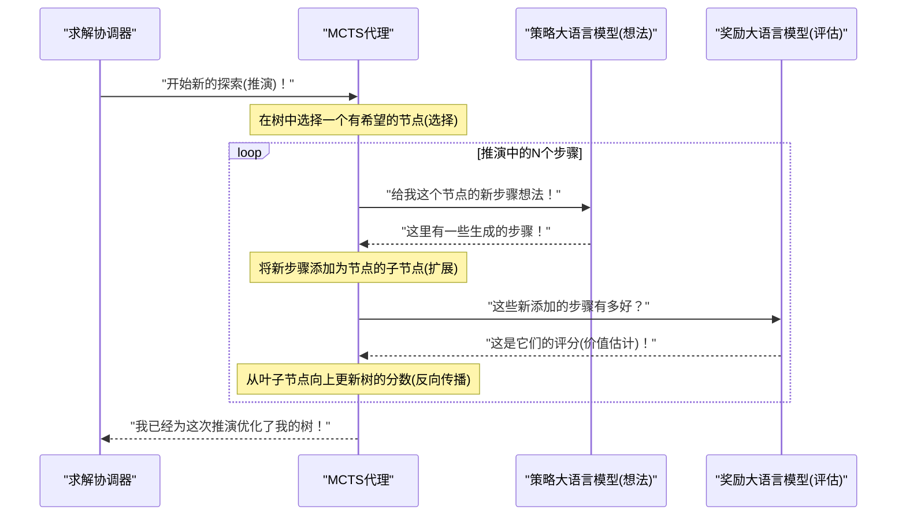
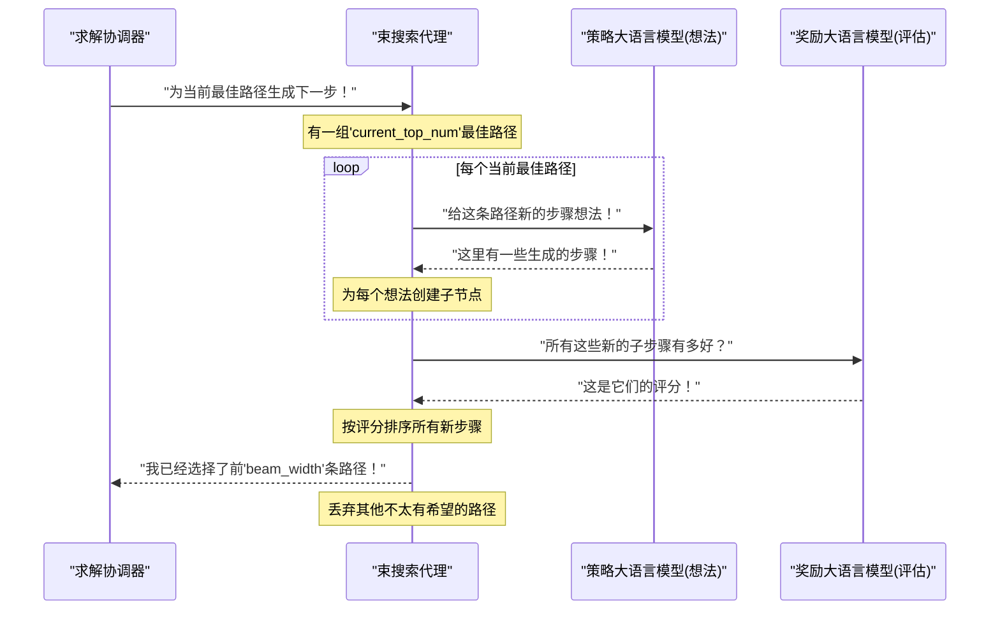

# 第2章：搜索代理(MCTS/束搜索)

欢迎回到`rStar`

在[前一章](01_solver_orchestrator_.md)中，我们学习了**求解协调器**，它就像是解决数学问题的项目经理。

它组织整个过程，但本身并不进行"思考"，而是将这项工作委托给其专家团队。

今天，我们将认识这个团队中最重要的成员：**==搜索代理==**。它们是`rStar`的"思考者"或"策略家"。

## 什么是搜索代理？

想象我们在玩一个复杂的棋盘游戏，比如国际象棋。

我们不会随机选择一步棋；而是会前瞻思考。我们会考虑几种可能的走法，设想对手可能的应对，并尝试找到通往胜利的最佳路径。

`rStar`中的**搜索代理**正是做这样的事情，但针对的是数学问题

它们是"思考"并探索不同解决路径的核心算法。当面对复杂问题时，它们不会只尝试一种方法；而是构建一个潜在解决步骤的"树"，探索各种想法，直到找到最佳方案。

在`rStar`中，我们主要使用两种类型的搜索代理，每种都有其独特的策略：

1.  **MCTS（蒙特卡洛树搜索）**：这个代理像一个策略性的棋盘游戏玩家，`探索多种走法，从结果中学习`，并专注于有希望的路径。
2.  **束搜索（Beam Search）**：这个代理像一个更简单的玩家，`每一步都选择最好的几个走法`，决策更直接。

让我们深入了解每一种代理，看看它们如何帮助`rStar`解决问题。

## 蒙特卡洛树搜索（MCTS）

将MCTS想象成一个非常好奇且策略性强的探索者。当面对数学问题时，它不会立即知道最佳路径，因此会==尝试许多==不同的路线。

以下是MCTS的简化工作流程：

1.  **探索（模拟）**：选择一条路径进行探索，尝试新的步骤。这就像在决策树中探索一个新的分支。
2.  **评估（推演）**：==一旦到达一个"叶子"（潜在的终点或有趣的点），它会快速模拟问题的其余部分==，猜测该路径可能有多好。这就像在脑海中快速推演游戏的剩余部分。
3.  **学习（``反向传播``）**：然后`更新`关于该路径所有步骤的知识。如果路径导致好的结果，这些步骤会得到更高的分数；如果导致坏的结果，则分数较低。
4.  **决策（选择）**：==基于所有探索和学习，决定==哪条路径最有希望进一步探索。它平衡尝试新事物（探索）和专注于之前表现良好的路径（利用）。

经过多次迭代，MCTS变得非常擅长识别解决数学问题最有希望的步骤序列。

### `rStar`工作流中的MCTS

在`rStar`中，MCTS代理从[策略与奖励大语言模型](03_policy___reward_llms_.md)获取想法，并构建一个复杂的搜索树。`求解协调器`通过探索和学习的循环指导它。

以下是MCTS一次"推演"或"迭代"的简化视图：



这个循环使MCTS能够逐步构建一个更健壮的搜索树，`别更好的解决路径`。

==树中的每个"节点"代表一个[解决方案节点](04_solution_nodes_.md)==——通向答案的部分步骤。

## 束搜索（Beam Search）

现在，让我们看看束搜索。如果MCTS是一个策略性的深度思考者，束搜索更像是一个务实的=="当下最佳"决策者==。

以下是束搜索的工作方式：

1.  **生成想法**：在问题的每一步，请求一组可能的下一步。
2.  **评估想法**：评估所有这些可能的下一步。
3.  **选择最佳几个**：不是探索所有路径，而是==只保留`N`个最佳路径（`N`称为"束宽度"==）。立即丢弃其他不太有希望的路径。
4.  **重复**：继续这个过程，始终只扩展前`N`个路径，逐步推进，直到找到解决方案或达到最大步数。

束搜索比MCTS更快，因为它不进行深度探索或复杂学习。它是一种"贪心"方法，始终尝试选择当前可用的最佳选项。

### `rStar`工作流中的束搜索

`rStar`中的束搜索代理也使用[策略与奖励大语言模型](03_policy___reward_llms_.md)获取想法并评估它们。关键区别在于它如何处理这些评估以决定保留哪些路径。



## MCTS与束搜索：快速比较

MCTS和束搜索都是强大的搜索代理，但在不同场景下表现优异：

| 特性         | 蒙特卡洛树搜索（MCTS）                 | 束搜索                                   |
| :----------- | :------------------------------------- | :--------------------------------------- |
| **策略**     | 探索多条路径，学习，平衡探索/利用。    | 贪心地选择每一步的最佳几个选项。         |
| **探索性**   | 高——寻找新路径并从结果中学习。         | 低——专注于扩展已知的良好路径。           |
| **复杂性**   | 更复杂，涉及模拟和树更新。             | 更简单，每一步评估和剪枝。               |
| **适用场景** | 需要深度策略推理的问题；不确定性较高。 | 良好的局部决策能导向良好全局结果的问题。 |
| **资源消耗** | 通常需要更多计算和内存，因为树更深。   | 通常更高效，但可能错过最优解。           |

## 如何在`rStar`中使用搜索代理

我们不会直接"调用"MCTS或束搜索代理。相反，我们通过配置告诉[求解协调器](01_solver_orchestrator_.md)使用哪种类型的代理。`协调器`会为我们初始化和管理这些代理。

以下是如何在`rStar`中通过配置文件（如`config/sample_mcts.yaml`或`config/sft_eval_bs.yaml`）指定代理类型：

```yaml
# 来自config/sample_mcts.yaml
mode: "mcts"          # 这行告诉rStar使用MCTS！
# ... 其他MCTS特定设置，如'iterations'和'c_puct'
```

```yaml
# 来自config/sft_eval_bs.yaml
mode: "bs"            # 这行告诉rStar使用束搜索！
# ... 其他束搜索特定设置，如'step_beam_width'
```

以下是`求解协调器`（来自第1章）如何根据我们的`config`创建和使用这些代理的概念性代码：

```python
# 概念性Python代码，简化自main.py和solver.py

from rstar_deepthink.agents import MCTS, BS
from rstar_deepthink.solver import Solver
from omegaconf import OmegaConf # 用于加载配置文件

# 1. 加载所需的配置
#    (例如，MCTS或束搜索的配置)
config = OmegaConf.load("config/sft_sample_mcts.yaml") # 或"config/sft_eval_bs.yaml"

# 2. 初始化求解协调器
solver = Solver(config=config)

# 3. 准备问题数据（例如，数学问题列表）
cur_data = [{"question": "2+2等于多少？", "answer": "4"}]

# 4. 求解协调器根据配置中的'mode'创建代理
agents = []
for q in cur_data:
    if config.mode == "mcts":
        agents.append(MCTS(config=config, question=q['question'], ground_truth=q['answer']))
    elif config.mode == "bs":
        agents.append(BS(config=config, question=q['question'], ground_truth=q['answer']))
    else:
        raise ValueError("不支持的搜索模式配置！")

# 5. 求解协调器指示这些代理解决问题
print(f"使用{config.mode}代理解决问题...")
solutions = solver.solve(agents, "results.jsonl", cur_data)

print("找到解决方案！")
# 输出可能如下：
# 使用mcts代理解决问题...
# 推演处理: 100%|██████████| 48/48 [00:0X<00:00, X.X 推演/s]
# 找到解决方案！
```

在这个例子中，只需在配置文件中更改`mode`（并确保为该模式提供正确的设置），就可以切换`rStar`的核心问题解决策略

## 搜索代理内部：代码窥探

让我们快速看看这些代理在`rStar`代码库中是如何定义的。

`rStar`中的所有搜索代理都继承自一个共同的`BaseTree`类，该类提供了构建和导航解决方案树的共享功能。

```python
# 来自rstar_deepthink/agents/__init__.py
# 此文件列出所有可用的代理类型
from .tree import BaseTree
from .beam_search import BS
from .mcts import MCTS

__all__ = [
    'BaseTree',
    'BS', # 我们的束搜索代理
    'MCTS', # 我们的MCTS代理
]
```

这告诉我们`BS`和`MCTS`是主要的代理类。

### `BaseTree`基础

`BaseTree`类（在`rstar_deepthink/agents/tree.py`中）为所有代理设置了通用结构。它保存问题`question`、`config`，以及最重要的，解决方案树的`root`节点。

```python
# 来自rstar_deepthink/agents/tree.py（简化）

class BaseTree(BaseModel):
    config: Any
    question: str
    root: Optional[Type[BaseNode]] = None # 解决方案树的起点
    current_node: Optional[Type[BaseNode]] = None # 当前在树中的位置

    def __init__(self, **kwargs) -> None:
        super().__init__(**kwargs)
        self.root = self.create_root() # 创建第一个节点
        self.current_node = self.root

    def create_root(self) -> Type[BaseNode]:
        # 此方法为问题创建第一个节点
        root = self.create_node()
        root.state["extra_info"] = f"question: {self.question}"
        return root

    @abstractmethod
    def create_node(self, parent: Optional[Type[BaseNode]] = None) -> Type[BaseNode]:
        # 每个特定代理（MCTS，束搜索）将定义自己的节点类型
        pass

    def collect_partial_solution(self, node: Type[BaseNode]) -> str:
        # 帮助从节点回溯到根节点收集步骤
        trajectory = []
        while node:
            if node.state['text']:
                trajectory.append(node.state['text'])
            node = node.parent
        return "".join(reversed(trajectory))

    # ... 其他通用方法
```

每个代理通过`create_root()`创建一个`root`节点。`create_node`方法留空（`@abstractmethod`），因为每个代理将使用稍微不同类型的[解决方案节点](04_solution_nodes_.md)来存储其独特信息。`collect_partial_solution`方法对于重建迄今为止采取的步骤很有用。

### 束搜索（`BS`）实现

`BS`类（在`rstar_deepthink/agents/beam_search.py`中）实现了束搜索逻辑。其核心思想是维护一个`current_top_num`（我们的束宽度）的最佳路径。

```python
# 来自rstar_deepthink/agents/beam_search.py（简化）

from rstar_deepthink.nodes.base_node import BaseNode # 束搜索使用基本节点

class BS(BaseTree):
    current_top_num: int = 1 # 这是束宽度（config.step_beam_width）
    current_nodes: List[Type[BaseNode]] = [] # 当前正在探索的节点
    candidate_nodes: List[Type[BaseNode]] = [] # 所有新生成的子节点

    def __init__(self, **kwargs) -> None:
        super().__init__(**kwargs)
        self.candidate_nodes.append(self.current_node) # 从根节点开始
        self.current_top_num = self.config.step_beam_width # 从配置设置束宽度

    def create_node(self, parent: Optional[Type[BaseNode]] = None) -> Type[BaseNode]:
        # 束搜索使用标准BaseNode作为其解决步骤
        return BaseNode(parent=parent, additional_state_keys=self.NODE_KEYS)

    def select_next_step(self, outputs=None, from_root=False) -> None:
        # 生成想法并获取值后，选择最佳的几个
        if outputs is not None:
            for candidate_node, output in zip(self.candidate_nodes, outputs):
                # 根据奖励模型输出更新节点值
                candidate_node.value = output.value_estimate if output.value_estimate is not None else 0

        # 按值（它们有多好）对所有候选节点排序
        self.candidate_nodes = sorted(self.candidate_nodes, key=lambda x: x.value, reverse=True)

        # 仅保留前'current_top_num'（束宽度）节点
        self.current_nodes = self.candidate_nodes[:self.current_top_num]
        # ... 也处理终端节点

    def generate_next_step(self, outputs: List[RequestOutput]) -> None:
        self.candidate_nodes = []
        for current_node, output in zip(self.current_nodes, outputs):
            self.current_node = current_node # 设置当前上下文
            # 为每个当前路径生成多个子步骤（来自LLM的想法）
            for idx, output in enumerate(output.outputs):
                step_result, parser_result = self.step_unwrap(output.text + output.stop_reason)
                self.create_child(step_result, parser_result, current_node)
            self.candidate_nodes.extend(current_node.children) # 将所有新子节点添加为候选
```

`select_next_step`方法是束搜索的关键：它获取所有新想法（子节点），获取它们的分数（值），排序它们，并仅保留`step_beam_width`个最佳节点。`generate_next_step`是代理向[策略与奖励大语言模型](03_policy___reward_llms_.md)请求多个下一步想法的地方，针对其当前最佳路径。

### 蒙特卡洛树搜索（`MCTS`）实现

`MCTS`类（在`rstar_deepthink/agents/mcts.py`中）更复杂，因为其探索-利用策略。它使用特殊的[MCTSNode](04_solution_nodes_.md)来跟踪访问次数和Q值。

```python
# 来自rstar_deepthink/agents/mcts.py（简化）

from rstar_deepthink.nodes import MCTSNode # MCTS使用特殊的MCTS节点
from .beam_search import BS # MCTS继承自束搜索，复用一些逻辑

class MCTS(BS): # MCTS扩展束搜索，复用一些逻辑
    search_node: Type[MCTSNode] = None # 当前正在探索的特定节点

    def create_node(self, parent: Optional[Type[MCTSNode]] = None) -> Type[MCTSNode]:
        # MCTS使用MCTSNode，它跟踪访问次数和分数以进行决策
        return MCTSNode(parent=parent, additional_state_keys=self.NODE_KEYS, c_puct=self.config.c_puct)

    def selection(self, from_root=False) -> Optional[Type[MCTSNode]]:
        # 核心MCTS"选择"步骤：选择一个节点进行探索
        node = self.root if from_root else self.search_node
        # 此方法使用MCTSNode的PUCT值（利用和探索的平衡）
        # 来决定哪个子节点最有希望深入探索
        # ...（基于PUCT值选择最佳子节点的复杂逻辑）...
        return node # 返回选择的节点以进一步探索

    def expand_node(self, outputs: List[CompletionOutput], node: Type[MCTSNode]) -> None:
        # 核心MCTS"扩展"步骤：从LLM想法创建新的子节点
        for idx, output in enumerate(outputs):
            step_result, parser_result = self.step_unwrap(output.text + output.stop_reason)
            self.create_child(step_result, parser_result, node, idx)

    def eval_final_answer(self, node: Type[MCTSNode]) -> None:
        # 到达终端状态（或评估潜在答案）后，
        # 此方法将奖励"反向传播"到所有父节点
        if node.state["final_answer"] in [NO_VALID_CHILD, TOO_MANY_STEPS, TOO_MANY_CODE_ERRORS]:
            node.update(self.config.negative_reward) # 分配惩罚
            return

        # ... 检查答案是否正确并递归更新节点的逻辑
        # 这是MCTS学习的"反向传播"步骤，所有祖先节点都从这个结果中学习
        node.update_recursive(value_estimate, self.root)
```

`selection`方法是MCTS决定下一步探索哪条路径的地方，使用`c_puct`参数平衡已知信息（利用）和尝试新事物（探索）。`expand_node`从[策略与奖励大语言模型](03_policy___reward_llms_.md)提供的想法创建新的子节点。最后，`eval_final_answer`（包括"反向传播"步骤）对MCTS的学习至关重要；它更新导致特定结果的所有节点的分数和访问次数。

## 结论

现在我们已经认识了**搜索代理**——`rStar`背后的智能"思考者", 我们学习了：
*   什么是搜索代理，以及它们如何构建潜在解决步骤的树。
*   ==**MCTS**，策略性探索者，学习并专注于有希望的路径==。
*   ==**束搜索**，务实的决策者，总是选择最佳的几个选项==。
*   如何配置`rStar`使用MCTS或束搜索。
*   使这些代理工作的核心代码的简要介绍

这些代理之所以强大，是因为它们不只是猜测；而是系统地探索、评估和学习不同的解决路径。然而，它们==严重依赖"专家"来提供好的`想法`和准确的`评估`==。

在[下一章](03_policy___reward_llms_.md)中，我们将探索这些"专家"：**策略与奖励大语言模型**，它们是负责生成创造性步骤并评估其质量的大语言模型。

[下一章：策略与奖励大语言模型](03_policy___reward_llms_.md)

