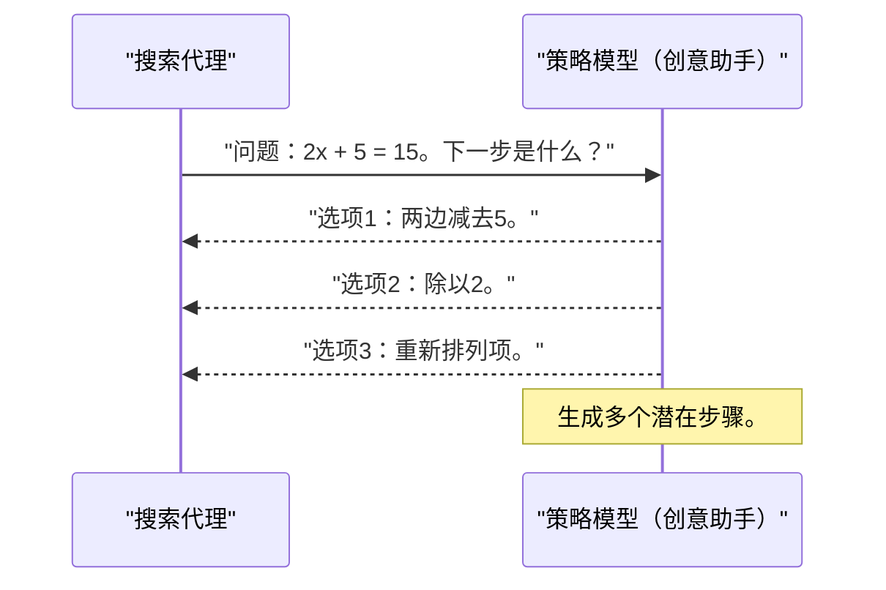
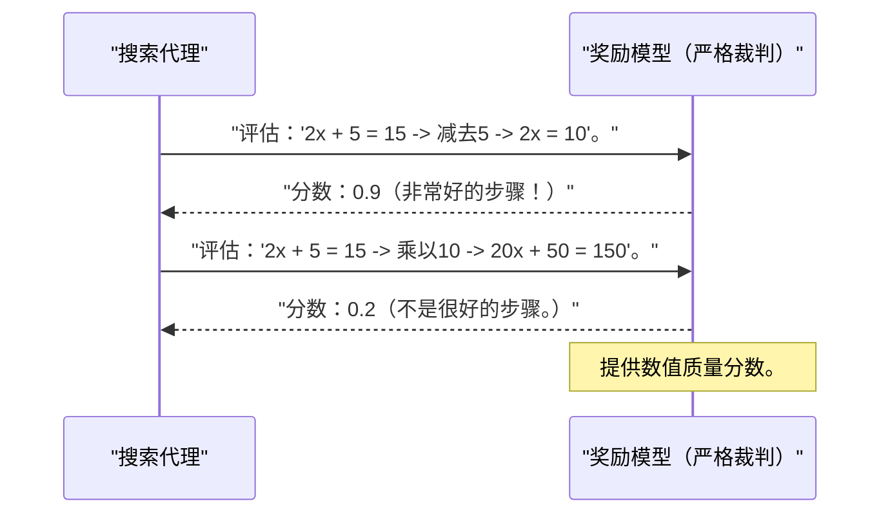
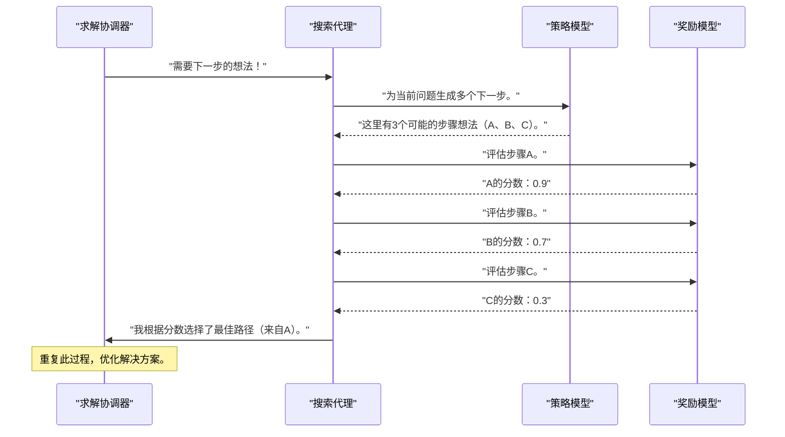

# 第3章：策略与奖励大语言模型

欢迎回到`rStar`

在[前一章](02_search_agents__mcts_beam_search__.md)中，我们探索了**搜索代理**，这些"思考者"系统地探索不同的路径来解决数学问题。

这些代理（如MCTS和束搜索）是聪明的策略家，但它们不会从头生成想法或评估其质量。它们需要帮助！

想象我们正在尝试解决一个非常棘手的谜题。我们可能会头脑风暴几种解决方法（想法！），然后对每个想法快速判断它是好是坏（==评估==！）。`rStar`中的**策略与奖励大语言模型**正是帮助搜索代理的两位"专家"。

## 什么是策略与奖励大语言模型？

在`rStar`中，我们使用大语言模型（LLMs）来完成两个截然不同但至关重要的角色：

1.  **策略模型（想法生成器）**：这个大语言模型就像一个创意助手。当我们的[搜索代理](02_search_agents__mcts_beam_search__.md)需要解决问题的下一步建议时，策略模型就会介入。它接收当前问题状态，并提出一系列潜在的==下一步行动==或推理思路。
2.  **奖励模型（批评家/裁判）**：这个大语言模型充当质量检查员。在策略模型提出多个步骤后，或代理采取部分路径后，奖励模型评估每个步骤或路径的质量。它给出一个==分数==，告诉系统某个步骤是否有希望。这个分数对于引导搜索朝向更好的解决方案至关重要。

这两个大语言模型共同作用，使`rStar`能够通过生成多样化的解决方案并智能评估哪些是最佳方案来*学习*和*改进*其问题解决能力。

## 策略模型：我们的创意助手

将策略模型想象成一个头脑风暴伙伴。它的任务是在[搜索代理](02_search_agents__mcts_beam_search__.md)需要新想法时生成一组多样化的==潜在下一步==。

**角色**：根据当前问题状态建议下一步行动、代码片段或推理思路。它专注于*生成*可能性。

**工作原理**

1.  [搜索代理](02_search_agents__mcts_beam_search__.md)向策略模型提供数学问题的当前状态（例如："解方程：2x + 5 = 15"）。
2.  策略模型作为大语言模型，生成多个不同的文本响应，每个响应代表一个潜在的下一步（例如："两边减去5"、"除以2"、"两边加10"）。它被设计为具有创造性并探索多种选项。



## 奖励模型：我们的严格裁判

一旦策略模型生成了一组想法，我们如何知道哪些是好的？这就是奖励模型的作用。它是评估每个建议步骤或部分解决方案质量的批评家。

**角色**：为给定的步骤或部分解决方案分配一个数值分数，表示其质量、正确性或潜力。它专注于*评估*可能性。

**工作原理（简化版）**：

1.  [搜索代理](02_search_agents__mcts_beam_search__.md)向奖励模型提供一个潜在步骤或部分解决方案（例如："给定2x + 5 = 15，如果我们两边减去5，得到2x = 10。这是一个好步骤吗？"）。
2.  奖励模型处理这个输入并输出一个分数（例如："0.9"表示好步骤，"0.1"表示坏步骤）。这个分数帮助代理决定遵循哪条路径。



## 策略与奖励大语言模型的协作

策略和奖励大语言模型的真正力量来自于它们与[求解协调器](01_solver_orchestrator_.md)和[搜索代理](02_search_agents__mcts_beam_search__.md)的协作。以下是它们在`rStar`整体流程中交互的简化视图：



这个*生成*想法和*评估*它们的循环会反复进行。[搜索代理](02_search_agents__mcts_beam_search__.md)使用这些==分数智能地构建和导航它们的解决方案树，始终优先考虑最有希望的路径==

## 在`rStar`中配置策略与奖励大语言模型

我们不会直接编写代码调用策略或奖励大语言模型。相反，我们通过配置告诉[求解协调器](01_solver_orchestrator_.md)使用哪些大语言模型。

在`rStar`中，配置文件（通常是`.yaml`文件）指定模型的路径以及是否需要奖励模型：

```yaml
# 来自config/sft_eval_mcts.yaml（示例）
model_dir: "path/to/your/policy_model" # 这是策略模型
reward_model_dir: "path/to/your/reward_model" # 这是奖励模型
need_value_func: True # 如果要使用奖励模型，设置为True
# ... 其他设置，如temperature、top_k等，用于生成
```

以下是[求解协调器](01_solver_orchestrator_.md)（来自第1章）如何使用此配置设置大语言模型：

```python
# 概念性Python代码，简化自main.py和solver.py

from rstar_deepthink.solver import Solver
from omegaconf import OmegaConf

# 1. 加载配置
config = OmegaConf.load("config/sft_eval_mcts.yaml")

# 2. 初始化求解协调器
# Solver的__init__方法将创建大语言模型处理器
solver = Solver(config=config)

# 现在，'solver.llm'已准备好生成想法（策略模型）
# 'solver.reward_model'已准备好评估（奖励模型）
print(f"策略模型加载自：{config.model_dir}")
print(f"奖励模型加载：{config.need_value_func}")

# solver.solve()方法（来自第1章）将在与搜索代理交互时
# 内部使用这些模型。
```

## 幕后：`rStar`如何与大语言模型交互

让我们深入`rStar`代码库，看看这些大语言模型是如何加载和使用的。

### 在`Solver`中设置大语言模型

`Solver`类（位于`rstar_deepthink/solver.py`）负责根据我们的配置初始化策略和奖励大语言模型。

```python
# 来自rstar_deepthink/solver.py（简化）

class Solver(BaseModel):
    # ... 其他属性 ...
    llm: Optional[Callable[[...], List[str]]] = None # 策略大语言模型的处理器
    reward_model: Optional[Any] = None # 奖励模型的处理器

    def __init__(self, **kwargs) -> None:
        super().__init__(**kwargs)
        self.need_value_func = self.config.need_value_func
        if self.need_value_func:
            self.reward_model = self.create_rm() # 如果需要，创建奖励模型
        self.llm = self.create_llm() # 始终创建策略模型

    def create_llm(self):
        # 此方法使用vLLM高效加载和提供策略模型
        engine, sampling_params = llm_engine(self.config)
        self.llm_engine = engine
        self.generate_sampling_params = sampling_params
        return partial(llm_generate, engine=self.llm_engine)

    def create_rm(self):
        # 此方法加载奖励模型
        rm, v_head, tokenizer = rm_engine(self.config)
        return partial(
            rm_generate,
            model=rm,
            v_head=v_head,
            tokenizer=tokenizer,
            max_model_len=self.config.max_model_len,
        )
```

`__init__`方法检查配置中`need_value_func`是否为`True`。如果是，则调用`create_rm()`设置奖励模型。

它始终调用`create_llm()`设置策略模型。这些方法返回*部分函数*，准备用提示调用。

### 策略大语言模型：`llm_generate`

`create_llm`方法使用`llm_engine`（来自`rstar_deepthink/llms/llm_engine.py`）通过`vllm`（一个用于快速大语言模型推理的库）加载实际的大语言模型。然后，它用`llm_generate`（来自`rstar_deepthink/llms/llms.py`）包装这个引擎。

```python
# 来自rstar_deepthink/llms/llms.py（简化）

from vllm import LLM, SamplingParams
from typing import List

def llm_generate(
    prompts: List[str],
    sampling_params: SamplingParams,
    engine: LLM, # 这是加载的策略大语言模型
):
    # 这是对策略模型的核心调用
    outputs = engine.generate(prompts, sampling_params=sampling_params)
    # ...（处理并过滤输出的代码，例如去重）...
    return outputs
```

这个`llm_generate`函数接收一个`prompts`列表（当前问题状态）和`sampling_params`（如`temperature`、`top_k`，控制生成步骤的创造力和多样性），然后让`vllm` `engine`生成`outputs`（建议的下一步）。

### 奖励大语言模型：`rm_generate`

类似地，`create_rm`方法使用`rm_engine`（来自`rstar_deepthink/llms/llm_engine.py`）加载奖励模型，然后用`rm_generate`（来自`rstar_deepthink/llms/llms.py`）包装它。

奖励模型略有不同：它通常由一个处理输入的基础大语言模型和一个小的"值头"（一个简单的神经网络层）组成，该值头接收大语言模型的最终内部表示并输出一个数值分数。

```python
# 来自rstar_deepthink/llms/llms.py（简化）
import torch
from vllm import LLM

class Reward():
    value_estimate: float = 0 # 存储分数

def rm_generate(model: LLM, v_head, prompts, tokenizer, max_model_len):
    if not prompts: return []
    rewards = []
    with torch.no_grad(): # 评估时不需要计算梯度
        for i in range(0, len(prompts), 2000): # 分批处理
            inputs = [prompt['prefix'] + prompt['text'] for prompt in prompts[i:i+2000]]
            # 1. 大语言模型处理输入文本
            batch_outputs = model.encode(inputs)
            for output in batch_outputs:
                last_hidden_states = output.outputs.data[-1]
                # 2. 值头输出分数
                reward = v_head(last_hidden_states)
                rewards.append(reward.cpu().item())
    # ...（缩放和归一化分数的代码）...
    return [Reward(value_estimate=reward) for reward in rewards]
```

`rm_generate`函数接收`prompts`（要评估的步骤）、`model`（基础大语言模型）和`v_head`（评分组件）。它首先使用`model`获取提示的内部表示（`last_hidden_states`），然后将其传递给`v_head`，后者输出一个数值`reward`分数。这些分数随后返回给[搜索代理](02_search_agents__mcts_beam_search__.md)。

`ValueHead`本身是一个定义在`rstar_deepthink/llms/rm.py`中的小型神经网络：

```python
# 来自rstar_deepthink/llms/rm.py（简化）
import torch.nn as nn

class ValueHead(nn.Module):
    def __init__(self, config, **kwargs):
        super().__init__()
        # 一个简单的线性层，将隐藏状态转换为单个数字
        hidden_size = 4096 # 大语言模型内部表示的维度
        self.summary = nn.Linear(hidden_size, 1)

    def forward(self, hidden_states):
        # 接收大语言模型的隐藏状态并输出标量分数
        output = self.summary(hidden_states)
        return output
```

### `Solver.solve`方法中的大语言模型调用

最后，让我们回顾一下[求解协调器](01_solver_orchestrator_.md)的`solve`方法（来自第1章）。这里是生成的策略和奖励大语言模型处理器实际被调用的地方：

```python
# 来自rstar_deepthink/solver.py（简化solve方法）

class Solver(BaseModel):
    # ...（初始化和其他方法）...

    def solve(self, agents: List[BaseTree], saved_jsonl_file: str, cur_data: List[Dict[str, Any]]):
        for rollout in tqdm(range(self.max_agent_steps), desc="推演处理"):
            # ...（代理设置）...

            for step in range(self.config.max_depth):
                # 1. 生成阶段：向策略大语言模型请求想法
                prompts, _, valid_agents, _, _, valid_rewards = self.generate_preprocess(agents)
                outputs = self.llm(prompts, self.generate_sampling_params) # << 策略大语言模型调用！
                valid_agents = self.generate_postprocess(outputs, valid_agents)

                # 2. 评估阶段：向奖励大语言模型请求评分
                prompts, _ = self.value_preprocess(valid_agents)
                if self.need_value_func:
                    outputs = self.reward_model(prompts=prompts) # << 奖励大语言模型调用！
                valid_agents = self.value_postprocess(outputs, valid_agents)

                # ...（代理更新的其余部分）...
```

我们可以清楚地看到`self.llm()`在"生成阶段"被调用来获取新想法，而`self.reward_model()`在"评估阶段"被调用来获取这些想法的分数。这就是`rStar`使用其大语言模型"专家"的核心方式。

## 结论

我们现在已经理解了**策略与奖励大语言模型**在`rStar`中的关键作用！
*   ==**策略模型**充当创意头脑风暴引擎，提出多样化的下一步==。
*   ==**奖励模型**充当严格裁判，用数值分数评估这些步骤的质量==。
*   这两个大语言模型与[求解协调器](01_solver_orchestrator_.md)和[搜索代理](02_search_agents__mcts_beam_search__.md)协同工作，为复杂数学问题的解决提供智能探索和优化能力。

它们生成和评估步骤的能力使`rStar`能够进行"深度思考"并有效学习。在下一章中，我们将看看这些单独的步骤和部分解决方案是==如何作为**解决方案节点**在系统中存储和管理的==。

[下一章：解决方案节点](04_solution_nodes_.md)