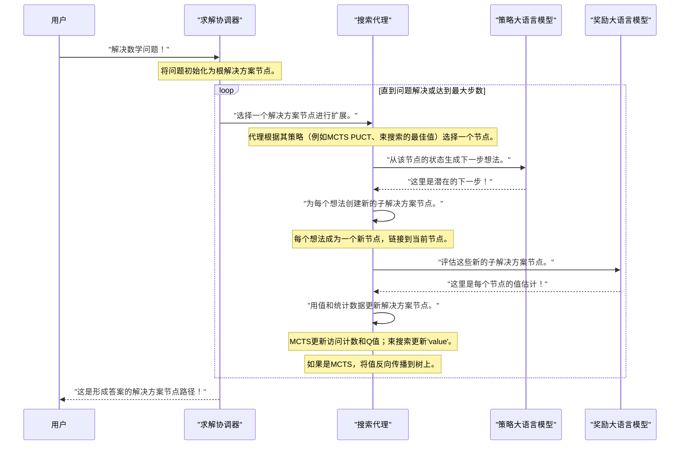

# 第4章：解决方案节点

欢迎回到`rStar`

在[前一章](03_policy___reward_llms_.md)中，我们学习了**策略与奖励大语言模型**——这些"专家"负责生成想法并评估其质量。

它们为我们的"思考者"——[搜索代理](02_search_agents__mcts_beam_search__.md)提供了关键指导。

> 但这些想法和评估结果去了哪里？`rStar`如何跟踪解决复杂问题过程中的所有步骤、决策和结果？

这就是**解决方案节点**的用武之地

## 什么是解决方案节点？

想象我们正在尝试解决一个非常困难的谜题，比如一个复杂的数学证明。我们不会直接跳到答案，而是会先采取一个步骤，然后是另一个步骤，观察每个行动的结果。

如果第一条路径看起来不太有希望，我们可能会尝试另一条路径。

**解决方案节点**是帮助`rStar`组织整个问题解决过程的基本构建块。可以将每个解决方案节点视为：

*   **一个单独的"思考"或"步骤"**：它代表[搜索代理](02_search_agents__mcts_beam_search__.md)采取的一个单独行动。
*   **决策树中的一张"卡片"**：每个节点存储拼图的一部分：
    *   到目前为止开发的*部分解决方案*。
    *   代理决定采取的*行动*。
    *   该行动产生的任何*观察结果*（例如Python脚本的输出）。
*   **历史记录**：节点以树状结构连接。每个节点知道它的"父节点"（导致它的步骤）和"子节点"（可能跟随它的步骤）。这使得`rStar`能够追溯它是如何到达某个点的，并探索替代路径。

本质上，解决方案节点是系统用于探索和构建解决方案的记忆和路线图。

## 作为节点树的问题解决方案

让我们可视化解决方案节点如何为一个简单的数学问题"解方程：2x + 5 = 15"形成解决方案树。

1.  **开始**：问题本身是**根节点**（节点0）。它没有父节点。
2.  **第一步（想法生成）**：[搜索代理](02_search_agents__mcts_beam_search__.md)向[策略大语言模型](03_policy___reward_llms_.md)请求想法。它可能会建议"两边减去5"。
3.  **新节点（扩展）**：创建一个新的**解决方案节点**（节点0.1）作为节点0的子节点。它存储：
    *   **部分解决方案**："步骤：两边减去5。"
    *   **行动**："思考"（或"解决"）。
    *   **观察结果**："方程变为2x = 10。"
4.  **第二步**：从节点0.1，代理考虑下一步行动。[策略大语言模型](03_policy___reward_llms_.md)建议"两边除以2"。
5.  **另一个新节点**：创建一个新的**解决方案节点**（节点0.1.1）作为节点0.1的子节点。它存储：
    *   **部分解决方案**："步骤：两边除以2。"
    *   **行动**："思考。"
    *   **观察结果**："方程变为x = 5。"
6.  **最终答案**：这个节点可能被标记为带有`final_answer`字段的"终端"节点，表示问题已解决。

==这个节点链（0 -> 0.1 -> 0.1.1）形成了一条可能的解决方案路径==。

如果代理从节点0探索另一个想法（例如"先除以2"），它将创建一个不同的子节点（例如节点0.2），在树中开始一个新的分支。

## `rStar`如何使用解决方案节点（无直接用户交互）

作为用户，我们不会直接创建或操作解决方案节点。它们是[求解协调器](01_solver_orchestrator_.md)和[搜索代理](02_search_agents__mcts_beam_search__.md)用于管理问题解决过程的内部表示。

它们的主要目的是：
*   **==跟踪状态==**：每个节点准确记录给定点的问题状态。
*   **==形成搜索树==**：它们构建[搜索代理](02_search_agents__mcts_beam_search__.md)探索的分支结构。
*   **==存储信息==**：它们保存[策略大语言模型](03_policy___reward_llms_.md)生成的文本和[奖励大语言模型](03_policy___reward_llms_.md)的评估结果。
*   **==支持学习（MCTS）==**：对于MCTS，特定类型的节点存储统计数据（如访问计数和值），帮助代理学习`哪些路径最有希望`。

## 幕后：解决方案节点的结构

让我们看看解决方案节点在`rStar`代码库中是如何表示的。主要有两种类型：`BaseNode`和`MCTSNode`。

### 1. `BaseNode`：每个步骤的基础

`rStar`中的==所有解决方案节点都建立在`BaseNode`类之上==。这个类定义了解决方案树中每个步骤所需的通用属性。

以下是`BaseNode`结构的简化视图（来自`rstar_deepthink/nodes/base_node.py`）：

```python
# 来自rstar_deepthink/nodes/base_node.py

class BaseNode(BaseModel):
    state: Dict[str, str] = {"text": "", "extra_info": ""} # 存储步骤的详细信息
    additional_state_keys: List[str] = [] # 用于自定义数据
    parent: Optional[Any] = None         # 链接到前一步骤（节点）
    children: List[Any] = []             # 下一个可能步骤（节点）的列表
    depth: int = 0                       # 该节点在树中的深度
    is_terminal: bool = False            # 如果此节点结束路径（例如找到答案、错误）则为True
    reward: Optional[float] = None       # 来自奖励大语言模型的奖励（如果适用）
    value: Optional[float] = 0           # 值估计（来自奖励大语言模型或MCTS）
    tag: str = "0"                       # 唯一标识符（例如"0.1"、"0.1.1"）
    consecutive_errors: int = 0          # 跟踪此路径的错误
    
    def __init__(self, **kwargs) -> None:
        super().__init__(**kwargs)
        # 初始化状态字典中的任何附加键
        for key in self.additional_state_keys:
            self.state[key] = ""

    def has_children(self) -> bool:
        return self.children != [] # 检查此节点是否有后续步骤
```

`BaseNode`的关键点：

*   **`state`**：这是最重要的部分，它是一个字典，保存关于这个特定步骤的所有具体细节，例如部分解决方案的`text`、采取的`action`、`observation`结果或`final_answer`。
*   **`parent`和`children`**：这些字段对于构建树状结构、连接节点至关重要。
*   **`depth`**：跟踪到达此节点所需的步骤数。
*   **`is_terminal`**：指示此路径是否已结束，无论是成功还是由于错误。
*   **`value`**：存储此节点的分数或值估计，通常由[奖励大语言模型](03_policy___reward_llms_.md)提供。

### 搜索代理如何创建`BaseNode`

[束搜索代理（BS）](02_search_agents__mcts_beam_search__.md)直接使用`BaseNode`来表示其解决方案步骤。让我们看看在`BS`代理中如何创建新节点（来自`rstar_deepthink/agents/beam_search.py`）：

```python
# 来自rstar_deepthink/agents/beam_search.py（简化）

class BS(BaseTree):
    NODE_KEYS: List[str] = ["action", "action_input", "final_answer"]
    # ... 其他属性 ...

    def create_node(self, parent: Optional[Type[BaseNode]] = None) -> Type[BaseNode]:
        # 此方法用于创建新的BaseNode
        return BaseNode(
            parent=parent, 
            additional_state_keys=self.NODE_KEYS,
        )
    
    def create_child(
        self, 
        step_result: str, 
        parser_result: Dict[str, str], 
        node: Type[BaseNode], # 这是父节点
    ) -> None:
        new_node = self.create_node(parent=node) # 创建新节点，链接到父节点
        new_node.depth = node.depth + 1
        new_node.tag = f"{node.tag}.{len(node.children) + 1}" # 分配唯一标签
        
        # 用步骤详情填充状态字典
        if parser_result is None:
            new_node.is_terminal = True
            new_node.state["text"] = step_result
            new_node.state["final_answer"] = "NO_VALID_CHILD"
        elif parser_result["final_answer"]:
            new_node.is_terminal = True
            new_node.state["text"] = step_result
            new_node.state["final_answer"] = parser_result["final_answer"]
        elif parser_result["action"]:
            # 如果采取了行动（例如调用Python工具）
            observation = code_execution(node, parser_result) # 执行代码，获取观察结果
            new_node.state["action"] = parser_result["action"]
            new_node.state["action_input"] = parser_result["action_input"]
            new_node.state["observation"] = observation
            new_node.state["text"] = f"{step_result}{self.config.step_delim}{observation}"
            # ... 检查错误并在发生错误时设置is_terminal ...
        else:
            new_node.state["text"] = step_result

        node.children.append(new_node) # 将新节点添加到父节点的子节点列表
```
当调用`generate_next_step`时（我们在[第2章](02_search_agents__mcts_beam_search__.md)中看到过），`BS`代理遍历其当前最佳路径，并为每个路径调用`create_child`，将[策略大语言模型](03_policy___reward_llms_.md)生成的想法转换为新的`BaseNode`，用`step_result`、`action`和代码执行的`observation`填充它们的`state`。

### 2. `MCTSNode`：专为蒙特卡洛树搜索设计

[MCTS代理](02_search_agents__mcts_beam_search__.md)需要的不仅仅是基本信息来执行其智能搜索。它需要额外的统计数据来平衡探索和利用。这是由扩展`BaseNode`的`MCTSNode`处理的。

以下是`MCTSNode`的简化视图（来自`rstar_deepthink/nodes/mcts_node.py`）：

```python
# 来自rstar_deepthink/nodes/mcts_node.py（简化）

import numpy as np
from .base_node import BaseNode

class MCTSNode(BaseNode):
    c_puct: float = 2 # MCTS的探索常数

    # 存储MCTS特定统计数据的私有属性
    __visit_count: int = PrivateAttr(default=0) # 此节点被访问的次数
    __value_sum: float = PrivateAttr(default=0) # 通过此节点收集的奖励/值的总和

    def q_value(self) -> float:
        # 计算此节点的平均值
        if self.__visit_count == 0:
            return 0
        return self.__value_sum / self.__visit_count

    def visit_count(self) -> int:
        return self.__visit_count

    def update(self, value: float) -> None:
        # 当观察到新值时更新节点的统计数据
        self.__visit_count += 1
        self.__value_sum += value

    def update_recursive(self, value: float, start_node: Type[BaseNode]) -> None:
        # 这是MCTS中的"反向传播"：
        # 更新此节点及其所有父节点直到根节点。
        self.update(value)
        if self.tag != start_node.tag:
            self.parent.update_recursive(value, start_node)

    def puct(self) -> float:
        # 计算用于选择的PUCT（多项式上置信树）值
        # 这平衡了探索新路径与利用已知好路径。
        if not self.parent: return 0
        q_value = self.q_value() if self.visit_count() > 0 else 0
        if self.parent.visit_count() == 0 or self.visit_count() == 0:
            u_value = 0
        else:
            u_value = self.c_puct * np.sqrt(np.log(self.parent.visit_count()) / (self.visit_count()))
        return q_value + u_value
```

`MCTSNode`为MCTS添加了关键功能：
*   **`__visit_count`**：MCTS算法通过此节点探索的次数。
*   **`__value_sum`**：在通过此节点的模拟中收集的所有奖励的总和。
*   **`q_value()`**：通过此节点采取的路径的平均值（利用）。
*   **`puct()`**：一个分数，指导MCTS的选择，平衡`q_value`与"探索奖励"（基于`c_puct`和`visit_count`）。
*   **`update()`和`update_recursive()`**：这些方法对于MCTS中的"反向传播"步骤至关重要，其中模拟的结果用于更新树中所有祖先节点的统计数据。

### 搜索代理如何创建`MCTSNode`

[MCTS代理](02_search_agents__mcts_beam_search__.md)（来自`rstar_deepthink/agents/mcts.py`）使用这些专用节点：

```python
# 来自rstar_deepthink/agents/mcts.py（简化）

from rstar_deepthink.nodes import MCTSNode
from .beam_search import BS # MCTS通常继承自束搜索基类

class MCTS(BS): # MCTS扩展束搜索，复用一些逻辑
    # ... 其他属性 ...

    def create_node(self, parent: Optional[Type[MCTSNode]] = None) -> Type[MCTSNode]:
        # 此方法用于创建新的MCTSNode
        return MCTSNode(
            parent=parent, 
            additional_state_keys=self.NODE_KEYS,
            c_puct=self.config.c_puct, # 传递探索常数
        )
    
    def eval_final_answer(self, node: Type[MCTSNode]) -> None:
        # 此方法是MCTS"反向传播"步骤的一部分
        if node.state["final_answer"] in ["NO_VALID_CHILD", "TOO_MANY_STEPS", "TOO_MANY_CODE_ERRORS"]:
            node.update(self.config.negative_reward) # 分配惩罚
            return
        
        # 如果答案正确，更新节点及其祖先
        if self.config.is_sampling:
            correct = is_equiv(self.ground_truth, node.state["final_answer"])
            node.update_recursive(self.config.positive_reward if correct else self.config.negative_reward, self.root)
        # ... 其他逻辑
```
当创建`MCTSNode`时，它用配置中的`c_puct`值初始化。`eval_final_answer`方法负责调用`update_recursive`，将奖励（或惩罚）传播到树上，使MCTS算法能够从每次模拟中学习。

### 解决方案节点类型：快速比较

| 特性         | `BaseNode`                                                   | `MCTSNode`                                            |
| :----------- | :----------------------------------------------------------- | :---------------------------------------------------- |
| **目的**     | 任何解决方案步骤的基本单位。                                 | 专为蒙特卡洛树搜索设计。                              |
| **核心数据** | `state`（文本、行动、观察结果、final_answer）。              | `state` + `__visit_count`、`__value_sum`、`c_puct`。  |
| **树链接**   | `parent`、`children`。                                       | `parent`、`children`。                                |
| **评估**     | `value`（来自[奖励大语言模型](03_policy___reward_llms_.md)的直接分数）。 | `q_value()`、`puct()`（从统计数据计算）。             |
| **更新逻辑** | 简单的`value`分配。                                          | `update()`、`update_recursive()`用于学习/反向传播。   |
| **使用者**   | [束搜索代理](02_search_agents__mcts_beam_search__.md)。      | [MCTS代理](02_search_agents__mcts_beam_search__.md)。 |

## 节点的旅程：从想法到解决方案

让我们用一个简化的序列来总结解决方案节点如何在`rStar`的问题解决过程中使用：


此图说明了[搜索代理](02_search_agents__mcts_beam_search__.md)在[策略与奖励大语言模型](03_policy___reward_llms_.md)的指导下，如何迭代地构建和优化**解决方案节点**树，直到找到完整解决方案的连续循环。

## 结论

我们现在已经探索了**解决方案节点**，这些节点代表了`rStar`问题解决旅程中的每个步骤。我们了解到：
*   解决方案节点存储部分解决方案、行动、观察结果和评估。
*   它们形成树状结构，使`rStar`能够探索多条路径并跟踪其进展。
*   `BaseNode`提供核心结构，而`MCTSNode`为蒙特卡洛树搜索的学习过程添加了专用字段。
*   用户不直接与它们交互；它们由[求解协调器](01_solver_orchestrator_.md)和[搜索代理](02_search_agents__mcts_beam_search__.md)管理。

这些节点对于`rStar`执行复杂推理、记住其步骤并从经验中学习至关重要。

在[下一章](05_system_configuration_.md)中，我们将转向**系统配置**，了解如何通过调整其组件的各种参数来自定义`rStar`的行为。

[下一章：系统配置](05_system_configuration_.md)