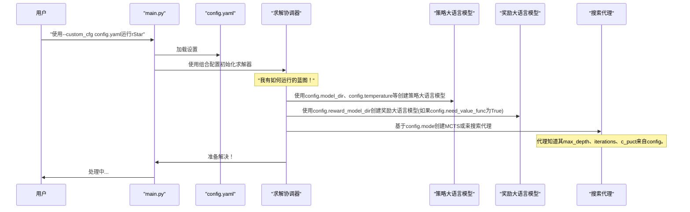

# 第5章：系统配置

欢迎回到`rStar`

在[前一章](04_solution_nodes_.md)中，我们探索了**解决方案节点**，这些构建块记录了`rStar`在解决问题过程中采取的每个步骤和决策

这些节点存储了[搜索代理(MCTS/束搜索)](02_search_agents__mcts_beam_search__.md)收集并由[策略与奖励大语言模型](03_policy___reward_llms_.md)评估的智慧。

但是我们如何告诉`rStar`要==使用*哪个*==[搜索代理(MCTS/束搜索)](02_search_agents__mcts_beam_search__.md)，或者在哪里找到[策略与奖励大语言模型](03_policy___reward_llms_.md)？如何调整它的行为，比如让它更有创造力或更专注？这就是**系统配置**的作用

## 什么是系统配置？

想象`rStar`是一个设计用于解决数学问题的高度先进的机器人。这个机器人有许多内部旋钮、开关和按钮：
*   "我今天应该使用哪种问题解决策略：==深度思考(`MCTS`)还是快速决策(`束搜索`)==？"
*   "在头脑风暴新步骤时，我应该有多大的创造力？"
*   "在放弃之前，我应该尝试解决这个问题多少次？"
*   "我在哪里可以找到我的'大脑'(大语言模型)？"

**系统配置**就像是机器人的**控制面板或蓝图**。

它是一个抽象概念，定义了==控制整个`rStar`系统运行的所有可调参数==。我们不需要改变机器人的核心线路(Python代码)，只需调整这些设置就可以自定义其行为、分配资源并指导其问题解决方法。

这使我们能够：
*   **实验**：轻松尝试不同的策略，看看哪些最适合不同的问题
*   **自定义**：根据我们的特定需求定制`rStar`的行为
*   **控制资源**：管理`rStar`使用的内存或计算量

## 关键配置概念

`rStar`系统高度可定制，许多方面都通过配置控制。以下是一些最重要的可调参数：

| 配置参数           | 控制内容                                                     | 示例值              |
| :----------------- | :----------------------------------------------------------- | :------------------ |
| `mode`             | 使用的[搜索代理(MCTS/束搜索)](02_search_agents__mcts_beam_search__.md)类型。 | `"mcts"`或`"bs"`    |
| `model_dir`        | [策略大语言模型](03_policy___reward_llms_.md)所在目录的路径。 | `"/path/to/model"`  |
| `reward_model_dir` | [奖励大语言模型](03_policy___reward_llms_.md)所在目录的路径。 | `"/path/to/rm"`     |
| `need_value_func`  | 是否使用[奖励大语言模型](03_policy___reward_llms_.md)进行评估。 | `True`或`False`     |
| `temperature`      | [策略大语言模型](03_policy___reward_llms_.md)生成想法时的"创造力"。值越高越有创造力。 | `0.7`到`1.0`        |
| `max_tokens`       | 大语言模型一步可以生成的最大文本长度。                       | `2048`              |
| `stop`             | 告诉大语言模型停止生成文本的特殊标记列表(如`"<end_of_step>"`)。 | `["<end_of_step>"]` |
| `max_depth`        | 解决方案路径中允许的[解决方案节点](04_solution_nodes_.md)(步骤)的最大数量。 | `16`                |
| `iterations`       | (仅MCTS)MCTS代理执行的完整"推演"或模拟次数。                 | `48`                |
| `c_puct`           | (仅MCTS)平衡MCTS中探索与利用的常数。                         | `2`                 |
| `step_beam_width`  | (仅束搜索)每一步保留的最佳路径数量。                         | `8`                 |
| `positive_reward`  | 正确解决方案的数值奖励。                                     | `1.0`               |
| `negative_reward`  | 错误解决方案或错误的数值惩罚。                               | `-1.0`              |
| `errors_threshold` | 在终止路径之前允许的连续Python执行错误的最大数量。           | `2`                 |

这些参数让我们可以精细控制`rStar`的行为

## 如何配置`rStar`：我们的控制面板

我们主要通过**YAML文件**与`rStar`的配置交互。这些是简单的文本文件，以人类可读的方式组织设置。`rStar`在`config/`目录中提供了几个示例配置文件，如`config/sample_mcts.yaml`和`config/sft_eval_bs.yaml`。

### 1. 选择配置文件

假设我们想使用蒙特卡洛树搜索([MCTS](02_search_agents__mcts_beam_search__.md))算法运行`rStar`并指定设置。我们会选择类似`config/sample_mcts.yaml`的文件：

```yaml
# 来自config/sample_mcts.yaml(简化)
mode: "mcts"          # 使用MCTS搜索代理
model_dir: ""         # 策略大语言模型路径
temperature: 0.7      # 大语言模型创造力
max_depth: 16         # 解决方案中的最大步骤
iterations: 48        # MCTS模拟次数
need_value_func: False # 不使用奖励模型
# ... 许多其他设置...
```

或者，如果我们更喜欢[束搜索(BS)](02_search_agents__mcts_beam_search__.md)并想使用[奖励模型](03_policy___reward_llms_.md)：

```yaml
# 来自config/sft_eval_bs.yaml(简化)
mode: "bs"            # 使用束搜索代理
model_dir: ""
reward_model_dir: ""  # 奖励模型路径
temperature: 1        # 更高的创造力
step_beam_width: 8    # 保留8条最佳路径
need_value_func: True # 使用奖励模型
# ... 许多其他设置...
```

### 2. 在`main.py`中加载配置

当我们使用`main.py`运行`rStar`时，它会加载这些配置文件。我们可以使用`--custom_cfg`命令行参数指定自定义配置文件。

以下是`main.py`处理加载所选配置的方式：

```python
# 来自main.py(简化)
import argparse
from omegaconf import OmegaConf # 用于管理配置的库
from rstar_deepthink.config import BaseConfig

def parse_args():
    args = argparse.ArgumentParser()
    # 在这里指定我们的配置文件：
    args.add_argument('--custom_cfg', type=str, default="config/sft_eval_mcts.yaml")
    # 我们也可以从命令行覆盖模型路径
    args.add_argument('--model_dir', type=str, default="") 
    args.add_argument('--reward_model_dir', type=str, default="") 
    args = args.parse_args()
    return args

if __name__ == '__main__':
    args = parse_args()

    # 1. 从默认的结构化配置开始
    config = OmegaConf.structured(BaseConfig)

    # 2. 加载我们的自定义配置文件并合并
    if args.custom_cfg:
        custom_config = OmegaConf.load(args.custom_cfg)
        config = OmegaConf.merge(config, custom_config)
    
    # 3. 完成配置对象
    config = OmegaConf.create(OmegaConf.to_yaml(config, resolve=True))

    # 4. 命令行参数可以覆盖配置文件设置
    if args.model_dir:
        config.model_dir = args.model_dir
    # ... 类似处理reward_model_dir...

    print(config) # 打印出所有最终使用的设置
    # ... rStar设置的其余部分...
```

**解释：**
1.  `parse_args()`读取我们提供的任何命令行参数，包括要使用的`custom_cfg`文件。
2.  `OmegaConf.structured(BaseConfig)`基于`rStar`的内部默认设置(在`BaseConfig`类中定义，我们稍后会看到)创建一个起始`config`对象。
3.  `OmegaConf.load(args.custom_cfg)`读取我们选择的YAML文件。
4.  `OmegaConf.merge(config, custom_config)`将我们文件中的设置与默认设置合并。如果我们的文件指定了一个设置(如`mode: "bs"`)，它会覆盖默认值。
5.  最后，任何命令行参数(如`--model_dir /new/path`)可以进一步覆盖来自默认值和我们的YAML文件的设置，给我们最大的灵活性。
6.  `config`对象然后保存所有这些最终的组合设置。

在此过程之后，`main.py`脚本将这个`config`对象传递给[求解协调器](01_solver_orchestrator_.md)，然后它使用它来设置所有其他组件，如[搜索代理(MCTS/束搜索)](02_search_agents__mcts_beam_search__.md)和[策略与奖励大语言模型](03_policy___reward_llms_.md)。

## 幕后：`BaseConfig`蓝图

`rStar`的所有可配置参数都在一个名为`BaseConfig`的中心Python类中定义。这个类充当传递给系统的`config`对象的蓝图。

我们可以在`rstar_deepthink/config.py`中找到`BaseConfig`：

```python
# 来自rstar_deepthink/config.py(简化)
from dataclasses import dataclass, field
from typing import List, Optional

@dataclass
class BaseConfig:
    mode: str = field(
        default="mcts", metadata={"help": "搜索模式用于推理"}
    )
    model_dir: Optional[str] = field(
        default=None, metadata={"help": "大语言模型目录"}
    )
    temperature: float = field(
        default=0.7, metadata={"help": "控制大语言模型生成的多样性"}
    )
    max_tokens: int = field(
        default=2048, metadata={"help": "生成的最大标记数。"}
    )
    stop: Optional[List[str]] = field(
        default=None, metadata={"help": "每个步骤可能的停止标记"}
    )
    max_depth: int = field(
        default=4, metadata={"help": "树的最大深度"}
    )
    iterations: int = field(
        default=1, metadata={"help": "mcts中的模拟次数"}
    )
    c_puct: float = field(
        default=2, metadata={"help": "mcts中c_puct的权重"}
    )
    need_value_func: bool = field(
        default=False, metadata={"help": "是否使用值头"}
    )
    # ... 更多配置参数...
```

**解释：**
*   `@dataclass`：这是Python的一个特性，可以轻松创建主要用于存储数据的类，比如我们的配置设置。
*   `field(default=..., metadata={"help": ...})`：每个参数都有一个默认值，重要的是，还有一个`help`消息解释它的作用。这使得`BaseConfig`自我记录！
*   `typing.Optional`和`typing.List`：这些表示参数可能是`None`(空)或项目列表。

当在`main.py`中调用`OmegaConf.structured(BaseConfig)`时，它基本上创建了一个包含所有这些默认值的对象。然后，我们的YAML文件和命令行参数更新这些值。

## 求解协调器如何使用配置

`config`对象是所有`rStar`组件的中央真相来源。[求解协调器](01_solver_orchestrator_.md)在创建时接收这个`config`，然后使用它来初始化所有其他内容。

以下是`config`在系统中流动的简化序列：



让我们回顾一下`Solver`的`__init__`方法(来自[第1章](01_solver_orchestrator_.md))，看看它如何使用`config`：

```python
# 来自rstar_deepthink/solver.py(简化init方法)

class Solver(BaseModel):
    config: Any # 这将是我们加载的BaseConfig对象
    llm: Optional[Callable[[...], List[str]]] = None
    reward_model: Optional[Any] = None
    max_agent_steps: int = 1

    def __init__(self, **kwargs) -> None:
        super().__init__(**kwargs)
        # 使用配置决定是否需要奖励模型
        self.need_value_func = self.config.need_value_func
        if self.need_value_func:
            self.reward_model = self.create_rm() # 如果为True则创建奖励模型
        
        self.llm = self.create_llm() # 总是创建策略大语言模型

        # 使用配置基于搜索模式设置代理步骤
        if self.config.mode == "mcts":
            self.max_agent_steps = self.config.iterations # MCTS使用'iterations'
        elif self.config.mode == "bs":
            self.max_agent_steps = self.config.max_depth # 束搜索可能使用'max_depth'或类似
        # ... 其他配置在求解器的方法中使用...
```

**解释：**
*   `Solver`类将整个`config`对象存储在`self.config`中。
*   它直接访问属性如`self.config.need_value_func`来做决定(例如是否加载[奖励大语言模型](03_policy___reward_llms_.md))。
*   它使用`self.config.mode`来调整其`max_agent_steps`(控制问题解决的主循环)。
*   `create_llm()`和`create_rm()`方法(如[第3章](03_policy___reward_llms_.md)所见)也严重依赖`self.config`参数如`model_dir`、`temperature`、`max_tokens`等来正确设置大语言模型。

通过将所有这些参数集中在`config`对象中，`rStar`获得了灵活性。

我们可以==快速切换不同的问题解决策略，调整大语言模型行为，并微调性能，而无需触及`rStar`代码库的核心逻辑==。

## 结论

我们现在已经探索了**系统配置**，`rStar`强大的控制面板！我们了解到：
*   配置定义了`rStar`的所有可调参数，允许自定义和实验。
*   关键参数==控制==[搜索代理(MCTS/束搜索)](02_search_agents__mcts_beam_search__.md)、[策略与奖励大语言模型](03_policy___reward_llms_.md)和整体系统行为。
*   我们通过==YAML文件管理配置==，这些文件由`main.py`加载和合并。
*   ==`BaseConfig`类充当`config`对象的蓝图==，提供默认值和文档。
*   [求解协调器](01_solver_orchestrator_.md)使用这个`config`对象来初始化和指导所有其他组件。

有了对系统配置的扎实理解，我们现在可以有效地引导`rStar`解决广泛的问题。在下一章中，我们将深入探讨**Python执行工具**，了解`rStar`如何在问题解决过程中==运行Python代码来执行计算并与现实世界交互==。

[下一章：Python执行工具](06_python_execution_tool_.md)

