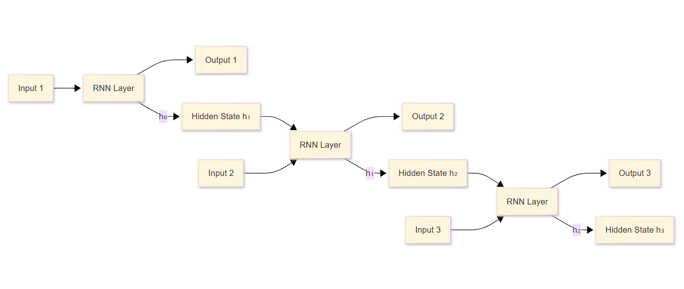
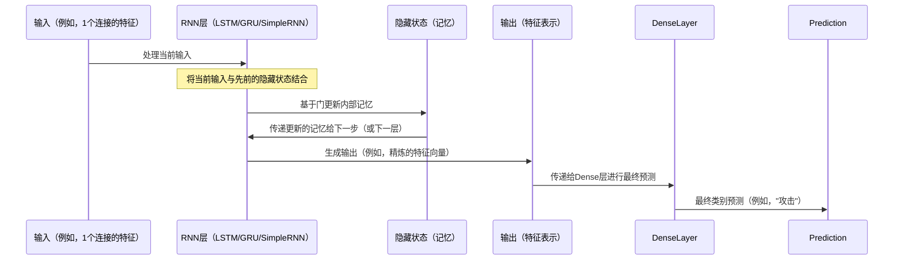

# 第6章：循环神经网络（RNN）模型（LSTM/GRU/SimpleRNN）

欢迎回来

在[第1章：分类任务配置（二分类 vs. 多分类）](01_classification_task_configuration__binary_vs__multiclass__.md)中，我们学习了如何提出正确的问题

- 在[第2章：数据加载与预处理](02_data_loading_and_preprocessing_.md)中，我们准备好了数据"食材"

- 在[第3章：经典机器学习模型](03_classical_machine_learning_models_.md)中，我们探索了传统工具
- 在[第4章：深度前馈神经网络（DNN）模型](04_deep_feed_forward_neural_network__dnn__models__.md)中，我们首次深入研究了深度学习
- 最近，在[第5章：纯卷积神经网络（CNN）模型](05_pure_convolutional_neural_network__cnn__models__.md)中，我们看到CNN如何==作为"模式检测器"在网络数据中发现局部签名==

虽然CNN非常擅长发现特征序列中任何地方出现的模式，但如果这些==特征的顺序和上下文至关重要呢==？

想象一个数据分析师，他不仅观察当前事件，还记住并学习所有过去的事件以理解更大的图景。例如，一系列看似无害的网络事件，`当以特定顺序查看时，可能会变得高度可疑`。

这就是**循环神经网络（RNN）模型**的用武之地

RNN是==一种专门为序列数据设计的特殊神经网络==。

它们具有内部"记忆"，可以处理信息序列，记住序列早期部分的见解以指导对后续部分的决策。对于我们的网络入侵检测（NID）项目，RNN就像具有卓越长期记忆的安全警卫，使他们能够发现随时间展开的攻击。

## RNN解决了什么问题？

RNN专门==用于理解序列中的依赖关系和模式==。与通常独立处理每个输入的DNN或CNN不同，RNN考虑输入的顺序。这在NID中非常有价值，因为许多攻击不是单一的孤立事件，而是事件的序列或特定的活动流，当组合在一起时，标志着入侵。

对于我们的网络流量数据，尽管我们查看的是单个连接的41个特征，但这些特征可以被视为一个短序列或全面的"快照"。RNN可以利用其内部记忆来捕捉这些特征之间的复杂关系和依赖关系，将它们作为顺序输入，有效地将网络连接分类为"正常"或"攻击"（二分类），或精确定位"攻击类型"（多分类）。

## RNN的关键概念

RNN的核心思想是能够==将信息从序列中的一个步骤传递到下一个步骤==。这种"记忆"使其能够理解上下文。我们将探讨三种主要的RNN层类型：`SimpleRNN`、`LSTM`和`GRU`。

### 1. 核心思想：内部记忆（循环）

想象一个普通的神经网络层接收输入。它处理输入并输出结果。RNN层做同样的事情，但有一个额外的步骤：它还将其内部状态（其"记忆"）的副本发送回自身，用于序列中的下一个输入。



这种循环`赋予了RNN其"循环"性质及其记忆能力`。

### 2. SimpleRNN：基本的循环层

`SimpleRNN`是最直接的循环层类型。它处理输入序列，并在`每个时间步`，根据当前输入和先前的隐藏状态更新其隐藏状态。

*   **工作原理（类比）**：想象一个人试图记住一长串数字。他们听到一个数字，短暂记住上一个数字，然后在听到下一个数字之前将新数字添加到他们的短期记忆中。这很简单，但它可能难以记住序列中较早的部分。这被称为"==梯度消失问题=="——早期步骤中的重要信息会随时间丢失。

### 3. LSTM（长短期记忆）：智能记忆门

`LSTM`层是RNN的一个突破，因为它们解决了梯度消失问题。它们具有更复杂的内部结构，包括控制信息流的"门"。这些门决定：

*   **记住什么信息**：哪些部分的先前记忆足够重要需要保留。
*   **添加什么新信息**：当前输入的哪些部分应该存储。
*   **忘记什么信息**：旧记忆的哪些部分不再相关。
*   **输出什么**：当前记忆的哪些部分对下一层相关。

*   **工作原理（类比）**：LSTM就像一个超级有条理的数据分析师，他们==有一个系统来记录、划掉和突出显示笔记中的内容==，确保他们在非常长的报告（序列）中==保留最重要的信息==。这使得它们非常适合捕捉长期依赖关系。

### 4. GRU（门控循环单元）：简化的记忆门

`GRU`层是LSTM的略微简化版本。它们也使用门控机制来控制信息流，但门更少。这使得它们在计算上更便宜（训练更快），同时通常能达到类似的性能。

*   **工作原理（类比）**：GRU就像一个稍微不那么细致但仍然非常有效的数据分析师。他们有一个简化的系统来管理笔记，仍然擅长在长时间内记住关键事实，但==内部步骤比LSTM少==。

### 5. RNN的输入形状：`[samples, time_steps, features]`

对于RNN，输入数据需要是3D格式：
*   `samples`：数据集中单个网络连接（行）的数量。
*   `time_steps`：输入RNN的序列长度。
*   `features`：每个`time_step`的特征数量。

对于我们的KDD数据集，有41个特征，表示"特征序列"的自然方式是`[number_of_connections, 41, 1]`，其中每个特征是一个`time_step`并有一个值。

然而，提供的项目代码通常将数据重塑为`(trainX.shape[0], 1, trainX.shape[1])`，即`[samples, 1, 41]`。在这种特定设置中：
*   `time_steps = 1`：RNN将整个41维特征向量作为单个输入步骤处理。
*   `features = 41`：所有41个特征在该单个步骤中一次性呈现。

虽然这对"序列数据"来说可能看起来违反直觉，但这是使用RNN的有效方式。循环单元（SimpleRNN、LSTM或GRU）仍然使用其内部记忆机制来处理复杂的41维输入并保持状态。

> 如果堆叠多个RNN层（如`lskeras3.py`文件中所示），`return_sequences`参数有助于将状态从一层传递到下一层，建立更深的理解。

### 6. `return_sequences`参数：用于堆叠RNN层

当堆叠多个RNN层时，需要告诉较早的RNN层输出其完整的隐藏状态序列，而不仅仅是最终状态。
*   **`return_sequences=True`**：RNN层将输出一个序列（每个`time_step`的隐藏状态）。如果要将一个RNN层的输出馈送到另一个RNN层，则需要此参数。
*   **`return_sequences=False`（默认）**：RNN层将仅输出序列中最后一个`time_step`的隐藏状态。这通常用于网络中的最后一个RNN层，在连接到分类的`Dense`层之前。

## 如何构建用于入侵检测的RNN

我们将使用Keras构建我们的RNN模型。基本步骤与其他深度学习模型类似：

1.  **==启动一个`Sequential`模型==**。
2.  **==添加`SimpleRNN`、`LSTM`或`GRU`层==**：定义神经元数量和`input_dim`。
3.  **==添加`Dropout`层==**：防止过拟合，就像在[第4章：深度前馈神经网络（DNN）模型](04_deep_feed_forward_neural_network__dnn__models__.md)中一样。
4.  **==添加`Dense`输出层==**：根据[第1章：分类任务配置（二分类 vs. 多分类）](01_classification_task_configuration__binary_vs__multiclass__.md)配置为二分类或多分类。
5.  **==编译模型==**：定义损失函数、优化器和指标。

记住，我们的输入数据必须重塑为`[samples, time_steps, features]`，对于项目代码来说是`[number_of_connections, 1, 41]`。

让我们看一个简化示例。假设`X_train`包含我们归一化和重塑的网络特征，`y_train`包含标签，如[第2章](02_data_loading_and_preprocessing_.md)和[第1章](01_classification_task_configuration__binary_vs__multiclass__.md)所述。

### 示例代码：用于二分类的简单GRU（1层）

以下是构建一个带有一个隐藏层的基本GRU模型用于二分类入侵检测的方法：

```python
from keras.models import Sequential
from keras.layers import GRU, Dense, Activation, Dropout
import numpy as np # 用于数据创建示例

# --- 假设 X_train 和 y_train 已准备好并重塑 ---
# 为了演示，我们创建一些虚拟数据：
# 1000个样本，1个时间步，每个时间步41个特征
X_train_dummy = np.random.rand(1000, 1, 41)
y_train_dummy = np.random.randint(0, 2, 1000) # 二分类标签（0或1）

# 1. 开始定义网络
model = Sequential()

# 2. 添加一个GRU层
#    - 4个神经元（units）：这是输出空间的维度。
#    - input_dim=41：每个时间步的特征数量。
#      （注意：时间步维度（1）由Keras隐式处理
#       当为第一层提供input_dim时，给定3D输入形状）
model.add(GRU(4, input_dim=41))

# 3. 添加一个Dropout层
model.add(Dropout(0.1))

# 4. 添加输出层（用于二分类，第1章）
model.add(Dense(1)) # 二分类输出的1个神经元
model.add(Activation('sigmoid')) # 用于概率的Sigmoid激活

# 5. 编译模型
model.compile(loss='binary_crossentropy', optimizer='adam', metrics=['accuracy'])

print("简单GRU模型创建并编译完成！")
model.summary() # 打印模型层的摘要
```

**解释：**

*   `Sequential()`：初始化我们的模型。
*   `GRU(4, input_dim=41)`：这添加了一个具有4个内部单元（神经元）的GRU层，它将处理输入。`input_dim=41`告诉它每个时间步有41个特征。由于输入形状中`time_steps`为1，GRU一次性处理整个41维特征向量。
*   `Dropout(0.1)`：随机丢弃10%的神经元连接以防止过拟合。
*   `Dense(1)`和`Activation('sigmoid')`：用于二分类的输出层，产生概率。
*   `model.compile(...)`：使用适当的损失函数（`binary_crossentropy`）和优化器（`adam`）配置模型进行训练。

你可以轻松地将`GRU`替换为`LSTM`或`SimpleRNN`：

```python
# LSTM示例：
# model.add(LSTM(4, input_dim=41))

# SimpleRNN示例：
# model.add(SimpleRNN(4, input_dim=41))
```

### 示例代码：用于二分类的更深GRU（多层）

为了使RNN"更深"并捕捉更复杂的序列模式，你可以堆叠多个RNN层。这需要对除最后一个RNN层之外的所有层使用`return_sequences=True`。

```python
from keras.models import Sequential
from keras.layers import GRU, Dense, Activation, Dropout
# ...（数据准备和重塑如前所述）...

# 1. 开始定义网络
model_deep_gru = Sequential()

# 2. 添加第一个GRU层（输出完整序列给下一个GRU）
model_deep_gru.add(GRU(32, input_dim=41, return_sequences=True))
model_deep_gru.add(Dropout(0.1))

# 3. 添加第二个GRU层（也输出完整序列）
model_deep_gru.add(GRU(32, return_sequences=True))
model_deep_gru.add(Dropout(0.1))

# 4. 添加第三个GRU层（也输出完整序列）
model_deep_gru.add(GRU(32, return_sequences=True))
model_deep_gru.add(Dropout(0.1))

# 5. 添加最终的GRU层（仅输出最后状态给Dense层）
model_deep_gru.add(GRU(32, return_sequences=False)) # 最后一个GRU的return_sequences=False
model_deep_gru.add(Dropout(0.1))

# 6. 添加输出层
model_deep_gru.add(Dense(1))
model_deep_gru.add(Activation('sigmoid'))

# 7. 编译模型
model_deep_gru.compile(loss='binary_crossentropy', optimizer='adam', metrics=['accuracy'])

print("\n深度GRU模型创建并编译完成！")
model_deep_gru.summary()
```

**多分类的关键区别（根据前面章节推断）：**
提供的RNN项目代码主要关注二分类。然而，如果要适应多分类：
*   **标签准备**：你需要使用`to_categorical`对标签进行**one-hot编码**，如[第1章：分类任务配置（二分类 vs. 多分类）](01_classification_task_configuration__binary_vs__multiclass__.md)所述。
*   **输出层**：最终的`Dense`层将有`num_classes`神经元（例如，5种攻击类型的5个神经元）并使用`softmax`激活。
*   **损失函数**：模型将使用`loss='categorical_crossentropy'`编译。

示例（假设的，基于前面章节的多分类设置）：
```python
# from keras.utils.np_utils import to_categorical # 用于one-hot编码

# # 假设 y_train_raw 有标签 0, 1, 2, 3, 4
# num_classes = 5
# y_train_one_hot = to_categorical(y_train_raw, num_classes=num_classes)
# # ...（带有GRU层的其余模型定义）...

# # 多分类的输出层：
# model.add(Dense(num_classes)) # 例如，5个类别5个神经元
# model.add(Activation('softmax'))

# model.compile(loss='categorical_crossentropy', optimizer='adam', metrics=['accuracy'])
```

## 幕后：RNN如何处理数据

想象RNN是一个信息连续流，其中"记忆单元"随着序列的新部分的到达而不断更新。



在训练期间（我们将在[第8章：模型训练生命周期（Keras）](08_model_training_lifecycle__keras__.md)中介绍），这个过程对每个序列重复进行。

RNN层内的内部权重和门被调整以最小化`loss`，使模型能够学习序列的哪些部分重要需要记住或忘记以做出准确预测。

## 深入项目代码参考

让我们看看实际项目代码文件，了解这些RNN是如何实现的。你可以在`KDDCup 99/GRU/`、`KDDCup 99/LSTM/`和`KDDCup 99/SimpleRNN/`文件夹（以及其他数据集的类似文件夹）中找到这些内容。

### 1. RNN的数据准备

项目中的所有RNN模型使用相同的数据加载、归一化和重塑策略，类似于[第2章：数据加载与预处理](02_data_loading_and_preprocessing_.md)。关键部分是将数据重塑为`(samples, 1, 41)`：

```python
# 来自 KDDCup 99/GRU/binary/lskeras.py（以及LSTM/SimpleRNN文件中的类似内容）
import pandas as pd
import numpy as np
from sklearn.preprocessing import Normalizer

# ...（从CSV加载traindata、testdata，提取X、Y、C、T）...

scaler = Normalizer().fit(X)
trainX = scaler.transform(X)
scaler = Normalizer().fit(T)
testT = scaler.transform(T)

y_train = np.array(Y)
y_test = np.array(C)

# 将输入重塑为[samples, time steps, features]
# 这里，time_steps = 1，features = 41
X_train = np.reshape(trainX, (trainX.shape[0], 1, trainX.shape[1]))
X_test = np.reshape(testT, (testT.shape[0], 1, testT.shape[1]))

print("RNN的输入数据形状:", X_train.shape) # 将输出类似 (num_samples, 1, 41) 的内容
```

**观察：**这种一致的重塑确保数据匹配Keras RNN层的`(batch_size, timesteps, input_dim)`期望，其中`timesteps=1`和`input_dim=41`。

### 2. 简单RNN（1层）- 二分类

让我们看看`KDDCup 99/SimpleRNN/binary/lskeras.py`：

```python
# 来自 KDDCup 99/SimpleRNN/binary/lskeras.py（简化版）
from keras.models import Sequential
from keras.layers import SimpleRNN, Dense, Activation, Dropout

# ...（X_train, y_train, X_test, y_test 如上所述准备好）...

model = Sequential()
model.add(SimpleRNN(4, input_dim=41)) # 具有4个单元的SimpleRNN层
model.add(Dropout(0.1))
model.add(Dense(1)) # 输出Dense层
model.add(Activation('sigmoid')) # 用于二分类的Sigmoid激活
model.compile(loss='binary_crossentropy', optimizer='adam', metrics=['accuracy'])
# ...（训练时的model.fit调用）...
```

**观察：**这是一个简单的`SimpleRNN`层，后跟`Dropout`和二分类输出层。

### 3. GRU（1层）- 二分类

现在，对于`KDDCup 99/GRU/binary/lskeras.py`：

```python
# 来自 KDDCup 99/GRU/binary/lskeras.py（简化版）
from keras.models import Sequential
from keras.layers import GRU, Dense, Activation, Dropout

# ...（X_train, y_train, X_test, y_test 如上所述准备好）...

model = Sequential()
model.add(GRU(4, input_dim=41)) # 具有4个单元的GRU层
model.add(Dropout(0.1))
model.add(Dense(1))
model.add(Activation('sigmoid'))
model.compile(loss='binary_crossentropy', optimizer='adam', metrics=['accuracy'])
# ...（训练时的model.fit调用）...
```

**观察：**结构与`SimpleRNN`示例相同，只是将`SimpleRNN`替换为`GRU`。`input_dim=41`是一致的。

### 4. LSTM（1层）- 二分类

对于`KDDCup 99/LSTM/binary/lskeras.py`：

```python
# 来自 KDDCup 99/LSTM/binary/lskeras.py（简化版）
from keras.models import Sequential
from keras.layers import LSTM, Dense, Activation, Dropout

# ...（X_train, y_train, X_test, y_test 如上所述准备好）...

model = Sequential()
model.add(LSTM(4, input_dim=41)) # 具有4个单元的LSTM层
model.add(Dropout(0.1))
model.add(Dense(1))
model.add(Activation('sigmoid'))
model.compile(loss='binary_crossentropy', optimizer='adam', metrics=['accuracy'])
# ...（训练时的model.fit调用）...
```

**观察：**同样，结构相同，只是使用了`LSTM`。这突显了在Keras中轻松交换不同RNN层类型的能力。

### 5. 更深GRU（多层）- 二分类

最后，让我们看看`KDDCup 99/GRU/binary/lskeras3.py`，它展示了一个更深的GRU网络：

```python
# 来自 KDDCup 99/GRU/binary/lskeras3.py（简化版）
from keras.models import Sequential
from keras.layers import GRU, Dense, Activation, Dropout

# ...（X_train, y_train, X_test, y_test 如上所述准备好）...

model = Sequential()
model.add(GRU(32, input_dim=41, return_sequences=True)) # 第一个GRU，输出完整序列
model.add(Dropout(0.1))
model.add(GRU(32, return_sequences=True)) # 第二个GRU，输出完整序列
model.add(Dropout(0.1))
model.add(GRU(32, return_sequences=True)) # 第三个GRU，输出完整序列
model.add(Dropout(0.1))
model.add(GRU(32, return_sequences=False)) # 最终的GRU，输出最后状态
model.add(Dropout(0.1))
model.add(Dense(1))
model.add(Activation('sigmoid'))
model.compile(loss='binary_crossentropy', optimizer='adam', metrics=['accuracy'])
# ...（训练时的model.fit调用）...
```

**观察：**这个模型堆叠了四个`GRU`层。注意前三个`GRU`层的`return_sequences=True`，以确保它们的完整内部状态传递给下一个`GRU`层。最终的`GRU`层使用`return_sequences=False`（或省略，因为它是默认值），因为它的输出馈送到`Dense`分类层。`LSTM`和`SimpleRNN`在其各自的`lskeras3.py`文件中有类似的结构。

## 结论

现在，已经探索了循环神经网络（RNN）模型，包括`SimpleRNN`、`LSTM`和`GRU`

- 理解了这些模型如何通过其内部"记忆"机制专门用于处理序列数据并捕捉随时间变化的依赖关系，这对于复杂的网络入侵检测至关重要。

- 学习了输入数据的3D形状的重要性以及构建更深RNN时的`return_sequences`参数。

RNN，尤其是LSTM和GRU，是理解网络事件时间背景的强大工具。在下一章，我们将看到如何结合CNN（用于局部模式检测）和LSTM（用于序列记忆）的优势，创建更强大的"CNN-LSTM混合模型"。

[第7章：CNN-LSTM混合模型](07_cnn_lstm_hybrid_models_.md)