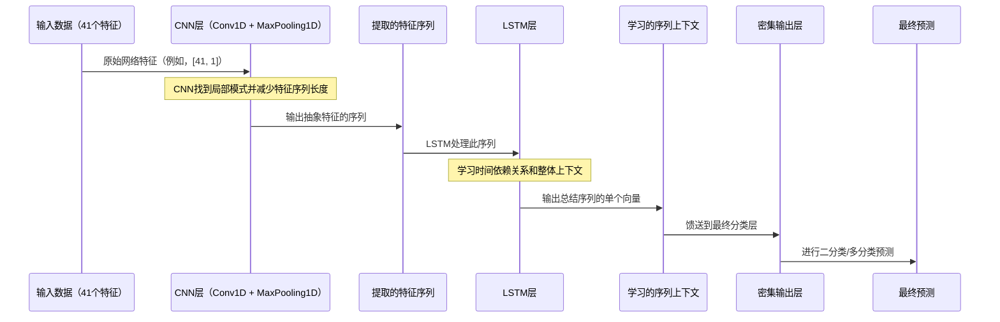

# 第7章：CNN-LSTM混合模型

欢迎回来

- 在[第1章：分类任务配置（二分类 vs. 多分类）](01_classification_task_configuration__binary_vs__multiclass__.md)中，我们学习了如何提出正确的问题
- 在[第2章：数据加载与预处理](02_data_loading_and_preprocessing_.md)中，我们准备好了数据"食材"；在[第3章：经典机器学习模型](03_classical_machine_learning_models_.md)中，我们探索了传统工具
- 在[第4章：深度前馈神经网络（DNN）模型](04_deep_feed_forward_neural_network__dnn__models__.md)中，我们首次深入研究了深度学习
- 最近，在[第5章：纯卷积神经网络（CNN）模型](05_pure_convolutional_neural_network__cnn__models__.md)中，我们发现CNN如何作为"模式检测器"找到局部签名
- 在[第6章：循环神经网络（RNN）模型（LSTM/GRU/SimpleRNN）](06_recurrent_neural_network__rnn__models__lstm_gru_simplernn__.md)中，我们学习了RNN（特别是LSTM）如何记忆和学习随时间变化的序列。

现在，如果我们可以将两者的优势结合起来会怎样？想象一下，你有两位高度专业化的安全专家。==一位专家（CNN）擅长快速发现信息流中的特定视觉细节或签名。另一位专家（LSTM）具有惊人的记忆力==，理解这些细节的整体流动、上下文和演变。

通过让他们一起工作，他们形成了一个强大的团队，能够检测到最复杂和不断演变的网络入侵。

这就是**CNN-LSTM混合模型**的力量

> 这些模型结合了CNN从网络流量数据中自动提取局部重要特征的能力，以及LSTM学习这些提取特征中序列模式和时间依赖关系的能力。

这就像拥有一支专门用于强大智能入侵检测的团队。

## CNN-LSTM混合模型解决了什么问题？

CNN-LSTM混合模型旨在捕捉序列数据中的局部空间特征和长期时间依赖关系。
对于我们的网络入侵检测（NID）项目，每个网络连接的数据是41个特征的序列（如[第2章：数据加载与预处理](02_data_loading_and_preprocessing_.md)所述，通常重塑为`[samples, 41, 1]`）。

*   **CNN部分**将扫描这41个特征（像一个1D序列）。它将自动学习识别重要的"局部签名"或在这些特征中短窗口内可能出现的小特征模式。例如，某些标志位和端口号的组合可能是攻击尝试的局部指示器。
*   **LSTM部分**然后获取这些"更高级"特征（来自CNN层的输出序列）并按顺序处理它们。它学习这些识别出的模式如何展开或相互关联，捕捉特征集中的更广泛上下文和依赖关系。这有助于模型理解信息的"流动"，即使在单个网络连接的特征内，也能更全面地理解其行为。

这种组合使模型能够深入理解网络流量的复杂性质，使其在将连接分类为"正常"或"攻击"（二分类），或精确定位"攻击类型"（多分类）方面非常有效。

## CNN-LSTM混合模型的关键概念

CNN-LSTM混合模型本质上是堆叠两种类型的神经网络层：CNN层作为特征提取器，LSTM层作为提取特征的序列处理器。

以下是它们如何协同工作：

### 1. ==CNN作为特征提取器==（前端）

*   **`Convolution1D`层**：如[第5章：纯卷积神经网络（CNN）模型](05_pure_convolutional_neural_network__cnn__models__.md)所学，这些层使用"过滤器"滑动我们的41个特征输入序列。它们自动检测重要的局部模式和关系。例如，当看到特定的协议标志序列时，过滤器可能会强烈激活。
*   **`MaxPooling1D`层**：卷积后，池化层（同样来自第5章）减少特征图的维度，仅保留最重要的模式检测。这简化了信息，同时保留了关键见解。

**关键点**：这些CNN和池化层的输出仍然是一个序列。它是更短、更丰富、更抽象的特征序列，代表检测到的局部模式。这非常适合LSTM接下来处理。

### 2.==LSTM作为序列建模器==（后端）

*   **`LSTM`层**：CNN层的输出序列直接馈送到`LSTM`层（来自[第6章：循环神经网络（RNN）模型（LSTM/GRU/SimpleRNN）](06_recurrent_neural_network__rnn__models__lstm_gru_simplernn__.md)）。LSTM将此CNN提取序列的每个元素视为一个"时间步"。其内部"记忆门"使其能够学习这些提取特征之间的复杂时间依赖关系和序列上下文。它可以记住特征序列早期检测到的模式与后期检测到的模式之间的关系。
*   **`Dropout`层**：在LSTM层之后，通常添加`Dropout`层（如[第4章：深度前馈神经网络（DNN）模型](04_deep_feed_forward_neural_network__dnn__models__.md)所述）以防止模型对训练数据过拟合。

### 3. 分类的输出层

*   **`Dense`输出层**：最后，LSTM层的输出（默认情况下是代表整个序列学习状态的单个向量）馈送到`Dense`层。如[第1章：分类任务配置（二分类 vs. 多分类）](01_classification_task_configuration__binary_vs__multiclass__.md)所学，该层将有1个带`sigmoid`激活的神经元用于二分类，或`N`个带`softmax`激活的神经元用于多分类。

## 如何构建CNN-LSTM混合模型

我们将使用Keras构建我们的CNN-LSTM模型。步骤涉及组合我们学到的层：

1.  **==准备数据==**：确保网络流量数据归一化并重塑为3D格式`[samples, time_steps, features]`。对于我们的KDD数据，这是`[number_of_connections, 41, 1]`，如[第2章：数据加载与预处理](02_data_loading_and_preprocessing_.md)所述。
2.  **==启动`Sequential`模型==**。
3.  **==添加`Convolution1D`层==**：为第一层定义过滤器、核大小、激活和`input_shape`。
4.  **==添加`MaxPooling1D`层==**：对特征图进行下采样。
5.  **添加`LSTM`层**：这些直接跟随`MaxPooling1D`层，处理其顺序输出。
6.  **添加`Dropout`层**：防止过拟合。
7.  **添加最终的`Dense`输出层**：配置为二分类或多分类。
8.  **编译模型**：定义损失函数、优化器和指标。

让我们看一个示例。假设`X_train`包含我们归一化和重塑的网络特征，`y_train`包含标签，如[第2章](02_data_loading_and_preprocessing_.md)和[第1章](01_classification_task_configuration__binary_vs__multiclass__.md)所述。

### 示例代码：用于二分类的简单CNN-LSTM

以下是构建用于二分类入侵检测的基本CNN-LSTM模型的方法：

```python
from keras.models import Sequential
from keras.layers import Convolution1D, MaxPooling1D, LSTM, Dense, Dropout
import numpy as np # 用于数据创建示例

# --- 假设 X_train 和 y_train 已准备好并重塑 ---
# 为了演示，虚拟数据（1000个样本，41个时间步，每个1个特征）
X_train_dummy = np.random.rand(1000, 41, 1)
y_train_dummy = np.random.randint(0, 2, 1000) # 二分类标签

# 定义LSTM输出的大小（神经元数量）
lstm_output_size = 70

# 1. 开始定义网络
model = Sequential()

# 2. 添加用于特征提取的CNN部分
#    卷积层：64个过滤器，核大小3，relu激活
#    input_shape=(41, 1)：我们的数据有41个特征，每个被视为具有1个值的时间步。
model.add(Convolution1D(64, 3, padding="same", activation="relu", input_shape=(41, 1)))
#    池化层：减少序列长度
model.add(MaxPooling1D(pool_size=2))

# 3. 添加用于序列建模的LSTM部分
#    LSTM层：处理CNN输出的特征序列
model.add(LSTM(lstm_output_size)) # LSTM单元的数量（这里为70）

# 4. 添加Dropout层以防止过拟合
model.add(Dropout(0.1))

# 5. 添加输出层（用于二分类，如第1章所述）
model.add(Dense(1, activation="sigmoid")) # 1个神经元，sigmoid用于概率

# 6. 编译模型
model.compile(loss="binary_crossentropy", optimizer="adam", metrics=['accuracy'])

print("CNN-LSTM混合模型创建并编译完成！")
model.summary() # 打印模型层的摘要
```

**解释：**
*   `Convolution1D(...)`和`MaxPooling1D(...)`：这些层作为模型的"眼睛"协同工作，在41个特征中找到局部模式。`padding="same"`有助于在池化前保持输出长度一致。
*   `LSTM(lstm_output_size)`：这是关键连接！来自`MaxPooling1D`层的顺序输出（具有减少的`time_steps`维度，但仍然是一个序列）自动馈送到`LSTM`层。LSTM然后处理这个抽象特征的序列。
*   注意在`MaxPooling1D`和`LSTM`之间没有`Flatten`层。这是因为`LSTM`期望顺序输入，而`MaxPooling1D`已经以正确的3D顺序格式提供它。
*   `Dense(1, activation="sigmoid")`和`loss="binary_crossentropy"`对于二分类是标准的，如[第1章](01_classification_task_configuration__binary_vs__multiclass__.md)所学。

### 扩展到更深CNN-LSTM和多分类

你可以通过在`LSTM`层之前堆叠更多`Convolution1D`和`MaxPooling1D`块来构建更深的混合模型，甚至通过堆叠多个`LSTM`层（对较早的LSTM使用`return_sequences=True`，如[第6章](06_recurrent_neural_network__rnn__models__lstm_gru_simplernn__.md)所述）。

对于多分类，只有输出层和损失函数会改变，正如[第1章：分类任务配置（二分类 vs. 多分类）](01_classification_task_configuration__binary_vs__multiclass__.md)所学。

```python
from keras.models import Sequential
from keras.layers import Convolution1D, MaxPooling1D, LSTM, Dense, Dropout
# ...（数据准备和重塑如前所述）...

# 多分类示例：假设 num_classes = 5（正常、DoS、Probe、R2L、U2R）
num_classes = 5
# y_train_dummy 应为 one-hot 编码，例如 to_categorical(y_train_raw, num_classes=5)

lstm_output_size = 70

model_multiclass_cnn_lstm = Sequential()
# 第一个CNN块
model_multiclass_cnn_lstm.add(Convolution1D(64, 3, padding="same", activation="relu", input_shape=(41, 1)))
model_multiclass_cnn_lstm.add(MaxPooling1D(pool_size=2))

# 第二个CNN块（更深特征提取）
model_multiclass_cnn_lstm.add(Convolution1D(128, 3, padding="same", activation="relu"))
model_multiclass_cnn_lstm.add(MaxPooling1D(pool_size=2))

# LSTM层
model_multiclass_cnn_lstm.add(LSTM(lstm_output_size))
model_multiclass_cnn_lstm.add(Dropout(0.1))

# 对于多分类（如第1章所述）：
model_multiclass_cnn_lstm.add(Dense(num_classes, activation="softmax")) # N个神经元，softmax激活

model_multiclass_cnn_lstm.compile(loss="categorical_crossentropy", optimizer="adam", metrics=['accuracy'])

print("\n用于多分类的深度CNN-LSTM模型创建并编译完成！")
model_multiclass_cnn_lstm.summary()
```

**多分类的关键区别：**
*   `Dense(num_classes, activation="softmax")`：输出层有`num_classes`（例如5）个神经元，`softmax`激活以输出每个类的概率。
*   `loss="categorical_crossentropy"`：当标签是one-hot编码时，这是正确的损失函数。

## 幕后：CNN-LSTM混合模型如何处理数据

将CNN-LSTM视为信息处理接力赛：



在训练期间（我们将在[第8章：模型训练生命周期（Keras）](08_model_training_lifecycle__keras__.md)中介绍），这个多阶段处理会反复进行。模型将其预测与真实标签进行比较，计算`loss`，然后调整所有内部参数（CNN过滤器权重、LSTM门权重、密集层权重）以提高其准确性。

## 深入项目代码参考

让我们看看实际项目代码文件，了解这些混合模型是如何实现的。你可以在`KDDCup 99/CNN-LSTM/`文件夹（以及`NSL-KDD/`和`UNSW-NB15/`数据集的类似文件夹）中找到这些内容。

### 1. CNN-LSTM的数据准备

项目中所有CNN-LSTM模型使用相同的数据加载、归一化和重塑策略，与纯CNN和RNN所示相同。关键是重塑为`(samples, 41, 1)`：

```python
# 来自 KDDCup 99/CNN-LSTM/binary/cnn1.py（及其他）
import pandas as pd
import numpy as np
from sklearn.preprocessing import Normalizer

# ...（从CSV加载traindata、testdata，提取X、Y、C、T）...

scaler = Normalizer().fit(X)
trainX = scaler.transform(X)
scaler = Normalizer().fit(T)
testT = scaler.transform(T)

y_train = np.array(Y)
y_test = np.array(C)

# 将输入重塑为[samples, time steps, features]
# 对于KDD，这意味着41个'时间步'（我们的特征），每个有1个值。
X_train = np.reshape(trainX, (trainX.shape[0],trainX.shape[1],1))
X_test = np.reshape(testT, (testT.shape[0],testT.shape[1],1))

print("CNN-LSTM的输入数据形状:", X_train.shape) # 将输出类似 (num_samples, 41, 1) 的内容
```

这个3D形状`(num_samples, 41, 1)`至关重要。`Convolution1D`层期望`(time_steps, features)`作为其`input_shape`，这里为`(41, 1)`。

### 2. 简单CNN-LSTM（1 Conv+Pool，1 LSTM）- 二分类

查看`KDDCup 99/CNN-LSTM/binary/cnn1.py`或`NSL-KDD/CNN-LSTM/binary/cnn1.py`：

```python
# 来自 KDDCup 99/CNN-LSTM/binary/cnn1.py（简化版）
from keras.models import Sequential
from keras.layers import Convolution1D, MaxPooling1D, LSTM, Dense, Dropout

# ...（X_train, y_train, X_test, y_test 如上所述准备好）...

lstm_output_size = 70 # 在代码中较早定义

cnn = Sequential()
# CNN部分：特征提取
cnn.add(Convolution1D(64, 3, border_mode="same",activation="relu",input_shape=(41, 1)))
cnn.add(MaxPooling1D(pool_length=(2)))
# LSTM部分：对提取的特征进行序列建模
cnn.add(LSTM(lstm_output_size))
cnn.add(Dropout(0.1))
# 输出层：二分类
cnn.add(Dense(1, activation="sigmoid"))

# cnn.compile(...) # 编译为 binary_crossentropy, adam, accuracy
# cnn.fit(...)     # 训练调用
```

**观察：**
*   `Convolution1D`层接受`(41, 1)`输入。`border_mode="same"`确保在池化前保持输出序列长度。
*   `MaxPooling1D(pool_length=(2))`减少序列长度。
*   `LSTM(lstm_output_size)`层直接跟随`MaxPooling1D`，将其输出作为序列处理。这是混合模型的核心。
*   输出`Dense(1, activation="sigmoid")`用于二分类。

### 3. 更深CNN-LSTM（多个Conv+Pool，1 LSTM）- 二分类

现在，我们来看`KDDCup 99/CNN-LSTM/binary/cnn3.py`，它展示了更深的CNN前端：

```python
# 来自 KDDCup 99/CNN-LSTM/binary/cnn3.py（简化版）
from keras.models import Sequential
from keras.layers import Convolution1D, MaxPooling1D, LSTM, Dense, Dropout

# ...（X_train, y_train, X_test, y_test 如上所述准备好）...

lstm_output_size = 70

cnn = Sequential()
# 第一个CNN块
cnn.add(Convolution1D(64, 3, border_mode="same",activation="relu",input_shape=(41, 1)))
cnn.add(Convolution1D(64, 3, border_mode="same", activation="relu")) # 另一个Conv1D层
cnn.add(MaxPooling1D(pool_length=(2)))
# 第二个CNN块（更深）
cnn.add(Convolution1D(128, 3, border_mode="same", activation="relu"))
cnn.add(Convolution1D(128, 3, border_mode="same", activation="relu"))
cnn.add(MaxPooling1D(pool_length=(2)))
# LSTM部分
cnn.add(LSTM(lstm_output_size))
cnn.add(Dropout(0.1))
# 输出层
cnn.add(Dense(1, activation="sigmoid"))

# cnn.compile(...)
# cnn.fit(...)
```

**观察：**
*   这个模型使用两个`Convolution1D`层后跟一个`MaxPooling1D`层，然后用更多过滤器（128）重复这个模式。这创建了一个更强大的CNN特征提取器。
*   最终`MaxPooling1D`层的输出仍然是一个序列，然后馈送到单个`LSTM`层。
*   输出层和编译对二分类保持一致。

### 4. 简单CNN-LSTM（1 Conv+Pool，1 LSTM）- 多分类

最后，我们来看`KDDCup 99/CNN-LSTM/multiclass/cnn1.py`。这将简单CNN-LSTM适应多分类：

```python
# 来自 KDDCup 99/CNN-LSTM/multiclass/cnn1.py（简化版）
from keras.models import Sequential
from keras.layers import Convolution1D, MaxPooling1D, LSTM, Dense, Dropout
from keras.utils.np_utils import to_categorical # 用于标签准备

# ...（X_train, y_train1, X_test, y_test1 如上所述准备好）...
# 数据准备：对多分类标签进行one-hot编码
y_train = to_categorical(y_train1)
y_test = to_categorical(y_test1)

lstm_output_size = 70

cnn = Sequential()
# CNN部分
cnn.add(Convolution1D(64, 3, border_mode="same",activation="relu",input_shape=(41, 1)))
cnn.add(MaxPooling1D(pool_length=(2)))
# LSTM部分
cnn.add(LSTM(lstm_output_size))
cnn.add(Dropout(0.1))
# 输出层：多分类（例如，5个类别）
cnn.add(Dense(5, activation="softmax")) # 5个神经元，softmax激活

# cnn.compile(...) # 编译为 categorical_crossentropy, adam, accuracy
# cnn.fit(...)
```

**观察：**
*   `y_train`和`y_test`标签在输入模型前使用`to_categorical`（one-hot编码）转换。
*   用于特征提取和序列建模的CNN和LSTM层与二分类版本相同。
*   输出层使用`Dense(5)`（5个类别）和`activation="softmax"`。
*   损失函数为`categorical_crossentropy`。

这些示例清楚地展示了CNN-LSTM混合模型如何结合卷积层进行强大的局部特征提取和循环层理解这些特征的序列上下文，所有都针对特定分类任务配置。

## 结论

现在，了解了强大的**CNN-LSTM混合模型**

> 理解了这些模型如何利用卷积神经网络（用于检测网络特征中的局部模式）和长短期记忆网络（用于学习这些模式的序列依赖关系和上下文）的优势。

这种组合产生了一个高度鲁棒的模型，能够检测复杂和不断演变的网络入侵。你还看到了如何使用`Keras构建`这些模型，并为二分类和多分类任务配置它们。

凭借我们多样化的经典、DNN、CNN、RNN和现在的CNN-LSTM混合模型工具包，我们已经准备好应对各种入侵检测挑战。下一个关键步骤是了解如何实际训练这些模型并评估它们的性能。

[第8章：模型训练生命周期（Keras）](08_model_training_lifecycle__keras__.md)