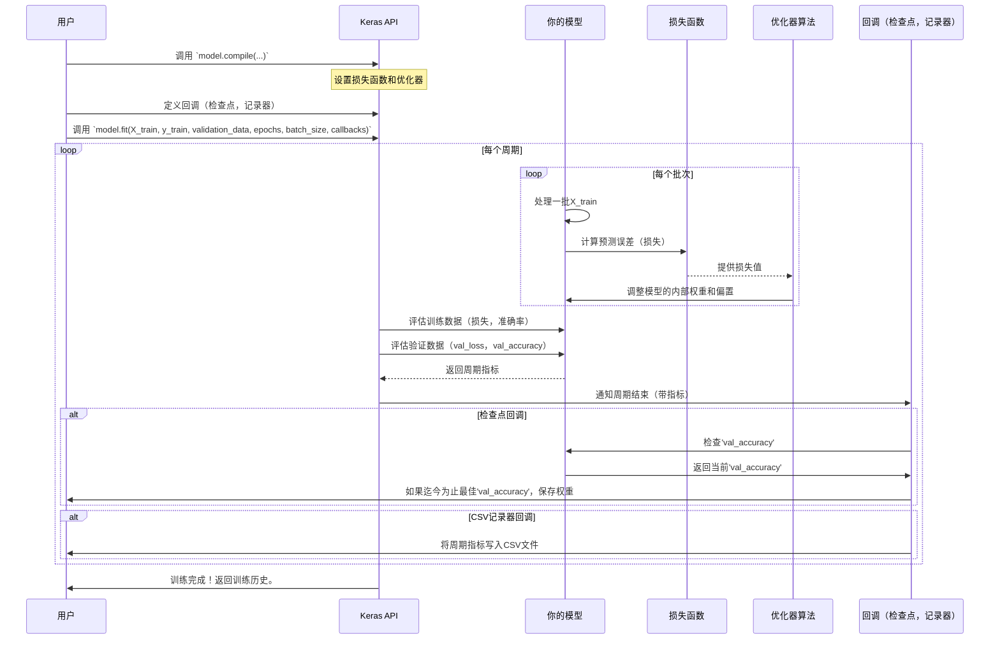

# 第8章：模型训练生命周期（Keras）

欢迎回来

在前面的章节中，我们已经走过了很长的路。

- 在[第1章：分类任务配置（二分类 vs. 多分类）](01_classification_task_configuration__binary_vs__multiclass__.md)中，我们学习了如何定义入侵检测问题的类型
- [第2章：数据加载与预处理](02_data_loading_and_preprocessing_.md)教会了我们如何准备数据"食材"。然后，我们构建了各种"安全警卫"模型
- [第3章：经典机器学习模型](03_classical_machine_learning_models_.md)、[第4章：深度前馈神经网络（DNN）模型](04_deep_feed_forward_neural_network__dnn__models__.md)、[第5章：纯卷积神经网络（CNN）模型](05_pure_convolutional_neural_network__cnn__models__.md)、[第6章：循环神经网络（RNN）模型（LSTM/GRU/SimpleRNN）](06_recurrent_neural_network__rnn__models__lstm_gru_simplernn__.md)和[第7章：CNN-LSTM混合模型](07_cnn_lstm_hybrid_models_.md)。

但这些模型是如何真正学习的？你已经构建了"大脑"（模型的层），但它仍然是"未受教育的"。它不知道什么是正常流量或攻击。本章就是关于==如何训练你的模型==——关键的**模型训练生命周期（Keras）**。

## 模型训练解决了什么问题？

构建模型只是战斗的一半。

> 这个过程解决的核心问题是将一个未经训练的模型转变为能够检测网络入侵的智能安全专家。

这就像把一个有前途的运动员送进一个严格的训练计划：

*   **定义目标和方法**：你需要告诉模型它的目标是什么（准确检测入侵）以及它应该如何实现这个目标（使用特定的学习规则）。
*   **随时间练习**：模型需要反复练习示例（我们的训练数据）并从错误中学习。
*   **跟踪进度**：你希望监控它的表现，不仅在练习期间，还包括新的、未见过的挑战，以确保它真正在改进。
*   **保存最佳表现**：你希望保存模型的最佳"状态"，以便以后使用，即使它在后续训练中表现下降。

这个针对我们Keras模型的"训练计划"就是我们所说的模型训练生命周期。它==确保我们的模型成为有效的网络入侵检测器==。

## 模型训练的关键概念

训练生命周期涉及几个相互关联的部分，它们共同工作来教导你的模型。

### 1. 损失函数：衡量"我们有多错"

在模型学习之前，它需要知道自己做得有多糟糕。**损失函数**是一个数学公式，计算一个数字，表示模型的预测与真实答案相比"有多错误"。

*   **类比**：如果你试图击中一个目标，损失函数测量你的箭离靶心有多远。损失越小，预测越好。

我们已经在[第1章：分类任务配置（二分类 vs. 多分类）](01_classification_task_configuration__binary_vs__multiclass__.md)中见过损失函数：
*   `binary_crossentropy`用于二分类（例如，正常/攻击）。
*   `categorical_crossentropy`用于多分类（例如，正常、DoS、Probe、R2L、U2R）。

### 2. 优化器：模型如何从错误中学习

一旦损失函数告诉模型"它有多错"，**优化器**就是"教练"，告诉模型如何调整其内部设置（权重和偏置）以减少该错误。它是指导学习过程的算法。

*   **类比**：优化器告诉弓箭手，"你上次射得太左且有点高。稍微向右调整你的站姿并降低你的瞄准。"

一个非常流行且有效的优化器是`adam`。其他常见的包括`SGD`（随机梯度下降）或`RMSprop`。

### 3. 拟合模型：实际的学习会话（`model.fit`）

Keras中的`model.fit()`函数是实际训练发生的地方。你提供训练数据（`X_train`，`y_train`）并告诉它要通过数据多少次。

*   **类比**：这是运动员进行锻炼的实际训练课程。

在`model.fit()`内部，两个重要概念控制训练过程：

*   **Epochs（周期）**：一个**周期**意味着模型已经看到并处理了所有训练示例一次。
    *   **类比**：一个完整的训练课程（例如，"我将训练100个周期"意味着100个完整的训练课程）。通常，模型需要许多周期才能有效学习。

*   **Batch Size（批次大小）**：不是一次向模型展示一个示例或一次展示所有示例，我们通常以小批量的形式提供数据，称为**批次**。处理每个批次后，模型会根据该批次的平均误差对其内部设置进行小的调整。
    *   **类比**：在训练中，你做一组10-12次重复（一个批次）然后休息并调整你的姿势。你不会只做一次重复然后调整，也不会不做任何调整就做所有1000次重复。使用批次使训练更稳定和高效。

*   **Validation Data（验证数据）**：在训练期间，监控模型在从未见过的数据上的表现也至关重要。这是你的**验证数据**（例如，`X_test`，`y_test`）。如果模型在训练数据上表现良好但在验证数据上表现不佳，这是**==过拟合==**的迹象（记忆训练数据而不是真正学习）。
    *   **类比**：一个学生用教科书问题（训练数据）练习，然后在新问题（验证数据）上测验。如果他们精通教科书但在测验中失败，他们只是记住了，而不是学会了。

### 4. 回调：监控和控制的工具

**回调**是你可以提供给`model.fit()`的特殊函数。它们在训练期间的特定点（例如，每个周期结束时）被调用，以执行诸如保存模型、提前停止训练或记录进度等操作。

*   **类比**：这些是健身追踪器、私人教练的笔记或记录你在训练中最佳时刻的相机。

对我们项目重要的两个回调是：

*   **`ModelCheckpoint`**：这个回调将模型的权重（其学习到的参数）保存到文件中。关键的是，你可以配置它基于一个指标（如验证准确率）`save_best_only=True`。这意味着它只会在模型在验证数据上达到迄今为止的最佳性能时保存模型。
    *   **类比**：自动保存你在训练期间最佳状态的图片，确保你始终有==最佳状态的记录==。

*   **`CSVLogger`**：这个回调将训练和验证指标（如每个周期的损失和准确率）记录到CSV文件中。这对于以后分析模型的学习进度非常有用。
    *   **类比**：一个==详细的训练日志==，记录每次训练后的所有表现指标（组数、重复次数、重量、你的感觉）。

## 如何在Keras中使用模型训练

让我们看看这些概念如何在Keras代码中结合起来。

我们将使用一个简化的示例，假设你已经构建并编译了你的Keras模型（例如，来自前面章节的DNN、CNN或LSTM）并准备好了数据（`X_train`，`y_train`，`X_test`，`y_test`）。

```python
from keras.models import Sequential
from keras.layers import Dense, Dropout
from keras.callbacks import ModelCheckpoint, CSVLogger
import numpy as np # 用于虚拟数据
import os # 为结果创建目录

# --- 1. 准备虚拟数据（用于演示） ---
# 假设1000个样本，41个特征
X_train_dummy = np.random.rand(1000, 41)
y_train_dummy = np.random.randint(0, 2, 1000) # 二分类标签
X_test_dummy = np.random.rand(200, 41)
y_test_dummy = np.random.randint(0, 2, 200)

# --- 2. 构建并编译一个简单模型（作为第4章的回顾） ---
model = Sequential()
model.add(Dense(128, input_dim=41, activation='relu'))
model.add(Dropout(0.1))
model.add(Dense(1, activation='sigmoid')) # 二分类输出
model.compile(loss='binary_crossentropy', optimizer='adam', metrics=['accuracy'])

print("模型构建并编译完成，准备训练！")
model.summary()
print("-" * 30)

# --- 3. 设置回调 ---
results_dir = 'my_model_results'
if not os.path.exists(results_dir):
    os.makedirs(results_dir)

# ModelCheckpoint：保存最佳模型权重
checkpointer = ModelCheckpoint(
    filepath=os.path.join(results_dir, "best_model_weights.hdf5"),
    verbose=1, # 保存时显示消息
    save_best_only=True, # 仅当当前验证准确率优于之前最佳时保存
    monitor='val_accuracy', # 监控验证准确率
    mode='max' # 更高的val_accuracy更好
)

# CSVLogger：将训练历史记录到CSV文件
csv_logger = CSVLogger(
    os.path.join(results_dir, 'training_log.csv'),
    separator=',',
    append=False # 创建新文件，不追加到现有文件
)

# --- 4. 使用model.fit()训练模型 ---
print("开始模型训练...")
history = model.fit(
    X_train_dummy, y_train_dummy,
    validation_data=(X_test_dummy, y_test_dummy), # 每个周期后评估的数据
    epochs=10, # 完整通过训练数据的次数
    batch_size=32, # 每次梯度更新的样本数
    callbacks=[checkpointer, csv_logger], # 使用的回调列表
    verbose=1 # 训练期间显示进度
)
print("训练完成！")

# 你可以从'history'对象访问训练历史
print("\n训练历史键:", history.history.keys())
```

**解释：**
1.  我们设置了一些虚拟数据和一个简单的DNN模型用于演示。
2.  **`results_dir`**：我们创建一个文件夹来保存我们的训练输出。
3.  **`ModelCheckpoint(...)`**：我们创建一个`ModelCheckpoint`对象。
    *   `filepath`：保存模型的路径。
    *   `save_best_only=True`：这是关键！它确保只保存导致最高`val_accuracy`的模型权重。
    *   `monitor='val_accuracy', mode='max'`：我们告诉它监视"验证准确率"并认为更高的值更好。
4.  **`CSVLogger(...)`**：我们创建一个`CSVLogger`对象。
    *   `filename`：训练历史（损失、准确率、val_loss、val_accuracy）将被保存的地方。
5.  **`model.fit(...)`**：这开始训练过程。
    *   `X_train_dummy, y_train_dummy`：我们的训练特征和标签。
    *   `validation_data=(X_test_dummy, y_test_dummy)`：模型将在每个周期后评估这些数据，而不用于学习。
    *   `epochs=10`：模型将完整通过`X_train_dummy`数据集10次。
    *   `batch_size=32`：32个训练样本将在模型更新其内部权重之前被处理。
    *   `callbacks=[checkpointer, csv_logger]`：我们提供我们的回调列表。Keras将在训练期间的适当时间调用这些。

随着训练运行，你将看到每个周期的进度更新，包括训练损失/准确率和验证损失/准确率。

如果`val_accuracy`提高，`ModelCheckpoint`将保存模型权重。`CSVLogger`将所有这些数字写入`training_log.csv`。

## 幕后：训练循环

让我们可视化你的模型通过训练生命周期的旅程：



## 深入项目代码参考

让我们看看提供的项目代码如何实现训练生命周期，重点关注`model.compile`、回调设置和`model.fit`调用。

将在不同类型的模型（DNN、CNN、RNN、CNN-LSTM）中一致地看到这种模式。

### 1. 模型编译

`model.compile`步骤在定义模型架构后始终存在。它指定模型将如何学习。

*   **来自`KDDCup 99/CNN-LSTM/binary/cnn2.py`：**
    
    ```python
    # ... (为cnn定义的模型架构) ...
    cnn.compile(loss="binary_crossentropy", optimizer="adam",metrics=['accuracy'])
    ```
    **解释：**对于二分类，它使用`binary_crossentropy`作为损失函数和`adam`作为优化器，跟踪`accuracy`。
    
*   **来自`NSL-KDD/dnn/multiclass/dnn1.py`：**
    
    ```python
    # ... (为模型定义的模型架构) ...
    model.compile(loss='categorical_crossentropy',optimizer='adam',metrics=['accuracy'])
    ```
    **解释：**对于多分类（使用one-hot编码标签），它使用`categorical_crossentropy`作为损失和`adam`作为优化器。

### 2. 设置回调

项目代码通常在训练调用之前定义`ModelCheckpoint`和`CSVLogger`。

*   **来自`KDDCup 99/GRU/binary/lskeras.py`（及类似文件）：**
    
    ```python
    from keras import callbacks
    from keras.callbacks import ModelCheckpoint, EarlyStopping, ReduceLROnPlateau, CSVLogger
    
    # ... (数据和模型设置) ...
    
    checkpointer = callbacks.ModelCheckpoint(
        filepath="kddresults/lstm1layer/checkpoint-{epoch:02d}.hdf5",
        verbose=1,
        save_best_only=True,
        monitor='val_acc', # 注意：'val_acc'是'val_accuracy'的旧名称
        mode='max'
    )
    csv_logger = CSVLogger(
        'training_set_iranalysis.csv', # 文件名
        separator=',',
        append=False
    )
    ```
    **解释：**这创建了一个`ModelCheckpoint`，基于`val_acc`（验证准确率）保存最佳模型权重，以及一个`CSVLogger`将训练指标保存到`training_set_iranalysis.csv`。
    
    ​	检查点的`filepath`通常包括`{epoch:02d}`以将周期号添加到文件名中。

### 3. 执行训练（`model.fit`）

`model.fit`调用将所有内容结合在一起，开始训练过程。

*   **来自`KDDCup 99/CNN-LSTM/binary/cnn2.py`：**
    
    ```python
    # ... (cnn模型定义和编译，检查点和csv_logger设置) ...
    cnn.fit(
        X_train, y_train,
        nb_epoch=1000, # 'epochs'的旧名称
        show_accuracy=True, # 显示准确率的旧名称。使用verbose=1。
        validation_data=(X_test, y_test),
        callbacks=[checkpointer,csv_logger]
    )
    cnn.save("results/cnn2results/cnn_model.hdf5") # 训练后保存最终模型
    ```
    **解释：**这训练`cnn`模型`1000`个周期，使用`X_train`和`y_train`进行训练，使用`(X_test, y_test)`进行验证。它在训练期间使用`checkpointer`和`csv_logger`。最后一行`cnn.save(...)`保存训练后模型的最后状态，如果检查点的`save_best_only`为真，这可能不是最好的。
    
*   **来自`KDDCup 99/dnn/binary/dnn1.py`：**
    ```python
    # ... (模型定义和编译，检查点和csv_logger设置) ...
    model.fit(
        X_train, y_train,
        validation_data=(X_test, y_test),
        batch_size=batch_size, # 这个示例明确使用batch_size
        nb_epoch=1000,
        callbacks=[checkpointer,csv_logger]
    )
    model.save("kddresults/dnn1layer/dnn1layer_model.hdf5")
    ```
    **解释：**类似于CNN-LSTM示例，但它明确显示了`batch_size`参数的使用。

> 这些代码片段展示了项目中训练Keras模型的一致模式：编译、定义回调，然后用训练和验证数据、周期和你选择的回调来拟合模型。

## 结论

现在，已经了解了关键的**模型训练生命周期（Keras）**

理解训练涉及用`loss`函数（如何测量错误）和`optimizer`（模型如何从错误中学习）配置模型。

你看到了如何使用`model.fit()`在`epochs`（周期）和`batches`（数据组）中训练模型，同时监控其在`validation_data`上的表现。关键的是，学习了`ModelCheckpoint`如何保存表现最佳的模型权重，以及`CSVLogger`如何记录训练指标，确保你的进度被跟踪并保存最佳模型状态。

这个过程==将构建的神经网络转变为功能性的智能入侵检测系统==。有了训练好的模型，下一步是真正理解它的表现如何并有效地传达这些结果。

[第9章：性能评估和报告](09_performance_evaluation_and_reporting_.md)