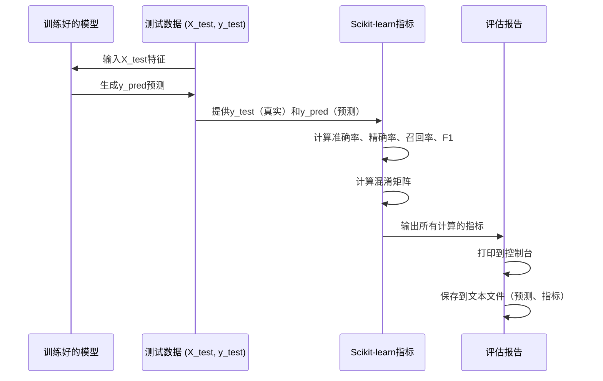

# 第9章：性能评估与报告

欢迎回来

在前面的章节中，我们经历了一段不可思议的旅程

- 我们在[第1章：分类任务配置（二分类 vs. 多分类）](01_classification_task_configuration__binary_vs__multiclass__.md)中学习了如何定义入侵检测任务
- 在[第2章：数据加载与预处理](02_data_loading_and_preprocessing_.md)中准备了数据
- 并构建了从[第3章：经典机器学习模型](03_classical_machine_learning_models_.md)到高级的[第7章：CNN-LSTM混合模型](07_cnn_lstm_hybrid_models_.md)的各种"安全警卫"模型
- 最近，在[第8章：模型训练生命周期（Keras）](08_model_training_lifecycle__keras__.md)中，我们学习了如何实际训练这些模型，将它们转变为智能系统。

现在我们的模型已经训练好了，一个关键问题仍然存在：**它们的工作表现如何？**就

像新来的安全警卫需要严格的评估以确保其有效性一样，我们训练好的网络入侵检测模型也需要彻底的性能审查。

在我们信任它们保护我们的网络之前，需要评估它们的优势和劣势。

## 性能评估解决了什么问题？

训练模型就像教导学生；评估其性能就像给他们考试。

这个过程解决的核心问题是**衡量和理解我们训练好的模型在从未见过的网络流量上识别入侵的有效性**。

我们的核心用例是：
1.  **==量化有效性==**：获取清晰的数字（指标），告诉我们模型的入侵检测有多准确、多精确和多完整。
2.  **==识别弱点==**：理解模型在哪里犯错（例如，将正常流量误认为攻击，或漏掉实际攻击）。
3.  **==生成"成绩单=="**：创建模型性能的综合报告，可以共享和分析。

这种"质量检查"确保我们对模型有信心，并可以做出明智的决定，选择哪些模型最适合实际部署。

## 性能评估的关键概念

为了真正理解模型的性能，我们需要超越简单的"准确率"。我们使用一组特定的工具和指标。

### 1. 测试数据：未见过的挑战

评估的最重要规则是在模型**训练或验证期间从未见过的数据**上测试它。

这是我们在[第2章：数据加载与预处理](02_data_loading_and_preprocessing_.md)中的`X_test`（测试特征）和`y_test`（真实测试标签）。

这确保我们测量的是模型对新情况的泛化能力，而不仅仅是它记住了训练示例。

### 2. 预测：模型的"猜测"

第一步是让我们的训练模型对`X_test`数据进行预测。这给了我们`y_pred`，这是我们的模型认为测试流量的正确标签。

*   **对于Keras深度学习模型**：通常使用`model.predict()`（给出概率）后跟一个阈值（例如，二分类的>0.5）或`np.argmax()`（多分类）将概率转换为类别标签。一些较旧的Keras版本或实用函数可能有`model.predict_classes()`直接使用。
*   **对于Scikit-learn经典模型**：你使用`model.predict()`直接给出类别标签。

### 3. 核心指标：数字的含义是什么？

一旦我们有了`y_pred`（模型预测的）和`y_test`（实际真相），我们可以使用`sklearn.metrics`计算各种指标。

*   **准确率**：最简单的指标。它告诉我们所有预测中正确的百分比。
    *   **类比**：如果一个安全警卫正确识别了100人中的90人是"员工"或"入侵者"，他们的准确率是90%。
    *   *公式*：`(正确预测) / (总预测)`

*   **精确率**：关注正预测（例如，预测为`Attack`）。在所有模型说某物是攻击的时候，有多少次它实际上是攻击？高精确率意味着更少的"误报"。
    *   **类比**：在警卫喊"入侵者！"的10次中，有8次确实是入侵者。他们的精确率是80%。（2次误报）。
    *   *公式*：`(真正例) / (真正例 + 假正例)`

*   **召回率（或灵敏度）**：关注实际的正面案例（例如，实际的`Attack`流量）。在所有真正有攻击的时候，模型正确检测到了多少？高召回率意味着更少的漏检攻击。
    *   **类比**：在10个实际入侵者试图进入时，警卫发现了7个。他们的召回率是70%。（漏掉了3个入侵者）。
    *   *公式*：`(真正例) / (真正例 + 假反例)`

*   **F1分数**：一个平衡精确率和召回率的单一指标。它通常比仅准确率更有信息量，特别是当一个类别比其他类别少得多时（如攻击通常是这样）。
    *   **类比**：一个平衡的分数，显示警卫是否既擅长不经常"喊狼来了"（精确率），又擅长抓住大多数真正的狼（召回率）。
    *   *公式*：`2 * (精确率 * 召回率) / (精确率 + 召回率)`

### 4. 混淆矩阵：详细分解

**混淆矩阵**是一个表格，详细分解了每个类别的正确和错误预测。对于理解模型在哪里混淆至关重要。

对于**二分类**（例如，Normal vs. Attack），它通常看起来像这样：

|                  | **预测: Normal** | **预测: Attack** |
| :--------------- | :--------------- | :--------------- |
| **实际: Normal** | 真反例 (TN)      | 假正例 (FP)      |
| **实际: Attack** | 假反例 (FN)      | 真正例 (TP)      |

*   **真正例 (TP)**：正确预测"Attack"当它实际上是"Attack"。（好！）
*   **真反例 (TN)**：正确预测"Normal"当它实际上是"Normal"。（好！）
*   **假正例 (FP)**：预测"Attack"当它实际上是"Normal"。（"误报"——不好！）
*   **假反例 (FN)**：预测"Normal"当它实际上是"Attack"。（"漏检入侵"——在NID中非常不好！）

对于**多分类**，矩阵变得更大（例如，5个类别的5x5矩阵），显示特定攻击类型之间的误分类。

## 如何评估和报告性能

让我们通过使用我们训练好的模型和`scikit-learn`来应用这些概念。我们假设你有一个训练好的模型（`model`或`cnn`）和准备好的`X_test`和`y_test`数据。

### 1. 进行预测

首先，我们获取模型在测试数据上的预测。

```python
import numpy as np
from sklearn.metrics import accuracy_score, precision_score, recall_score, f1_score, confusion_matrix
# 假设 'model' 是你的训练好的Keras或Scikit-learn模型
# 假设 'X_test' 和 'y_test' 是你准备好的测试特征和真实标签

# --- 对于Keras深度学习模型 ---
# 如果 model.predict 给出概率（例如，二分类的sigmoid输出）
y_probabilities = model.predict(X_test)
y_pred_keras = (y_probabilities > 0.5).astype(int) # 将概率转换为0或1用于二分类

# 如果 model.predict_classes（较旧的Keras）或用于多分类的argmax
# y_pred_keras = model.predict_classes(X_test) # 如果直接预测类别
# 对于多分类， y_pred_keras = np.argmax(y_probabilities, axis=1) # 从概率中获取类别索引

print("Keras预测样本（前10个）：", y_pred_keras[:10].flatten()) # flatten以便更易查看
print("真实标签样本（前10个）：", y_test[:10])

# --- 对于Scikit-learn经典模型 ---
# model.predict() 直接给出经典模型的类别标签
y_pred_sklearn = model.predict(X_test)

print("\nScikit-learn预测样本（前10个）：", y_pred_sklearn[:10])
print("真实标签样本（前10个）：", y_test[:10])
```

**解释：**
*   `model.predict(X_test)`：这是获取模型对`X_test`输出的核心函数。
*   `(y_probabilities > 0.5).astype(int)`：对于带有`sigmoid`输出的二分类，`predict`给出0到1之间的概率。我们通过检查概率是否大于0.5将其转换为明确的`0`或`1`。
*   输出显示模型预测与实际真实标签之间的比较。

### 2. 计算和打印指标

现在我们使用`scikit-learn`的指标函数来获取我们的"成绩单"数字。

```python
# 假设 'y_pred' 是你的模型的预测（来自Keras或Scikit-learn）
# 且 'y_test' 是真实标签

# 计算准确率
accuracy = accuracy_score(y_test, y_pred)
print(f"\n准确率: {accuracy:.4f}")

# 计算精确率（使用 'binary' 用于二分类）
precision = precision_score(y_test, y_pred, average="binary")
print(f"精确率: {precision:.4f}")

# 计算召回率（使用 'binary' 用于二分类）
recall = recall_score(y_test, y_pred, average="binary")
print(f"召回率: {recall:.4f}")

# 计算F1分数（使用 'binary' 用于二分类）
f1 = f1_score(y_test, y_pred, average="binary")
print(f"F1分数: {f1:.4f}")
```

**解释：**
*   `accuracy_score(y_test, y_pred)`：比较真实标签（`y_test`）与预测标签（`y_pred`）。
*   `precision_score(...)`、`recall_score(...)`、`f1_score(...)`：这些函数计算各自的指标。
*   `average="binary"`：这个参数对二分类很重要；它告诉函数专门为正类（例如，`Attack`，通常表示为`1`）计算指标。对于多分类，你会使用`average="macro"`或`average="weighted"`。
*   输出将显示这些关键性能指标，格式化为几位小数。

### 3. 生成和显示混淆矩阵

混淆矩阵提供了预测错误的视觉和数字摘要。

```python
# 假设 'y_pred' 和 'y_test' 已定义

# 生成混淆矩阵
cm = confusion_matrix(y_test, y_pred)
print("\n混淆矩阵:")
print(cm)

# 如果你想打印更详细的分类报告（特别适用于多分类）
from sklearn.metrics import classification_report
# 对于二分类（假设类别0是'Normal'，1是'Attack'）
target_names_binary = ['Normal', 'Attack']
print("\n分类报告（二分类）:")
print(classification_report(y_test, y_pred, target_names=target_names_binary))

# 对于多分类（例如，5个类别）
# target_names_multiclass = ['Normal', 'DoS', 'Probe', 'R2L', 'U2R']
# print("\n分类报告（多分类）:")
# print(classification_report(y_test, y_pred, target_names=target_names_multiclass))
```

**解释：**
*   `confusion_matrix(y_test, y_pred)`：这个函数直接计算混淆矩阵表。
*   `classification_report(...)`：这是一个非常有用的函数，打印每个类别的精确率、召回率和F1分数，以及支持（该类别的实际出现次数）和整体准确率。对于综合报告非常优秀。
*   输出将显示矩阵（例如，二分类的2x2表）和使用`classification_report`时的详细报告。

### 4. 将结果保存到文件

通常的做法是将预测和计算的指标保存到文件，以便后续分析、比较或报告。

```python
import numpy as np # 已导入，但为了上下文
import os # 管理目录

# 假设 'y_pred' 和 'y_test' 已定义
results_output_dir = 'evaluation_results'
if not os.path.exists(results_output_dir):
    os.makedirs(results_output_dir)

# 将预测和真实标签保存到文本文件
np.savetxt(os.path.join(results_output_dir, 'predicted_labels.txt'), y_pred, fmt='%01d')
np.savetxt(os.path.join(results_output_dir, 'true_labels.txt'), y_test, fmt='%01d')
print(f"\n预测和真实标签已保存到 '{results_output_dir}' 文件夹。")

# 你也可以将指标保存到简单的文本文件
with open(os.path.join(results_output_dir, 'model_metrics.txt'), 'w') as f:
    f.write(f"准确率: {accuracy:.4f}\n")
    f.write(f"精确率: {precision:.4f}\n")
    f.write(f"召回率: {recall:.4f}\n")
    f.write(f"F1分数: {f1:.4f}\n")
    f.write("\n混淆矩阵:\n")
    f.write(str(cm)) # 写入矩阵的字符串表示
    f.write("\n\n分类报告:\n")
    f.write(classification_report(y_test, y_pred, target_names=target_names_binary))

print(f"性能指标已保存到 '{results_output_dir}/model_metrics.txt'。")
```

**解释：**
*   `os.makedirs(results_output_dir)`：如果目录不存在，则创建它，以保持我们的结果组织有序。
*   `np.savetxt(...)`：一个NumPy函数，将数组保存到文本文件。`fmt='%01d'`确保整数保存时没有小数。
*   `with open(...) as f:`：打开一个文件用于写入。
*   `f.write(...)`：将字符串内容（我们的指标）写入文件。
*   这将创建包含原始预测、真实标签和所有计算指标摘要的文本文件，这对于详细报告和比较至关重要。

## 幕后：评估流程

以下是整个评估过程的展开：



## 深入项目代码参考

项目代码广泛使用`sklearn.metrics`进行评估和`numpy.savetxt`保存结果。让我们看看提供的代码片段中的示例。

### 1. Keras模型评估（`KDDCup 99/CNN-LSTM/binary/cnn1.py`）

这个文件加载一个预训练的Keras模型，评估它，并报告指标。

```python
# 来自 KDDCup 99/CNN-LSTM/binary/cnn1.py（简化）
from sklearn.metrics import (precision_score, recall_score, f1_score, accuracy_score, confusion_matrix)
from keras.models import Sequential # 假设 'cnn' 是一个Sequential模型

# ... (X_test, y_test 如第2章所述准备) ...
# ... (cnn 模型定义并使用 cnn.load_weights() 加载权重) ...

cnn.compile(loss='binary_crossentropy', optimizer='adam', metrics=['accuracy'])
loss, accuracy = cnn.evaluate(X_test, y_test, verbose=0) # 在测试数据上评估模型
print("\n损失: %.2f, 准确率: %.2f%%" % (loss, accuracy*100))

y_pred = cnn.predict_classes(X_test) # 获取类别预测（较旧的Keras或实用函数）

accuracy = accuracy_score(y_test, y_pred)
recall = recall_score(y_test, y_pred , average="binary")
precision = precision_score(y_test, y_pred , average="binary")
f1 = f1_score(y_test, y_pred, average="binary")
np.savetxt('res/expected1.txt', y_test, fmt='%01d')
np.savetxt('res/predicted1.txt', y_pred, fmt='%01d')

print("准确率")
print("%.6f" %accuracy)
print("召回率")
print("%.6f" %recall)
print("精确率")
print("%.6f" %precision)
print("f1分数")
print("%.6f" %f1)
cm = confusion_matrix(y_test, y_pred)
print("混淆矩阵")
print(cm)
```

**观察：**
*   `cnn.evaluate(X_test, y_test)`：这个Keras函数直接在测试数据上计算损失和`model.compile()`定义的指标（如准确率）。
*   `cnn.predict_classes(X_test)`：用于从模型获取实际的预测类别标签。
*   `sklearn.metrics`函数：`accuracy_score`、`recall_score`、`precision_score`、`f1_score`、`confusion_matrix`用于计算和打印各个指标。
*   `np.savetxt(...)`：将真实（`y_test`）和预测（`y_pred`）标签保存到文本文件（`expected1.txt`、`predicted1.txt`）。这允许在不重新运行模型的情况下进行后续分析或生成报告。

### 2. 经典模型评估（`NSL-KDD/classical/binary/all.py`）

这个文件展示了多个经典模型的评估。每个模型的模式是一致的。

```python
# 来自 NSL-KDD/classical/binary/all.py（简化用于逻辑回归）
import numpy as np
from sklearn.metrics import (precision_score, recall_score, f1_score, accuracy_score, confusion_matrix)
from sklearn.linear_model import LogisticRegression

# ... (traindata, trainlabel, testdata, testlabel 如第2章所述准备) ...

model = LogisticRegression()
model.fit(traindata, trainlabel)

expected = testlabel # 为清晰重命名，与 y_test 相同
predicted = model.predict(testdata) # 从经典模型获取预测
np.savetxt('res/predictedLR.txt', predicted, fmt='%01d')

accuracy = accuracy_score(expected, predicted)
recall = recall_score(expected, predicted, average="binary")
precision = precision_score(expected, predicted , average="binary")
f1 = f1_score(expected, predicted , average="binary")
cm = confusion_matrix(expected, predicted)
print(cm)

# 手动计算TPR和FPR（通常从混淆矩阵派生）
tpr = float(cm[0][0])/np.sum(cm[0]) # 正常类别的真正例率（通常称为特异性）
fpr = float(cm[1][1])/np.sum(cm[1]) # 攻击类别的真正例率（通常称为攻击的召回率）

print("准确率")
print("%.3f" %accuracy)
# ... (打印其他指标) ...
```

**观察：**
*   `expected`（真实标签）和`predicted`（模型的输出）变量被明确定义。
*   `np.savetxt(...)`：保存逻辑回归的预测。这个文件中的每个经典模型将其预测保存到单独的文件（例如，`predictedNB.txt`、`predictedKNN.txt`）。
*   标准的`sklearn.metrics`函数用于计算准确率、精确率、召回率和F1分数。
*   混淆矩阵（`cm`）直接打印。
*   项目代码手动从混淆矩阵计算真正例率（TPR）和假正例率（FPR），这对于理解特定类别的性能非常有用，有时用于高级指标如ROC曲线。

### 3. 高级多分类报告（`KDDCup 99/GRU/multiclass/confmat.py`）

这个特定的脚本设计用于获取保存的预测并提供详细报告，包括每个类别的二元性能。

```python
# 来自 KDDCup 99/GRU/multiclass/confmat.py（简化）
import numpy as np
from sklearn.metrics import confusion_matrix, accuracy_score

predicted = np.genfromtxt ('res/predicted1.txt', delimiter=",") # 加载保存的预测
expected = np.genfromtxt ('res/expected1.txt', delimiter=",")   # 加载保存的真实标签
y_true = expected[0:311029] # 如果需要，切片数据
y_pred = predicted[0:311029]

print(accuracy_score(y_true, y_pred)) # 整体准确率
cm = confusion_matrix(y_true, y_pred) # 整体多分类混淆矩阵

cl = 0 # 遍历每个类别（例如，5个类别的0到4）
for num in range(0,5):
    new_y_true = y_true.astype(int)
    new_y_pred = y_pred.astype(int)

    # 将一个类别转换为1，其余类别转换为0（单个类别的二元转换）
    ipresent = np.where(new_y_true == cl)[0]
    new_y_true[ipresent] = 9 # 临时标记感兴趣的类别
    inot = np.where(new_y_true <> 9)[0]
    new_y_true[inot] = 0 # 所有其他类别变为0
    new_y_true[ipresent] = 1 # 感兴趣的类别变为1

    # 对预测重复
    ipresent = np.where(new_y_pred == cl)[0]
    new_y_pred[ipresent] = 9
    inot = np.where(new_y_pred <> 9)[0]
    new_y_pred[inot] = 0
    new_y_pred[ipresent] = 1

    print ("---------------------------------------------------------\n"+ "类别 " + str(cl) )
    tn, fp, fn, tp = confusion_matrix(new_y_true, new_y_pred).ravel() # 获取该类别的二元CM

    # 计算并打印该类别的准确率、FPR、TPR与其余类别
    tp = tp.astype(float); tn = tn.astype(float); fp = fp.astype(float); fn = fn.astype(float)
    tpr = tp/(tp+fn)
    fpr = fp/(fp+tn)
    acc = (tp+tn)/(tp+fp+tn+fn)
    print("准确率 = \t" + str(acc) + "\nFPR= \t "+ str(fpr) + "\nTPR= \t" + str(tpr))
    cl = cl + 1
```

**观察：**
*   这个脚本演示了使用`np.genfromtxt`加载之前保存的预测和真实标签。这是将评估步骤与训练/预测步骤分离的常见做法。
*   然后它遍历多分类问题中的每个类别。对于每个类别，它巧妙地将多分类问题转换为一系列二元问题（"这是类别X还是非类别X？"）。
*   这允许它计算特定类别的`TN, FP, FN, TP`，然后计算每个类别的`准确率`、`FPR`和`TPR`，提供模型在特定攻击类型上表现优劣的非常详细的分解。

这种全面的评估和报告方法对于真正理解你的网络入侵检测模型的性能至关重要。

## 结论

恭喜！你已经完成了我们介绍机器学习在网络入侵检测中应用的旅程。你现在已经掌握了**性能评估与报告**的关键技能。你理解了一个模型的好坏取决于它的评估，并且你已经获得了进行严格评估的工具。

你现在可以：
*   理解**测试数据**和进行**预测**的重要性。
*   计算和解释关键指标如**准确率、精确率、召回率和F1分数**。
*   使用**混淆矩阵**获取模型正确和错误预测的详细视图。
*   通过打印到控制台和保存结果到文件来有效**报告**你的发现。

这种有效评估和报告模型性能的能力不仅仅是一个最终步骤；它是一个持续的反馈循环，指导你未来如何配置、预处理和训练你的模型。掌握了这些知识，你已经走在构建、测试和理解强大的网络入侵检测系统的路上啦


END *★,°*:.☆(￣▽￣)/.°★* 。

