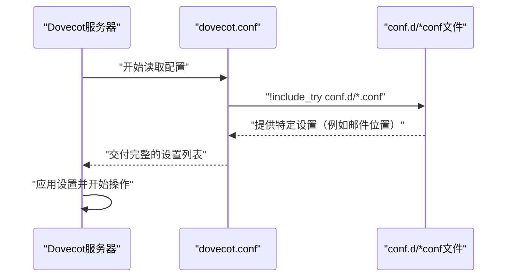
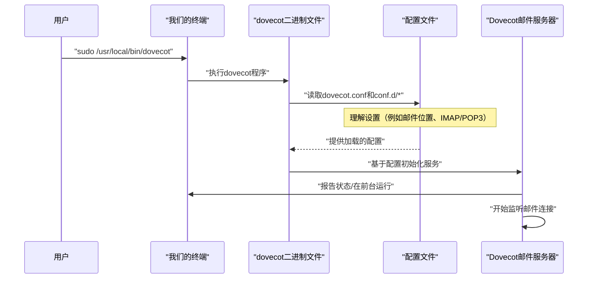

# 第3章：配置系统

欢迎回来

在[第2章：安装与构建过程](02_installation___build_process_.md)中，我们学习了如何在系统上安装Dovecot。

现在软件已经准备就绪，但这就像厨房里有一台全新的强大电器——它已经插上电源，但我们还没有告诉它该做什么

想象我们买了一台高级咖啡机。它可以冲泡浓缩咖啡、卡布奇诺甚至热巧克力，但==首先需要告诉它我们的偏好==：喜欢咖啡的浓度、使用的杯子大小，或者是否需要自动打奶泡。

> 这就是Dovecot的**配置系统**发挥作用的地方。就像咖啡机的设置面板和用户手册一样

Dovecot的配置系统允许我们定制和管理其行为。通过它，我们可以==精确地告诉Dovecot我们想要什么样的邮件服务器==。我们希望它处理IMAP还是POP3？邮件应该存储在哪里？如何连接用户？所有这些细节都通过配置来控制。

## 什么是配置系统？

Dovecot的配置系统本质上是一组文本文件，包含Dovecot应如何操作的指令。当Dovecot启动时，它会读取这些文件以理解我们的具体要求

可以这样理解：
*   **Dovecot**是精密的设备（我们的邮件服务器）。
*   **配置文件**是其用户手册和设置面板的结合体。我们通过=="编写"手册来设置其功能==。

## 在哪里可以找到Dovecot的设置

当我们在前一章使用`sudo make install`安装Dovecot时，它将所有核心程序和一组默认配置文件放置在特定位置。

Dovecot配置文件的主要位置是：

`/usr/local/etc/dovecot/`

这个目录就像Dovecot邮件服务器的"主控室"。里面可以找到`dovecot.conf`（主配置文件）和一个名为`conf.d/`的目录，后者包含许多更小、更专业的配置文件

### 为什么有这么多文件？`conf.d`目录

我们可能会好奇为什么没有一个巨大的配置文件。Dovecot采用了一种巧妙的方法来保持组织性：
*   **`dovecot.conf`**：这是==主配置文件==。它作为入口点，通常包含（或引用）其他配置文件。
*   **`conf.d/`目录**：包含许多更小、==模块化的配置文件==。每个文件（例如`10-mail.conf`、`20-imap.conf`）通常负责Dovecot功能的特定方面。

(也是一种分层架构)

这种模块化方法使管理、理解和更新设置变得更加容易。不必在一个大文件中寻找单个设置，通常可以直接转到相关的小文件。这就像`用户手册有不同的部分，而不是一个连续的文本块`。

## 如何查看默认配置

让我们看看这些文件。我们暂时不会进行复杂的更改，但知道它们的位置和大致内容已经是重要的第一步

首先，列出主配置目录的内容：

```bash
ls /usr/local/etc/dovecot/
```

**会发生什么**：
我们将看到`/usr/local/etc/dovecot/`中的文件和目录列表。可能包括`dovecot.conf`和`conf.d`目录。

```
# 示例输出（可能略有不同）
conf.d  dovecot.conf  ssl
```

现在，让我们看看主`dovecot.conf`文件的内容。我们将使用`cat`命令显示其内容。由于它可能很长，我们只显示一小部分。

```bash
cat /usr/local/etc/dovecot/dovecot.conf | head -n 15
```

**会发生什么**：
这个命令使用`cat`显示文件，`head -n 15`只显示前15行。我们将看到一些解释初始设置和引用`conf.d`目录的注释（以`#`开头的行）。

```
# 来自dovecot.conf的示例片段
# 这是Dovecot的主配置文件。
#
# conf.d/文件中的所有设置也可以在这里配置。
# dovecot.conf的设置会覆盖conf.d/的设置。
#
# 如果在这里进行更改，请记住先取消注释设置。
#
# <doc/wiki/Configuration.txt>

!include_try /usr/local/etc/dovecot/conf.d/*.conf
```
**解释**：注意`!include_try /usr/local/etc/dovecot/conf.d/*.conf`这一行。这非常重要！它==告诉Dovecot读取`conf.d`目录中的所有`.conf`文件。这就是模块化系统协同工作的方式==。

接下来，让我们看看`conf.d`目录中的一个文件。常见的是`10-mail.conf`，它处理与邮件存储位置相关的设置。

```bash
cat /usr/local/etc/dovecot/conf.d/10-mail.conf | head -n 10
```

**会发生什么**：
我们将看到`10-mail.conf`文件的一个片段，通常包含与邮件存储相关的设置。

```
# 来自10-mail.conf的示例片段
# 邮箱位置和格式。参见<doc/wiki/MailLocation.txt>

# 文件系统命名空间的逗号分隔列表。
# 默认命名空间是第一个。
#mail_location =
```
**解释**：这个片段展示了我们可能定义`mail_location`的地方，它告诉Dovecot在系统上存储用户邮件的位置。\默认情况下，它通常被注释掉，意味着Dovecot使用其内置默认值或自动检测位置。

## Dovecot如何读取其配置

当我们启动Dovecot（将在下一章介绍）时，它不会猜测该做什么。它会仔细遵循我们在配置文件中设置的指令。

以下是该过程的简化视图：


**解释**：这个图表说明Dovecot首先读取主`dovecot.conf`文件。这个文件然后告诉Dovecot也读取`conf.d`目录中的所有单独文件。最后，Dovecot结合所有这些指令来理解它应该如何运行。

## 进行更改和获取帮助

现在我们知道配置文件的位置，下一步是学习*如何*更改它们。这就是[第1章：项目文档与支持](01_project_documentation___support_.md)再次变得极其重要的地方！

有关特定设置的详细信息、它们的作用以及如何根据我们的需求配置它们，我们*必须*参考官方Dovecot文档：

`https://doc.dovecot.org`

例如，如果我们想更改之前看到的`mail_location`，我们可以在在线文档中搜索"mail_location"或"邮件存储"以找到详细的解释和示例。

> 试图猜测设置的作用或随机更改值可能会破坏我们的Dovecot服务器

**关键要点**：本章向我们展示了设置的位置。在线文档向我们展示了在这些设置中*应该*放入什么内容。

## 结论

在本章中，我们在掌握Dovecot的道路上迈出了关键一步：理解其**配置系统**。我们现在知道Dovecot的行为主要通过位于`/usr/local/etc/dovecot/`的文本文件进行定制，其中`dovecot.conf`作为主入口点，`conf.d/`目录提供模块化设置。我们还了解了Dovecot如何读取这些文件，最重要的是，当我们准备进行实际更改时，可以在哪里找到全面的在线文档。

随着Dovecot的安装和配置系统的解密，我们已经准备好让我们的邮件服务器焕发生机

[下一章：服务操作](04_service_operation_.md)

---


# 第4章：服务运行

在[第3章：配置系统](03_configuration_system_.md)中，我们学习了Dovecot设置的位置以及其配置文件如何协同工作。我们已经安装了Dovecot，并告诉它我们希望它如何运行。现在，最激动人心的部分来了：让我们的邮件服务器活起来

想象一下，我们已经成功组装了一台复杂的机器，比如一个超级酷的机器人，并且我们已经用所有想要它执行的任务编程了它的大脑。机器人已经准备好了，指令也已加载，但它只是坐在那里。缺少了什么？"开机"按钮！

本章就是关于**服务运行**的——就像为Dovecot按下那个"开机"按钮。它涵盖了在成功安装和配置Dovecot后实际启动Dovecot所需的基本步骤。我们将学习==如何执行主`dovecot`程序，使我们的邮件服务器开始执行其预期的任务，比如接收和发送电子邮件==

## 对Dovecot来说，"服务运行"意味着什么？

对Dovecot来说，"服务运行"主要意味着启动主`dovecot`程序。当这个程序运行时，它会做几件事：
*   读取我们在[第3章：配置系统](03_configuration_system_.md)中学到的所有==配置==文件。
*   根据这些设置建立必要的==组件==（如IMAP和POP3服务）。
*   然后"==监听=="来自想要访问电子邮件的邮件程序（如Outlook或Thunderbird）的传入连接。

因此，当我们谈论"运行"Dovecot时，本质上是在讨论让这个核心程序启动并运行。

## 如何启动Dovecot：`dovecot`二进制文件

Dovecot运行的核心是一个名为`dovecot`的单一程序。

当我们在第2章的[安装与构建过程](02_installation___build_process_.md)中成功完成安装时，这个`dovecot`程序被放置在我们系统上的特定位置，通常是`/usr/local/bin/`。

指导我们安装的`INSTALL.md`文件对此给出了一个简单的指令：

```markdown
运行
=======

[...]

一旦所有配置完成，通过运行"dovecot"二进制文件启动Dovecot。
```
这意味着，要启动Dovecot，我们只需要在终端中运行`dovecot`命令

### 在前台运行Dovecot

对于初学者来说，启动Dovecot并查看发生了什么的最简单方法是直接在终端的"前台"运行它。这意味着Dovecot会将其消息直接打印到屏幕上，并且我们的终端将忙于运行Dovecot，直到我们停止它。

**如何运行：**

```bash
sudo /usr/local/bin/dovecot
```

**解释：**
*   `sudo`：由于Dovecot通常需要绑定到特殊的网络端口（如IMAP的143端口或安全IMAP的993端口）并访问系统资源，它通常需要管理员权限才能启动。`sudo`临时授予我们这些权限。我们可能会被要求输入密码。
*   `/usr/local/bin/dovecot`：这是我们在[第2章：安装与构建过程](02_installation___build_process_.md)中安装的`dovecot`程序的完整路径。

**会发生什么：**
输入密码后，Dovecot将启动。我们可能会在终端中看到一些消息出现，这是Dovecot告诉我们它在做什么。如果一切配置正确，Dovecot将安静地运行，等待邮件连接。我们的终端提示符在我们停止Dovecot之前不会返回。

```
# 示例输出（可能有所不同）
# （输入密码后，Dovecot启动...）
# 我们可能会在这里看到一些日志消息，或者它可能很安静。
# 终端在Dovecot停止之前不会给我们新的提示符。
```

### 停止Dovecot（前台）

如果我们像上面那样在前台运行Dovecot，可以通过简单地按键盘上的`Ctrl + C`来停止它。这会向正在运行的程序发送一个关闭信号。

**如何停止（如果在前台）：**

```bash
# 当dovecot在终端中运行时：
Ctrl + C
```

**会发生什么：**
Dovecot将接收信号，执行优雅的关闭，我们的终端提示符将返回，准备接受下一个命令。

### 在后台运行Dovecot（简要提及）

在现实世界的服务器设置中，我们通常不会在前台运行Dovecot。相反，它作为"守护进程"或"服务"在后台运行，这意味着它持续运行而不会占用我们的终端。这通常由操作系统的服务管理器（如`systemd`或`sysvinit`）管理。

对于这个初学者教程，我们将保持简单，专注于直接执行`dovecot`二进制文件。学习系统服务是一个高级主题，通常涉及特定的操作系统命令（如`sudo systemctl start dovecot`）。现在，只需知道核心操作始终是关于启动那个`dovecot`程序。

## Dovecot如何启动：简化视图

当我们执行`dovecot`二进制文件时，以下是发生的一个非常简化的序列：


**解释**：我们作为用户告诉终端运行`dovecot`程序。这个程序然后去我们的配置文件中学习它应该如何行为。一旦它有了所有的指令，它就会启动实际的邮件服务器组件，并开始等待人们连接来检查他们的邮件。

## 去哪里了解更多高级操作

虽然本章专注于启动Dovecot的基本操作，但官方文档始终是我们了解更多高级操作主题的最佳朋友：

*   **官方Dovecot文档**：`https://doc.dovecot.org`

在那里，我们将找到关于以下内容的信息：
*   将Dovecot作为后台服务运行。
*   监控Dovecot的状态。
*   解决常见的启动问题。
*   使用Dovecot的命令行工具进行管理。

## 结论

在本章中，我们迈出了执行Dovecot**服务运行**的关键一步。

我们已经了解到，在安装和配置之后，我们通过执行`dovecot`二进制文件（通常使用`sudo /usr/local/bin/dovecot`）来启动Dovecot。

这个命令充当"开机"按钮，允许Dovecot读取其设置并开始作为我们的邮件服务器运行，准备处理电子邮件。我们现在也了解了Dovecot启动的基本流程以及它在内部做了什么来准备服务。

随着Dovecot的启动和运行，下一个关键步骤是==确保与我们的邮件服务器的所有通信都是安全的==。

[下一章：安全通信（SSL/TLS）](05_secure_communication__ssl_tls__.md)

