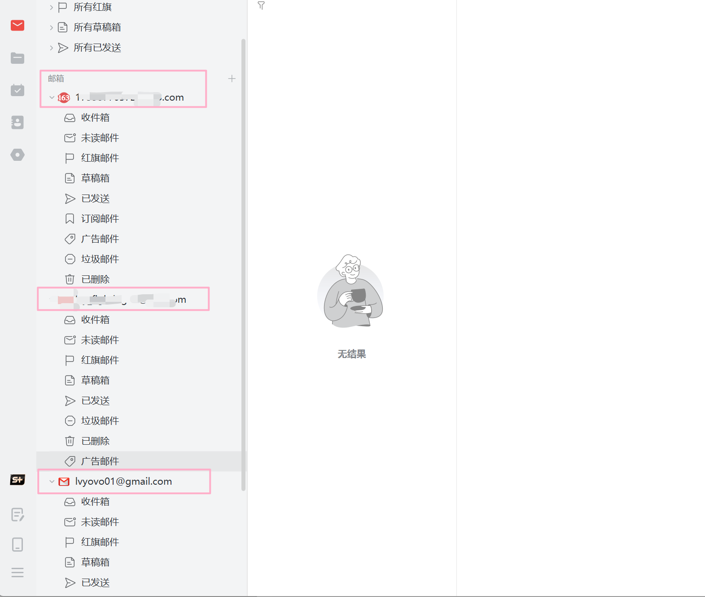
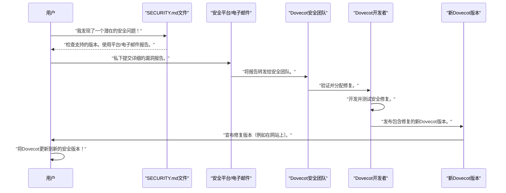

# 第5章：安全通信（SSL/TLS）

欢迎回来

在[第4章：服务运行](04_service_operation_.md)中，我们学习了如何启动Dovecot邮件服务器并使其运行。

现在，我们的服务器已经启动并准备好处理电子邮件，但有一个关键问题：==我们的邮件程序（如Outlook、Thunderbird或手机上的邮件应用）与Dovecot服务器之间的通信是否私密且安全==？

想象一下，我们正在发送一封非常重要的机密信件。我们会选择将其写在明信片上让所有人都能看到，还是将其放入密封的防拆信封中？当我们的邮件程序与Dovecot通信时，如果没有安全措施，就像在明信片上发送信息——任何人都可能"窃听"并读取我们的电子邮件、密码和其他敏感数据，因为它们会在互联网上传输。

这就是**安全通信（SSL/TLS）**发挥作用的地方。

本章将解释Dovecot如何为所有电子邮件通信提供一个强大的"密封信封"，确保隐私和保护。我们将探讨Dovecot如何使用一个名为OpenSSL的强大工具来实现这一点。

相关前文传送：[[Linux#60][HTTPS] 加密 | 数字指纹 | 详解HTTPS工作方案 | CA认证](https://blog.csdn.net/2301_80171004/article/details/142642574?ops_request_misc=%257B%2522request%255Fid%2522%253A%2522daff39d132d78c237e5f6a330e0b7b9b%2522%252C%2522scm%2522%253A%252220140713.130102334.pc%255Fblog.%2522%257D&request_id=daff39d132d78c237e5f6a330e0b7b9b&biz_id=0&utm_medium=distribute.pc_search_result.none-task-blog-2~blog~first_rank_ecpm_v1~rank_v31_ecpm-1-142642574-null-null.nonecase&utm_term=%E6%95%B0%E5%AD%97%E7%AD%BE%E5%90%8D&spm=1018.2226.3001.4450)

## 什么是SSL/TLS？为什么需要它？

**SSL/TLS**代表安全套接层/传输层安全性。

这些就像是围绕我们常规网络流量的高度复杂的安全包装。可以将其视为在我们的邮件程序和Dovecot服务器之间创建一个安全的私有隧道。

以下是它如此重要的原因：

1.  **`加密`**：这是安全的核心。当我们使用SSL/TLS时，所有数据（我们的电子邮件、用户名、密码）在离开设备之前都会==被加密成不可读的格式==。只有我们的Dovecot服务器（拥有特殊的"密钥"）==才能解密==和读取它，反之亦然。
    1.  这就像用只有我们和预期收件人才能理解的密码编写信件。

2.  **`认证`**：我们如何知道我们正在与实际的Dovecot服务器交谈，而不是试图欺骗我们的冒名顶替者？==SSL/TLS使用数字"证书"==，这些证书充当我们服务器的官方身份证。这些证书证明了服务器的身份，因此我们的邮件程序可以确保它连接到了正确的地方。

Dovecot作为一个专业级邮件服务器，依赖于一个众所周知且备受尊敬的"安全专家"库——**OpenSSL**来执行所有这些复杂的加密和认证任务。这种依赖意味着Dovecot不必为安全性重新发明轮子；它使用了一个经过验证的、久经考验的解决方案。

如[第2章：安装与构建过程](02_installation___build_process_.md)中的`INSTALL.md`文件所述：

```markdown
SSL/TLS
=======

Dovecot支持[OpenSSL](https://openssl-library.org/)以实现SSL/TLS功能。
```
**解释**：这明确说明Dovecot==使用OpenSSL库来实现其安全通信功能==，确认了它作为加密基础技术的角色。

## 如何在Dovecot中启用安全通信

要在Dovecot中启用SSL/TLS，我们主要需要两样东西：

1.  **==SSL证书==**：这是服务器的数字身份证，包含有关我们服务器的信息和公钥。
2.  **==SSL私钥==**：这是与证书匹配的密钥。它必须安全地保存在我们的服务器上，并允许Dovecot解密消息。

这些通常是服务器上的文件。一旦我们拥有了它们，我们需要告诉Dovecot在哪里找到它们并启用SSL/TLS。这是通过Dovecot的[配置系统](03_configuration_system_.md)完成的。

让我们看看相关的配置文件，通常是`conf.d/`目录中的`10-ssl.conf`。

```bash
cat /usr/local/etc/dovecot/conf.d/10-ssl.conf | grep -E "^#?ssl|^#?ssl_cert|^#?ssl_key" | head -n 10
```

**会发生什么**：
这个命令将显示`10-ssl.conf`文件中与SSL/TLS配置相关的行。默认情况下，某些行可能被注释掉（以`#`开头）。

```
# 来自10-ssl.conf的示例片段（默认或类似）
#ssl = yes
#ssl_cert = </etc/dovecot/certs/dovecot.pem
#ssl_key = </etc/dovecot/private/dovecot.key
```

**解释**：
*   `#ssl = yes`：当取消注释并设置为`yes`时，这行告诉Dovecot启用SSL/TLS。
*   `#ssl_cert = </etc/dovecot/certs/dovecot.pem`：这行指向存储服务器SSL证书的文件。`<`符号表示Dovecot应该从该路径读取文件内容。
*   `#ssl_key = </etc/dovecot/private/dovecot.key`：这行指向存储服务器SSL私钥的文件。

要启用安全通信，我们需要编辑此文件（例如使用`nano`或`vi`文本编辑器）以取消注释这些行，并确保路径指向我们实际的证书和密钥文件。

```bash
# 启用它的示例（在我们拥有实际文件后）
# 记住要编辑文件，而不是直接运行此命令！
#
# /usr/local/etc/dovecot/conf.d/10-ssl.conf
ssl = yes
ssl_cert = </path/to/your/server_certificate.pem
ssl_key = </path/to/your/server_private_key.key
```
**解释**：我们需要将`ssl = yes`取消注释（如果存在`#`则删除），并更新`ssl_cert`和`ssl_key`行为我们自己的证书和私钥的正确文件路径。

这些==文件通常使用OpenSSL等工具创建或由证书颁发机构（CA）提供==。进行这些更改后，我们需要`重新启动`Dovecot（如[第4章：服务运行](04_service_operation_.md)中所学）以使新设置生效。

## 安全通信在底层的工作原理

当Dovecot配置为使用SSL/TLS并且邮件程序尝试连接时，以下是发生的情况的简化视图：

```mermaid
sequenceDiagram
    participant MailApp as "用户的邮件应用"
    participant Dovecot as "Dovecot服务器"
    participant OpenSSL as "OpenSSL库"

    MailApp->>Dovecot: "连接（例如到IMAP端口）"
    Dovecot->>MailApp: "我支持TLS。让我们使这次对话安全吗？"
    MailApp->>Dovecot: "好的，让我们安全地进行！"
    Note over Dovecot, MailApp: "SSL/TLS握手开始：交换证书，协商加密方法"
    Dovecot->>OpenSSL: "提供服务器证书和私钥以进行握手"
    OpenSSL-->>Dovecot: "处理加密细节并生成会话密钥"
    Dovecot->>MailApp: "安全连接已建立"
    MailApp<->>Dovecot: "所有后续数据（电子邮件、密码）在传输过程中由OpenSSL加密"
```
**解释**：
1.  **初始化**：我们的邮件应用连接到Dovecot服务器。
2.  **安全提议**：Dovecot（因为设置了`ssl = yes`）告诉邮件应用："嘿，我可以安全地交谈，你想吗？"
3.  **协议与握手**：邮件应用同意。然后它们执行"握手"。在此过程中，==Dovecot出示其SSL证书==（其身份证），并安全地交换信息以商定一个秘密"密钥"（临时代码）来加密它们的对话。这个复杂的过程完全由**==OpenSSL库==**在幕后管理。
4.  **安全通道**：握手完成后，==建立了一个安全隧道==。从这一点开始，所有在我们的邮件应用和Dovecot之间流动的数据在发送前由OpenSSL加密，到达时由OpenSSL解密，保持我们的通信私密并防止窥探者。

一旦配置完成，整个过程会自动且非常快速地发生，为所有邮件服务器交互提供了一个强大的安全层。

## 结论

在本章中，我们学习了**安全通信（SSL/TLS）**以及为什么它对保护我们的电子邮件至关重要。

我们现在了解到Dovecot使用SSL/TLS来加密和认证通信，将开放的对话转变为私密的、密封的交换。

我们还看到了Dovecot对强大的**OpenSSL库**的依赖以实现此功能，以及如何通过在我们的配置中设置`ssl = yes`并指向`ssl_cert`和`ssl_key`文件来启用它。

确保我们的邮件服务器通信安全是整体安全的基础部分。虽然SSL/TLS处理了数据传输中的隐私问题，但为了构建真正强大的邮件服务器，还有许多其他方面需要考虑

[下一章：安全管理](06_security_management_.md)

---




> （软件实现的就是类似上述邮箱集成的服务器）

# 第6章：安全管理

在[第5章：安全通信（SSL/TLS）](05_secure_communication___ssl_tls__.md)中，我们学习了Dovecot如何加密我们的电子邮件流量，确保邮件在互联网传输过程中的私密性。这就像将重要信件放入安全的密封信封中。

但`如果"邮局(Dovecot服务端)"本身存在问题呢？`如果软件（Dovecot）存在可能意外暴露邮件的"漏洞"，即使使用了SSL/TLS？就像汽车制造商有安全召回流程一样，软件项目也需要明确的计划来处理潜在的安全问题。

这就是**安全管理**的用武之地。

它是项目官方的"安全指南"和"紧急联系方式"，用于在出现问题时使用。它明确告诉我们Dovecot项目如何处理安全问题，哪些版本受到保护，以及如果我们发现问题可以在哪里报告。这对于保持整个系统的可信度和安全性至关重要。

## 什么是安全管理？

将软件项目的安全管理想象成一家负责任公司的产品安全计划。如果我们发现可能危害用户的潜在缺陷，我们需要知道：
*   哪些产品仍受支持并将获得修复？（支持的版本）
*   如何负责任地报告缺陷，以便在恶意行为者利用之前修复？（报告渠道）
*   处理这些敏感问题的总体政策是什么？

Dovecot在专门的`SECURITY.md`文件中提供了这些问题的明确答案，这就像是项目的安全手册。

### 1. 支持的版本：保持安全

软件在不断演进。新功能被添加，有时也会发现新的安全漏洞。开发者不可能总是修复软件每个过去版本中的安全问题。这就是项目指定"支持的版本"的原因。

**这对我们的重要性**：如果我们运行的是非常旧版本的Dovecot，即使在新版本中发现并修复了严重的安全漏洞，我们的旧版本可能不会获得该修复。运行受支持的版本确保我们在开发者积极保护的系统上。

`SECURITY.md`文件明确说明了这一点：

```markdown
# 安全政策

## 支持的版本

对于社区，我们仅支持最新发布的版本。请访问https://www.dovecot.org/download查看最新版本。
```
**解释**：这段内容告诉我们，Dovecot社区官方仅支持（并提供安全修复）最新发布的版本。这是一种常见做法，以确保资源集中在最新且广泛使用的软件上。就像智能手机制造商仅提供最新操作系统版本的安全更新。

**我们的行动**：始终检查`https://www.dovecot.org/download`，确保我们使用的是最新、官方支持的Dovecot版本以获得最佳安全性。

### 2. 报告漏洞：我们的紧急联系方式

想象我们发现Dovecot中存在一个关键漏洞，可能允许某人读取他人的电子邮件。我们不会只是在公共论坛上发布它，对吧？那会给恶意人员在修复前利用它的机会！这被称为"负责任披露"。

项目需要一个专门的、安全的渠道，让我们可以直接向开发者私下报告此类问题。这使他们能够在问题广为人知之前调查并修复它。

`SECURITY.md`文件提供了这些关键的联系方式：

```markdown
## 报告漏洞或其他安全问题

要报告漏洞和其他安全问题，请使用https://yeswehack.com/programs/dovecot或发送电子邮件至[security@dovecot.org](mailto:security@dovecot.org)。
请仔细阅读程序范围。
```
**解释**：Dovecot提供了两种主要、专门的方式来报告安全问题：
1.  **安全平台(`https://yeswehack.com/programs/dovecot`)**：这是一个专门为安全研究人员设计的平台，用于保密地报告漏洞。它有助于管理流程、跟踪报告，并通常包括"漏洞赏金"计划，报告者可能会因发现并负责任地披露问题而获得奖励。
2.  **专用电子邮件地址(`security@dovecot.org`)**：用于直接与Dovecot安全团队私下沟通。

这两种方法确保我们的报告直接送达能够修复问题的人员，而不会过早地将漏洞暴露给公众。"仔细阅读程序范围"的说明意味着我们应该理解他们寻找的问题类型以及他们偏好的报告结构。

### 工作原理：报告安全问题

让我们可视化如果我们`发现Dovecot中的安全漏洞时的流程`：


**解释**：作为用户，我们查阅`SECURITY.md`文件以了解如何报告问题。

然后我们使用指定的私人渠道（安全平台或电子邮件）向Dovecot安全团队报告问题。团队验证问题，开发者创建修复，最终发布一个修复漏洞的新Dovecot版本。这确保严重问题能够快速且负责任地得到解决，保护所有用户。

## 结论

在本章中，我们学习了**安全管理**，这是任何负责任软件项目的重要方面。我们现在了解到Dovecot提供了关于**支持的版本**的明确指南（强调保持最新的重要性），并`提供了**专用渠道**（安全平台和电子邮件）来负责任地报告漏洞`。这个框架确保可以高效、安全地解决我们邮件服务器的潜在威胁，使Dovecot成为对所有人更值得信赖的系统。

通过理解Dovecot对安全管理的承诺，我们更有能力确保自己的邮件服务器保持安全和受保护。

END *★,°*:.☆(￣▽￣)/*.°★* 。