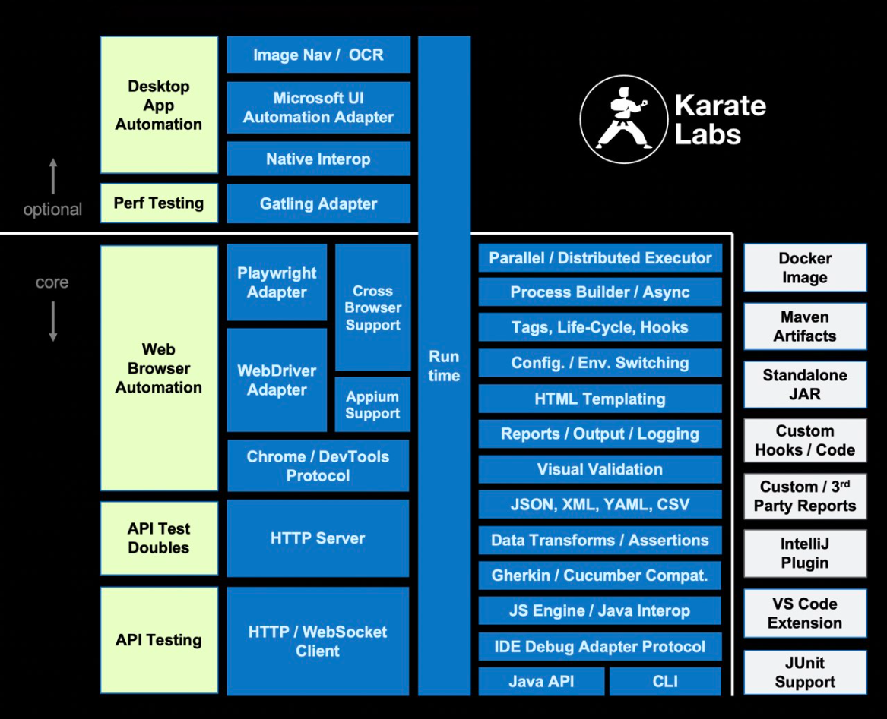
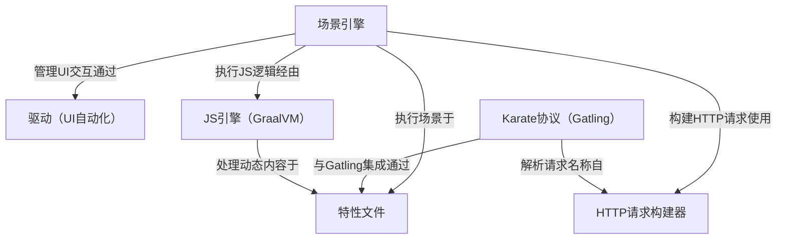
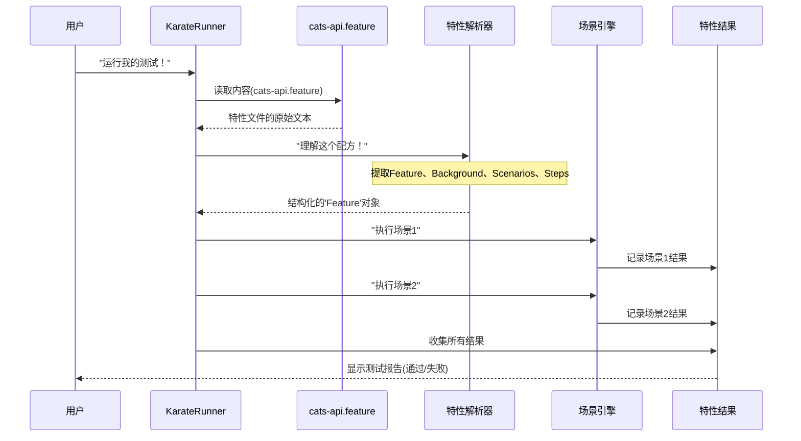

# docs：Karate



Karate是一个**==API测试自动化框架==**，允许用户使用类似Gherkin的简单、人类可读语言编写测试。

它通过`集成Gatling等工具`，支持*`功能性API测试`*、*UI自动化*（使用浏览器驱动）和*性能测试*，所有这些都由灵活的GraalVM JavaScript运行时提供支持。它是定义和执行复杂测试工作流及`断言`的多功能工具。

## 可视化



## 章节

1. [特性文件
](01_feature_.md)
2. [场景引擎
](02_scenarioengine_.md)
3. [HTTP请求构建器
](03_httprequestbuilder_.md)
4. [JS引擎（GraalVM）
](04_jsengine__graalvm__.md)
5. [驱动（UI自动化）
](05_driver__ui_automation__.md)
6. [Karate协议（Gatling）
](06_karateprotocol__gatling__.md)

-----------


# 第1章：特性文件

欢迎来到Karate

在这第一章中，我们将认识最基础的概念：**特性文件（Feature）**。可以把特性文件看作Karate测试的主要蓝图。

## 特性文件解决了什么问题？

假设我们正在构建一个在线商店，需要确保能够正确添加、查看和更新商品。

> 我们需要一种==结构化==的方式来编写这些测试步骤，以便任何人都能理解，同时计算机也能==自动==执行。

这正是"特性文件"的作用所在。在Karate中，特性文件就像是一个脚本或配方，用于测试应用程序的特定部分。它回答了这个问题："我想==通过这个测试验证软件的什么具体功能==？"

## 理解"特性文件"

在Karate中，特性文件是一个纯文本文件，通常以`.feature`结尾

这个文件是测试定义的主要容器。

以下是关于特性文件的关键要点：

*   **它是一个测试文件**：每个创建的`.feature`文件都被视为一个特性文件。
*   **它组织相关测试**：特性文件将多个单独的测试用例（Karate称为"场景"）组合在一起，这些用例都与相同的整体功能相关。例如，一个`.feature`文件可能测试"用户登录"的所有方面，而另一个测试"商品管理"。
*   **它可以包含背景设置**：通常，特性文件中的多个测试用例需要相同的初始设置（如登录或设置基础URL）。特性文件允许定义一个`Background`部分，其中包含在每个测试用例之前运行的步骤。这避免了重复编写相同的步骤。

> 本质上，==特性文件是我们的脚本==，定义了要执行的`操作`（如发送API请求）和对应用程序的`检查`（断言）。

## 第一个特性文件示例

让我们看一个简单的`.feature`文件示例

我们将模拟测试一个管理"猫"的API（想象一个宠物商店API）。

```gherkin
# 文件: cats-api.feature

Feature: 管理猫咪库存

  Background:
    # 这个URL将用于本文件中的所有请求
    * url 'http://localhost:8080/api/cats' 

  Scenario: 创建并获取猫咪信息
    Given request { name: 'Whiskers', color: 'black' }
    When method post
    Then status 200
    And match response == { id: '#uuid', name: 'Whiskers', color: 'black' }
    * def catId = response.id

    Given path catId
    When method get
    Then status 200
    And match response.name == 'Whiskers'

  Scenario: 更新猫咪名称
    * def id = 'some-existing-cat-id' # 通常我们会从前面的步骤或设置中获取这个ID
    Given path id
    And request { name: 'Shadow' }
    When method put
    Then status 200
    And match response.name == 'Shadow'
```

让我们分解这个示例：

*   `Feature: 管理猫咪库存`：这行声明了我们的特性文件。它为整个测试脚本命名，描述其目的。
*   `Background:`：这个部分包含在每个场景之前运行的步骤。
    *   `* url 'http://localhost:8080/api/cats'`：设置所有API调用的基础URL。我们只需设置一次，而不必每次都输入完整URL。
*   `Scenario: 创建并获取猫咪信息`：这是我们第一个测试用例的开始。
    *   `Given request { name: 'Whiskers', color: 'black' }`：准备要发送给API的数据（一只名为Whiskers的黑猫）。
    *   `When method post`：告诉Karate使用HTTP POST方法发送这些数据。
    *   `Then status 200`：检查API是否返回HTTP状态码200（表示"成功"）。
    *   `And match response == { id: '#uuid', name: 'Whiskers', color: 'black' }`：验证API响应是否符合预期。`#uuid`告诉Karate期望`id`是任何有效的UUID字符串。
    *   `* def catId = response.id`：将新创建猫咪的`id`保存到变量`catId`中供后续使用。
    *   接下来的几步使用`catId`执行GET请求并验证是否正确获取了猫咪信息。
*   `Scenario: 更新猫咪名称`：这是我们的第二个测试用例，测试更新功能。注意`Background`中的URL会自动再次使用。

这个简单的`.feature`文件让我们==定义了一个完整的测试目标==（`管理猫咪库存`），并将其分解为更小、可管理的测试用例（`创建并获取猫咪信息`，`更新猫咪名称`）。

## 内部机制：Karate如何处理特性文件

当我们让Karate运行测试时，以下是特性文件处理的简化流程：

1.  **启动Karate**：从命令行或开发环境启动测试运行。
2.  **Karate==查找==特性文件**：Karate定位所有的`.feature`文件。
3.  **解析特性文件**：对于每个`.feature`文件，Karate像读取配方一样"读取"它。它理解关键字（`Feature`、`Background`、`Scenario`、`Given`、`When`、`Then`），并将文本转换为内部引擎可以理解的结构化对象。
4.  **执行场景**：Karate逐个执行每个`Scenario`（及其关联的`Background`步骤），执行我们编写的指令。
5.  **收集结果**：Karate记录每个步骤和场景是通过还是失败。
6.  **生成报告**：最后，Karate将所有结果编译成可读的报告，告诉我们"特性文件"（及其所有场景）的整体成功或失败情况。

让我们用图表展示这个过程：



现在，让我们看看实现这一功能的部分核心Karate代码：

#### `Feature`对象

Karate读取`.feature`文件后，会将其转换为名为`Feature`的Java对象。这个对象保存了文件中所有的结构信息。

```java
// karate-core/src/main/java/com/intuit/karate/core/Feature.java
package com.intuit.karate.core;

import java.util.ArrayList;
import java.util.List;

public class Feature {
    public static final String KEYWORD = "Feature"; // 标识特性文件的开始

    private String name;             // 例如："管理猫咪库存"
    private String description;      // 名称后的可选文本
    private Background background;   // Background部分（如果有）
    private List<FeatureSection> sections = new ArrayList(); // 场景或场景大纲的列表

    // 读取.feature文件并填充此对象的方法
    public static Feature read(String path) { /* ... */ return null; }
    // ... 其他获取名称、背景、部分等的方法 ...
}
```
**说明**：`Feature`类是Karate内部对`.feature`文件的表示

存储了我们给特性文件起的名称、任何描述、`Background`设置，最重要的是一个`FeatureSection`对象列表，其中每个部分对应文件中的一个`Scenario`或`Scenario Outline`。

#### `FeatureParser`

这个组件负责读取`.feature`文件的文本内容，并将其转换为结构化的`Feature`对象。

```java
// karate-core/src/main/java/com/intuit/karate/core/FeatureParser.java
package com.intuit.karate.core;

import org.antlr.v4.runtime.tree.ParseTreeWalker;
// ... 其他导入 ...

public class FeatureParser extends KarateParserBaseListener {
    private final Feature feature; // 正在构建的Feature对象

    private FeatureParser(Feature feature, InputStream is) {
        this.feature = feature;
        // ... 使用ANTLR（解析器生成器）读取输入流 ...
        // 并"遍历"解析后的结构，调用enterFeatureHeader等方法。
        ParseTreeWalker walker = new ParseTreeWalker();
        walker.walk(this, parser.feature());
    }

    protected static void parse(Feature feature) {
        // 这个方法启动对给定特性资源的解析过程。
        // 它读取.feature文件的内容并填充Feature对象。
    }

    @Override
    public void enterFeatureHeader(KarateParser.FeatureHeaderContext ctx) {
        // 当解析器遇到"Feature:"行时调用此方法。
        // 它从解析的文本中提取特性文件的名称和描述。
        // feature.setName(...);
        // feature.setDescription(...);
    }

    // @Override public void enterBackground(...) { ... }
    // @Override public void enterScenario(...) { ... }
    // ... 类似的Background、Scenario等方法 ...
}
```
**说明**：`FeatureParser`是专门"读取"`.feature`文件中使用的Gherkin语法的组件

它逐行读取文件，识别`Feature`、`Background`、`Scenario`和步骤（`Given`、`When`、`Then`）等关键字，然后利用这些信息构建`Feature`对象。

#### `FeatureRuntime`

一旦创建了`Feature`对象，`FeatureRuntime`就会接管。它是"协调器"，管理特性文件中所有`Scenario`的实际执行。

```java
// karate-core/src/main/java/com/intuit/karate/core/FeatureRuntime.java
package com.intuit.karate.core;

import java.util.Iterator;
// ... 其他导入 ...

public class FeatureRuntime implements Runnable {
    public final FeatureCall featureCall; // 关于要运行的特性文件的信息
    public final FeatureResult result;   // 存储所有测试结果的对象
    public final Iterator<ScenarioRuntime> scenarios; // 要运行的场景列表

    public FeatureRuntime(ScenarioCall call) {
        // 构造函数设置FeatureRuntime，包含要运行的特性文件的详细信息。
        this.featureCall = call.featureCall;
        this.result = new FeatureResult(featureCall.feature);
        this.scenarios = new ScenarioIterator(this).filterSelected().iterator();
    }

    @Override
    public void run() {
        // 这个方法启动特性文件的执行。
        // 它遍历每个场景并执行。
        scenarios.forEachRemaining(this::processScenario);
        afterFeature(); // 完成结果并运行任何特性文件后的钩子。
    }

    private void processScenario(ScenarioRuntime sr) {
        // 这个方法执行单个场景（测试用例）。
        sr.run(); // 场景内步骤的实际执行发生在这里。
        synchronized (result) {
            result.addResult(sr.result); // 将场景结果添加到整体FeatureResult中。
        }
    }
    // ... 管理并行执行、钩子等方法 ...
}
```
**说明**：`FeatureRuntime`是`Feature`的主要执行者。它的`run()`方法系统地遍历`Feature`中的每个`Scenario`（由`ScenarioRuntime`对象表示）并执行它们。它还管理将每个场景的结果收集到`FeatureResult`对象中。

#### `FeatureResult`

最后，在所有内容运行完毕后，`FeatureResult`对象总结了整个特性文件测试运行的结果。

```java
// karate-core/src/main/java/com/intuit/karate/core/FeatureResult.java
package com.intuit.karate.core;

import java.util.ArrayList;
import java.util.List;
// ... 其他导入 ...

public class FeatureResult {
    private final Feature feature; // 已执行的特性文件
    private final List<ScenarioResult> scenarioResults = new ArrayList<>(); // 每个场景的结果

    public FeatureResult(Feature feature) {
        this.feature = feature;
    }

    public void addResult(ScenarioResult result) {
        scenarioResults.add(result); // 添加单个场景的结果
    }

    public int getFailedCount() {
        // 计算这个特性文件中失败的场景数量。
        // ...
        return 0; // 简化
    }

    public boolean isFailed() {
        // 如果特性文件中有任何场景失败，返回true。
        return getFailedCount() > 0;
    }
    // ... 计算总持续时间、通过数量、生成报告等方法 ...
}
```
**说明**：`FeatureResult`类是我们特性文件的记分板

- 在`FeatureRuntime`执行完特性文件中的所有场景后，`FeatureResult`聚合所有单独的`ScenarioResult`
- 它提供了一个摘要，包括有多少场景通过或失败，以及整个特性文件运行的总时间。这些数据对于生成测试报告至关重要。

## 总结

在本章中，我们了解到**特性文件**是Karate中的基础构建块

它是==一个`.feature`文件，充当测试脚本==，组织相关的测试用例（场景），并通常包含一个`Background`用于常见设置步骤

我们看到了如何创建一个简单的特性文件，并深入了解了Karate内部组件（`Feature`、`FeatureParser`、`FeatureRuntime`、`FeatureResult`）如何协同工作来处理和执行我们的测试。

现在我们已经理解了什么是特性文件，下一步自然就是深入了解单个测试用例是如何执行的。在下一章中，我们将探索[场景引擎](02_scenarioengine_.md)，它负责运行特性文件中的每个`Scenario`。

