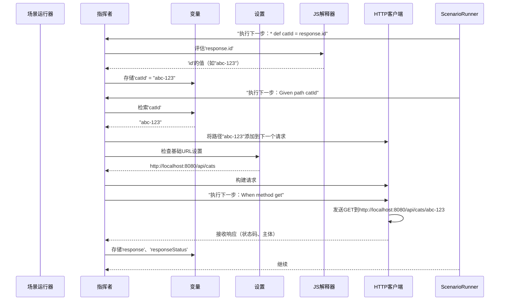
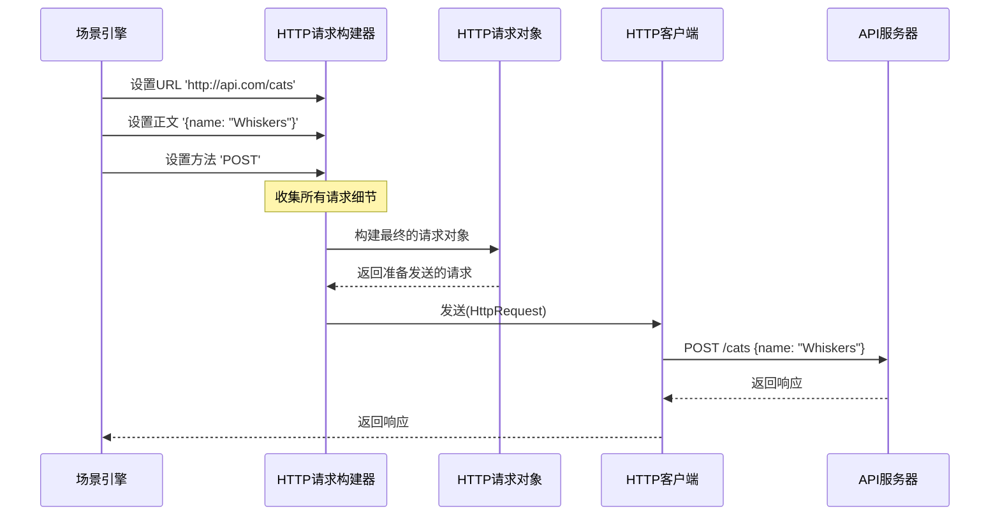

# 第2章：场景引擎

欢迎回来

在[第1章：特性文件](01_feature_.md)中，我们了解到`Feature`文件就像一本大型食谱，用于==组织测试用例==（场景）。

但究竟是==谁在"阅读"==这本食谱并"烹饪"这道菜呢？这就是**场景引擎（ScenarioEngine）**的职责所在

## 场景引擎解决了什么问题？

假设我们是主厨，刚刚收到一份食谱（Karate的`Scenario`）来制作一道特定的菜肴。这份食谱包含多个步骤："切洋葱"、"炒大蒜"、"加入香料"、"炖煮20分钟"。为了完成这道菜，我们需要：

1.  **跟踪食材**：当前可用的变量（如`catId`、`response`）是什么？
2.  **管理厨房工具**：访问正确的HTTP客户端发送请求，或使用UI驱动与网页交互。
3.  **按顺序执行指令**：逐个执行每个步骤（`Given`、`When`、`Then`）。
4.  **记住设置**：基础URL是什么？默认请求头是什么？
5.  **处理错误**：如果某个步骤失败，应该停止还是继续？

`ScenarioEngine`就像是一个运行中的`Scenario`的"大脑"。

> 从`.feature`文件中获取所有指令（步骤），并确保它们正确执行，同时管理所有动态部分

它保证了一个步骤中定义的变量可以在下一个步骤中使用，配置被正确应用，以及所有工具（如HTTP客户端）准备就绪。

它是**乐队的指挥**，每个测试步骤就像一种乐器，在正确的时间演奏自己的部分，使用正确的乐谱（变量）和设置（配置）。

## 场景引擎的工作原理

当我们运行Karate测试并开始执行某个`Scenario`时，Karate会为该`Scenario`创建一个专用的`ScenarioEngine`。这个引擎为测试提供了一个全新、干净的工作空间，==确保一个场景的变量或操作不会意外影响另一个场景==。

让我们回顾一下"cats-api.feature"示例中的一个步骤：

```gherkin
  Scenario: 创建并获取猫咪信息
    Given request { name: 'Whiskers', color: 'black' }
    When method post
    Then status 200
    And match response == { id: '#uuid', name: 'Whiskers', color: 'black' }
    * def catId = response.id  # <--- 'catId'如何被存储和使用？

    Given path catId           # <--- 'catId'如何在这里可用？
    When method get
    Then status 200
    And match response.name == 'Whiskers'
```

以下是`ScenarioEngine`处理这些步骤的方式：

1.  `Given request { name: 'Whiskers', color: 'black' }`：`ScenarioEngine`接收这条指令，准备一个HTTP请求，并将其主体设置为提供的JSON
2.  `When method post`：`ScenarioEngine`使用其内部的HTTP客户端（我们将在[第3章：HTTP请求构建器](03_httprequestbuilder_.md)中探讨）发送这个POST请求。
3.  `Then status 200`：收到响应后，`ScenarioEngine`检查HTTP状态码。如果不是200，则将该步骤标记为失败。
4.  `* def catId = response.id`：这是一个关键步骤！`ScenarioEngine`从API的`response`中获取`id`，并将其存储为名为`catId`的变量。这个变量现在可以在*当前场景*的任何后续步骤中使用。
5.  `Given path catId`：在下一步中，`ScenarioEngine`轻松检索之前存储的`catId`变量，并将其用于构建新请求的URL路径。

这种对数据、状态和操作的持续管理是`ScenarioEngine`的核心工作。

## 内部机制：场景引擎的工作原理

当我们运行一个`Scenario`时，执行操作的并不是`Scenario`本身，而是创建一个`ScenarioRuntime`来执行`Scenario`，然后`ScenarioRuntime`设置并使用`ScenarioEngine`来完成所有实际工作。

以下是`ScenarioEngine`职责的简化说明：

*   **变量存储（`vars`）**：它有一个特殊的映射（`vars`）来保存所有通过`* def`定义的变量或Karate自动创建的变量（如`response`、`responseStatus`）。这些变量在当前场景的任何步骤中都可使用。
*   **配置管理（`config`）**：它保存当前测试的设置，如`url`、超时时间、SSL设置等。当我们使用`* configure`时，`ScenarioEngine`会更新这些配置。
*   **JavaScript执行（`JS`）**：Karate允许我们编写强大的JavaScript表达式。`ScenarioEngine`包含一个[JsEngine（GraalVM）](04_jsengine__graalvm__.md)，可以运行这些表达式、评估动态值，甚至定义函数。
*   **操作分发器**：它包含每个Gherkin关键字（`url`、`path`、`request`、`method`、`match`、`def`、`configure`等）的方法，将我们人类可读的测试步骤转换为内部的Java代码操作。

让我们用图表展示这一协调过程：



### `ScenarioEngine`类

`ScenarioEngine`是一个核心类，它将Karate的许多功能整合到一个测试运行中。

```java
// karate-core/src/main/java/com/intuit/karate/core/ScenarioEngine.java
package com.intuit.karate.core;

import com.intuit.karate.*;
import com.intuit.karate.graal.JsEngine; // 导入JS引擎
import com.intuit.karate.http.HttpRequestBuilder; // 导入HTTP请求构建器
import java.util.Map; // 用于变量

public class ScenarioEngine {

    // 这些保存当前场景的"状态"
    private Config config;          // 当前测试配置
    private HttpRequestBuilder requestBuilder; // 构建HTTP请求的工具
    private final Map<String, Variable> vars;  // 场景的变量
    protected JsEngine JS;          // JavaScript执行上下文

    public ScenarioEngine(Config config, ScenarioRuntime runtime, Map<String, Variable> vars, Logger logger) {
        this.config = config;
        this.runtime = runtime; // 拥有此引擎的ScenarioRuntime
        this.vars = vars;       // 存储变量的映射
        this.logger = logger;
    }

    public void init() {
        JS = JsEngine.local(); // 初始化JavaScript引擎
        vars.forEach((k, v) -> JS.put(k, v.getValue())); // 将变量复制到JS上下文
        // ...（HTTP客户端等其他初始化）
    }

    // ... 许多用于Gherkin关键字的方法，如def、url、method、match ...
}
```
**说明**：`ScenarioEngine`构造函数接收`Config`（当前设置）、`ScenarioRuntime`（其父执行器）和一个空的`Map`（`vars`）用于变量。在`init()`中，它设置`JsEngine`并确保所有初始变量对JavaScript可用。它是整个场景执行的中心枢纽。

### Gherkin步骤到引擎调用：`ScenarioActions`

我们编写`Given request { ... }`，但Karate如何知道这意味着调用`ScenarioEngine`中的特定方法呢？这是`ScenarioActions`的工作。它充当桥梁，将我们的Gherkin步骤映射到`ScenarioEngine`中的适当方法。

```java
// karate-core/src/main/java/com/intuit/karate/ScenarioActions.java
package com.intuit.karate;

import com.intuit.karate.core.ScenarioEngine;
import com.intuit.karate.core.When; // 用于将Gherkin链接到Java方法的注解

public class ScenarioActions implements Actions {

    private final ScenarioEngine engine; // 持有ScenarioEngine的引用

    public ScenarioActions(ScenarioEngine engine) {
        this.engine = engine;
    }

    @Override
    @When("^def\\h+(\\w+)\\h+=\\h+(.+)") // 这是一个正则表达式，匹配'* def name = value'
    public void def(String name, String exp) {
        engine.assign(AssignType.AUTO, name, exp, false); // 调用ScenarioEngine来'分配'变量
    }

    @Override
    @When("^url (.+)") // 匹配'* url some-expression'
    public void url(String exp) {
        engine.url(exp); // 调用ScenarioEngine设置URL
    }

    @Override
    @When("^method\\h+(\\w+)") // 匹配'* method GET'或'* method post'
    public void method(String method) {
        engine.method(method); // 调用ScenarioEngine执行HTTP方法
    }

    // ... 许多其他Gherkin步骤方法 ...
}
```
**说明**：`ScenarioActions`类包装了`ScenarioEngine`。`ScenarioActions`中的每个方法都用`@When`注解，告诉Karate如何识别Gherkin步骤模式（例如，`^def\\h+(\\w+)\\h+=\\h+(.+)`表示"以`def`开头，后跟变量名，然后是`=`，再是任何表达式"）。当Gherkin步骤匹配时，Karate调用`ScenarioActions`中的相应方法，该方法随后将实际工作委托给`ScenarioEngine`。

### 变量管理：`assign`和`setVariable`

当我们编写`* def catId = response.id`时，会调用`ScenarioEngine`的`assign`方法。该方法评估右侧表达式（`response.id`），然后调用`setVariable`来存储它。

```java
// karate-core/src/main/java/com/intuit/karate/core/ScenarioEngine.java（简化版）
public class ScenarioEngine {
    // ...（字段和构造函数）...

    // 由ScenarioActions.def()调用
    public void assign(AssignType assignType, String name, String exp, boolean docString) {
        name = StringUtils.trimToEmpty(name);
        validateVariableName(name); // 确保'name'有效

        Variable v = docString ? new Variable(exp) : evalKarateExpression(exp); // 评估'response.id'
        setVariable(name, v); // 存储变量
    }

    public void setVariable(String key, Object value) {
        Variable v;
        Object o;
        if (value instanceof Variable) {
            v = (Variable) value;
            o = v.getValue();
        } else {
            o = value;
            v = new Variable(value);
        }
        vars.put(key, v); // 存储到内部的Java Map
        if (JS != null) {
            JS.put(key, o); // 同时存储到JavaScript引擎，供JS表达式使用
        }
    }

    public Variable evalKarateExpression(String text) {
        // ...（判断是否为JSON、XML或JavaScript的逻辑）...
        return evalJs(text); // 对于简单表达式，传递给JsEngine
    }

    public Variable evalJs(String js) {
        try {
            return new Variable(JS.eval(js)); // 执行JavaScript
        } catch (Exception e) {
            // ... 错误处理 ...
            throw ke;
        }
    }
}
```
**说明**：`assign`方法负责接收变量名和表达式，评估该表达式（通常通过`evalKarateExpression`和`evalJs`使用`JsEngine`），然后使用`setVariable`存储结果。`setVariable`非常重要，因为它将数据同时存储在Java的`Map`（`vars`）和`JsEngine`的上下文中，使其对Karate的内部操作和我们的JavaScript代码都可用。

## 总结

**场景引擎**是Karate测试的动态核心，充当每个`Scenario`的中央指挥单元

它专业地管理所有测试特定的数据（如变量和配置），协调每个步骤的执行，处理HTTP请求，并运行JavaScript

理解`ScenarioEngine`有助于我们了解Karate如何==将声明式的`Feature`文件无缝转换为可操作的测试步骤==。

现在我们已经了解了`ScenarioEngine`如何指挥测试，接下来让我们深入了解其最重要的工具之一：==负责构建和发送HTTP请求==的组件

在下一章中，我们将探索[HTTP请求构建器](03_httprequestbuilder_.md)。

--------


# 第3章：HTTP请求构建器

在[第2章：场景引擎](02_scenarioengine_.md)中，我们了解到`ScenarioEngine`是一个勤勉的指挥者，==负责协调单个测试场景中的所有步骤==。

管理变量、应用配置并分发操作。其中最常见且强大的操作之一就是向应用程序的API发送HTTP请求。

但`ScenarioEngine`在发送这些HTTP请求之前，是如何实际==构建HTTP请求==的呢？这就是**HTTP请求构建器（HttpRequestBuilder）**的职责所在

## HTTP请求构建器解决了什么问题？

想象一下我们正在寄一封实体信件。在投递之前，我们需要仔细准备：

1.  **收件人地址（URL）**：信要寄到哪里？
2.  **方法（信件类型）**：是正式信件（POST）、便签（GET）、更新（PUT）还是取消（DELETE）？
3.  **内容（正文）**：要发送什么消息？
4.  **请求头（特殊说明）**：是否有"紧急"、"需要回执"或"内容是JSON"等特殊说明？
5.  **参数（额外细节）**：是否需要在地址中包含额外的细节，比如`trackingId`？

如果每次寄信都要手动完成这些步骤，不仅繁琐而且容易出错。`HttpRequestBuilder`正是为了解决HTTP请求的这一问题而设计的。它是一个抽象层，帮助Karate以清晰、结构化的方式逐步构建HTTP请求，然后再发送出去。

它允许我们逐项指定请求的URL、方法、请求头、参数和正文。可以将其视为一个**智能表单**，我们为HTTP请求填写这个表单。表单中的每个字段都有明确定义，我们可以按任意顺序填写，确保最终的"信件"（HTTP请求）在发送前准备就绪。

## 构建请求：示例

让我们回顾[第1章：特性文件](01_feature_.md)中的"创建猫咪"场景，看看在编写测试步骤时，`HttpRequestBuilder`是如何隐式工作的。

```gherkin
  Scenario: 创建一只新猫
    # 步骤1：设置请求正文
    Given request { name: 'Whiskers', color: 'black' }
    
    # 步骤2：定义HTTP方法
    When method post
    
    # 步骤3：发送并检查响应
    Then status 200
```

在这些简单的Gherkin步骤背后，`ScenarioEngine`正在使用`HttpRequestBuilder`来逐步积累请求的所有细节：

1.  `Given request { name: 'Whiskers', color: 'black' }`：这一步告诉`HttpRequestBuilder`准备一个包含此JSON数据的请求正文。
2.  `When method post`：这一步告诉`HttpRequestBuilder`请求将是一个`POST`请求。
3.  `Then status 200`：此时，`HttpRequestBuilder`已经收集了所有信息。它"构建"最终的`HttpRequest`对象，并将其交给`HttpClient`实际发送。

`HttpRequestBuilder`的妙处在于，我们不需要在Gherkin测试中直接与其交互。我们使用Karate的关键字（`url`、`path`、`request`、`method`、`header`、`param`），而`ScenarioEngine`会自动将这些关键字转换为对`HttpRequestBuilder`的调用。

以下是不同Gherkin关键字如何参与构建请求：

| Karate关键字 | 在HttpRequestBuilder上设置的内容       | 示例Gherkin                               |
| :----------- | :------------------------------------- | :---------------------------------------- |
| `url`        | 请求的基础URL。                        | `* url 'https://api.example.com'`         |
| `path`       | 向URL添加路径段。                      | `Given path 'cats'`                       |
| `method`     | HTTP方法（GET、POST、PUT、DELETE等）。 | `When method post`                        |
| `request`    | 请求的正文（JSON、XML、文本等）。      | `Given request { id: 1 }`                 |
| `header`     | 自定义HTTP请求头。                     | `And header Authorization = 'Bearer 123'` |
| `param`      | URL中的查询参数。                      | `And param limit = 10`                    |
| `form field` | 用于发送HTML表单数据。                 | `And form field name = 'Bob'`             |

## 内部机制：请求构建的过程

让我们深入了解一下`HttpRequestBuilder`的内部工作原理。

当`ScenarioEngine`（我们在第2章中提到的指挥者）遇到与构建HTTP请求相关的Gherkin步骤时，它不会立即发送请求。相反，它会使用`HttpRequestBuilder`实例"记录"这些细节。这个`HttpRequestBuilder`在单个请求的生命周期内存在，收集所有信息片段。

一旦遇到`method`步骤（例如`When method post`），它标志着请求已经完成并准备好发送。此时，`HttpRequestBuilder`将所有收集到的细节"构建"成一个最终的、不可变的`HttpRequest`对象。这个`HttpRequest`对象随后被传递给`HttpClient`，后者负责与API的实际通信。

以下是这一过程的简化序列：



### `HttpRequestBuilder`类

`HttpRequestBuilder`是主要的类，用于保存请求的*进行中*细节。它提供了设置URL、方法、请求头、正文和参数的方法。它采用"流畅API"风格，意味着我们可以链式调用方法。

```java
// karate-core/src/main/java/com/intuit/karate/http/HttpRequestBuilder.java
package com.intuit.karate.http;

import com.intuit.karate.core.Config; // 用于全局设置

public class HttpRequestBuilder {

    // 字段：存储正在构建的请求细节
    private String url;
    private String method;
    private Object body;
    // ... 其他字段，如请求头、参数等 ...

    public final HttpClient client; // 最终发送请求的客户端

    public HttpRequestBuilder(HttpClient client) {
        this.client = client;
    }

    public HttpRequestBuilder url(String value) {
        this.url = value; // 更新URL
        return this;       // 返回'this'以支持方法链式调用
    }

    public HttpRequestBuilder method(String method) {
        this.method = method; // 设置HTTP方法
        return this;
    }

    public HttpRequestBuilder body(Object body) {
        this.body = body; // 设置请求正文
        return this;
    }
    
    // ... 其他方法，如header()、param()、path() ...

    public HttpRequest build() {
        // 在构建之前，确保设置默认值（例如，如果未指定方法，则默认为GET）
        // ... buildInternal()逻辑 ...

        HttpRequest request = new HttpRequest(); // 创建最终的HttpRequest对象
        request.setMethod(method);
        request.setUrl(getUri()); // 从基础URL、路径和参数构造完整URL
        request.setBody(com.intuit.karate.JsonUtils.toBytes(body)); // 将正文转换为字节
        // ... 设置请求头等 ...
        return request; // 返回完全构建的请求
    }

    public Response invoke() {
        // ScenarioEngine调用此方法实际发送请求
        return client.invoke(build()); // 构建请求，然后传递给HttpClient
    }
    // ... 其他内部方法 ...
}
```
**说明**：`HttpRequestBuilder`类保存了HTTP请求的所有片段，这些片段在构建过程中逐步添加。

`url()`、`method()`和`body()`等方法更新其内部状态。`build()`方法获取所有这些积累的信息，并创建一个最终的`HttpRequest`对象。

`invoke()`方法是关键：它触发`build()`，然后将生成的`HttpRequest`传递给`HttpClient`进行发送。

### `HttpRequest`类

`HttpRequest`类表示*最终、完整且不可变*的HTTP请求，已准备好通过网络发送。

它是一个简单的数据容器，以结构化的方式保存所有必要的细节。

```java
// karate-core/src/main/java/com/intuit/karate/http/HttpRequest.java
package com.intuit.karate.http;

import java.util.List;
import java.util.Map;

public class HttpRequest {

    private String url;
    private String method;
    private Map<String, List<String>> headers; // 存储所有请求头
    private byte[] body;                       // 将请求正文存储为字节

    // ... 所有字段的getter和setter ...

    public String getUrl() {
        return url;
    }

    public void setUrl(String url) {
        this.url = url;
    }

    public String getMethod() {
        return method;
    }

    public void setMethod(String method) {
        this.method = method;
    }

    public byte[] getBody() {
        return body;
    }

    public void setBody(byte[] body) {
        this.body = body;
    }

    // ... 其他方法 ...
}
```
**说明**：`HttpRequest`对象就像一封完美填写地址并包装好的信件。

它包含最终的URL、选择的HTTP方法、任何指定的请求头以及请求正文，一切都准备好交付。

它不包含任何*构建*自身的逻辑；它只是`HttpRequestBuilder`的最终产品。

### `HttpClient`接口

`HttpClient`是一个接口，定义了如何发送`HttpRequest`。

Karate提供了默认实现（如底层的HTTP客户端库），但理论上我们可以根据需要替换它。

```java
// karate-core/src/main/java/com/intuit/karate/http/HttpClient.java
package com.intuit.karate.http;

import com.intuit.karate.core.Config;

public interface HttpClient {

    void setConfig(Config config);
    Config getConfig();
    Response invoke(HttpRequest request); // 核心方法：发送请求！

}
```
**说明**：`HttpClient`是投递服务。

一旦`HttpRequestBuilder`创建了`HttpRequest`（信件），`HttpClient.invoke()`（投递服务）就会将其发送到目标（API服务器）。然后等待`Response`（回信）并将其带回Karate。

## 总结

**HTTP请求构建器**是Karate中一个强大组件，它简化了构建HTTP请求的复杂任务

- 通过理解Gherkin关键字（如`url`、`method`、`request`、`header`和`param`）如何通过`HttpRequestBuilder`共同构建`HttpRequest`对象，我们可以更深入地了解Karate如何有效地与API通信。

现在我们已经介绍了HTTP请求的构建和发送方式，我们可能会好奇Karate如何==处理Gherkin步骤中的`动态值`和表达式==，比如评估`response.id`或自定义JavaScript逻辑。这正是我们将在下一章中探讨的内容：[JS引擎（GraalVM）](04_jsengine__graalvm__.md)。

