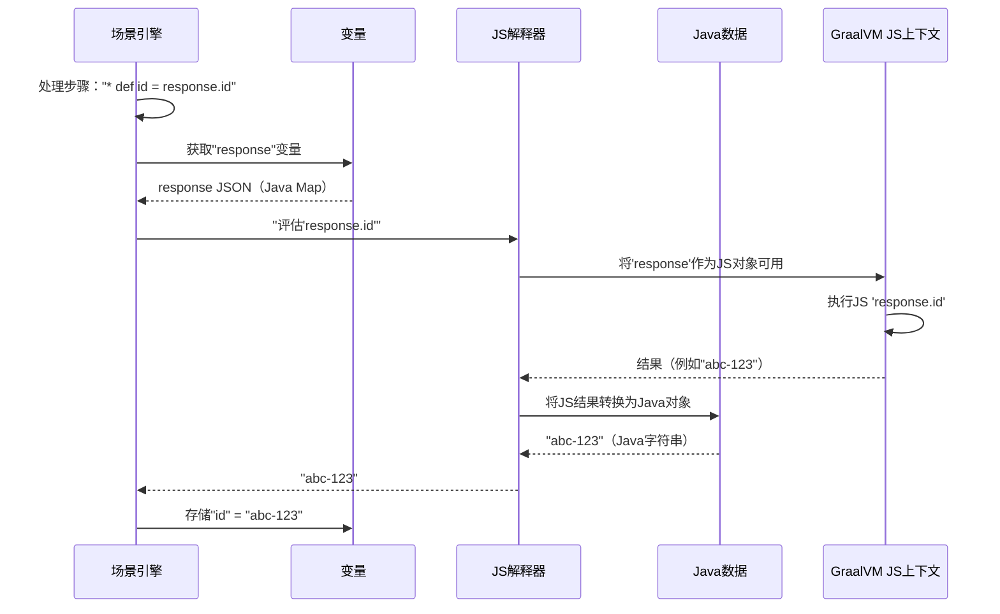

# 第4章：JS引擎（GraalVM）

欢迎回来

在[第3章：HTTP请求构建器](03_httprequestbuilder_.md)中，我们学习了Karate如何专业地构建和发送HTTP请求。

但如果测试数据不是静态的呢？

> 如果我们==需要计算一个值、转换响应或在测试步骤中运行一些`动态逻辑`呢==？

这时，**JS引擎**（Karate内置的JavaScript引擎，基于GraalVM）就派上用场了

它是一个强大的"大脑"，使Karate测试变得极其灵活和可编程，允许我们直接在`.feature`文件中使用JavaScript。

## JS引擎解决了什么问题？

假设API返回一个项目列表，我们需要过滤它们、计算总数，甚至从列表中==随机选择==一个项目。或者，我们可能需要为每个==请求生成==一个唯一的时间戳。仅仅定义静态值是不够的，测试需要==智能==

> `JsEngine`解决了测试中**动态逻辑和数据操作**的问题。它允许我们：

*   **==定义动态值的变量==**：例如，`* def uniqueId = 'prefix-' + new Date().getTime()`。
*   **==转换数据==**：将复杂的API响应转换为更简单的结构以便断言。
*   **==编写辅助函数==**：创建可重用的JavaScript代码供测试调用。
*   **==控制测试流程==**：使用条件逻辑根据之前的API响应做出决策。
*   **==在Java和JavaScript之间无缝切换==**：直接从JavaScript代码中访问Karate强大的内置函数（如`karate.get()`、`karate.map()`、`karate.call()`）。

可以将`JsEngine`视为一个**超级智能的计算器和微型计算机**，直接内置在Karate测试运行器中。它理解并执行JavaScript代码，使测试逻辑变得生动

## JS引擎的工作原理

当我们在`.feature`文件中编写JavaScript表达式（例如在`* def`、`* match`之后或使用`karate.`函数时），[ScenarioEngine](02_scenarioengine_.md)会将JavaScript代码交给`JsEngine`。`JsEngine`随后：

1.  **执行JavaScript**：在安全且隔离的环境中运行代码。
2.  **管理变量**：可以访问场景中定义的所有变量（如`response`、`catId`），并且任何通过`* def`定义的新变量都会存储在这里。
3.  **返回结果**：==将JavaScript执行的结果返回给[ScenarioEngine](02_scenarioengine_.md)==，后者使用该结果（例如赋值变量或检查断言）。
4.  **实现Java-JavaScript通信**：通过特殊的==桥接机制==，JavaScript代码可以调用Java方法并访问Karate的内部辅助函数，反之亦然。这就是为什么我们可以从JavaScript中调用`karate.log('hello')`。

Karate使用**GraalVM**作为其底层的JavaScript引擎。

GraalVM是一个高性能运行时，允许Java应用程序高效运行其他语言（如JavaScript）编写的代码。这意味着Karate中的JavaScript运行速度非常快

## 第一个Karate中的JavaScript示例

让我们看看如何在`.feature`文件中使用JavaScript处理动态数据。我们将为猫咪生成一个唯一名称，并在控制台中打印日志。

```gherkin
# 文件: dynamic-cat.feature

Feature: 管理动态猫咪名称

  Background:
    * url 'http://localhost:8080/api/cats'

  Scenario: 创建一只具有动态名称的猫咪
    # 步骤1：使用JavaScript生成唯一名称
    * def uniqueName = 'Whiskers-' + new Date().getTime()
    
    # 步骤2：将生成的名称打印到控制台（使用Karate内置函数）
    * print '生成的猫咪名称:', uniqueName

    # 步骤3：在请求中使用动态名称
    Given request { name: uniqueName, color: 'striped' }
    When method post
    Then status 200
    And match response.name == uniqueName
```

以下是JavaScript部分的解析：

*   `* def uniqueName = 'Whiskers-' + new Date().getTime()`：
    *   这行代码告诉Karate定义一个变量`uniqueName`。
    *   值通过JavaScript表达式计算：`'Whiskers-' + new Date().getTime()`。`new Date().getTime()`是标准的JavaScript代码，获取当前时间的毫秒数，确保生成唯一的后缀。
    *   `JsEngine`执行此JavaScript代码，并将结果字符串赋值给`uniqueName`。
*   `* print '生成的猫咪名称:', uniqueName`：
    *   `print`是Karate的特殊关键字，自动将其参数传递给`JsEngine`并打印到控制台。它通常隐式调用JavaScript的`toString()`方法。
*   `Given request { name: uniqueName, color: 'striped' }`：
    *   这里，`uniqueName`是由JavaScript创建的变量。当Karate构建请求正文时，[ScenarioEngine](02_scenarioengine__.md)从其内部变量存储（与`JsEngine`关联）中检索`uniqueName`的值。

这个示例展示了`JsEngine`如何通过JavaScript轻松处理动态值。

## 内部机制：JS引擎的作用

当[ScenarioEngine](02_scenarioengine__.md)遇到需要JavaScript评估的表达式时，它会将该表达式传递给其`JsEngine`实例。`JsEngine`提供了一个JavaScript执行上下文，其中变量可用且代码可以运行。

以下是JavaScript表达式评估的简化流程：



### `JsEngine`类

Karate中的`JsEngine`类是GraalVM的`Context`对象的包装器。`Context`是所有JavaScript代码实际运行的地方。

```java
// karate-core/src/main/java/com/intuit/karate/graal/JsEngine.java
package com.intuit.karate.graal;

import org.graalvm.polyglot.Context; // GraalVM的JS执行环境
import org.graalvm.polyglot.Engine;
import org.graalvm.polyglot.Value; // 表示JS值

public class JsEngine {

    // 这是实际运行脚本的GraalVM JS上下文
    public final Context context;
    // 允许访问JS全局作用域（变量存储的地方）
    public final Value bindings;

    private JsEngine(Context context) {
        this.context = context;
        // 'bindings'类似于浏览器/Node.js JS中的'window'或'global'对象
        bindings = context.getBindings("js");
    }

    // 为场景创建新的隔离JsEngine
    public static JsEngine local() {
        // ...（创建新GraalVM Context的逻辑）...
        return new JsEngine(createContext(engine));
    }

    // 评估JavaScript表达式并返回结果
    public JsValue eval(String exp) {
        return new JsValue(evalForValue(exp));
    }

    // 将Java对象放入JS引擎的全局作用域
    public void put(String key, Object value) {
        bindings.putMember(key, JsValue.fromJava(value));
    }

    // ... 其他用于高级JS交互的方法 ...
}
```
**说明**：`JsEngine`持有`context`（JS运行的沙盒）和`bindings`（JS可访问的全局变量）。`eval()`方法是Karate执行JavaScript代码的方式，而`put()`是将Java对象（如`response`变量或`karate`辅助函数）提供给JavaScript上下文的方式。

### `ScenarioBridge`类

你可能已经注意到，Karate中许多有用的函数以`karate.`开头，例如`karate.log()`、`karate.get()`或`karate.call()`。这些是通过`ScenarioBridge`暴露给`JsEngine`的Java方法。它是JavaScript与Karate核心功能交互的**网关**。

```java
// karate-core/src/main/java/com/intuit/karate/core/ScenarioBridge.java
package com.intuit.karate.core;

import com.intuit.karate.graal.JsValue; // 用于在Java和JS之间转换
import org.graalvm.polyglot.Value; // GraalVM的通用值类型

public class ScenarioBridge {

    private final ScenarioEngine ENGINE; // 当前场景引擎的引用

    protected ScenarioBridge(ScenarioEngine engine) {
        ENGINE = engine; // ScenarioBridge需要访问ScenarioEngine
    }

    // 暴露给JS的内置Karate函数示例
    public Object call(boolean sharedScope, String fileName, Value arg) {
        // ... 调用ScenarioEngine.call()运行另一个特性文件 ...
        return JsValue.fromJava(result.getValue()); // 将结果返回给JS
    }

    // 'karate.log()'函数
    public void log(Value... values) {
        // 仅在启用打印时记录
        if (ENGINE.getConfig().isPrintEnabled()) {
            ENGINE.logger.info("{}", new LogWrapper(values)); // 使用ScenarioEngine的记录器
        }
    }

    // 'karate.get()'函数，用于访问变量/JSON路径
    public Object get(String exp) {
        // ... 使用ScenarioEngine.evalKarateExpression() ...
        return JsValue.fromJava(v.getValue()); // 返回包装为JS的Java对象
    }

    // ... 许多其他Karate实用函数，如map、filter、eval、embed ...
}
```
**说明**：`ScenarioBridge`充当代理。当在`.feature`文件中调用`karate.log()`时，`JsEngine`会在`karate`对象（`ScenarioBridge`的实例）上找到`log()`方法，然后Java中的这个`log()`方法调用`ScenarioEngine`的实际日志机制。`JsValue.fromJava()`和`JsValue.toJava()`调用对于在Java和JavaScript世界之间转换数据至关重要。

### `Variable`和`JsValue`：桥接Java和JavaScript

为了使数据在Java和JavaScript之间无缝流动，Karate使用`Variable`（Java的内部表示）和`JsValue`（GraalVM `Value`对象的辅助类）。

```java
// karate-core/src/main/java/com/intuit/karate/core/Variable.java（简化版）
package com.intuit.karate.core;

import com.intuit.karate.graal.JsValue; // 用于从GraalVM Value转换
import org.graalvm.polyglot.Value;

public class Variable {
    public final Type type;
    private final Object value; // 实际的Java对象

    public Variable(Object o) {
        if (o instanceof Value) { // 如果是来自GraalVM的JS值
            o = new JsValue((Value) o).getValue(); // 转换为Java对象
        }
        // ... 根据'o'确定类型并存储为'value' ...
        this.value = o;
    }

    // ... 获取值、检查类型、转换为字符串/映射/列表的方法 ...
}
```

```java
// karate-core/src/main/java/com/intuit/karate/graal/JsValue.java（简化版）
package com.intuit.karate.graal;

import org.graalvm.polyglot.Value; // GraalVM对任何JS值的表示

public class JsValue {

    private final Value original; // 原始的GraalVM JS Value
    protected final Object value;  // 转换后的Java对象
    public final Type type;

    public JsValue(Value v) {
        this.original = v;
        // ... 将'v'（GraalVM Value）转换为标准Java 'Object'的逻辑 ...
        // 例如：如果v.isString()，则value = v.asString()
        // 如果v.hasArrayElements()，则value = Java List
        this.value = convertedJavaObject;
        this.type = determinedType;
    }

    public <T> T getValue() {
        return (T) value; // 获取原始Java对象
    }

    public static Object fromJava(Object o) {
        // 将Java对象转换为适合GraalVM JS的表示形式
        // 例如，Java List -> JsList（GraalVM代理对象）
        // Java Map -> JsMap
        // 简单类型（String、Number、Boolean）直接传递
        return o; // 简化
    }

    public static Object toJava(Value v) {
        return new JsValue(v).getValue(); // 将GraalVM Value转换回Java对象
    }

    // ... 其他辅助方法 ...
}
```
**说明**：`Variable`是Karate内部用于存储任何数据的"盒子"。当JavaScript提供一个值（GraalVM的`Value`）时，`Variable`使用`JsValue`打开这个盒子并获取其中的原生Java对象。相反，`JsValue.fromJava()`用于使Java对象"JavaScript友好"，以便可以传递给`JsEngine`并被JavaScript代码理解。这种持续的转换确保了无缝的互操作性。

## 总结

**JS引擎**是一个核心组件，为Karate提供了==灵活性==和强大功能。

通过提供高性能的JavaScript执行环境（GraalVM）以及Java和JavaScript之间的无缝桥接，它允许我们在`.feature`文件中嵌入动态逻辑、转换数据并利用强大的实用函数。理解`JsEngine`使我们能够编写==更智能、更灵活和更健壮的测试==。

现在我们已经了解了Karate如何执行动态逻辑，接下来让我们探索它==如何与Web浏览器交互以实现用户界面自动化==。在下一章中，我们将深入探讨[驱动（UI自动化）](05_driver__ui_automation__.md)。
