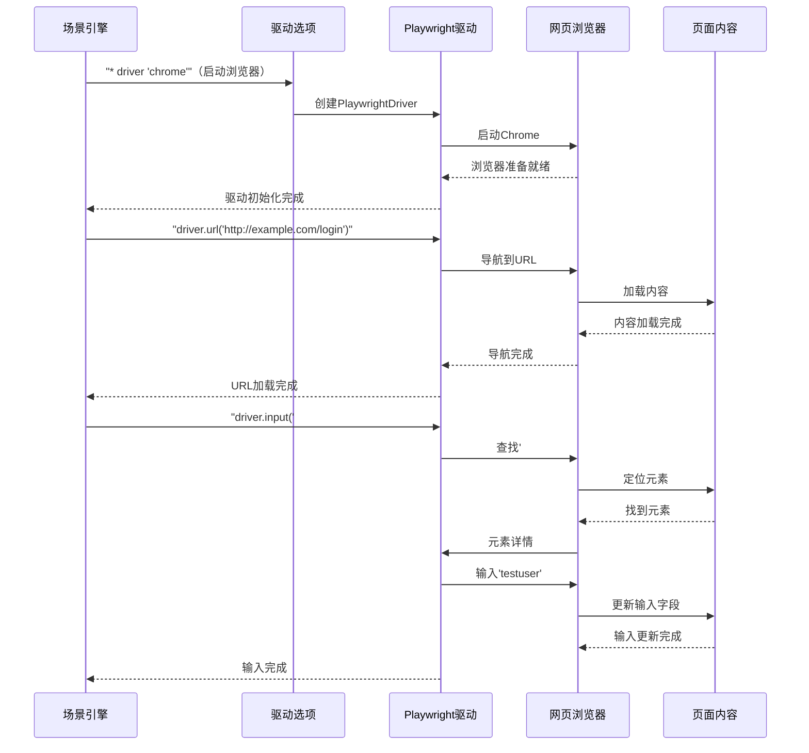

# 第5章：驱动（UI自动化）

欢迎回来

在[第4章：JS引擎（GraalVM）](04_jsengine__graalvm__.md)中，我们学习了Karate如何==使用JavaScript为API测试添加`动态`逻辑和数据操作==。

但如果应用程序不仅仅是API呢？如果它是一个网站或桌面应用程序，需要用户交互呢？Karate如何=="看到"并"点击"按钮、在字段中输入内容以及验证屏幕上的内容==？

这就是**驱动（Driver）**的用武之地——它是测试的"眼睛"和"手"，用于用户界面（UI）自动化

## 驱动解决了什么问题？

假设我们正在测试一个在线商店。我们需要验证用户是否可以：
1.  打开网站。
2.  在登录表单中输入用户名和密码。
3.  点击"登录"按钮。
4.  登录成功后看到"欢迎"消息。

每次修改网站后手动执行这些步骤既繁琐又缓慢。我们需要一种方法让测试自动执行这些步骤，就像真实用户一样，然后检查屏幕上的一切是否正确。

`Driver`是Karate对这一问题的解决方案。它就像一个**遥控器**，让测试脚本与Web浏览器（如Chrome、Firefox或Edge）甚至桌面应用程序交互。它提供了以下功能：
*   **导航**到不同的网页。
*   **查找**屏幕上的元素（如按钮、输入字段、文本）。
*   **对这些元素执行操作**（如点击、输入、悬停）。
*   **从屏幕获取信息**（如文本内容、输入值、属性）。
*   **截图**以查看用户看到的内容。

本质上，==`Driver`将测试指令转换为浏览器或应用程序理解的命令==，从而实现UI交互的自动化。

前文传送：[[测试_9] 自动化测试 | web自动化--Selenium实战](https://blog.csdn.net/2301_80171004/article/details/148256957?ops_request_misc=%257B%2522request%255Fid%2522%253A%25229573b3b02b4ba4aec1ceb3de0d827ad3%2522%252C%2522scm%2522%253A%252220140713.130102334.pc%255Fblog.%2522%257D&request_id=9573b3b02b4ba4aec1ceb3de0d827ad3&biz_id=0&utm_medium=distribute.pc_search_result.none-task-blog-2~blog~first_rank_ecpm_v1~rank_v31_ecpm-7-148256957-null-null.nonecase&utm_term=%E8%87%AA%E5%8A%A8&spm=1018.2226.3001.4450)

## 驱动的工作原理

当告诉Karate启动UI测试时，它会启动一个`Driver`（或连接到现有的`Driver`）

这个`Driver`随后管理Karate测试脚本与实际浏览器或应用程序之间的通信。

每次在`.feature`文件中使用`driver.<action>`命令时，`Driver`会在UI上执行该操作。例如，`driver.url('http://example.com')`告诉浏览器导航到该URL。`driver.click('#loginButton')`告诉它找到ID为`loginButton`的元素并点击它。

==Karate可以为`Driver`使用不同的底层技术==，例如Playwright（支持Chrome、Firefox、WebKit）、Selenium WebDriver，甚至是专门的桌面自动化工具（如`karate-robot`用于Windows应用程序）。我们只需告诉Karate需要*哪种类型*的驱动（例如`'chrome'`、`'firefox'`、`'webview'`），==剩下的交给它处理==。

## 自动化登录页面示例

让我们使用登录页面示例来看看`Driver`如何在`.feature`文件中使用：

```gherkin
Feature: 网站用户登录

  Scenario: 使用有效凭据成功登录
    # 步骤1：启动浏览器（例如Chrome，内部使用Playwright）
    * driver 'chrome'
    
    # 步骤2：导航到登录页面URL
    * driver.url('http://example.com/login')
    
    # 步骤3：找到用户名输入字段（使用其ID）并输入内容
    * driver.input('#username', 'testuser')
    
    # 步骤4：找到密码输入字段并输入密码
    * driver.input('#password', 'testpass')
    
    # 步骤5：点击登录按钮
    * driver.click('#loginButton')
    
    # 步骤6：等待欢迎消息出现在页面上
    * driver.waitForText('#welcomeMessage', 'Welcome, testuser!')
    
    # 步骤7：最终断言文本完全符合预期
    * match driver.text('#welcomeMessage') == 'Welcome, testuser!'
```

让我们分解这个示例：

*   `* driver 'chrome'`：这一行是启动UI自动化`Driver`的方式。它告诉Karate启动一个'chrome'浏览器。Karate通常在底层使用Playwright库，提供强大、快速且现代的浏览器自动化体验。
*   `* driver.url('http://example.com/login')`：此命令使用`Driver`指示浏览器转到指定的URL。
*   `* driver.input('#username', 'testuser')`：这里的`#username`是一个"定位器"。可以将定位器视为页面上元素的唯一地址或标识符（如HTML ID、CSS选择器或XPath）。`Driver`找到此地址的元素，然后输入`testuser`。
*   `* driver.click('#loginButton')`：类似地，`Driver`找到由`#loginButton`标识的元素，并模拟鼠标点击。
*   `* driver.waitForText('#welcomeMessage', 'Welcome, testuser!')`：这是一个非常有用的命令。它告诉`Driver`等待ID为`#welcomeMessage`的元素出现在页面上，并包含指定的文本。`Driver`会不断检查，直到找到或超时。
*   `* match driver.text('#welcomeMessage') == 'Welcome, testuser!'`：等待后，我们使用`driver.text('#welcomeMessage')`获取元素的实际文本内容，然后`match`它与预期值，确保登录成功。

## 内部机制：UI自动化如何实现

当使用`* driver`关键字并调用`driver.url()`或`driver.input()`等方法时，以下是简化的执行流程：

1.  **驱动初始化**：`* driver 'chrome'`步骤触发[ScenarioEngine](02_scenarioengine__.md)使用`DriverOptions`设置所选`Driver`。这涉及启动浏览器或连接到现有浏览器。
2.  **命令转换**：当调用`driver.url(...)`或`driver.click(...)`时，具体的`Driver`实现（例如`PlaywrightDriver`）将此通用Karate命令转换为底层浏览器自动化库（例如Playwright的`page.navigate()`或`locator.click()`）的特定命令。
3.  **浏览器交互**：命令发送到运行的浏览器。浏览器在网页上执行操作。
4.  **结果检索**：如果命令需要结果（如`driver.text()`），`Driver`等待浏览器的响应并将其返回给Karate测试。



### `Driver`接口

`Driver`接口（类似于蓝图）定义了任何UI自动化工具应能执行的常见操作。当编写`driver.url(...)`时，我们调用的是此接口中声明的方法。

```java
// karate-core/src/main/java/com/intuit/karate/driver/Driver.java（简化版）
package com.intuit.karate.driver;

import java.util.List;
import java.util.Map;

public interface Driver { // 这是所有UI驱动的蓝图

    // 静态方法启动特定驱动（例如'chrome'、'firefox'）
    public static Driver start(Map<String, Object> options) { /* ... */ return null; }

    void quit(); // 关闭浏览器/应用程序的方法

    String getUrl(); // 获取当前页面的URL
    void setUrl(String url); // 导航浏览器到指定URL

    // 与UI元素交互的方法
    Element click(String locator);
    Element input(String locator, String value);
    String text(String locator);
    boolean exists(String locator);

    // 等待条件的方法
    Element waitFor(String locator);
    String waitForUrl(String expected);
    Element waitForText(String locator, String expected);

    byte[] screenshot(boolean embed); // 截图

    // ... 许多其他UI自动化方法 ...
}
```
**说明**：`Driver`接口列出了Karate测试可以从==任何==UI自动化会话中期望的标准功能。它确保无论是控制Chrome、Firefox还是桌面应用程序，我们都有一组一致的命令可供使用。

### `PlaywrightDriver`实现

虽然`Driver`是一个接口，但具体类如`PlaywrightDriver`（用于Web浏览器）或`Robot`（用于桌面应用程序）实现了这些方法。`PlaywrightDriver`使用优秀的Playwright库来控制Web浏览器。

```java
// karate-playwright/src/main/java/com/intuit/karate/playwright/driver/PlaywrightDriver.java（简化版）
package com.intuit.karate.playwright.driver;

import com.intuit.karate.driver.Driver; // 实现标准Driver接口
import com.intuit.karate.driver.Element;
import com.microsoft.playwright.Page;      // Playwright的核心浏览器页面对象
import com.microsoft.playwright.Locator;    // Playwright查找元素的方式

public class PlaywrightDriver implements Driver { // Driver接口的具体实现

    private Page page; // 实际控制浏览器标签页的Playwright页面对象

    public PlaywrightDriver(PlaywrightDriverOptions options, Browser browser, Playwright playwright) {
        // 构造函数初始化Playwright，启动浏览器并创建新的'page'对象。
        this.page = browserContext.newPage();
    }

    @Override
    public void setUrl(String url) {
        page.navigate(url); // 调用Playwright的原生方法导航
    }

    @Override
    public Element input(String locator, String value) {
        // Playwright使用定位器找到元素并填充其值
        Locator pwLocator = page.locator(locator);
        pwLocator.fill(value);
        return rootElement(locator); // 返回Karate Element以支持链式调用
    }

    @Override
    public Element click(String locator) {
        // Playwright找到元素并点击它
        Locator pwLocator = page.locator(locator);
        pwLocator.click();
        return rootElement(locator);
    }

    @Override
    public String text(String locator) {
        // Playwright找到元素并返回其文本内容
        return page.locator(locator).textContent();
    }

    // ... 实现Driver接口中定义的所有其他方法 ...
}
```
**说明**：`PlaywrightDriver`是Karate内置的控制Web浏览器的方式。当执行`* driver 'chrome'`时，Karate可能会使用此`PlaywrightDriver`连接或启动Chrome浏览器。其方法直接调用Playwright库中的相应函数（`page.navigate`、`locator.fill`、`locator.click`），然后与实际浏览器窗口交互。

### `Element`接口

当`Driver`在屏幕上找到某些内容（如按钮或输入字段）时，它将其表示为`Element`

这个`Element`也有自己的操作，可以直接对其执行。

```java
// karate-core/src/main/java/com/intuit/karate/driver/Element.java（简化版）
package com.intuit.karate.driver;

import java.util.Map;

public interface Element { // 表示屏幕上找到的单个UI元素

    String getLocator(); // 用于找到此元素的定位器
    boolean isPresent(); // 元素当前是否在屏幕上可见？

    Element click(); // 点击此特定元素
    Element input(String value); // 在此特定元素中输入内容
    String getText(); // 获取此元素的文本内容
    String getValue(); // 获取输入字段的当前值

    // ... 其他特定于元素的操作和属性 ...
}
```
> **说明**：`Element`接口描述了*单个*UI组件在被定位后可以执行的操作。`Driver`在页面上执行全局操作，而`Element`让我们专注于与特定按钮、文本字段或链接交互。

### `DriverOptions`类

`DriverOptions`类帮助`Driver`的初始设置，并提供常见的实用方法，例如处理`waitFor`重试和解析不同的定位器类型。

```java
// karate-core/src/main/java/com/intuit/karate/driver/DriverOptions.java（简化版）
package com.intuit.karate.driver;

import com.intuit.karate.core.ScenarioRuntime;
import java.util.Map;
import java.util.function.Predicate;
import java.util.function.Supplier;

public class DriverOptions { // 管理驱动配置和实用程序

    public final Map<String, Object> options; // 来自特性文件的所有驱动配置
    public final int timeout; // 驱动操作的默认超时时间

    // 此静态方法是启动任何驱动的入口点
    public static Driver start(Map<String, Object> options, ScenarioRuntime sr) {
        // 它检查'options'映射中的'type'（例如'chrome'、'robot'）
        // 然后创建并返回正确的具体驱动实现。
        // 例如，对于'chrome'，它可能返回一个新的PlaywrightDriver。
        return null; // 简化
    }

    // 实用方法，用于'waitFor'命令重试操作
    public <T> T retry(Supplier<T> action, Predicate<T> condition, String logDescription, boolean failWithException) {
        // 此方法重复调用'action'（例如检查元素）
        // 并检查是否满足'condition'（例如元素存在）。
        // 当条件为真或达到最大尝试次数时停止。
        return action.get(); // 简化
    }

    // 将用户友好的定位器字符串（例如'#id'）
    // 转换为底层驱动可以理解的格式。
    public String selector(String locator, String contextNode) {
        // ... 解析CSS、XPath、友好定位器的逻辑 ...
        return "page.locator('" + locator + "')"; // 简化输出
    }

    // ... 包含许多其他配置和实用方法 ...
}
```
**说明**：`DriverOptions`就像==是`Driver`的控制面板==

处理我们提供的所有设置（如`headless: true`或`timeout: 10000`），在调用`* driver`时帮助选择正确的`Driver`实现，并管理`waitFor`命令的重试逻辑，使UI测试更加健壮。

## 总结

**驱动**是Karate强大的遥控器，用于与Web浏览器和桌面应用程序交互。通过抽象Playwright或Selenium等不同自动化工具的复杂性，它让我们能够编写清晰、人类可读的测试，模拟真实的用户交互。我们了解了如何==启动驱动、导航到URL、与元素交互以及验证屏幕上的内容==。

现在我们已经了解了Karate如何自动化API和UI，接下来可能会好奇它如何用于性能测试。在下一章中，我们将探索[Karate协议（Gatling）](06_karateprotocol__gatling__.md)，看看如何扩展Karate测试以进行负载测试。

