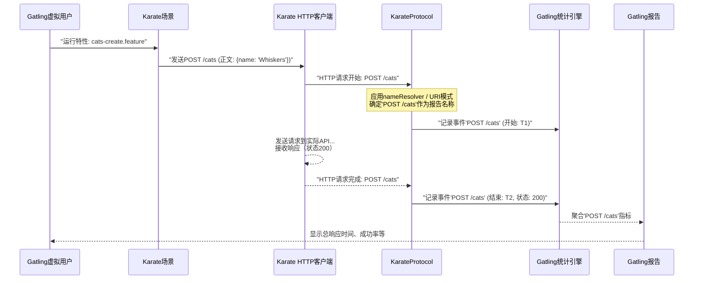

# 第6章：Karate协议（Gatling）

欢迎回来

在[第5章：驱动（UI自动化）](05_driver__ui_automation__.md)中，我们学习了Karate如何与Web浏览器交互以实现用户界面自动化，以及它在API测试中的主要优势。现在我们已经知道如何编写健壮的功能和UI测试，但如果需要==了解应用程序在高负载下的性能表现==呢？Karate测试能否用于性能测试？

答案是肯定的！这就是**KarateProtocol** for Gatling的用武之地。它是关键的桥梁，允许我们将现有的Karate API测试作为性能测试重用，并由强大的==Gatling负载测试工具==执行。

## KarateProtocol解决了什么问题？

假设我们有一个精心设计的Karate API测试，用于创建用户，然后通过动态生成的ID检索该用户：

```gherkin
Scenario: 创建并检索用户
  * url 'http://api.example.com/users'
  Given request { name: 'Alice' }
  When method post
  Then status 200
  * def userId = response.id

  * url 'http://api.example.com/users/' + userId
  When method get
  Then status 200
```

当使用性能测试工具Gatling运行此测试时，Gatling需要为每个HTTP请求收集指标。如果我们向`/users/123`、`/users/456`和`/users/789`发送请求，默认情况下，Gatling会将这些视为*三个不同的请求*，因为它们的URL不同。这会导致性能报告中出现数百或数千个唯一的URL，使得无法看清"通过ID获取用户"端点的整体性能。

`KarateProtocol`通过充当**翻译器和记分员**来解决这个问题。它定义了Gatling应如何==理解和聚合Karate场景发出的HTTP请求==。它允许我们：

1.  **分组动态URL**：告诉Gatling`/users/123`和`/users/456`应报告在单一有意义的名称下，如"GET /users/{id}"。
2.  **定义暂停时间**：在特定类型的请求之间==引入延迟==，以模拟用户"思考时间"或控制某些端点的请求速率。
3.  **为性能运行配置Karate**：专门为负载测试设置Karate的环境，例如加载不同的配置文件。

可以将`KarateProtocol`视为**交给Gatling的规则手册**

> 当Karate测试在性能测试的"游戏"中运行时，它确保Gatling==理解==哪些"玩法"是相似的，如何==评分==以及如何清晰地==报告==，即使涉及动态数据。

## KarateProtocol的工作原理

当将Karate与Gatling集成时，我们会编写一个小的Gatling模拟脚本（通常用Scala或Java），定义负载配置文件（例如"在1分钟内逐步增加100个用户"）。在此脚本中，我们声明一个`KarateProtocol`实例。

这个`KarateProtocol`配置：
*   **识别URL模式**：指定模式如`/users/{id}`，告诉`KarateProtocol`如何规范化动态URL。
*   **提供`nameResolver`**：这是一个强大的函数，可以检查Karate发出的每个HTTP请求，并为Gatling报告返回自定义名称。这对于GraphQL或SOAP API特别有用，因为URL可能是固定的，但*负载*定义了操作。
*   **设置Karate `Runner`**：允许在Gatling下运行时为Karate测试配置环境（例如`karate.env = 'perf'`）。

每当Karate测试（在Gatling虚拟用户中运行）发出HTTP请求时，`KarateProtocol`会拦截此请求。它使用定义的模式或`nameResolver`为该请求确定一个一致的聚合名称，然后将此名称与请求的开始和结束时间一起传递给Gatling的统计引擎，以便正确报告。

## 使用KarateProtocol：示例

让我们看一个用Java编写的简单Gatling模拟，演示如何使用`KarateProtocol`对Karate特性进行性能测试（Gatling也支持Scala，非常类似）。

```java
// 文件: src/test/java/mock/CatsSimulation.java（简化版）
package mock;

import com.intuit.karate.gatling.javaapi.KarateProtocolBuilder;
import io.gatling.javaapi.core.ScenarioBuilder;
import io.gatling.javaapi.core.Simulation;
import static io.gatling.javaapi.core.CoreDsl.*;
import static com.intuit.karate.gatling.javaapi.KarateDsl.*;

public class CatsSimulation extends Simulation {

  public CatsSimulation() {
    // 步骤1：定义KarateProtocol
    KarateProtocolBuilder protocol = karateProtocol(
      // 将动态URL映射到Gatling报告的静态名称
      uri("/cats/{id}").nil(), // GET, PUT, DELETE /cats/123 -> "GET /cats/{id}"
      uri("/cats").pauseFor(method("get", 15), method("post", 25)) // /cats端点
    );

    // 可选：自定义请求名称解析方式以用于报告
    // 如果请求有'karate-name'头，则使用其值作为报告名称
    protocol.nameResolver = (req, ctx) -> req.getHeader("karate-name");

    // 可选：配置Karate测试运行器的环境
    // 这将使所有Karate场景的'karate.env'等于'perf'
    protocol.runner.karateEnv("perf");

    // 步骤2：定义执行Karate特性的Gatling场景
    ScenarioBuilder create = scenario("创建猫咪").exec(
      karateFeature("classpath:mock/cats-create.feature")
    );

    // 步骤3：设置Gatling负载注入
    setUp(
      create.injectOpen(rampUsers(10).during(5)).protocols(protocol)
    );
  }
}
```

让我们分解此示例中的`KarateProtocol`部分：
*   `KarateProtocolBuilder protocol = karateProtocol(...)`：这是我们创建`KarateProtocol`实例的地方。使用`karateProtocol()`辅助函数。
*   `uri("/cats/{id}").nil()`：这一行对聚合至关重要。它告诉`KarateProtocol`，任何匹配`/cats/{id}`的URI请求（其中`{id}`是任何动态值的占位符）都应报告在单一的聚合名称`/cats/{id}`下。`nil()`表示此模式上没有为任何HTTP方法配置特定的"暂停"时间。
*   `uri("/cats").pauseFor(method("get", 15), method("post", 25))`：配置基本`/cats`端点。对于`GET /cats`，将在发送请求*之前*应用15毫秒的暂停。对于`POST /cats`，将应用25毫秒的暂停。`/cats`的其他方法（如PUT、DELETE）不会在此处有人工暂停。
*   `protocol.nameResolver = (req, ctx) -> req.getHeader("karate-name");`：这是可选但强大的自定义。它提供一个函数来检查每个发出的HTTP请求（`req`）。如果该请求有一个名为`karate-name`的自定义HTTP头，则其值将用作Gatling报告中的名称。如果没有，`KarateProtocol`会回退到其默认命名（如`/cats/{id}`）。
    *   **Karate特性中的示例**：如果`.feature`文件包含`* header karate-name = '创建新猫咪'`，则该步骤的所有请求将在Gatling中报告为"创建新猫咪"，覆盖默认的URI模式。
*   `protocol.runner.karateEnv("perf");`：告诉底层的Karate `Runner`使用`perf`环境。这意味着如果在Gatling下运行，将加载并应用`karate-config-perf.js`文件，*同时*也会加载标准的`karate-config.js`。这对于性能特定的配置非常有用（例如指向不同的性能测试API端点）。
*   `create.injectOpen(...).protocols(protocol)`：最后，在`setUp`块中，将Gatling场景（`create`）链接到刚刚定义的`KarateProtocol`。

通过使用`KarateProtocol`，可以确保Gatling报告清晰、简洁，并准确反映应用程序端点的性能，即使涉及动态数据。

## 内部机制：协议的作用

当Gatling模拟开始运行Karate场景时，`KarateProtocol`充当拦截器和报告器。以下是简化的流程：



### `KarateProtocol`类（Scala）

核心的`KarateProtocol`类通常用Scala编写（因为Gatling本身基于Scala），保存模拟脚本中定义的配置。

```scala
// karate-gatling/src/main/scala/com/intuit/karate/gatling/KarateProtocol.scala
package com.intuit.karate.gatling

import com.intuit.karate.Runner
import com.intuit.karate.http.{HttpRequest, HttpUtils}
import com.intuit.karate.core.ScenarioRuntime
import io.gatling.core.protocol.Protocol
import scala.collection.immutable.Map // Scala的不可变Map

case class MethodPause(val method: String, pause: Int)

class KarateProtocol(val uriPatterns: Map[String, Seq[MethodPause]]) extends Protocol {
  // 查找请求URL是否匹配任何定义的模式（例如"/cats/{id}"）
  def pathMatches(uri: String): Option[String] = { /* ... */ null }

  // 返回特定请求名称和方法的配置暂停时间
  def pauseFor(requestName: String, method: String) = { /* ... */ 0 }

  // 默认解析器：从URL提取路径
  val defaultNameResolver = (req: HttpRequest, ctx: ScenarioRuntime) => {
    val pathPair = HttpUtils.parseUriIntoUrlBaseAndPath(req.getUrl)
    val matchedUri = pathMatches(pathPair.right)
    if (matchedUri.isDefined) matchedUri.get else pathPair.right
  }

  // 用户定义的名称解析器（可覆盖默认）
  var nameResolver: (HttpRequest, ScenarioRuntime) => String = (req, ctx) => null

  // Karate Runner配置
  var runner = new Runner.Builder
  // ... 'callSingle'和'callOnce'的缓存 ...
}
```
**说明**：`KarateProtocol`存储`uriPatterns`（如`/cats/{id}`）和关联的`MethodPause`时间。它还有一个`defaultNameResolver`，尝试从URL路径智能地派生报告名称，以及关键的`nameResolver`变量（可由用户设置，如上面的Java示例所示）以提供自定义命名逻辑。`runner`字段允许直接配置Karate `Runner`。

### `KarateProtocolBuilder`类（Java）

当使用Gatling的Java DSL时，我们与`KarateProtocolBuilder`交互，它在幕后构建`KarateProtocol`实例。

```java
// karate-gatling/src/main/java/com/intuit/karate/gatling/javaapi/KarateProtocolBuilder.java
package com.intuit.karate.gatling.javaapi;

import java.util.function.BiFunction;
import com.intuit.karate.Runner;
import com.intuit.karate.core.ScenarioRuntime;
import com.intuit.karate.gatling.KarateProtocol;
import com.intuit.karate.gatling.MethodPause;
import com.intuit.karate.http.HttpRequest;
import io.gatling.javaapi.core.ProtocolBuilder;

public class KarateProtocolBuilder implements ProtocolBuilder {

    // 用户定义的名称解析器函数
    public BiFunction<HttpRequest, ScenarioRuntime, String> nameResolver;
    // Karate Runner构建器实例
    public Runner.Builder runner = new Runner.Builder();    

    // 存储URI模式和暂停（Java Map在内部转换为Scala Map）
    private final java.util.Map<String, scala.collection.immutable.Seq<MethodPause>> uriPatterns;

    public KarateProtocolBuilder(java.util.Map<String, scala.collection.immutable.Seq<MethodPause>> uriPatterns) {
        this.uriPatterns = uriPatterns;
    }

    // 设置自定义名称解析器的方法
    public KarateProtocolBuilder nameResolver(BiFunction<HttpRequest, ScenarioRuntime, String> nameResolver) {
        this.nameResolver = nameResolver;
        return this;
    }

    @Override
    public KarateProtocol protocol() {
        // 此方法由Gatling调用以创建最终的KarateProtocol对象。
        KarateProtocol protocol = new KarateProtocol(uriPatterns);
        if (nameResolver != null) {
            // 将Java BiFunction转换为KarateProtocol的Scala函数
            protocol.nameResolver_$eq((req, sr) -> nameResolver.apply(req, sr));                
        }
        protocol.runner_$eq(runner); // 设置runner配置
        return protocol;
    }
}
```
**说明**：这个Java类提供了从Java Gatling模拟中配置`KarateProtocol`的用户友好方式。它接受`uriPatterns`并允许设置`nameResolver`和`runner`构建器。`protocol()`方法负责将这些Java配置转换为Gatling理解的基于Scala的`KarateProtocol`对象。

### `KarateFeatureAction`和`PerfHook`

将Karate HTTP请求与Gatling报告集成的实际魔法通过`PerfHook`实现。这个钩子是由`KarateFeatureAction`（执行Karate特性的Gatling内部组件）实现的接口。

```scala
// karate-gatling/src/main/scala/com/intuit/karate/gatling/KarateActions.scala（简化版）
package com.intuit.karate.gatling

import com.intuit.karate.core._
import com.intuit.karate.http.HttpRequest
import com.intuit.karate.{PerfHook, Runner}
import io.gatling.commons.stats.{KO, OK}
import io.gatling.core.action.ExitableAction
import io.gatling.core.session.Session

class KarateFeatureAction(/* ... */) extends ExitableAction {

  override def execute(session: Session) = {
    val perfHook = new PerfHook { // 这是核心桥接逻辑

      override def getPerfEventName(req: HttpRequest, sr: ScenarioRuntime): String = {
        // 1. 尝试从协议的nameResolver获取自定义名称
        val customName = protocol.nameResolver.apply(req, sr)
        // 2. 如果customName为null，则回退到defaultNameResolver
        val finalName = if (customName != null) customName else protocol.defaultNameResolver.apply(req, sr)
        // 3. 在请求前应用任何配置的暂停
        val pauseTime = protocol.pauseFor(finalName, req.getMethod)
        if (pauseTime > 0) pause(pauseTime)
        // 4. 返回Gatling报告选择的名称
        return if (customName != null) customName else req.getMethod + " " + finalName
      }

      override def reportPerfEvent(event: PerfEvent): Unit = {
        // 当Karate完成HTTP请求时调用此方法。
        // 它将Karate事件转换为Gatling日志条目。
        val okOrNot = if (event.isFailed) KO else OK
        statsEngine.logResponse(session.scenario, session.groups, event.getName, 
          event.getStartTime, event.getEndTime, okOrNot, 
          Option(event.getStatusCode.toString), Option(event.getMessage))
      }

      // ... 其他方法如submit(), afterFeature(), pause() ...
    }
    // ... Runner.callAsync使用此perfHook执行Karate特性 ...
  }
}
```
**说明**：当Gatling运行Karate特性（`KarateFeatureAction`）时，它会为该执行创建一个特定的`PerfHook`。这个`PerfHook`有两个关键方法：
1.  `getPerfEventName()`：在Karate发送HTTP请求*之前*调用。它咨询`KarateProtocol`中配置的`nameResolver`和`uriPatterns`，决定此请求的规范名称（如"GET /cats/{id}"），Gatling将在报告中使用此名称。它还应用任何`pauseFor`配置。
2.  `reportPerfEvent()`：在Karate完成HTTP请求*之后*调用。它获取性能数据（名称、开始时间、结束时间、状态、错误消息）并直接记录到Gatling的`statsEngine`中。这是Gatling收集最终性能报告中所有指标的方式。

## 总结

**KarateProtocol**是一个强大且关键的组件，用于在Gatling的性能测试上下文中利用Karate API测试。

通过提供清晰的机制来==定义动态URL的聚合方式、自定义报告请求名称以及配置==Karate运行时，它使得从`功能测试到性能测试`的过渡变得无缝。理解`KarateProtocol`使我们能够从现有的Karate测试套件中获得有意义且准确的性能指标。

这是我们关于Karate核心概念的结尾，我们从[特性](01_feature_.md)和[场景引擎](02_scenarioengine_.md)等基本构建块开始，通过[HTTP请求构建器](03_httprequestbuilder_.md)和[JS引擎（GraalVM）](04_jsengine__graalvm__.md)，学习了[驱动（UI自动化）](05_driver__ui_automation__.md)，最后了解了如何通过[Karate协议（Gatling）](06_karateprotocol__gatling__.md)扩展测试。现在我们已经掌握了Karate工作原理的基础，并知道如何用它构建一些测试

END *★,°*:.☆(￣▽￣)/*.°★* 。
