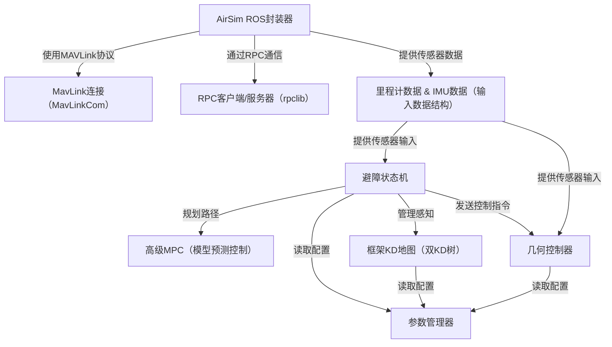

链接：[[2503.10141\] Mapless Collision-Free Flight via MPC using Dual KD-Trees in Cluttered Environments](https://arxiv.org/abs/2503.10141#)

# docs：Avoid-MPC

`Avoid-MPC`项目为==无人机配备了**自主避障**能力==。

它利用*高级模型预测控制（MPC）*系统进行最优路径规划，并通过*实时KD树地图*实现即时障碍物感知。该系统通过ROS与*AirSim模拟器*无缝集成，支持对模拟无人机的全面测试与控制

能处理传感器数据、管理配置，并生成精确的控制指令，以实现安全高效的导航

## 可视化

## 章节

1. [避障状态机](01_avoidancestatemachine_.md)  
2. [里程计数据 & IMU数据（输入数据结构）](02_odom_data_t___imu_data_t__input_data_structures__.md)  
3. [高级MPC（模型预测控制）](03_highlvlmpc__model_predictive_control__.md)  
4. [框架KD地图（双KD树）](04_framekdmap__dual_kd_tree__.md)  
5. [几何控制器](05_geometriccontroller_.md)  
6. [AirSim ROS封装器](06_airsimroswrapper_.md)  
7. [参数管理器](07_parametermanager_.md)  
8. [MavLink连接（MavLinkCom）](08_mavlinkconnection__mavlinkcom__.md)  
9. [RPC客户端/服务器（rpclib）](09_rpc_client_server__rpclib__.md)  

---
