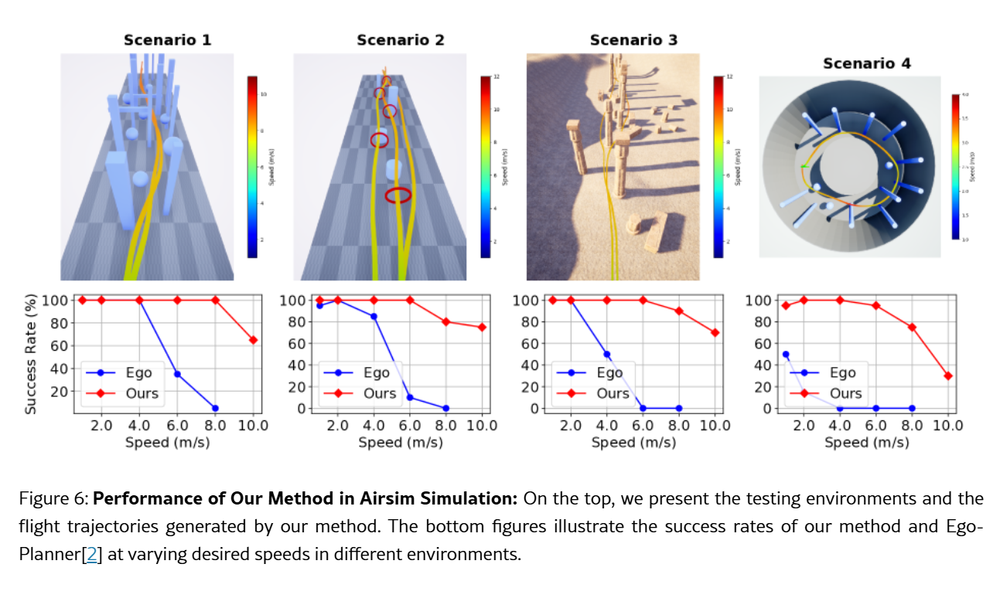

链接：[[2503.10141\] Mapless Collision-Free Flight via MPC using Dual KD-Trees in Cluttered Environments](https://arxiv.org/abs/2503.10141#)

# docs：Avoid-MPC

`Avoid-MPC`项目为==无人机配备了**自主避障**能力==。

它利用*高级模型预测控制（MPC）*系统进行最优路径规划，并通过*实时KD树地图*实现即时障碍物感知。该系统通过ROS与*AirSim模拟器*无缝集成，支持对模拟无人机的全面测试与控制

能处理传感器数据、管理配置，并生成精确的控制指令，以实现安全高效的导航

## 可视化

## 章节

1. [避障状态机](01_avoidancestatemachine_.md)  
2. [里程计数据 & IMU数据（输入数据结构）](02_odom_data_t___imu_data_t__input_data_structures__.md)  
3. [高级MPC（模型预测控制）](03_highlvlmpc__model_predictive_control__.md)  
4. [框架KD地图（双KD树）](04_framekdmap__dual_kd_tree__.md)  
5. [几何控制器](05_geometriccontroller_.md)  
6. [AirSim ROS封装器](06_airsimroswrapper_.md)  
7. [参数管理器](07_parametermanager_.md)  
8. [MavLink连接（MavLinkCom）](08_mavlinkconnection__mavlinkcom__.md)  
9. [RPC客户端/服务器（rpclib）](09_rpc_client_server__rpclib__.md)  

---

# 基于双KD树模型预测控制的杂乱环境无地图避障飞行

## 摘要  
在杂乱环境中实现无碰撞飞行是自主四旋翼飞行器的关键能力。

传统方法通常依赖详细的3D地图构建、轨迹生成与跟踪。但这种级联式流程会引入累积误差和计算延迟，限制飞行敏捷性与安全性。

本文提出了一种==无需显式==构建3D地图或生成跟踪避障轨迹的新方法，通过==模型预测控制==（MPC）直接根据深度相机稀疏点云生成安全动作。

- 我们创新性地引入双KD树机制：障碍KD树快速识别最近障碍物实现避障，边缘KD树为MPC求解器提供鲁棒初始猜测以避免局部最优。

- 经大量仿真与实物验证，本方法在仿真中可实现12m/s、实物测试中6m/s的可靠避障，性能显著优于基于地图构建和模仿学习的方法

## 引言  
无碰撞穿越杂乱环境始终是自主四旋翼飞行器的核心挑战。

传统方法采用==多级分层==框架：先通过占据栅格或欧氏符号距离场（ESDF）构建显式地图，再生成避障路径并参数化为多项式/B样条轨迹，最后由底层控制器跟踪。

这种级联范式存在两个固有缺陷：

- 一是各模块误差累积会导致飞行器失控

- 二是串行工作流带来显著计算延迟，影响高速场景的响应能力。

如图所示，与传统==建图-规划-跟踪==流程相比，我们提出的框架==通过MPC直接优化避障动作==。

系统架构（图2）包含双KD树模块：

- 边缘KD树通过膨胀边缘图调整参考路径，障碍KD树执行KNN最近邻查询计算碰撞代价
- 最终通过非线性规划（NLP）生成实时控制指令。

本系统包含：

(1) 双KD树模块——障碍KD树计算碰撞代价，边缘KD树调整航点优化初始值；

(2) MPC优化模块实时规划控制。系统从当前位置向目标稀疏采样航点，通过深度图构建双KD树，检测到潜在碰撞时调整航点，最终MPC模块结合运动学约束和碰撞代价优化航点，生成控制指令发送至飞控单元（FCU）

（一些3d游戏的设计代入解决现实问题也是好起来了bush）

还有一些公式 不是很好打，感兴趣的去看原文叭orz

