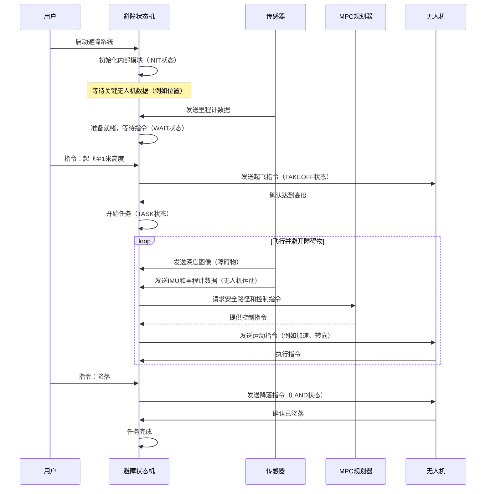
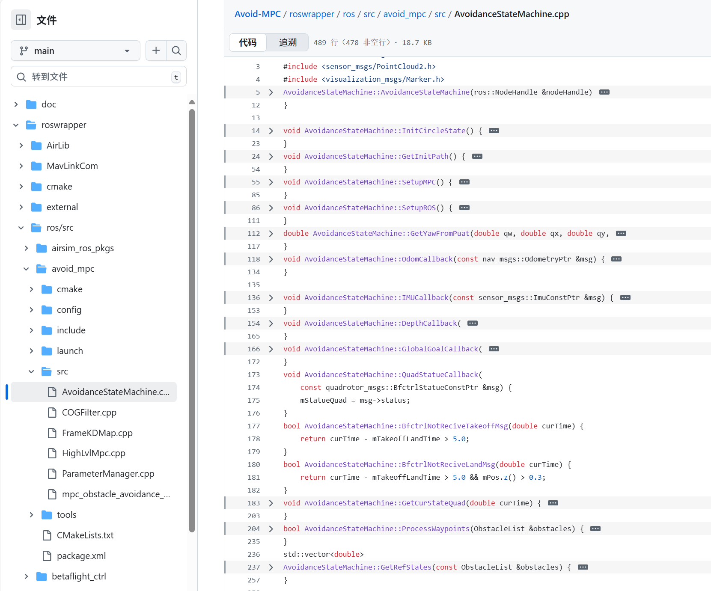
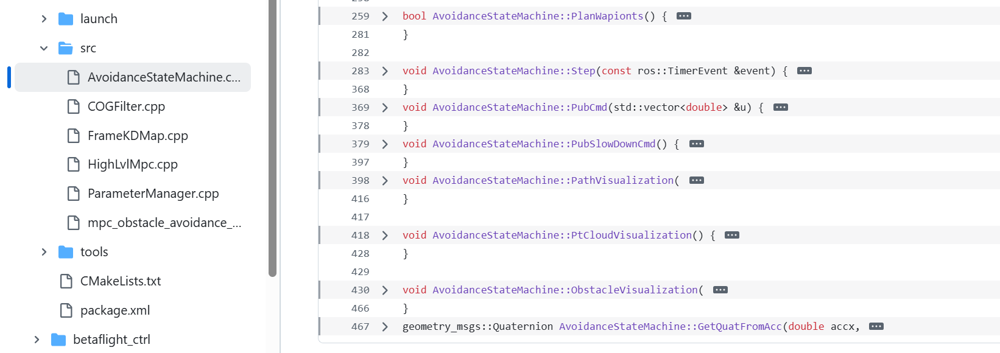

# 第1章：避障状态机

想象我们拥有一架超级智能的无人机，它可以完全自主飞行。现在，假设这架无人机需要穿过一个摆满家具的杂乱房间，或者在有许多树木的森林中导航，而且不能发生碰撞。它是如何知道每个时刻该做什么的？当出现障碍物时，它如何决定何时起飞、何时前进或何时减速？

这就是**避障状态机（`AvoidanceStateMachine`）**的用武之地！可以将其视为无人机避障的大脑，是它在复杂环境中导航的自动驾驶系统。它的主要任务是引导无人机完成飞行的不同阶段，确保即使在缺乏区域详细地图的情况下也能避开障碍物。

## 避障状态机解决了什么问题？

让我们以无人机在杂乱环境中飞行为具体例子。无人机不能随机飞行，它需要一种结构化的方式来管理其行为。它需要：

1. **启动**：做好准备，检查系统。
2. **等待指令**：保持空闲状态，直到收到指令。
3. **起飞**：安全上升到一定高度。
4. **执行任务**：飞向目标，但**关键是要避开沿途的障碍物**。
5. **降落**：安全下降并停止。

`AvoidanceStateMachine`负责管理整个生命周期，确保无人机知道每个步骤该做什么，并对周围环境做出适当反应。它就像是无人机飞行操作的高度组织化的管理者，专注于避障功能。

## 理解“状态机”概念

“状态机”听起来可能很复杂，但其实是一个非常常见的概念。以交通信号灯为例：
- 它有状态：`红灯`、`黄灯`、`绿灯`。
- 它根据规则在状态之间转换（例如，`绿灯`几秒后变为`黄灯`，`黄灯`几秒后变为`红灯`）。

`AvoidanceStateMachine`的工作原理类似。无人机始终处于一个特定的“状态”，并根据传感器信息和指令在这些状态之间切换。

在`Avoid-MPC`中，`AvoidanceStateMachine`有五个主要状态：

| 状态      | 描述                                                         | 类比（无人机的生命周期）               |
| :-------- | :----------------------------------------------------------- | :------------------------------------- |
| `INIT`    | 无人机系统正在启动，准备就绪。它正在检查传感器和内部组件。   | 刚拆箱的无人机，正在启动。             |
| `WAIT`    | 无人机已初始化并准备就绪，但正在等待开始任务的指令（例如“起飞”）。 | 无人机停在地面上，电机关闭，等待起飞。 |
| `TAKEOFF` | 无人机正在起飞并上升到目标飞行高度。                         | 无人机缓慢升空。                       |
| `TASK`    | 无人机正在执行其主要任务，例如飞向特定目标或探索区域，同时主动避开障碍物。 | 无人机在房间中飞行，避开家具。         |
| `LAND`    | 无人机正在安全下降并降落。                                   | 无人机缓缓返回地面。                   |

## 避障状态机如何引导无人机

让我们看看`AvoidanceStateMachine`如何协调一次典型的飞行任务：

1. **初始化（`INIT`）**：当`Avoid-MPC`系统启动时，`AvoidanceStateMachine`初始化。它建立与ROS（机器人操作系统）的连接，以便与传感器和控制系统通信。
2. **等待（`WAIT`）**：初始化完成后，它耐心等待重要数据，例如当前位置（称为“里程计”数据）。一旦收到这些关键信息，它就知道可以接收指令了。
3. **起飞（`TAKEOFF`）**：收到“起飞”指令（可能来自操作员或其他系统）后，`AvoidanceStateMachine`向无人机发送命令，使其上升到安全高度。
4. **任务执行（`TASK`）**：==达到目标高度后，无人机进入`TASK`状态==。这里是避障功能真正发挥作用的地方
   - 它持续监听**传感器数据**（例如深度摄像头“看到”障碍物，IMU/里程计感知自身运动）。
   - 利用这些数据确定障碍物的位置。
   - 然后使用高级技术（如[高级MPC（模型预测控制）](03_highlvlmpc__model_predictive_control__.md)）规划安全路径，在避开检测到的障碍物的同时到达目标。
   - 最后，向无人机发送精确的控制指令（例如“前进”、“左转”、“减速”）。
5. **降落（`LAND`）**：任务完成或收到“降落”指令后，`AvoidanceStateMachine`切换到`LAND`状态，引导无人机返回地面。

以下是`AvoidanceStateMachine`在飞行任务中与无人机系统不同部分交互的简化流程：



## 代码

让我们看看这个“状态机”在`Avoid-MPC`代码中是如何实现的。





### 1. `ProcessState`枚举

不同的状态（INIT、WAIT、TAKEOFF、TASK、LAND）在C++中使用`enum`定义。这有助于组织代码并明确无人机当前所处的状态。

```cpp
// 来源：roswrapper/ros/src/avoid_mpc/include/AvoidanceStateMachine.h
enum ProcessState {
    INIT = 0u,
    WAIT = 1u,
    TAKEOFF = 2u,
    TASK = 3u,
    LAND = 4u
};
```
这段代码展示了`ProcessState`枚举，它是一组标签，`AvoidanceStateMachine`用它们来跟踪无人机当前的行为

`INIT`赋值为`0`，`WAIT`为`1`，依此类推。

### 2. 主循环（`Step`函数）

`AvoidanceStateMachine`有一个名为`Step`的特殊函数，它==会像心跳一样反复运行==

这个函数负责状态转换。它检查当前状态并决定执行什么操作或切换到哪个状态。

```cpp
// 来源：roswrapper/ros/src/avoid_mpc/src/AvoidanceStateMachine.cpp（简化版）
void AvoidanceStateMachine::Step(const ros::TimerEvent &event) {
    double curTime = ros::Time::now().toSec(); // 获取当前时间
    switch (mStateProcess) { // 检查当前状态
    case INIT: {
        // INIT状态代码：检查是否收到里程计数据
        if (mbIsReceiveOdom) {
            ROS_INFO("收到里程计数据，等待触发。");
            mStateProcess = WAIT; // 切换到WAIT状态
        }
        break;
    }
    case WAIT: {
        // WAIT状态代码：检查起飞指令
        if (mStatueQuad == quadrotor_msgs::BfctrlStatue::BFCTRL_STATUS_WAITINGCMD) {
            ROS_INFO("触发，起飞。");
            mStateProcess = TAKEOFF; // 切换到TAKEOFF状态
        }
        break;
    }
    case TAKEOFF: {
        // TAKEOFF状态代码：发送起飞指令，检查高度
        if (mPos.z() < 0.6 * mHeight) {
            // 仍在起飞，发布起飞消息
            quadrotor_msgs::TakeoffLand takeoffMsg;
            takeoffMsg.takeoff_land_cmd = quadrotor_msgs::TakeoffLand::TAKEOFF;
            mPubTakeoffLand.publish(takeoffMsg);
        } else {
            ROS_INFO("达到目标高度，开始任务。");
            mStateProcess = TASK; // 切换到TASK状态
        }
        break;
    }
    case TASK: {
        // TASK状态代码：处理传感器数据，规划路径，发送指令
        // ...（MPC规划和避障的复杂逻辑）...
        PubCmd(u); // 发布控制指令
        break;
    }
    case LAND: {
        // LAND状态代码：发送降落指令
        quadrotor_msgs::TakeoffLand msg;
        msg.takeoff_land_cmd = quadrotor_msgs::TakeoffLand::LAND;
        mPubTakeoffLand.publish(msg);
        break;
    }
    }
    // 可视化代码（如果启用，在所有状态下运行）
    PtCloudVisualization();
    ObstacleVisualization(mVecObstacles);
}
```
`Step`函数由定时器（这里是`ros::Timer`）定期调用。内部的`switch`语句检查`mStateProcess`变量，该变量保存了状态机的当前状态。根据状态，它执行不同的代码块。例如，在`INIT`状态下，它等待里程计数据。一旦收到数据，就将`mStateProcess`更新为`WAIT`，导致下一次`Step`调用执行`WAIT`状态的逻辑。

### 3. 接收数据（输入）

`AvoidanceStateMachine`需要了解现实世界的情况。

通过**传感器数据**和**其他无人机系统**获取这些信息。它使用称为“回调”的特殊函数，这些函数在新数据到达时触发。

```cpp
// 来源：roswrapper/ros/src/avoid_mpc/src/AvoidanceStateMachine.cpp（简化版）
void AvoidanceStateMachine::OdomCallback(const nav_msgs::OdometryPtr &msg) {
    mbIsReceiveOdom = true; // 收到里程计数据后设置标志为true
    // 存储无人机的位置（mPos）、方向（mQuat）和速度（mVel）
    mPos = Eigen::Vector3d(msg->pose.pose.position.x, /* ... */);
    mQuat = Eigen::Quaterniond(msg->pose.pose.orientation.w, /* ... */);
    mVel = Eigen::Vector3d(msg->twist.twist.linear.x, /* ... */);
}

void AvoidanceStateMachine::IMUCallback(const sensor_msgs::ImuConstPtr &msg) {
    // 存储无人机的加速度（mAcc）并可能优化方向
    // ... 滤波和计算 ...
    mAcc = mQuat.toRotationMatrix() * accbFiltered - Eigen::Vector3d(0, 0, 9.81);
}

void AvoidanceStateMachine::DepthCallback(const sensor_msgs::ImageConstPtr &msg) {
    // 处理深度图像以检测障碍物并将其添加到地图中
    // ... 转换并使用mKeyFrameMap更新地图 ...
    mKeyFrameMap.AddVertex(Twb, msg); // 将深度数据添加到障碍物地图
}
```
这些回调函数就像是专用的邮箱。

`OdomCallback`接收里程计消息（告诉无人机其位置和速度）。`IMUCallback`获取IMU（惯性测量单元）数据以确定方向和加速度。`DepthCallback`处理深度摄像头的图像以“看到”障碍物。

`AvoidanceStateMachine`利用所有这些==传入数据更新其对世界和无人机状态的内部理解==。这里提到的`mKeyFrameMap`是[框架KD地图（双KD树）](04_framekdmap__dual_kd_tree__.md)的一部分，我们稍后会探讨

### 4. 发送指令（输出）

一旦`AvoidanceStateMachine`处理完信息并决定下一步行动，它需要告诉无人机该做什么。

通过发布控制指令来实现这一点。

```cpp
// 来源：roswrapper/ros/src/avoid_mpc/src/AvoidanceStateMachine.cpp（简化版）
void AvoidanceStateMachine::PubCmd(std::vector<double> &u) {
    quadrotor_msgs::Command cmdMsg;
    cmdMsg.header.stamp = ros::Time::now();
    cmdMsg.mode = quadrotor_msgs::Command::ACCELERATION_MODE;
    cmdMsg.acceleration.x = u[0]; // 发送X方向的期望加速度
    cmdMsg.acceleration.y = u[1]; // 发送Y方向的期望加速度
    cmdMsg.acceleration.z = u[2]; // 发送Z方向的期望加速度
    cmdMsg.yaw = 0; // 暂时保持偏航（绕垂直轴旋转）固定
    mPubCmd.publish(cmdMsg); // 发布指令
}

void AvoidanceStateMachine::PubSlowDownCmd() {
    // 根据当前速度和加速度计算减速加速度
    Eigen::Vector3d accSlow = -mVel * mParamSlowDownKp - mAcc * mParamSlowDownKd;
    // ... 对加速度施加限制 ...
    quadrotor_msgs::Command cmdMsg;
    // ... 填充减速加速度的cmdMsg ...
    mPubCmd.publish(cmdMsg); // 发布减速指令
}
```
`PubCmd`函数创建一个`Command`消息，并用计算出的期望加速度（来自[高级MPC（模型预测控制）](03_highlvlmpc__model_predictive_control__.md)）填充它。

`PubSlowDownCmd`是一个特殊指令，用于在检测到紧急危险时让无人机快速减速。这些===消息被发送到无人机的底层飞行控制器，后者执行实际的物理运动==。

## 总结

`AvoidanceStateMachine`确实是`Avoid-MPC`项目的“大脑”。它作为中央协调器，管理无人机从启动到降落的整个任务，重点是安全避开障碍物。通过==将复杂问题分解为可管理的状态并根据实时数据在这些状态之间转换==，它使无人机能够在动态环境中执行复杂的避障行为。

现在我们已经了解了整体管理器，接下来让我们看看它用于决策的关键信息：关于无人机位置和方向的输入数据。

[下一章：里程计数据 & IMU数据（输入数据结构）](02_odom_data_t___imu_data_t__input_data_structures__.md)

