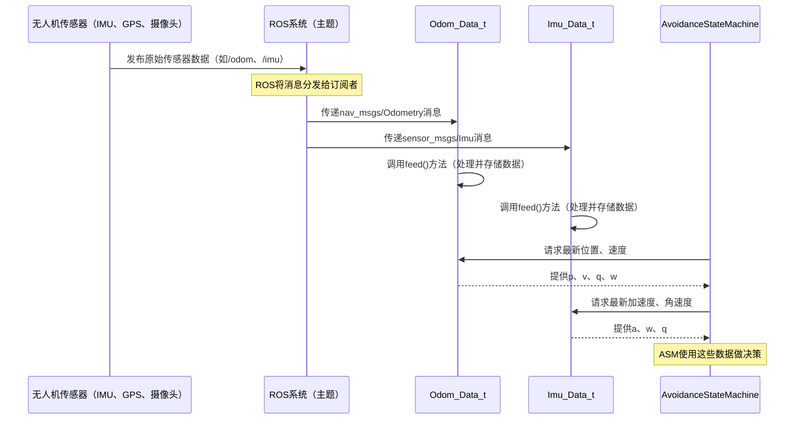

# 第2章：Odom_Data_t 和 Imu_Data_t（输入数据结构）

在[前一章](01_avoidancestatemachine_.md)中，我们了解了`AvoidanceStateMachine`，这是无人机飞行和避障行为的"大脑"。

> 但这个大脑如何知道现实世界中发生了什么？它如何知道无人机的位置、速度或朝向？

这就是`Odom_Data_t`和`Imu_Data_t`发挥作用的地方。

可以将它们视为无人机的**眼睛、耳朵和运动感知器**，它们打包关键的实时信息，使`AvoidanceStateMachine`能够做出明智决策。

## Odom_Data_t和Imu_Data_t解决了什么问题？

想象我们的无人机正在复杂环境中飞行并试图避开障碍物。为了有效做到这一点，它需要不断回答以下基本问题：

* "我现在在哪里？"
* "我移动的速度有多快？"
* "我朝向哪个方向？"
* "我是否在加速，朝哪个方向加速？"
* "我是否在旋转？"

不同的传感器提供这些问题的部分答案：GPS、视觉传感器、轮式编码器（地面机器人）和专门的内部传感器。这些传感器的==原始数据可能杂乱无章==，格式各异。

`Odom_Data_t`和`Imu_Data_t`通过充当**标准化表单或容器**来解决这个问题。它们收集多样化的传感器信息，整齐地组织这些信息，并以一致、易于理解的方式呈现给无人机的大脑（`AvoidanceStateMachine`）和其他组件。这确保了在讨论无人机当前状态时，所有组件都"使用同一种语言"。

## 理解里程计（Odom_Data_t）

"里程计"听起来可能很高端，但它只是指跟踪无人机随时间变化的**位置、速度和方向**。这是无人机知道其在世界中的精确位置和运动的方式。

`Odom_Data_t`结构专门用于保存这类数据。

以下是`Odom_Data_t`通常包含的内容：

| 数据类型       | 描述                                    |
| :------------- | :-------------------------------------- |
| **位置 (p)**   | 无人机在3D空间中的位置（X、Y、Z坐标）。 |
| **速度 (v)**   | 无人机移动的速度和方向（线速度）。      |
| **方向 (q)**   | 无人机的朝向（姿态或旋转）。            |
| **角速度 (w)** | 无人机绕自身轴旋转的速度。              |

这些数据通常通过融合来自多个传感器（如GPS、摄像头等）的信息或专用定位系统获得。

## 理解IMU数据（Imu_Data_t）

IMU代表**惯性测量单元**。它是几乎所有无人机上的关键传感器。IMU通常包含：

*   **加速度计**：测量线性加速度（速度变化的快慢）。
*   **陀螺仪**：测量角速度（无人机旋转的快慢）。
*   有时**磁力计**：测量磁场以确定航向（类似指南针）。

`Imu_Data_t`结构设计用于存储这些原始惯性测量值。

以下是`Imu_Data_t`通常包含的内容：

| 数据类型           | 描述                                                         |
| :----------------- | :----------------------------------------------------------- |
| **角速度 (w)**     | 无人机绕自身轴旋转的速度。                                   |
| **线性加速度 (a)** | 无人机速度沿其轴变化的快慢（不包括重力）。                   |
| **方向 (q)**       | 无人机当前朝向的估计值（通常由IMU本身的传感器融合计算得出）。 |

## 它们如何协同工作：一个真实场景

假设我们在第1章中的无人机处于`TASK`状态，正在房间中飞行。

1.  **传感器**：无人机的内部IMU传感器及其定位系统（结合摄像头和其他数据源确定位置）不断生成数据。
2.  **原始消息**：这些数据以原始ROS消息形式输出（如`nav_msgs::Odometry`和`sensor_msgs::Imu`）。
3.  **填充结构**：`Odom_Data_t`和`Imu_Data_t`结构有特殊函数可以"消化"这些原始消息。它们==提取==重要数值（位置、速度、加速度等）并将其存储在组织良好的变量中。
4.  **准备使用**：现在，`AvoidanceStateMachine`可以轻松访问`Odom_Data_t.p`获取无人机当前位置，`Imu_Data_t.a`获取其加速度等。这些干净、最新的信息对于使用[高级MPC（模型预测控制）](03_highlvlmpc__model_predictive_control__.md)等组件规划无碰撞路径至关重要。

## 底层实现：数据流

让我们可视化传感器数据如何通过这些结构流向`AvoidanceStateMachine`：



## 代码

让我们看看这些输入数据结构在`Avoid-MPC`代码中是如何定义和填充的。

### 1. `Odom_Data_t`结构定义

在C++中，这些结构被定义为类。以下是`input.h`中`Odom_Data_t`类的简化版：

```cpp
// 来源：roswrapper/ros/src/betaflight_ctrl/betaflight_ctrl/src/input.h
class Odom_Data_t {
public:
    EIGEN_MAKE_ALIGNED_OPERATOR_NEW // 对Eigen类型很重要
    Eigen::Vector3d p;              // 位置（x, y, z）
    Eigen::Vector3d v;              // 线速度（vx, vy, vz）
    Eigen::Quaterniond q;           // 方向（w, x, y, z）
    Eigen::Vector3d w;              // 角速度（wx, wy, wz）

    nav_msgs::Odometry msg;         // 原始ROS消息
    ros::Time rcv_stamp;            // 接收消息的时间戳
    bool recv_new_msg;              // 新消息到达的标志

    Odom_Data_t();                  // 构造函数
    void feed(nav_msgs::OdometryConstPtr pMsg); // 更新数据的方法
    // ... 其他内部使用的成员 ...
};
```
这段代码展示了`Odom_Data_t`类

它有公共变量如`p`（位置）、`v`（速度）、`q`（方向）和`w`（角速度）

> 这些变量使用`Eigen::Vector3d`和`Eigen::Quaterniond`，这是用于高效处理3D向量（如位置或速度）和旋转（方向）的特殊C++类型。

`feed`方法用于用新传感器数据更新这些变量。

### 2. `Imu_Data_t`结构定义

类似地，以下是`Imu_Data_t`类的定义：

```cpp
// 来源：roswrapper/ros/src/betaflight_ctrl/betaflight_ctrl/src/input.h
class Imu_Data_t {
public:
    Eigen::Quaterniond q;           // 方向（w, x, y, z）
    Eigen::Vector3d w;              // 角速度（wx, wy, wz）
    Eigen::Vector3d a;              // 线加速度（ax, ay, az）

    sensor_msgs::Imu msg;           // 原始ROS消息
    ros::Time rcv_stamp;            // 接收消息的时间戳

    Imu_Data_t();                   // 构造函数
    void feed(sensor_msgs::ImuConstPtr pMsg); // 更新数据的方法
};
```
`Imu_Data_t`类保存无人机的方向（`q`）、角速度（`w`）和线加速度（`a`）。同样使用了`Eigen`类型以进行高效的数学运算。

### 3. 用数据填充`Odom_Data_t`（`feed`方法）

`feed`方法至关重要。它接收原始`nav_msgs::Odometry`消息（来自ROS系统），并提取相关数据填充`Odom_Data_t`的内部变量。

```cpp
// 来源：roswrapper/ros/src/betaflight_ctrl/betaflight_ctrl/src/input.cpp
void Odom_Data_t::feed(nav_msgs::OdometryConstPtr pMsg) {
    ros::Time now = ros::Time::now();

    msg = *pMsg; // 存储整个原始消息以供参考
    rcv_stamp = now;
    recv_new_msg = true;

    // 使用辅助函数从ROS消息中提取数据
    uav_utils::extract_odometry(pMsg, p, v, q, w);

    // ... 额外处理如转换到本地坐标系、检查频率 ...
}
```
在这个`feed`方法中，`pMsg`是指向传入ROS里程计消息的指针

`uav_utils::extract_odometry`函数（来自`uav_utils/converters.h`）是一个方便的辅助函数，它接收原始消息并直接填充`Odom_Data_t`对象的`p`、`v`、`q`和`w`变量。这确保数据以干净、一致的格式存储。

以下是`extract_odometry`辅助函数的实现：
```cpp
// 来源：roswrapper/ros/src/betaflight_ctrl/uav_utils/include/uav_utils/converters.h
inline void extract_odometry(nav_msgs::OdometryConstPtr msg, Eigen::Vector3d& p,
                      Eigen::Vector3d& v, Eigen::Quaterniond& q, Eigen::Vector3d& w)
{
    // 位置
    p(0) = msg->pose.pose.position.x;
    p(1) = msg->pose.pose.position.y;
    p(2) = msg->pose.pose.position.z;

    // 线速度
    v(0) = msg->twist.twist.linear.x;
    v(1) = msg->twist.twist.linear.y;
    v(2) = msg->twist.twist.linear.z;

    // 方向
    q.w() = msg->pose.pose.orientation.w;
    q.x() = msg->pose.pose.orientation.x;
    q.y() = msg->pose.pose.orientation.y;
    q.z() = msg->pose.pose.orientation.z;

    // 角速度
    w(0) = msg->twist.twist.angular.x;
    w(1) = msg->twist.twist.angular.y;
    w(2) = msg->twist.twist.angular.z;
}
```
这个辅助函数接收原始ROS消息（`msg`），并将其`position`、`velocity`、`orientation`和`angular`扭曲值直接映射到`Eigen::Vector3d`和`Eigen::Quaterniond`变量`p`、`v`、`q`和`w`中。这是将原始消息数据转换为更易用的C++类型的常见模式。

### 4. 用数据填充`Imu_Data_t`（`feed`方法）

`Imu_Data_t::feed`方法对IMU消息执行类似操作：

```cpp
// 来源：roswrapper/ros/src/betaflight_ctrl/betaflight_ctrl/src/input.cpp
void Imu_Data_t::feed(sensor_msgs::ImuConstPtr pMsg) {
    ros::Time now = ros::Time::now();

    msg = *pMsg; // 存储整个原始消息
    rcv_stamp = now;

    // 直接提取角速度
    w(0) = msg.angular_velocity.x;
    w(1) = msg.angular_velocity.y;
    w(2) = msg.angular_velocity.z;

    // 直接提取线加速度
    a(0) = msg.linear_acceleration.x;
    a(1) = msg.linear_acceleration.y;
    a(2) = msg.linear_acceleration.z;

    // 直接提取方向（如果IMU提供）
    q.x() = msg.orientation.x;
    q.y() = msg.orientation.y;
    q.z() = msg.orientation.z;
    q.w() = msg.orientation.w;

    // ... 额外处理 ...
}
```
这里，`Imu_Data_t::feed`方法直接从原始`sensor_msgs::Imu`消息（`msg`）中读取`angular_velocity`、`linear_acceleration`和`orientation`字段，并将它们赋值给其`w`、`a`和`q`变量。

## 总结

`Odom_Data_t`和`Imu_Data_t`是`Avoid-MPC`项目的基础部分

它们是关键的输入通道，为无人机的"大脑"（`AvoidanceStateMachine`）提供对其自身的最基本理解：它在哪里、如何移动以及在世界中的朝向。通过标准化和组织这些关键的传感器数据，它们使所有其他高级模块（如避障系统）能够有效且安全地运行。

现在我们已经了解了无人机如何获得自我感知，接下来让我们探索它如何使用这些信息预测运动并主动避开障碍物。

[下一章：高级MPC（模型预测控制）](03_highlvlmpc__model_predictive_control__.md)

