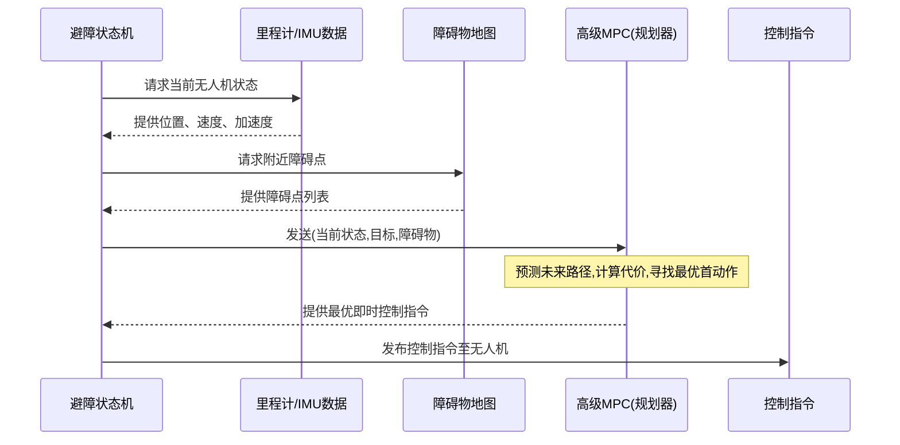

# 第3章：高级MPC（模型预测控制）

在[上一章](02_odom_data_t___imu_data_t__input_data_structures__.md)中，我们了解了无人机如何通过`Odom_Data_t`和`Imu_Data_t`获取自身状态——位置、速度和朝向。这些关键信息告诉`AvoidanceStateMachine`无人机当前的位置。但仅仅知道"我在哪里"是不够的；无人机还需要知道"下一步该做什么才能*不撞上障碍物*地到达目标？"

这正是**高级MPC（`HighLvlMpc`）**组件的职责。可以将其视为无人机的**战略路径规划器**或高智能棋手。它不会等到快撞上障碍物时才做出反应，而是**前瞻多步**来决定最佳动作。

## 高级MPC解决了什么问题？

假设我们的无人机处于`TASK`状态（来自[第1章：避障状态机](01_avoidancestatemachine_.md)），正在杂乱仓库中飞向目标点。借助`Odom_Data_t`，它知道自己的当前位置和速度。通过传感器（将在[第4章：框架KD地图（双KD树）](04_framekdmap__dual_kd_tree__.md)详述）它还感知到周围障碍物。

`HighLvlMpc`需要解决以下挑战：
* **目标抵达**：如何让无人机平稳飞向目标？
* **避障**：如何避开当前和预测路径上的障碍物？
* **安全与效率**：如何平衡安全性（避免碰撞）与效率（快速到达目标且动作平顺）？

该组件通过**预测未来**并寻找*最优*控制动作来持续规划无人机运动，在遵守限制和规避危险的前提下实现目标。

## 理解模型预测控制（MPC）

模型预测控制（MPC）是系统（如无人机）决策的强大方法，其工作原理如下：

1. **"预见未来"（预测）**：MPC组件拥有无人机（根据指令如何运动）和环境（障碍物位置）的数学模型。它用该模型预测无人机在未来几秒内采取特定动作后的位置。这个未来时段称为"预测时域"。
2. **"寻找最佳方案"（优化）**：MPC在预测时域内考虑多种可能动作序列，计算每个序列的"代价"：
   * **高代价**：撞上障碍物、严重偏离期望路径或做出剧烈耗能动作。
   * **低代价**：平稳飞向目标且远离障碍物。
   然后找出*总代价最低*的动作序列。
3. **"执行第一步"（实施）**：无人机不执行整个预测序列，仅执行最优序列的*第一个*动作。
4. **"重新评估循环"（滚动时域）**：执行动作后，环境可能变化（新障碍出现或无人机运动偏差）。MPC用新状态*重复整个过程*，持续重新规划以适应新信息。

这种"滚动时域"方法使MPC在动态环境中极具鲁棒性和适应性。

## "高级"在高级MPC中的含义

"高级"意味着该MPC负责战略级运动决策，而非电机控制的细节。它输出"在X/Y/Z方向加速多少、偏转多少角度"等指令，而非直接控制单个电机转速。后者是底层控制器（如[几何控制器](05_geometriccontroller_.md)）的职责，它将高级指令转化为实际电机信号。

## 高级MPC如何引导无人机避障

让我们追踪`HighLvlMpc`利用信息规划的过程：

1. **当前状态**：获取无人机当前位置、速度和加速度（来自`Odom_Data_t`和`Imu_Data_t`）。
2. **目标**：接收`AvoidanceStateMachine`提供的目标位置。
3. **障碍物信息**：获取附近障碍点列表（由[框架KD地图（双KD树）](04_framekdmap__dual_kd_tree__.md)提供）。
4. **预测**：使用内部模型模拟无人机在不同控制动作下未来几秒的运动。
5. **代价计算**：为每条模拟路径计算"优劣"：
   * **距目标距离**：离目标多近？（代价越低越好）
   * **距障碍物距离**：离障碍物多远？（距离越远代价越低）
   * **控制能耗**：所需加速度和转向多平顺？（动作越平滑代价越低）
6. **最优控制**：选择总代价最低的即时控制动作（期望加速度和偏航率）。
7. **输出**：这些动作发送回`AvoidanceStateMachine`，由其传递给[几何控制器](05_geometriccontroller_.md)执行。

数据流简化示意如下：



## 深入代码（简化版）

`HighLvlMpc`组件通过C++的`ObstacleAvoidanceMPC`类实现，使用**CasADi**数学优化库（见`casadi/casadi.hpp`导入）。该库允许定义无人机动力学、代价函数和约束，并高效求解复杂优化问题。

核心思想是由Python脚本(`mpc_obstacle_casadi.py`)定义整个MPC问题：
* 无人机状态（位置、速度等）如何随控制输入变化。
* 路径"优劣"标准（代价函数）。
* 运动限制（如最大加速度）。

该脚本将数学逻辑编译为快速C++共享库文件(如`mpc_obstacle_v2.so`)。C++的`ObstacleAvoidanceMPC`类加载并使用这个预编译求解器实时寻找最优动作。

### 1. `ObstacleAvoidanceMPC`类定义

查看`HighLvlMpc.h`中的类：

```cpp
// 来源：roswrapper/ros/src/avoid_mpc/include/HighLvlMpc.h
#include <casadi/casadi.hpp>

class ObstacleAvoidanceMPC {
public:
    ObstacleAvoidanceMPC(double T, double dt, std::string soPath);
    void Solve(const std::vector<double> &vecRefStates, std::vector<double> &u,
               std::vector<std::vector<double>> &x0Array, bool faster = false);
    // ... 其他设置函数 ...
private:
    double mT; // 预测时域时长
    double mDt; // 预测时间步长
    int mN;     // 预测步数(T/dt)
    int mDimX;  // 无人机状态维度(位置,速度等)
    int mDimU;  // 控制输入维度(加速度,偏航率)
    double mDroneRadius; // 无人机碰撞检测尺寸
    std::vector<double> mWeights; // 各代价项权重
    casadi::Function mSolver;     // 执行核心计算的CasADi求解器
    // ... 其他求解器设置内部变量 ...
};
```
`ObstacleAvoidanceMPC`类包含关键参数：`mT`（MPC预测未来总时长）、`mDt`（预测粒度）、`mDimX`（描述无人机状态的值数量）和`mDimU`（描述控制指令的值数量）。`mSolver`是核心，为预编译的CasADi函数，用于计算最优动作。

### 2. 构造函数：求解器设置

创建`ObstacleAvoidanceMPC`时，其构造函数配置CasADi求解器，包括设定无人机运动限制和加载预编译求解器。

```cpp
// 来源：roswrapper/ros/src/avoid_mpc/src/HighLvlMpc.cpp (简化版)
ObstacleAvoidanceMPC::ObstacleAvoidanceMPC(double T, double dt,
                                           std::string soPath) {
    mT = T; // 预测总时长(如2秒)
    mDt = dt; // 时间步长(如0.1秒)
    mN = T / dt; // 预测步数(如20步)
    mDimX = 10; // 状态变量:(px,py,pz,yaw,vx,vy,vz,ax,ay,az)
    mDimU = 4; // 控制变量:(ax_cmd,ay_cmd,az_cmd,yaw_dot)

    // ... 定义加速度和偏航率的上下限 ...
    // ... 定义求解器初始猜测和约束条件 ...

    // 从共享库(.so)文件加载预编译CasADi求解器
    mSolver = casadi::nlpsol("solve", "ipopt", soPath, ipopt_options);
    // mSolverFaster是迭代次数更少的快速求解器
    mSolverFaster = casadi::nlpsol("solve", "ipopt", soPath, ipopt_options);

    // 代价函数默认权重
    mWeights = {100, 100, 100, 300, 1,  1,  1,  0., 0., 0., 0.0, 10, 10,
                30,  0,   1,   1,   0., 0., 0., 1., 1., 1., 1.,  1.};
    // ... 其他初始化 ...
}
```
构造函数中设置`mT`、`mDt`、`mN`、`mDimX`和`mDimU`。`mDimX=10`表示无人机状态由10个值描述（位置X/Y/Z、偏航角、速度X/Y/Z、加速度X/Y/Z）。`mDimU=4`表示控制指令为4个值（期望加速度X/Y/Z、偏航率）。`soPath`指向Python脚本生成的预编译求解器。

### 3. `Solve`方法：决策核心

这是`AvoidanceStateMachine`反复调用的核心函数，用于计算下一个最优控制动作。

```cpp
// 来源：roswrapper/ros/src/avoid_mpc/src/HighLvlMpc.cpp (简化版)
void ObstacleAvoidanceMPC::Solve(const std::vector<double> &vecRefStates,
                                 std::vector<double> &u,
                                 std::vector<std::vector<double>> &x0Array,
                                 bool faster) {
    // 1. 准备求解器输入参数:
    // 包括当前状态、目标点、障碍点及配置的权重、增益和无人机半径
    std::vector<double> all_params;
    // ... 将vecRefStates、mGains、mTau、mWeights、mDroneRadius填入all_params ...
    casadi::DM refStates = all_params; // 转换为CasADi数据类型

    // 2. 设置求解器参数:
    casadi::DMDict args;
    args["x0"] = mNlpW0; // 热启动(用前次解加速求解)
    args["lbx"] = mLbw; // 变量下限
    args["ubx"] = mUbw; // 变量上限
    args["p"] = refStates; // 组合参数向量
    args["lbg"] = mLbg; // 约束下限
    args["ubg"] = mUbg; // 约束上限

    // 3. 调用CasADi求解器:
    casadi::DMDict sol;
    if (faster) {
        sol = mSolverFaster(args); // 使用迭代次数更少的快速求解器
    } else {
        sol = mSolver(args);       // 使用完整求解器
    }

    // 4. 提取最优控制指令(u)和预测轨迹(x0Array):
    std::vector<double> sol_x0 = sol["x"].get_elements(); // 获取完整解
    u.clear();
    u.resize(mDimU); // 调整控制指令输出向量大小
    for (int i = 0; i < mDimU; i++) {
        u[i] = sol_x0[i + mDimX]; // 提取首个控制动作
    }
    mNlpW0 = sol_x0; // 保存当前解供下次热启动使用

    // ... 用预测轨迹填充x0Array用于可视化 ...
}
```
`Solve`方法是核心工作区。它接收当前状态、目标和障碍信息(`vecRefStates`)，使用预配置的`mSolver`（CasADi函数）寻找最优控制指令(`u`)。同时输出`x0Array`（预测轨迹，用于调试或可视化）。`mNlpW0 = sol_x0`行很重要：它将*前次*解作为*当前*优化问题的初始猜测，大幅提升求解速度。

### 4. Python魔法：`mpc_obstacle_casadi.py`

该Python脚本不在无人机运行时执行，但对*创建*快速C++求解器至关重要。它定义：

* **无人机状态：**
  | 变量                          | 描述                 |
  | :---------------------------- | :------------------- |
  | `px, py, pz`                  | 位置(X, Y, Z)        |
  | `yaw`                         | 偏航角(绕垂直轴旋转) |
  | `vx, vy, vz`                  | 线速度(X, Y, Z)      |
  | `ax, ay, az`                  | 线加速度(X, Y, Z)    |
  | *(共`_s_dim = 10`个状态变量)* |                      |

* **控制输入：**
  | 变量                         | 描述                  |
  | :--------------------------- | :-------------------- |
  | `ax_cmd, ay_cmd, az_cmd`     | 期望线加速度(X, Y, Z) |
  | `yaw_dot`                    | 期望偏航角速度        |
  | *(共`_u_dim = 4`个控制变量)* |                       |

* **系统动力学**：描述施加`ax_cmd, ay_cmd,...`后`px, py, pz,...`如何随`dt`变化的数学方程。

* **代价函数(`mpc_obj`)**：这是MPC"决策"的核心，定义路径"优劣"。它是多种惩罚项之和：

  ```python
  # 来源：roswrapper/ros/src/avoid_mpc/tools/mpc_obstacle_casadi.py (简化版)
  # 每个预测步(k)的循环内:
  # 终点目标跟踪代价
  cost_goal_k = delta_s_k.T @ self._Q_goal @ delta_s_k
  
  # 中间参考路径偏离代价
  cost_gap_k = (rot @ delta_p_k).T @ self._Q_pen @ (rot @ delta_p_k)
  
  # 剧烈控制动作代价(保持运动平滑)
  delta_u_k = U[:, k] - [0, 0, self._gz, 0.0] # 与悬停加速度的差值
  cost_u_k = delta_u_k.T @ self._Q_u @ delta_u_k
  
  # 关键：避障代价
  # 当无人机靠近障碍物时施加惩罚，
  # 尤其是朝障碍物运动时。
  cost_collide_k += self.avoidance_lambda * self.softplus(dist * -32) * viToObstacle
  
  self.mpc_obj = self.mpc_obj + cost_goal_k + cost_u_k + cost_gap_k + cost_collide_k
  ```
  * `cost_goal_k`：惩罚预测终点状态与最终`target`的偏差。
  * `cost_gap_k`：惩罚与`ref_traj`（中间路径）的偏离。
  * `cost_u_k`：惩罚剧烈或突变的`U`（控制输入），鼓励平滑节能飞行。`self._gz`是重力补偿。
  * `cost_collide_k`：这是**避障**项。`dist`是到障碍物的距离，`self.softplus`是数学函数，当`dist`较小（靠近障碍物）时产生强惩罚，`viToObstacle`在无人机*朝向*障碍物运动时增加惩罚。`avoidance_lambda`控制避障重要性。

Python的`high_lvl_mpc`类还有`GenerateC()`方法，将所有定义编译为`.so`文件。此编译为*一次性*离线操作，非飞行时实时执行。

## 总结

`HighLvlMpc`是无人机的先进策略中枢。它整合所有可用信息——当前状态（来自`Odom_Data_t`和`Imu_Data_t`）、任务目标和感知到的障碍物——利用精密数学模型预见未来。通过在短预测时域内反复优化路径，确保无人机能在复杂环境中稳健安全导航，始终做出"最佳"即时决策以避开障碍并飞向目标。

现在理解了无人机如何规划运动，接下来让我们看看它如何"看见"并构建环境障碍物地图。

[下一章：框架KD地图（双KD树）](04_framekdmap__dual_kd_tree__.md)

